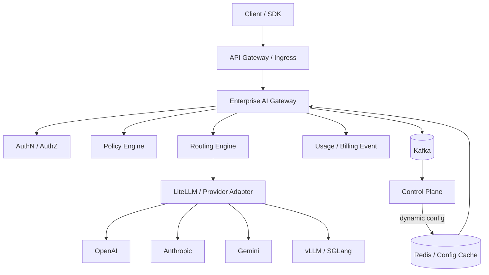
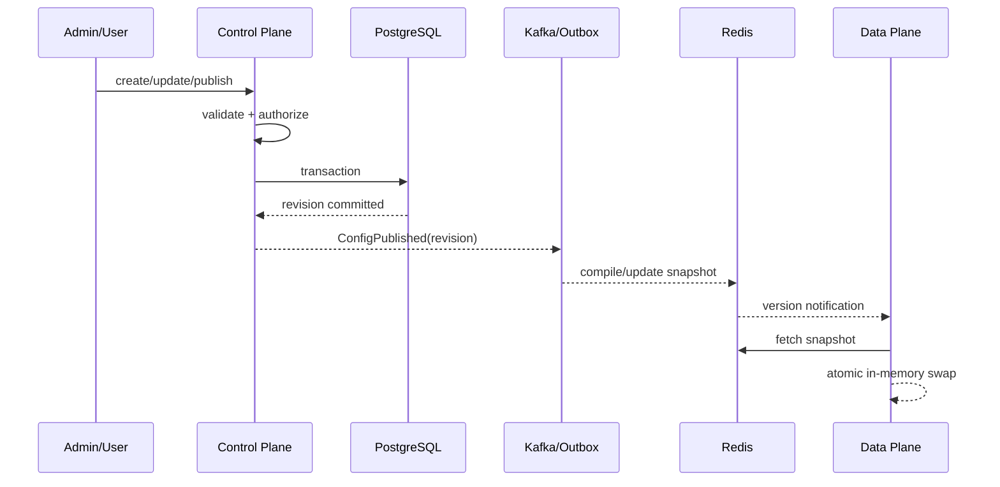
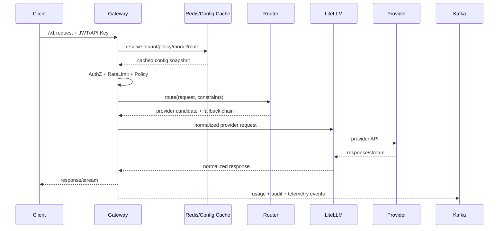

# Enterprise AI Platform Architecture Guide（企业 AI 平台架构指南）

**Version:** 1.0  
**Date:** 2026-08-07  
**Source baseline:** `AI-Gateway.md`（2930 行讨论稿）  
**Status:** Architecture & Implementation Baseline / 可作为研发设计说明书、评审基线与实施蓝图

## 1. 文档定位

本指南把源讨论稿提出的 AI Gateway 方案正式化为 **Enterprise AI Platform**：Control Plane 负责 IAM、Tenant、Provider、Model、Policy、Routing Config、Billing、Audit 和配置治理；Data Plane 负责统一 API、鉴权、限流、策略执行、缓存、路由、重试/回退和可观测性；AI Runtime 负责 LiteLLM 与外部/自托管模型运行时；Infrastructure 提供 Kubernetes、Redis、PostgreSQL、Kafka、对象存储和监控基础。

**最关键边界：LiteLLM 不是最终产品，也不直接面向用户；它只是 Runtime/Provider Adapter。**

## 2. 阅读顺序

- 架构负责人：Volume 1 -> Volume 2 -> Volume 3 -> Volume 6 -> Volume 7。
- 后端研发：Volume 2 -> Volume 3 -> Volume 8。
- 推理平台：Volume 4 -> Volume 5 -> Volume 7。
- SRE/平台工程：Volume 5 -> Volume 7 -> Volume 8 -> Appendix B。
- 安全/合规：Volume 6 -> Volume 2 Audit -> Appendix B。

## 3. 总体架构





## 4. 五项架构原则

| 原则 | 说明 |
| --- | --- |
| Everything is API | 所有可被平台外部或跨域调用的能力都必须定义稳定、版本化、可审计的 API 合同。 |
| Everything is Event | 调用、计费、审计、健康、配置发布等跨域副作用优先通过事件总线解耦。 |
| Everything is Stateless | Gateway、Router、LiteLLM 等数据平面实例不保存业务状态，可水平扩容并可随时替换。 |
| Everything is Configurable | Provider、模型映射、路由、预算、租户权限和安全策略由控制平面动态下发。 |
| Everything is Observable | 每个请求从入口到 Provider 都有 request_id/trace_id，并可关联延迟、Token、成本、缓存、重试和审计。 |

## 5. 全章节目录

| 章节 | 卷 | 标题 | 覆盖重点 |
| --- | --- | --- | --- |
| Chapter 1 | Volume 1 | 项目背景、目标与平台定位 | 为什么企业需要 AI Gateway、为什么不能把 LiteLLM 直接当最终产品、Enterprise AI Platform 定位、目标用户与典型场景、范围与非目标、成功标准与关键术语 |
| Chapter 2 | Volume 1 | 架构原则与非功能需求 | 五项核心原则、高可用与无状态、性能与延迟预算、一致性与配置传播、可扩展性与插件化、可观测性与审计、成本与合规约束 |
| Chapter 3 | Volume 1 | C4 Context：系统上下文 | 人员与外部系统、SDK/Client 接入、企业身份源、外部模型 Provider、自托管推理集群、监控与安全系统、上下文级信任边界 |
| Chapter 4 | Volume 1 | Container / Component 架构 | Web Console、Control Plane 服务群、Data Plane 服务群、AI Runtime、基础设施、同步调用与异步事件边界、组件依赖规则 |
| Chapter 5 | Volume 1 | Deployment：Kubernetes 与多 Region | Namespace 与工作负载、Ingress/Gateway、多副本与 HPA、Region/Zone 拓扑、跨 Region 配置同步、故障切换、数据驻留与延迟 |
| Chapter 6 | Volume 1 | DDD 与 Bounded Context | IAM、Tenant、Provider、Model、Policy、Routing、Billing、Audit、Gateway、上下文映射与领域事件 |
| Chapter 7 | Volume 1 | 架构治理与 ADR | 架构决策记录、技术债治理、兼容性规则、能力成熟度、变更评审、例外管理、平台演进原则 |
| Chapter 8 | Volume 2 | IAM Service | 用户、组织、部门、角色、OIDC/JWT 会话、服务身份、用户生命周期、权限声明、管理 API、缓存与撤销 |
| Chapter 9 | Volume 2 | Tenant、组织层级与授权模型 | Tenant/Department/User 层级、逻辑隔离、RBAC、ABAC、模型权限、Provider 白名单、地域与环境约束 |
| Chapter 10 | Volume 2 | API Key 与凭据生命周期 | 企业 API Key 格式、生成与哈希存储、轮换、过期与撤销、RPM/TPM/Quota 绑定、泄漏处置、Provider Key 隔离 |
| Chapter 11 | Volume 2 | Provider Registry 与 Provider Capability Registry | Provider/Region/Endpoint、Credential 引用、Priority/Weight、Health/Latency/Cost、Vision/Tool/Reasoning/Embedding/Audio/Rerank、能力版本、Provider 生命周期 |
| Chapter 12 | Volume 2 | Model Registry 与模型别名 | client_model/model_alias、provider_model、smart-chat 映射、版本与弃用、能力要求、上下文长度、模型市场与租户可见性 |
| Chapter 13 | Volume 2 | Policy Engine | Quota、Budget、RateLimit、Whitelist/Blacklist、Region、Model Permission、Sensitive Prompt、OPA/CEL/DSL、Policy as Code |
| Chapter 14 | Volume 2 | Routing Config Service | 策略配置模型、Weight/Latency/Cost/Geo/Sticky、AB Test、Fallback 链、热更新、发布与回滚、配置版本 |
| Chapter 15 | Volume 2 | Billing、Usage、Quota 与 Budget | Token 与成本、RPM/TPM、Daily/Weekly/Monthly/Lifetime Budget、Tenant/Department/User 分摊、价格版本、异步聚合、超预算行为 |
| Chapter 16 | Volume 2 | Audit Service | 登录与身份事件、配置变更、Provider/模型变更、API Key 操作、调用审计、SOX/ISO27001 证据、不可抵赖与保留策略 |
| Chapter 17 | Volume 3 | 数据平面总览与请求生命周期 | OpenAI Compatible API、请求上下文、AuthN/AuthZ、RateLimit、Policy、Cache、Router、LiteLLM、Provider |
| Chapter 18 | Volume 3 | 统一 API 与协议兼容层 | Chat Completions、Responses 风格扩展、Embedding、Image、Audio、Tool Calling、错误模型、幂等与版本化 |
| Chapter 19 | Volume 3 | 请求上下文、鉴权、限流与策略执行 | JWT/API Key 解析、tenant/user/request_id、RPM/TPM、配额预检、策略判定、敏感参数过滤、决策缓存 |
| Chapter 20 | Volume 3 | Router Engine：插件化路由管线 | CapabilityFilter、TenantFilter、BudgetFilter、GeoFilter、HealthFilter、LatencyRouter、CostRouter、WeightRouter、Sticky/Session Affinity、AB Test |
| Chapter 21 | Volume 3 | 可靠性：Timeout、Retry、Circuit Breaker、Fallback | 分层超时、可重试错误、指数退避与抖动、熔断状态机、Fallback DAG、请求预算、防重放 |
| Chapter 22 | Volume 3 | 缓存：Memory、Redis、Semantic Cache | L1/L2/L3、cache key、tenant/model/temperature/prompt_hash、TTL、负缓存、流式缓存、语义缓存风险、失效 |
| Chapter 23 | Volume 3 | Streaming、SSE、WebSocket 与 Realtime | SSE 代理、背压、客户端断连、WebSocket 会话、Realtime API、流式计费、中途失败、超时与心跳 |
| Chapter 24 | Volume 3 | 事件、Usage、Billing 与 Telemetry 发射 | 调用完成事件、Token/Cost 事件、Audit 事件、Kafka topic、幂等键、At-least-once、DLQ、聚合 |
| Chapter 25 | Volume 3 | 配置一致性与无状态性能模型 | Redis/Memory Cache、版本戳、Pub/Sub/Watch、冷启动、数据库隔离、配置回滚、数据平面不查主库原则 |
| Chapter 26 | Volume 4 | LiteLLM 作为 Router/Provider Adapter | 职责边界、Provider 适配、模型参数规范化、错误归一化、重试边界、凭据注入、不可直接暴露原则 |
| Chapter 27 | Volume 4 | vLLM 生产部署 | 模型服务拓扑、GPU/显存、Tensor Parallel、KV Cache、并发控制、OpenAI Compatible Server、滚动升级、监控 |
| Chapter 28 | Volume 4 | SGLang 推理运行时 | 适用场景、调度与并发、结构化输出、部署模式、与 vLLM 的选择边界、容量与压测 |
| Chapter 29 | Volume 4 | Ollama 与开发环境 | 开发者本地体验、模型拉取、非生产边界、与统一 API 集成、资源限制、测试数据 |
| Chapter 30 | Volume 4 | Embedding Runtime | 模型注册、维度与距离度量、批处理、吞吐优化、版本兼容、缓存、成本 |
| Chapter 31 | Volume 4 | Reranker Runtime | Cross-Encoder、TopK、超时预算、批量重排、模型路由、降级、指标 |
| Chapter 32 | Volume 4 | Vision、Audio、Image 多模态统一接入 | 输入规范化、对象存储、MIME/大小限制、异步任务、安全扫描、成本核算、能力匹配 |
| Chapter 33 | Volume 4 | Prompt Registry、Version 与 Template | Prompt ID、版本、模板变量、发布环境、审批、回滚、Trace 关联、评测 |
| Chapter 34 | Volume 4 | Agent、MCP、RAG、Workflow 扩展边界 | Gateway 与 Agent Gateway 边界、MCP Server 注册、RAG 服务接口、工具权限、工作流编排、安全上下文传递、未来演进 |
| Chapter 35 | Volume 5 | Kubernetes 生产架构 | Deployment、Service、Ingress、ConfigMap、Secret、PVC、StorageClass、NodeAffinity、HPA/PDB、Namespace |
| Chapter 36 | Volume 5 | Helm Chart 设计 | Chart 拆分、values 分层、Secrets 引用、模板函数、探针、资源配额、升级与回滚、Chart 测试 |
| Chapter 37 | Volume 5 | Terraform 与多云基础设施 | AWS、Azure、GCP、网络、Kubernetes、数据库、缓存、对象存储、KMS、模块与 state |
| Chapter 38 | Volume 5 | Redis：配置、限流与缓存基础 | Cluster、Sentinel、Key 设计、TTL 30/60/300、一致性、热点 Key、内存策略、灾备 |
| Chapter 39 | Volume 5 | PostgreSQL：系统事实源 | Patroni、Read Replica、Schema、索引、分区、连接池、备份、PITR、迁移 |
| Chapter 40 | Volume 5 | Kafka：Async Event Bus | Topic 规划、Partition Key、Consumer Group、Schema、幂等、重试、DLQ、保留策略、容量 |
| Chapter 41 | Volume 5 | MinIO / S3 对象存储 | 多模态对象、审计归档、生命周期、加密、预签名 URL、病毒扫描、跨 Region 复制 |
| Chapter 42 | Volume 5 | 网络、Ingress、服务发现与 mTLS | NGINX/Envoy/Kong、Kubernetes Service、DNS、NetworkPolicy、mTLS、egress 控制、Private Endpoint、超时 |
| Chapter 43 | Volume 5 | GPU Node 与自托管推理基础设施 | GPU Pool、NodeAffinity/Taint、驱动与 Runtime、MIG、容量隔离、监控、成本、故障处理 |
| Chapter 44 | Volume 6 | Authentication：OIDC、OAuth2、JWT | Azure AD/Keycloak/Auth0、Authorization Code/Client Credentials、JWT 校验、JWKS 缓存、会话与服务身份、撤销 |
| Chapter 45 | Volume 6 | Authorization：RBAC、ABAC 与策略授权 | 角色、资源、动作、租户边界、属性、最小权限、策略冲突、权限审计 |
| Chapter 46 | Volume 6 | Secrets：Vault、KMS 与 Provider Key | 密钥不落库明文、动态凭据、KMS Envelope Encryption、轮换、租户密钥、审计、Break-glass |
| Chapter 47 | Volume 6 | Encryption：TLS、mTLS 与静态加密 | TLS1.2+、证书轮换、内部 mTLS、Postgres/Redis/Kafka 加密、对象存储 SSE、字段级加密 |
| Chapter 48 | Volume 6 | Compliance：GDPR、SOC2、ISO27001、SOX | 数据分类、数据驻留、保留与删除、访问审计、变更控制、供应商风险、证据留存、责任矩阵 |
| Chapter 49 | Volume 6 | AI Safety：Prompt Injection、Guardrail、PII、Moderation | 输入检测、输出检测、PII 识别/脱敏、工具调用约束、Prompt Injection、模型安全策略、人工升级 |
| Chapter 50 | Volume 6 | API Security 与 OWASP | 认证绕过、注入、SSRF、越权、DoS、请求大小、速率限制、CORS、错误信息最小化 |
| Chapter 51 | Volume 6 | 供应链、容器与运行时安全 | SBOM、镜像签名、依赖扫描、Admission Policy、只读文件系统、Seccomp、NetworkPolicy、漏洞响应 |
| Chapter 52 | Volume 7 | 可观测性架构：OTEL、Prometheus、Grafana、Tempo、Langfuse | Metrics/Logs/Traces、Trace Context、OTEL Collector、Prometheus、Tempo/Jaeger、Langfuse、采样、数据保留 |
| Chapter 53 | Volume 7 | Dashboard 与核心指标 | Gateway QPS/RPM、Latency P50/P95/P99、Token、Provider、Tenant、Cache、Retry/Fallback、Budget/Cost、GPU |
| Chapter 54 | Volume 7 | SLI、SLO 与 Error Budget | 可用性、成功率、延迟、流式首 Token、配置传播、Provider 可用性、错误预算政策 |
| Chapter 55 | Volume 7 | Alerting 与 On-call | 多窗口告警、Provider 5xx/429、延迟、预算异常、Kafka Lag、Redis/Postgres、PagerDuty、降噪 |
| Chapter 56 | Volume 7 | Runbook：故障处置手册 | OpenAI 429、Provider 5xx、Redis 故障、Postgres 故障、Kafka Lag、配置错误、密钥泄漏、GPU OOM |
| Chapter 57 | Volume 7 | Chaos Engineering | Provider 注入失败、网络延迟、Pod Kill、Redis 故障、Kafka 分区、Region 故障、恢复目标 |
| Chapter 58 | Volume 7 | 容量规划、压测与性能工程 | QPS/TPS、并发、Token Throughput、Little 定律、连接池、缓存命中率、GPU 容量、压测场景 |
| Chapter 59 | Volume 7 | FinOps 与自动成本优化 | Provider 单价、模型分层、Budget、缓存节省、路由成本、闲置 GPU、Showback/Chargeback、Cost Optimizer |
| Chapter 60 | Volume 7 | 备份、灾难恢复与多 Region Failover | RPO/RTO、Postgres PITR、Redis 恢复、Kafka 复制、对象存储复制、DNS/GSLB、演练 |
| Chapter 61 | Volume 8 | Monorepo 与 Repository 结构 | apps/、packages/、deploy/、ops/、docs/、scripts/、共享库边界、版本策略 |
| Chapter 62 | Volume 8 | 代码规范、DDD 分层与插件接口 | Domain/Application/Infrastructure、依赖方向、Router Plugin、Policy Plugin、Provider Adapter、Guardrail、Cache、测试约束 |
| Chapter 63 | Volume 8 | 数据库 DDL 与 Migration | tenant、user、api_key、provider、provider_capability、model、route_policy、usage、audit、迁移流程 |
| Chapter 64 | Volume 8 | OpenAPI、错误码、API 版本与 SDK | OpenAI Compatible Surface、/v1、管理 API、错误模型、分页、幂等、SDK 生成、兼容性测试 |
| Chapter 65 | Volume 8 | Dockerfile 与构建标准 | 多阶段构建、最小基础镜像、非 root、依赖锁定、健康检查、SBOM、缓存、镜像标签 |
| Chapter 66 | Volume 8 | 完整 Helm 部署模型 | gateway、control-plane、runtime、observability、依赖 Chart、values 示例、生产覆盖、升级策略 |
| Chapter 67 | Volume 8 | Terraform 模块与环境拓扑 | network、kubernetes、postgres、redis、kafka、object-storage、kms、dns、dev/stage/prod |
| Chapter 68 | Volume 8 | GitHub Actions、Harbor、ArgoCD 与 GitOps | PR 检查、测试、镜像构建、扫描、推送 Harbor、环境晋级、ArgoCD Sync、回滚 |
| Chapter 69 | Volume 8 | 测试策略：Unit、Contract、E2E、Load、Security | 单元测试、契约测试、Provider Mock、E2E、故障注入、性能回归、安全扫描、发布门禁 |
| Chapter 70 | Volume 8 | Roadmap 与团队拓扑 | Phase1 MVP、Phase2 企业可用、Phase3 平台化、Phase4 云原生、Phase5 AI 平台、团队角色、里程碑与 Exit Criteria |
| Chapter 71 | Volume 8 | 发布、兼容、弃用与变更管理 | SemVer、API Compatibility、Model Alias 切换、Provider 灰度、数据库迁移、配置回滚、弃用窗口 |
| Chapter 72 | Volume 8 | 生产上线与运营移交 | 上线 Gate、容量与演练、安全审批、SLO、Runbook、值班、证据包、Day-2 Operations |

## 6. 源文件需求覆盖矩阵

| 源文件明确要求 | 本指南落点 |
| --- | --- |
| LiteLLM 只承担 Provider 调度，不直接暴露给用户 | Ch1, Ch17, Ch26 |
| Enterprise Gateway 前置 AuthN/AuthZ、Policy、Routing、Billing | Ch4, Ch17-Ch20, Ch24 |
| 多租户 Tenant/User/API Key | Ch8-Ch10, Ch63 |
| Provider / Model Mapping / Capability Registry | Ch11-Ch12, Ch20, Ch63 |
| Router Pipeline：Capability/Tenant/Budget/Geo/Health/Latency/Cost/Weight | Ch14, Ch20 |
| Latency/Cost/Region/Sticky/Weighted/Health/Capability 路由 | Ch14, Ch20 |
| Budget：Daily/Weekly/Monthly/Lifetime | Ch13, Ch15 |
| 灰度发布、UserID Hash、A/B Test | Ch14, Ch20, Ch71 |
| Provider Health：P95/P99/Availability/ErrorRate，后台探测 | Ch11, Ch20, Ch53-Ch56 |
| 三级缓存：Memory/Redis/Vector(Semantic) | Ch22, Ch38 |
| Data Plane 无状态，配置来自 Redis/Memory，不直接查询数据库 | Ch2, Ch17, Ch25 |
| Control Plane：IAM/Provider/Model/Policy/Routing/Billing/Audit | Ch8-Ch16 |
| Kafka 异步日志、计费、审计 | Ch15-Ch16, Ch24, Ch40 |
| Kubernetes + Helm + HPA；Redis Cluster；Postgres Patroni | Ch35-Ch39, Ch66 |
| CI/CD：GitHub Actions + Harbor + ArgoCD | Ch68 |
| Observability：Prometheus/Grafana/OTEL/Tempo/Langfuse | Ch52-Ch56 |
| AI Runtime：LiteLLM/vLLM/SGLang/Ollama | Ch26-Ch29 |
| Embedding/Reranker/Vision/Audio/Image | Ch30-Ch32 |
| Prompt Registry/Version/Template | Ch33 |
| MCP/Agent/RAG/Workflow/Evaluation/Safety/Marketplace | Ch34, Ch49, Ch70 |
| Security：OIDC/OAuth2/JWT、RBAC/ABAC、Vault/KMS、TLS/mTLS、GDPR/SOC2/ISO27001 | Ch44-Ch51 |
| Operations：Alert/Runbook/Chaos/Capacity Planning | Ch55-Ch60 |
| Implementation：Repository/DDL/OpenAPI/Helm/Terraform/Dockerfile/GitOps/Code Convention | Ch61-Ch72 |

## 7. 交付物清单

- `Volume-01...md` 至 `Volume-08...md`：8 卷正文，共 72 章。
- `Appendix-A-Sequence-Diagrams.md`：20 个核心时序图模板。
- `Appendix-B-Production-Checklist.md`：生产上线基线检查清单。
- `Appendix-C-Best-Practices.md`：最佳实践、反模式与技术栈基线。
- `Enterprise-AI-Platform-Architecture-Guide-Full.md`：合并版全文。
- `SOURCE-COVERAGE.md`：源讨论稿逐能力映射表。

## 8. 使用约束

本文是架构与工程实施基线，不替代具体企业的法务、合规、安全审批和容量实测。涉及 GDPR/SOC2/ISO27001/SOX 的章节给出平台应具备的工程控制面，不声称仅凭本指南即可获得任何认证。


---

# Volume 1 Architecture（总体架构）

> 本卷属于《Enterprise AI Platform Architecture Guide（企业 AI 平台架构指南）》v1.0。其内容以 `AI-Gateway.md` 的最终架构定位为基线，并将讨论稿中的能力清单展开为工程设计、实施和验收规范。

## Chapter 1 项目背景、目标与平台定位

### 1. 目标与边界

本章把 **项目背景、目标与平台定位** 定义为可实现、可测试、可运维的工程能力。设计必须遵守控制平面与数据平面分离：控制平面保存事实状态、配置和治理规则；数据平面消费已发布的配置快照并保持无状态。除明确属于运行时的 Provider 调用外，不应把企业治理职责下沉给 LiteLLM 或具体模型供应商。

本章覆盖：
- **为什么企业需要 AI Gateway**：作为本章的必选设计项，必须在配置、代码、监控或运维流程中形成可验证的实现。
- **为什么不能把 LiteLLM 直接当最终产品**：作为本章的必选设计项，必须在配置、代码、监控或运维流程中形成可验证的实现。
- **Enterprise AI Platform 定位**：作为本章的必选设计项，必须在配置、代码、监控或运维流程中形成可验证的实现。
- **目标用户与典型场景**：作为本章的必选设计项，必须在配置、代码、监控或运维流程中形成可验证的实现。
- **范围与非目标**：作为本章的必选设计项，必须在配置、代码、监控或运维流程中形成可验证的实现。
- **成功标准与关键术语**：作为本章的必选设计项，必须在配置、代码、监控或运维流程中形成可验证的实现。

### 2. 核心设计决策

1. **单一事实源**：管理状态以 PostgreSQL/控制平面为事实源，Redis/内存仅作为面向数据平面的发布与加速层。
2. **配置版本化**：任何影响请求行为的对象都必须包含版本号、发布时间、发布人和回滚目标；请求日志记录生效的 `config_version`。
3. **租户优先**：所有资源访问都显式带 `tenant_id`；不存在“先查全局再由业务代码过滤”的跨租户访问方式。
4. **失败显式化**：拒绝、降级、回退、缓存命中、策略覆盖等决策都输出 reason code，不允许仅用字符串日志表达。
5. **异步副作用**：Usage、Billing、Audit、Analytics 等非阻塞副作用通过 Kafka 事件完成，核心请求路径不等待下游写库。
6. **可逆变更**：高风险配置使用草稿 -> 校验 -> 发布 -> 观察 -> 回滚的生命周期；禁止直接修改生产缓存作为常规操作。

### 3. 组件、职责与所有权

| 设计项 | 实现要求 | 验收证据 |
| --- | --- | --- |
| 为什么企业需要 AI Gateway | 定义 为什么企业需要 AI Gateway 的职责、输入输出和所有权；避免跨边界隐式耦合。 | 为什么企业需要 AI Gateway 配置/资源可追踪、可审计、可回滚 |
| 为什么不能把 LiteLLM 直接当最终产品 | 定义 为什么不能把 LiteLLM 直接当最终产品 的职责、输入输出和所有权；避免跨边界隐式耦合。 | 为什么不能把 LiteLLM 直接当最终产品 配置/资源可追踪、可审计、可回滚 |
| Enterprise AI Platform 定位 | 定义 Enterprise AI Platform 定位 的职责、输入输出和所有权；避免跨边界隐式耦合。 | Enterprise AI Platform 定位 配置/资源可追踪、可审计、可回滚 |
| 目标用户与典型场景 | 定义 目标用户与典型场景 的职责、输入输出和所有权；避免跨边界隐式耦合。 | 目标用户与典型场景 配置/资源可追踪、可审计、可回滚 |
| 范围与非目标 | 定义 范围与非目标 的职责、输入输出和所有权；避免跨边界隐式耦合。 | 范围与非目标 配置/资源可追踪、可审计、可回滚 |
| 成功标准与关键术语 | 定义 成功标准与关键术语 的职责、输入输出和所有权；避免跨边界隐式耦合。 | 成功标准与关键术语 配置/资源可追踪、可审计、可回滚 |

平台团队需要给每个组件分配明确 Owner，并定义 SLO、Runbook、升级窗口和数据保留责任。跨域调用优先依赖稳定 API/事件，而不是共享数据库表。

### 3.1 专项设计细节

- **为什么企业需要 AI Gateway**：为“为什么企业需要 AI Gateway”定义明确的配置 schema、Owner、失败模式、审计字段和验收测试；在进入生产前至少完成正常路径、权限边界、回滚与监控验证。
- **为什么不能把 LiteLLM 直接当最终产品**：为“为什么不能把 LiteLLM 直接当最终产品”定义明确的配置 schema、Owner、失败模式、审计字段和验收测试；在进入生产前至少完成正常路径、权限边界、回滚与监控验证。
- **Enterprise AI Platform 定位**：为“Enterprise AI Platform 定位”定义明确的配置 schema、Owner、失败模式、审计字段和验收测试；在进入生产前至少完成正常路径、权限边界、回滚与监控验证。
- **目标用户与典型场景**：为“目标用户与典型场景”定义明确的配置 schema、Owner、失败模式、审计字段和验收测试；在进入生产前至少完成正常路径、权限边界、回滚与监控验证。
- **范围与非目标**：为“范围与非目标”定义明确的配置 schema、Owner、失败模式、审计字段和验收测试；在进入生产前至少完成正常路径、权限边界、回滚与监控验证。
- **成功标准与关键术语**：为“成功标准与关键术语”定义明确的配置 schema、Owner、失败模式、审计字段和验收测试；在进入生产前至少完成正常路径、权限边界、回滚与监控验证。

### 4. 数据与配置模型

建议所有控制平面对象至少具备：`id`、`tenant_id`（全局资源可为空）、`name`、`status`、`version`、`created_at`、`updated_at`、`created_by`、`updated_by`。配置发布对象额外包含 `revision`、`effective_at`、`rollback_revision` 与内容哈希。敏感字段仅保存 `secret_ref`，不保存 Provider 明文 Key。

对数据平面而言，读取结果应被编译为紧凑的 Runtime Snapshot，例如：

```json
{
  "config_version": 1842,
  "tenant_id": "t_01",
  "model_alias": "smart-chat",
  "policy_ids": ["p_budget", "p_region"],
  "route_strategy": "latency_cost_weighted",
  "providers": ["openai-us", "claude-jp", "gemini-ap"]
}
```

### 5. API、事件与契约

管理 API 采用资源化设计，典型模式为：`POST /admin/<resource>`、`GET /admin/<resource>/<built-in function id>`、`PATCH /admin/<resource>/<built-in function id>`、`POST /admin/<resource>/<built-in function id>:publish`、`POST /admin/<resource>/<built-in function id>:rollback`。所有写操作支持幂等键并生成审计事件。

事件最少包含 `event_id`、`event_type`、`schema_version`、`occurred_at`、`tenant_id`、`request_id/trace_id`、`producer` 和业务 payload。消费者必须可重复消费，不能以“Kafka 只投递一次”为前提。

### 6. 关键流程

典型流程是：管理端创建/修改资源 -> 控制平面做语义校验 -> 数据库事务提交 -> Outbox/事件发布 -> 配置编译 -> Redis 更新并广播版本 -> 数据平面实例拉取/订阅 -> 新请求使用新版本 -> 指标观察 -> 必要时回滚。



### 7. 异常、降级与一致性

- 控制平面不可用时，数据平面继续使用最后一个已验证配置快照，不因管理面故障停止模型请求。
- Redis 短时故障时，可使用内存快照继续服务；超过配置最大陈旧时间后按资源风险选择 fail-open 或 fail-closed。
- 配置发布失败必须保持旧版本生效，不能出现半发布；推荐使用 revision + compare-and-swap 或双缓冲快照。
- 异步事件重复时消费者以 `event_id` 或业务幂等键去重；事件堆积不得阻塞在线调用。
- Provider、模型或策略依赖变化时，先校验引用完整性，再允许发布。

### 8. 安全与合规

所有管理操作必须强身份认证并进行资源级授权；高风险操作（密钥、全局策略、模型下线、预算上限）建议要求双人审批或受控角色。日志默认不记录完整 Prompt/Response，正文采集通过租户策略显式启用，并具备 PII 脱敏和保留期限。任何对外错误不得泄漏 Provider Key、内部 endpoint、策略源码或堆栈。

### 9. 可观测性与 SLO

至少记录：请求数、成功率、拒绝原因、端到端延迟、内部阶段耗时、Provider 延迟/错误、缓存命中、重试与 fallback、Token、成本、预算消耗、配置版本。关键管理对象记录发布成功率和配置传播延迟。建议将 `tenant_id` 作为受控维度使用，避免在高基数指标中直接暴露 `user_id`/`request_id`。

### 10. 实施步骤

1. 先定义领域对象、API/事件 schema 和权限矩阵，再编码服务逻辑。
2. 构建 PostgreSQL 事实源与迁移脚本；引入 Outbox 或等价的事务事件机制。
3. 实现 Runtime Snapshot 编译器与 Redis 发布通道。
4. 数据平面只实现 snapshot 消费与热更新，不嵌入管理逻辑。
5. 增加单元、契约、E2E、回滚和故障注入测试。
6. 建立 Dashboard、告警、Runbook 和上线 Gate。

### 11. 验收标准

- 所列设计项均有明确 API/配置/代码所有权，且可在测试环境演示。
- 数据平面在控制平面短时不可用时仍可处理请求，并能报告配置陈旧度。
- 任何生产配置变更都能定位操作者、revision、发布时间、影响范围和回滚版本。
- 跨租户访问测试、权限绕过测试和秘密泄漏扫描通过。
- 指标能够回答“谁在何时用哪个模型、为何路由到哪个 Provider、花了多少、是否重试/缓存/回退”。

### 13. 平台定位结论

LiteLLM 仅作为 **LLM Router Engine / Provider Adapter** 使用，绝不直接暴露给最终业务客户端。企业价值位于其前方：身份、租户、策略、预算、模型别名、灰度、路由、审计和运维。最终产品是 **Enterprise AI Platform**，而不是 LiteLLM 的二次封装。


---

## Chapter 2 架构原则与非功能需求

### 1. 目标与边界

本章把 **架构原则与非功能需求** 定义为可实现、可测试、可运维的工程能力。设计必须遵守控制平面与数据平面分离：控制平面保存事实状态、配置和治理规则；数据平面消费已发布的配置快照并保持无状态。除明确属于运行时的 Provider 调用外，不应把企业治理职责下沉给 LiteLLM 或具体模型供应商。

本章覆盖：
- **五项核心原则**：作为本章的必选设计项，必须在配置、代码、监控或运维流程中形成可验证的实现。
- **高可用与无状态**：作为本章的必选设计项，必须在配置、代码、监控或运维流程中形成可验证的实现。
- **性能与延迟预算**：作为本章的必选设计项，必须在配置、代码、监控或运维流程中形成可验证的实现。
- **一致性与配置传播**：作为本章的必选设计项，必须在配置、代码、监控或运维流程中形成可验证的实现。
- **可扩展性与插件化**：作为本章的必选设计项，必须在配置、代码、监控或运维流程中形成可验证的实现。
- **可观测性与审计**：作为本章的必选设计项，必须在配置、代码、监控或运维流程中形成可验证的实现。
- **成本与合规约束**：作为本章的必选设计项，必须在配置、代码、监控或运维流程中形成可验证的实现。

### 2. 核心设计决策

1. **单一事实源**：管理状态以 PostgreSQL/控制平面为事实源，Redis/内存仅作为面向数据平面的发布与加速层。
2. **配置版本化**：任何影响请求行为的对象都必须包含版本号、发布时间、发布人和回滚目标；请求日志记录生效的 `config_version`。
3. **租户优先**：所有资源访问都显式带 `tenant_id`；不存在“先查全局再由业务代码过滤”的跨租户访问方式。
4. **失败显式化**：拒绝、降级、回退、缓存命中、策略覆盖等决策都输出 reason code，不允许仅用字符串日志表达。
5. **异步副作用**：Usage、Billing、Audit、Analytics 等非阻塞副作用通过 Kafka 事件完成，核心请求路径不等待下游写库。
6. **可逆变更**：高风险配置使用草稿 -> 校验 -> 发布 -> 观察 -> 回滚的生命周期；禁止直接修改生产缓存作为常规操作。

### 3. 组件、职责与所有权

| 设计项 | 实现要求 | 验收证据 |
| --- | --- | --- |
| 五项核心原则 | 定义 五项核心原则 的职责、输入输出和所有权；避免跨边界隐式耦合。 | 五项核心原则 配置/资源可追踪、可审计、可回滚 |
| 高可用与无状态 | 定义 高可用与无状态 的职责、输入输出和所有权；避免跨边界隐式耦合。 | 高可用与无状态 配置/资源可追踪、可审计、可回滚 |
| 性能与延迟预算 | 定义 性能与延迟预算 的职责、输入输出和所有权；避免跨边界隐式耦合。 | 性能与延迟预算 配置/资源可追踪、可审计、可回滚 |
| 一致性与配置传播 | 定义 一致性与配置传播 的职责、输入输出和所有权；避免跨边界隐式耦合。 | 一致性与配置传播 配置/资源可追踪、可审计、可回滚 |
| 可扩展性与插件化 | 定义 可扩展性与插件化 的职责、输入输出和所有权；避免跨边界隐式耦合。 | 可扩展性与插件化 配置/资源可追踪、可审计、可回滚 |
| 可观测性与审计 | 定义 可观测性与审计 的职责、输入输出和所有权；避免跨边界隐式耦合。 | 可观测性与审计 配置/资源可追踪、可审计、可回滚 |
| 成本与合规约束 | 定义 成本与合规约束 的职责、输入输出和所有权；避免跨边界隐式耦合。 | 成本与合规约束 配置/资源可追踪、可审计、可回滚 |

平台团队需要给每个组件分配明确 Owner，并定义 SLO、Runbook、升级窗口和数据保留责任。跨域调用优先依赖稳定 API/事件，而不是共享数据库表。

### 3.1 专项设计细节

- **五项核心原则**：为“五项核心原则”定义明确的配置 schema、Owner、失败模式、审计字段和验收测试；在进入生产前至少完成正常路径、权限边界、回滚与监控验证。
- **高可用与无状态**：为“高可用与无状态”定义明确的配置 schema、Owner、失败模式、审计字段和验收测试；在进入生产前至少完成正常路径、权限边界、回滚与监控验证。
- **性能与延迟预算**：为“性能与延迟预算”定义明确的配置 schema、Owner、失败模式、审计字段和验收测试；在进入生产前至少完成正常路径、权限边界、回滚与监控验证。
- **一致性与配置传播**：为“一致性与配置传播”定义明确的配置 schema、Owner、失败模式、审计字段和验收测试；在进入生产前至少完成正常路径、权限边界、回滚与监控验证。
- **可扩展性与插件化**：为“可扩展性与插件化”定义明确的配置 schema、Owner、失败模式、审计字段和验收测试；在进入生产前至少完成正常路径、权限边界、回滚与监控验证。
- **可观测性与审计**：为“可观测性与审计”定义明确的配置 schema、Owner、失败模式、审计字段和验收测试；在进入生产前至少完成正常路径、权限边界、回滚与监控验证。
- **成本与合规约束**：为“成本与合规约束”定义明确的配置 schema、Owner、失败模式、审计字段和验收测试；在进入生产前至少完成正常路径、权限边界、回滚与监控验证。

### 4. 数据与配置模型

建议所有控制平面对象至少具备：`id`、`tenant_id`（全局资源可为空）、`name`、`status`、`version`、`created_at`、`updated_at`、`created_by`、`updated_by`。配置发布对象额外包含 `revision`、`effective_at`、`rollback_revision` 与内容哈希。敏感字段仅保存 `secret_ref`，不保存 Provider 明文 Key。

对数据平面而言，读取结果应被编译为紧凑的 Runtime Snapshot，例如：

```json
{
  "config_version": 1842,
  "tenant_id": "t_01",
  "model_alias": "smart-chat",
  "policy_ids": ["p_budget", "p_region"],
  "route_strategy": "latency_cost_weighted",
  "providers": ["openai-us", "claude-jp", "gemini-ap"]
}
```

### 5. API、事件与契约

管理 API 采用资源化设计，典型模式为：`POST /admin/<resource>`、`GET /admin/<resource>/<built-in function id>`、`PATCH /admin/<resource>/<built-in function id>`、`POST /admin/<resource>/<built-in function id>:publish`、`POST /admin/<resource>/<built-in function id>:rollback`。所有写操作支持幂等键并生成审计事件。

事件最少包含 `event_id`、`event_type`、`schema_version`、`occurred_at`、`tenant_id`、`request_id/trace_id`、`producer` 和业务 payload。消费者必须可重复消费，不能以“Kafka 只投递一次”为前提。

### 6. 关键流程

典型流程是：管理端创建/修改资源 -> 控制平面做语义校验 -> 数据库事务提交 -> Outbox/事件发布 -> 配置编译 -> Redis 更新并广播版本 -> 数据平面实例拉取/订阅 -> 新请求使用新版本 -> 指标观察 -> 必要时回滚。


### 7. 异常、降级与一致性

- 控制平面不可用时，数据平面继续使用最后一个已验证配置快照，不因管理面故障停止模型请求。
- Redis 短时故障时，可使用内存快照继续服务；超过配置最大陈旧时间后按资源风险选择 fail-open 或 fail-closed。
- 配置发布失败必须保持旧版本生效，不能出现半发布；推荐使用 revision + compare-and-swap 或双缓冲快照。
- 异步事件重复时消费者以 `event_id` 或业务幂等键去重；事件堆积不得阻塞在线调用。
- Provider、模型或策略依赖变化时，先校验引用完整性，再允许发布。

### 8. 安全与合规

所有管理操作必须强身份认证并进行资源级授权；高风险操作（密钥、全局策略、模型下线、预算上限）建议要求双人审批或受控角色。日志默认不记录完整 Prompt/Response，正文采集通过租户策略显式启用，并具备 PII 脱敏和保留期限。任何对外错误不得泄漏 Provider Key、内部 endpoint、策略源码或堆栈。

### 9. 可观测性与 SLO

至少记录：请求数、成功率、拒绝原因、端到端延迟、内部阶段耗时、Provider 延迟/错误、缓存命中、重试与 fallback、Token、成本、预算消耗、配置版本。关键管理对象记录发布成功率和配置传播延迟。建议将 `tenant_id` 作为受控维度使用，避免在高基数指标中直接暴露 `user_id`/`request_id`。

### 10. 实施步骤

1. 先定义领域对象、API/事件 schema 和权限矩阵，再编码服务逻辑。
2. 构建 PostgreSQL 事实源与迁移脚本；引入 Outbox 或等价的事务事件机制。
3. 实现 Runtime Snapshot 编译器与 Redis 发布通道。
4. 数据平面只实现 snapshot 消费与热更新，不嵌入管理逻辑。
5. 增加单元、契约、E2E、回滚和故障注入测试。
6. 建立 Dashboard、告警、Runbook 和上线 Gate。

### 11. 验收标准

- 所列设计项均有明确 API/配置/代码所有权，且可在测试环境演示。
- 数据平面在控制平面短时不可用时仍可处理请求，并能报告配置陈旧度。
- 任何生产配置变更都能定位操作者、revision、发布时间、影响范围和回滚版本。
- 跨租户访问测试、权限绕过测试和秘密泄漏扫描通过。
- 指标能够回答“谁在何时用哪个模型、为何路由到哪个 Provider、花了多少、是否重试/缓存/回退”。

### 13. 五项原则

| 原则 | 工程含义 |
| --- | --- |
| Everything is API | 所有可被平台外部或跨域调用的能力都必须定义稳定、版本化、可审计的 API 合同。 |
| Everything is Event | 调用、计费、审计、健康、配置发布等跨域副作用优先通过事件总线解耦。 |
| Everything is Stateless | Gateway、Router、LiteLLM 等数据平面实例不保存业务状态，可水平扩容并可随时替换。 |
| Everything is Configurable | Provider、模型映射、路由、预算、租户权限和安全策略由控制平面动态下发。 |
| Everything is Observable | 每个请求从入口到 Provider 都有 request_id/trace_id，并可关联延迟、Token、成本、缓存、重试和审计。 |


---

## Chapter 3 C4 Context：系统上下文

### 1. 目标与边界

本章把 **C4 Context：系统上下文** 定义为可实现、可测试、可运维的工程能力。设计必须遵守控制平面与数据平面分离：控制平面保存事实状态、配置和治理规则；数据平面消费已发布的配置快照并保持无状态。除明确属于运行时的 Provider 调用外，不应把企业治理职责下沉给 LiteLLM 或具体模型供应商。

本章覆盖：
- **人员与外部系统**：作为本章的必选设计项，必须在配置、代码、监控或运维流程中形成可验证的实现。
- **SDK/Client 接入**：作为本章的必选设计项，必须在配置、代码、监控或运维流程中形成可验证的实现。
- **企业身份源**：作为本章的必选设计项，必须在配置、代码、监控或运维流程中形成可验证的实现。
- **外部模型 Provider**：作为本章的必选设计项，必须在配置、代码、监控或运维流程中形成可验证的实现。
- **自托管推理集群**：作为本章的必选设计项，必须在配置、代码、监控或运维流程中形成可验证的实现。
- **监控与安全系统**：作为本章的必选设计项，必须在配置、代码、监控或运维流程中形成可验证的实现。
- **上下文级信任边界**：作为本章的必选设计项，必须在配置、代码、监控或运维流程中形成可验证的实现。

### 2. 核心设计决策

1. **单一事实源**：管理状态以 PostgreSQL/控制平面为事实源，Redis/内存仅作为面向数据平面的发布与加速层。
2. **配置版本化**：任何影响请求行为的对象都必须包含版本号、发布时间、发布人和回滚目标；请求日志记录生效的 `config_version`。
3. **租户优先**：所有资源访问都显式带 `tenant_id`；不存在“先查全局再由业务代码过滤”的跨租户访问方式。
4. **失败显式化**：拒绝、降级、回退、缓存命中、策略覆盖等决策都输出 reason code，不允许仅用字符串日志表达。
5. **异步副作用**：Usage、Billing、Audit、Analytics 等非阻塞副作用通过 Kafka 事件完成，核心请求路径不等待下游写库。
6. **可逆变更**：高风险配置使用草稿 -> 校验 -> 发布 -> 观察 -> 回滚的生命周期；禁止直接修改生产缓存作为常规操作。

### 3. 组件、职责与所有权

| 设计项 | 实现要求 | 验收证据 |
| --- | --- | --- |
| 人员与外部系统 | 定义 人员与外部系统 的职责、输入输出和所有权；避免跨边界隐式耦合。 | 人员与外部系统 配置/资源可追踪、可审计、可回滚 |
| SDK/Client 接入 | 定义 SDK/Client 接入 的职责、输入输出和所有权；避免跨边界隐式耦合。 | SDK/Client 接入 配置/资源可追踪、可审计、可回滚 |
| 企业身份源 | 定义 企业身份源 的职责、输入输出和所有权；避免跨边界隐式耦合。 | 企业身份源 配置/资源可追踪、可审计、可回滚 |
| 外部模型 Provider | 定义 外部模型 Provider 的职责、输入输出和所有权；避免跨边界隐式耦合。 | 外部模型 Provider 配置/资源可追踪、可审计、可回滚 |
| 自托管推理集群 | 定义 自托管推理集群 的职责、输入输出和所有权；避免跨边界隐式耦合。 | 自托管推理集群 配置/资源可追踪、可审计、可回滚 |
| 监控与安全系统 | 定义 监控与安全系统 的职责、输入输出和所有权；避免跨边界隐式耦合。 | 监控与安全系统 配置/资源可追踪、可审计、可回滚 |
| 上下文级信任边界 | 定义 上下文级信任边界 的职责、输入输出和所有权；避免跨边界隐式耦合。 | 上下文级信任边界 配置/资源可追踪、可审计、可回滚 |

平台团队需要给每个组件分配明确 Owner，并定义 SLO、Runbook、升级窗口和数据保留责任。跨域调用优先依赖稳定 API/事件，而不是共享数据库表。

### 3.1 专项设计细节

- **人员与外部系统**：为“人员与外部系统”定义明确的配置 schema、Owner、失败模式、审计字段和验收测试；在进入生产前至少完成正常路径、权限边界、回滚与监控验证。
- **SDK/Client 接入**：为“SDK/Client 接入”定义明确的配置 schema、Owner、失败模式、审计字段和验收测试；在进入生产前至少完成正常路径、权限边界、回滚与监控验证。
- **企业身份源**：为“企业身份源”定义明确的配置 schema、Owner、失败模式、审计字段和验收测试；在进入生产前至少完成正常路径、权限边界、回滚与监控验证。
- **外部模型 Provider**：为“外部模型 Provider”定义明确的配置 schema、Owner、失败模式、审计字段和验收测试；在进入生产前至少完成正常路径、权限边界、回滚与监控验证。
- **自托管推理集群**：为“自托管推理集群”定义明确的配置 schema、Owner、失败模式、审计字段和验收测试；在进入生产前至少完成正常路径、权限边界、回滚与监控验证。
- **监控与安全系统**：为“监控与安全系统”定义明确的配置 schema、Owner、失败模式、审计字段和验收测试；在进入生产前至少完成正常路径、权限边界、回滚与监控验证。
- **上下文级信任边界**：为“上下文级信任边界”定义明确的配置 schema、Owner、失败模式、审计字段和验收测试；在进入生产前至少完成正常路径、权限边界、回滚与监控验证。

### 4. 数据与配置模型

建议所有控制平面对象至少具备：`id`、`tenant_id`（全局资源可为空）、`name`、`status`、`version`、`created_at`、`updated_at`、`created_by`、`updated_by`。配置发布对象额外包含 `revision`、`effective_at`、`rollback_revision` 与内容哈希。敏感字段仅保存 `secret_ref`，不保存 Provider 明文 Key。

对数据平面而言，读取结果应被编译为紧凑的 Runtime Snapshot，例如：

```json
{
  "config_version": 1842,
  "tenant_id": "t_01",
  "model_alias": "smart-chat",
  "policy_ids": ["p_budget", "p_region"],
  "route_strategy": "latency_cost_weighted",
  "providers": ["openai-us", "claude-jp", "gemini-ap"]
}
```

### 5. API、事件与契约

管理 API 采用资源化设计，典型模式为：`POST /admin/<resource>`、`GET /admin/<resource>/<built-in function id>`、`PATCH /admin/<resource>/<built-in function id>`、`POST /admin/<resource>/<built-in function id>:publish`、`POST /admin/<resource>/<built-in function id>:rollback`。所有写操作支持幂等键并生成审计事件。

事件最少包含 `event_id`、`event_type`、`schema_version`、`occurred_at`、`tenant_id`、`request_id/trace_id`、`producer` 和业务 payload。消费者必须可重复消费，不能以“Kafka 只投递一次”为前提。

### 6. 关键流程

典型流程是：管理端创建/修改资源 -> 控制平面做语义校验 -> 数据库事务提交 -> Outbox/事件发布 -> 配置编译 -> Redis 更新并广播版本 -> 数据平面实例拉取/订阅 -> 新请求使用新版本 -> 指标观察 -> 必要时回滚。


### 7. 异常、降级与一致性

- 控制平面不可用时，数据平面继续使用最后一个已验证配置快照，不因管理面故障停止模型请求。
- Redis 短时故障时，可使用内存快照继续服务；超过配置最大陈旧时间后按资源风险选择 fail-open 或 fail-closed。
- 配置发布失败必须保持旧版本生效，不能出现半发布；推荐使用 revision + compare-and-swap 或双缓冲快照。
- 异步事件重复时消费者以 `event_id` 或业务幂等键去重；事件堆积不得阻塞在线调用。
- Provider、模型或策略依赖变化时，先校验引用完整性，再允许发布。

### 8. 安全与合规

所有管理操作必须强身份认证并进行资源级授权；高风险操作（密钥、全局策略、模型下线、预算上限）建议要求双人审批或受控角色。日志默认不记录完整 Prompt/Response，正文采集通过租户策略显式启用，并具备 PII 脱敏和保留期限。任何对外错误不得泄漏 Provider Key、内部 endpoint、策略源码或堆栈。

### 9. 可观测性与 SLO

至少记录：请求数、成功率、拒绝原因、端到端延迟、内部阶段耗时、Provider 延迟/错误、缓存命中、重试与 fallback、Token、成本、预算消耗、配置版本。关键管理对象记录发布成功率和配置传播延迟。建议将 `tenant_id` 作为受控维度使用，避免在高基数指标中直接暴露 `user_id`/`request_id`。

### 10. 实施步骤

1. 先定义领域对象、API/事件 schema 和权限矩阵，再编码服务逻辑。
2. 构建 PostgreSQL 事实源与迁移脚本；引入 Outbox 或等价的事务事件机制。
3. 实现 Runtime Snapshot 编译器与 Redis 发布通道。
4. 数据平面只实现 snapshot 消费与热更新，不嵌入管理逻辑。
5. 增加单元、契约、E2E、回滚和故障注入测试。
6. 建立 Dashboard、告警、Runbook 和上线 Gate。

### 11. 验收标准

- 所列设计项均有明确 API/配置/代码所有权，且可在测试环境演示。
- 数据平面在控制平面短时不可用时仍可处理请求，并能报告配置陈旧度。
- 任何生产配置变更都能定位操作者、revision、发布时间、影响范围和回滚版本。
- 跨租户访问测试、权限绕过测试和秘密泄漏扫描通过。
- 指标能够回答“谁在何时用哪个模型、为何路由到哪个 Provider、花了多少、是否重试/缓存/回退”。

### 13. C4 Context 图


---

## Chapter 4 Container / Component 架构

### 1. 目标与边界

本章把 **Container / Component 架构** 定义为可实现、可测试、可运维的工程能力。设计必须遵守控制平面与数据平面分离：控制平面保存事实状态、配置和治理规则；数据平面消费已发布的配置快照并保持无状态。除明确属于运行时的 Provider 调用外，不应把企业治理职责下沉给 LiteLLM 或具体模型供应商。

本章覆盖：
- **Web Console**：作为本章的必选设计项，必须在配置、代码、监控或运维流程中形成可验证的实现。
- **Control Plane 服务群**：作为本章的必选设计项，必须在配置、代码、监控或运维流程中形成可验证的实现。
- **Data Plane 服务群**：作为本章的必选设计项，必须在配置、代码、监控或运维流程中形成可验证的实现。
- **AI Runtime**：作为本章的必选设计项，必须在配置、代码、监控或运维流程中形成可验证的实现。
- **基础设施**：作为本章的必选设计项，必须在配置、代码、监控或运维流程中形成可验证的实现。
- **同步调用与异步事件边界**：作为本章的必选设计项，必须在配置、代码、监控或运维流程中形成可验证的实现。
- **组件依赖规则**：作为本章的必选设计项，必须在配置、代码、监控或运维流程中形成可验证的实现。

### 2. 核心设计决策

1. **单一事实源**：管理状态以 PostgreSQL/控制平面为事实源，Redis/内存仅作为面向数据平面的发布与加速层。
2. **配置版本化**：任何影响请求行为的对象都必须包含版本号、发布时间、发布人和回滚目标；请求日志记录生效的 `config_version`。
3. **租户优先**：所有资源访问都显式带 `tenant_id`；不存在“先查全局再由业务代码过滤”的跨租户访问方式。
4. **失败显式化**：拒绝、降级、回退、缓存命中、策略覆盖等决策都输出 reason code，不允许仅用字符串日志表达。
5. **异步副作用**：Usage、Billing、Audit、Analytics 等非阻塞副作用通过 Kafka 事件完成，核心请求路径不等待下游写库。
6. **可逆变更**：高风险配置使用草稿 -> 校验 -> 发布 -> 观察 -> 回滚的生命周期；禁止直接修改生产缓存作为常规操作。

### 3. 组件、职责与所有权

| 设计项 | 实现要求 | 验收证据 |
| --- | --- | --- |
| Web Console | 定义 Web Console 的职责、输入输出和所有权；避免跨边界隐式耦合。 | Web Console 配置/资源可追踪、可审计、可回滚 |
| Control Plane 服务群 | 定义 Control Plane 服务群 的职责、输入输出和所有权；避免跨边界隐式耦合。 | Control Plane 服务群 配置/资源可追踪、可审计、可回滚 |
| Data Plane 服务群 | 定义 Data Plane 服务群 的职责、输入输出和所有权；避免跨边界隐式耦合。 | Data Plane 服务群 配置/资源可追踪、可审计、可回滚 |
| AI Runtime | 定义 AI Runtime 的职责、输入输出和所有权；避免跨边界隐式耦合。 | AI Runtime 配置/资源可追踪、可审计、可回滚 |
| 基础设施 | 定义 基础设施 的职责、输入输出和所有权；避免跨边界隐式耦合。 | 基础设施 配置/资源可追踪、可审计、可回滚 |
| 同步调用与异步事件边界 | 定义 同步调用与异步事件边界 的职责、输入输出和所有权；避免跨边界隐式耦合。 | 同步调用与异步事件边界 配置/资源可追踪、可审计、可回滚 |
| 组件依赖规则 | 定义 组件依赖规则 的职责、输入输出和所有权；避免跨边界隐式耦合。 | 组件依赖规则 配置/资源可追踪、可审计、可回滚 |

平台团队需要给每个组件分配明确 Owner，并定义 SLO、Runbook、升级窗口和数据保留责任。跨域调用优先依赖稳定 API/事件，而不是共享数据库表。

### 3.1 专项设计细节

- **Web Console**：为“Web Console”定义明确的配置 schema、Owner、失败模式、审计字段和验收测试；在进入生产前至少完成正常路径、权限边界、回滚与监控验证。
- **Control Plane 服务群**：为“Control Plane 服务群”定义明确的配置 schema、Owner、失败模式、审计字段和验收测试；在进入生产前至少完成正常路径、权限边界、回滚与监控验证。
- **Data Plane 服务群**：为“Data Plane 服务群”定义明确的配置 schema、Owner、失败模式、审计字段和验收测试；在进入生产前至少完成正常路径、权限边界、回滚与监控验证。
- **AI Runtime**：为“AI Runtime”定义明确的配置 schema、Owner、失败模式、审计字段和验收测试；在进入生产前至少完成正常路径、权限边界、回滚与监控验证。
- **基础设施**：为“基础设施”定义明确的配置 schema、Owner、失败模式、审计字段和验收测试；在进入生产前至少完成正常路径、权限边界、回滚与监控验证。
- **同步调用与异步事件边界**：为“同步调用与异步事件边界”定义明确的配置 schema、Owner、失败模式、审计字段和验收测试；在进入生产前至少完成正常路径、权限边界、回滚与监控验证。
- **组件依赖规则**：为“组件依赖规则”定义明确的配置 schema、Owner、失败模式、审计字段和验收测试；在进入生产前至少完成正常路径、权限边界、回滚与监控验证。

### 4. 数据与配置模型

建议所有控制平面对象至少具备：`id`、`tenant_id`（全局资源可为空）、`name`、`status`、`version`、`created_at`、`updated_at`、`created_by`、`updated_by`。配置发布对象额外包含 `revision`、`effective_at`、`rollback_revision` 与内容哈希。敏感字段仅保存 `secret_ref`，不保存 Provider 明文 Key。

对数据平面而言，读取结果应被编译为紧凑的 Runtime Snapshot，例如：

```json
{
  "config_version": 1842,
  "tenant_id": "t_01",
  "model_alias": "smart-chat",
  "policy_ids": ["p_budget", "p_region"],
  "route_strategy": "latency_cost_weighted",
  "providers": ["openai-us", "claude-jp", "gemini-ap"]
}
```

### 5. API、事件与契约

管理 API 采用资源化设计，典型模式为：`POST /admin/<resource>`、`GET /admin/<resource>/<built-in function id>`、`PATCH /admin/<resource>/<built-in function id>`、`POST /admin/<resource>/<built-in function id>:publish`、`POST /admin/<resource>/<built-in function id>:rollback`。所有写操作支持幂等键并生成审计事件。

事件最少包含 `event_id`、`event_type`、`schema_version`、`occurred_at`、`tenant_id`、`request_id/trace_id`、`producer` 和业务 payload。消费者必须可重复消费，不能以“Kafka 只投递一次”为前提。

### 6. 关键流程

典型流程是：管理端创建/修改资源 -> 控制平面做语义校验 -> 数据库事务提交 -> Outbox/事件发布 -> 配置编译 -> Redis 更新并广播版本 -> 数据平面实例拉取/订阅 -> 新请求使用新版本 -> 指标观察 -> 必要时回滚。


### 7. 异常、降级与一致性

- 控制平面不可用时，数据平面继续使用最后一个已验证配置快照，不因管理面故障停止模型请求。
- Redis 短时故障时，可使用内存快照继续服务；超过配置最大陈旧时间后按资源风险选择 fail-open 或 fail-closed。
- 配置发布失败必须保持旧版本生效，不能出现半发布；推荐使用 revision + compare-and-swap 或双缓冲快照。
- 异步事件重复时消费者以 `event_id` 或业务幂等键去重；事件堆积不得阻塞在线调用。
- Provider、模型或策略依赖变化时，先校验引用完整性，再允许发布。

### 8. 安全与合规

所有管理操作必须强身份认证并进行资源级授权；高风险操作（密钥、全局策略、模型下线、预算上限）建议要求双人审批或受控角色。日志默认不记录完整 Prompt/Response，正文采集通过租户策略显式启用，并具备 PII 脱敏和保留期限。任何对外错误不得泄漏 Provider Key、内部 endpoint、策略源码或堆栈。

### 9. 可观测性与 SLO

至少记录：请求数、成功率、拒绝原因、端到端延迟、内部阶段耗时、Provider 延迟/错误、缓存命中、重试与 fallback、Token、成本、预算消耗、配置版本。关键管理对象记录发布成功率和配置传播延迟。建议将 `tenant_id` 作为受控维度使用，避免在高基数指标中直接暴露 `user_id`/`request_id`。

### 10. 实施步骤

1. 先定义领域对象、API/事件 schema 和权限矩阵，再编码服务逻辑。
2. 构建 PostgreSQL 事实源与迁移脚本；引入 Outbox 或等价的事务事件机制。
3. 实现 Runtime Snapshot 编译器与 Redis 发布通道。
4. 数据平面只实现 snapshot 消费与热更新，不嵌入管理逻辑。
5. 增加单元、契约、E2E、回滚和故障注入测试。
6. 建立 Dashboard、告警、Runbook 和上线 Gate。

### 11. 验收标准

- 所列设计项均有明确 API/配置/代码所有权，且可在测试环境演示。
- 数据平面在控制平面短时不可用时仍可处理请求，并能报告配置陈旧度。
- 任何生产配置变更都能定位操作者、revision、发布时间、影响范围和回滚版本。
- 跨租户访问测试、权限绕过测试和秘密泄漏扫描通过。
- 指标能够回答“谁在何时用哪个模型、为何路由到哪个 Provider、花了多少、是否重试/缓存/回退”。

### 13. 建议的 15 个服务/工作负载目录

| 服务/工作负载 | 平面 | 核心职责 |
|---|---|---|
| gateway-api | Data Plane | OpenAI Compatible API、请求上下文、流式代理 |
| router-engine | Data Plane | 候选过滤、评分、选择、Fallback 编排 |
| iam-service | Control Plane | 用户、组织、角色、OIDC/API Key |
| tenant-service | Control Plane | Tenant/Department、套餐、隔离策略 |
| provider-registry | Control Plane | Provider Endpoint、Region、Secret Ref、Health/Cost 元数据 |
| model-registry | Control Plane | 模型别名、版本、能力、弃用 |
| policy-service | Control Plane | Quota/Budget/Region/Model/Safety Policy |
| routing-config | Control Plane | 路由策略、权重、灰度、A/B、Fallback |
| billing-service | Control Plane | Usage 聚合、价格、成本、预算 |
| audit-service | Control Plane | 管理与调用审计、证据留存 |
| prompt-registry | Control Plane | Prompt/Template/Version/发布 |
| health-scheduler | Worker | Provider 主动探测、健康快照、同步任务 |
| config-compiler | Worker | 将管理配置编译为 Runtime Snapshot 并发布 Redis |
| guardrail-service | Shared | PII、Moderation、Prompt Injection、输出策略 |
| admin-console | Control Plane UI | 租户、模型、Provider、预算、路由、审计统一管理 |

服务是否独立部署应以组织规模和负载为准；在早期可合并代码库或进程，但领域边界、API 和数据所有权仍按上表保持。


---

## Chapter 5 Deployment：Kubernetes 与多 Region

### 1. 目标与边界

本章把 **Deployment：Kubernetes 与多 Region** 定义为可实现、可测试、可运维的工程能力。设计必须遵守控制平面与数据平面分离：控制平面保存事实状态、配置和治理规则；数据平面消费已发布的配置快照并保持无状态。除明确属于运行时的 Provider 调用外，不应把企业治理职责下沉给 LiteLLM 或具体模型供应商。

本章覆盖：
- **Namespace 与工作负载**：作为本章的必选设计项，必须在配置、代码、监控或运维流程中形成可验证的实现。
- **Ingress/Gateway**：作为本章的必选设计项，必须在配置、代码、监控或运维流程中形成可验证的实现。
- **多副本与 HPA**：作为本章的必选设计项，必须在配置、代码、监控或运维流程中形成可验证的实现。
- **Region/Zone 拓扑**：作为本章的必选设计项，必须在配置、代码、监控或运维流程中形成可验证的实现。
- **跨 Region 配置同步**：作为本章的必选设计项，必须在配置、代码、监控或运维流程中形成可验证的实现。
- **故障切换**：作为本章的必选设计项，必须在配置、代码、监控或运维流程中形成可验证的实现。
- **数据驻留与延迟**：作为本章的必选设计项，必须在配置、代码、监控或运维流程中形成可验证的实现。

### 2. 核心设计决策

1. **单一事实源**：管理状态以 PostgreSQL/控制平面为事实源，Redis/内存仅作为面向数据平面的发布与加速层。
2. **配置版本化**：任何影响请求行为的对象都必须包含版本号、发布时间、发布人和回滚目标；请求日志记录生效的 `config_version`。
3. **租户优先**：所有资源访问都显式带 `tenant_id`；不存在“先查全局再由业务代码过滤”的跨租户访问方式。
4. **失败显式化**：拒绝、降级、回退、缓存命中、策略覆盖等决策都输出 reason code，不允许仅用字符串日志表达。
5. **异步副作用**：Usage、Billing、Audit、Analytics 等非阻塞副作用通过 Kafka 事件完成，核心请求路径不等待下游写库。
6. **可逆变更**：高风险配置使用草稿 -> 校验 -> 发布 -> 观察 -> 回滚的生命周期；禁止直接修改生产缓存作为常规操作。

### 3. 组件、职责与所有权

| 设计项 | 实现要求 | 验收证据 |
| --- | --- | --- |
| Namespace 与工作负载 | 定义 Namespace 与工作负载 的职责、输入输出和所有权；避免跨边界隐式耦合。 | Namespace 与工作负载 配置/资源可追踪、可审计、可回滚 |
| Ingress/Gateway | 定义 Ingress/Gateway 的职责、输入输出和所有权；避免跨边界隐式耦合。 | Ingress/Gateway 配置/资源可追踪、可审计、可回滚 |
| 多副本与 HPA | 定义 多副本与 HPA 的职责、输入输出和所有权；避免跨边界隐式耦合。 | 多副本与 HPA 配置/资源可追踪、可审计、可回滚 |
| Region/Zone 拓扑 | 定义 Region/Zone 拓扑 的职责、输入输出和所有权；避免跨边界隐式耦合。 | Region/Zone 拓扑 配置/资源可追踪、可审计、可回滚 |
| 跨 Region 配置同步 | 定义 跨 Region 配置同步 的职责、输入输出和所有权；避免跨边界隐式耦合。 | 跨 Region 配置同步 配置/资源可追踪、可审计、可回滚 |
| 故障切换 | 定义 故障切换 的职责、输入输出和所有权；避免跨边界隐式耦合。 | 故障切换 配置/资源可追踪、可审计、可回滚 |
| 数据驻留与延迟 | 定义 数据驻留与延迟 的职责、输入输出和所有权；避免跨边界隐式耦合。 | 数据驻留与延迟 配置/资源可追踪、可审计、可回滚 |

平台团队需要给每个组件分配明确 Owner，并定义 SLO、Runbook、升级窗口和数据保留责任。跨域调用优先依赖稳定 API/事件，而不是共享数据库表。

### 3.1 专项设计细节

- **Namespace 与工作负载**：为“Namespace 与工作负载”定义明确的配置 schema、Owner、失败模式、审计字段和验收测试；在进入生产前至少完成正常路径、权限边界、回滚与监控验证。
- **Ingress/Gateway**：为“Ingress/Gateway”定义明确的配置 schema、Owner、失败模式、审计字段和验收测试；在进入生产前至少完成正常路径、权限边界、回滚与监控验证。
- **多副本与 HPA**：HPA 指标优先选择 CPU + RPS/并发/队列等业务指标；只按 CPU 可能无法及时应对长连接或 I/O 型 Gateway。扩容速度和冷启动时间要纳入容量模型。
- **Region/Zone 拓扑**：路由前先做数据驻留过滤，再做延迟/成本优化；合规 Region 约束是 hard constraint，不能因 Provider 故障自动跨境 fallback，除非租户明确授权。
- **跨 Region 配置同步**：路由前先做数据驻留过滤，再做延迟/成本优化；合规 Region 约束是 hard constraint，不能因 Provider 故障自动跨境 fallback，除非租户明确授权。
- **故障切换**：为“故障切换”定义明确的配置 schema、Owner、失败模式、审计字段和验收测试；在进入生产前至少完成正常路径、权限边界、回滚与监控验证。
- **数据驻留与延迟**：路由前先做数据驻留过滤，再做延迟/成本优化；合规 Region 约束是 hard constraint，不能因 Provider 故障自动跨境 fallback，除非租户明确授权。

### 4. 数据与配置模型

建议所有控制平面对象至少具备：`id`、`tenant_id`（全局资源可为空）、`name`、`status`、`version`、`created_at`、`updated_at`、`created_by`、`updated_by`。配置发布对象额外包含 `revision`、`effective_at`、`rollback_revision` 与内容哈希。敏感字段仅保存 `secret_ref`，不保存 Provider 明文 Key。

对数据平面而言，读取结果应被编译为紧凑的 Runtime Snapshot，例如：

```json
{
  "config_version": 1842,
  "tenant_id": "t_01",
  "model_alias": "smart-chat",
  "policy_ids": ["p_budget", "p_region"],
  "route_strategy": "latency_cost_weighted",
  "providers": ["openai-us", "claude-jp", "gemini-ap"]
}
```

### 5. API、事件与契约

管理 API 采用资源化设计，典型模式为：`POST /admin/<resource>`、`GET /admin/<resource>/<built-in function id>`、`PATCH /admin/<resource>/<built-in function id>`、`POST /admin/<resource>/<built-in function id>:publish`、`POST /admin/<resource>/<built-in function id>:rollback`。所有写操作支持幂等键并生成审计事件。

事件最少包含 `event_id`、`event_type`、`schema_version`、`occurred_at`、`tenant_id`、`request_id/trace_id`、`producer` 和业务 payload。消费者必须可重复消费，不能以“Kafka 只投递一次”为前提。

### 6. 关键流程

典型流程是：管理端创建/修改资源 -> 控制平面做语义校验 -> 数据库事务提交 -> Outbox/事件发布 -> 配置编译 -> Redis 更新并广播版本 -> 数据平面实例拉取/订阅 -> 新请求使用新版本 -> 指标观察 -> 必要时回滚。


### 7. 异常、降级与一致性

- 控制平面不可用时，数据平面继续使用最后一个已验证配置快照，不因管理面故障停止模型请求。
- Redis 短时故障时，可使用内存快照继续服务；超过配置最大陈旧时间后按资源风险选择 fail-open 或 fail-closed。
- 配置发布失败必须保持旧版本生效，不能出现半发布；推荐使用 revision + compare-and-swap 或双缓冲快照。
- 异步事件重复时消费者以 `event_id` 或业务幂等键去重；事件堆积不得阻塞在线调用。
- Provider、模型或策略依赖变化时，先校验引用完整性，再允许发布。

### 8. 安全与合规

所有管理操作必须强身份认证并进行资源级授权；高风险操作（密钥、全局策略、模型下线、预算上限）建议要求双人审批或受控角色。日志默认不记录完整 Prompt/Response，正文采集通过租户策略显式启用，并具备 PII 脱敏和保留期限。任何对外错误不得泄漏 Provider Key、内部 endpoint、策略源码或堆栈。

### 9. 可观测性与 SLO

至少记录：请求数、成功率、拒绝原因、端到端延迟、内部阶段耗时、Provider 延迟/错误、缓存命中、重试与 fallback、Token、成本、预算消耗、配置版本。关键管理对象记录发布成功率和配置传播延迟。建议将 `tenant_id` 作为受控维度使用，避免在高基数指标中直接暴露 `user_id`/`request_id`。

### 10. 实施步骤

1. 先定义领域对象、API/事件 schema 和权限矩阵，再编码服务逻辑。
2. 构建 PostgreSQL 事实源与迁移脚本；引入 Outbox 或等价的事务事件机制。
3. 实现 Runtime Snapshot 编译器与 Redis 发布通道。
4. 数据平面只实现 snapshot 消费与热更新，不嵌入管理逻辑。
5. 增加单元、契约、E2E、回滚和故障注入测试。
6. 建立 Dashboard、告警、Runbook 和上线 Gate。

### 11. 验收标准

- 所列设计项均有明确 API/配置/代码所有权，且可在测试环境演示。
- 数据平面在控制平面短时不可用时仍可处理请求，并能报告配置陈旧度。
- 任何生产配置变更都能定位操作者、revision、发布时间、影响范围和回滚版本。
- 跨租户访问测试、权限绕过测试和秘密泄漏扫描通过。
- 指标能够回答“谁在何时用哪个模型、为何路由到哪个 Provider、花了多少、是否重试/缓存/回退”。

### 12. 部署片段


```yaml
apiVersion: apps/v1
kind: Deployment
metadata:
  name: gateway
spec:
  replicas: 3
  selector:
    matchLabels: {app: gateway}
  template:
    metadata:
      labels: {app: gateway}
    spec:
      containers:
      - name: gateway
        image: registry.example.com/ai-platform/gateway:${VERSION}
        ports: [{containerPort: 8080}]
        readinessProbe:
          httpGet: {path: /readyz, port: 8080}
        livenessProbe:
          httpGet: {path: /healthz, port: 8080}
        resources:
          requests: {cpu: "500m", memory: "512Mi"}
          limits: {cpu: "2", memory: "2Gi"}
```


---

## Chapter 6 DDD 与 Bounded Context

### 1. 目标与边界

本章把 **DDD 与 Bounded Context** 定义为可实现、可测试、可运维的工程能力。设计必须遵守控制平面与数据平面分离：控制平面保存事实状态、配置和治理规则；数据平面消费已发布的配置快照并保持无状态。除明确属于运行时的 Provider 调用外，不应把企业治理职责下沉给 LiteLLM 或具体模型供应商。

本章覆盖：
- **IAM**：作为本章的必选设计项，必须在配置、代码、监控或运维流程中形成可验证的实现。
- **Tenant**：作为本章的必选设计项，必须在配置、代码、监控或运维流程中形成可验证的实现。
- **Provider**：作为本章的必选设计项，必须在配置、代码、监控或运维流程中形成可验证的实现。
- **Model**：作为本章的必选设计项，必须在配置、代码、监控或运维流程中形成可验证的实现。
- **Policy**：作为本章的必选设计项，必须在配置、代码、监控或运维流程中形成可验证的实现。
- **Routing**：作为本章的必选设计项，必须在配置、代码、监控或运维流程中形成可验证的实现。
- **Billing**：作为本章的必选设计项，必须在配置、代码、监控或运维流程中形成可验证的实现。
- **Audit**：作为本章的必选设计项，必须在配置、代码、监控或运维流程中形成可验证的实现。
- **Gateway**：作为本章的必选设计项，必须在配置、代码、监控或运维流程中形成可验证的实现。
- **上下文映射与领域事件**：作为本章的必选设计项，必须在配置、代码、监控或运维流程中形成可验证的实现。

### 2. 核心设计决策

1. **单一事实源**：管理状态以 PostgreSQL/控制平面为事实源，Redis/内存仅作为面向数据平面的发布与加速层。
2. **配置版本化**：任何影响请求行为的对象都必须包含版本号、发布时间、发布人和回滚目标；请求日志记录生效的 `config_version`。
3. **租户优先**：所有资源访问都显式带 `tenant_id`；不存在“先查全局再由业务代码过滤”的跨租户访问方式。
4. **失败显式化**：拒绝、降级、回退、缓存命中、策略覆盖等决策都输出 reason code，不允许仅用字符串日志表达。
5. **异步副作用**：Usage、Billing、Audit、Analytics 等非阻塞副作用通过 Kafka 事件完成，核心请求路径不等待下游写库。
6. **可逆变更**：高风险配置使用草稿 -> 校验 -> 发布 -> 观察 -> 回滚的生命周期；禁止直接修改生产缓存作为常规操作。

### 3. 组件、职责与所有权

| 设计项 | 实现要求 | 验收证据 |
| --- | --- | --- |
| IAM | 定义 IAM 的职责、输入输出和所有权；避免跨边界隐式耦合。 | IAM 配置/资源可追踪、可审计、可回滚 |
| Tenant | 定义 Tenant 的职责、输入输出和所有权；避免跨边界隐式耦合。 | Tenant 配置/资源可追踪、可审计、可回滚 |
| Provider | 定义 Provider 的职责、输入输出和所有权；避免跨边界隐式耦合。 | Provider 配置/资源可追踪、可审计、可回滚 |
| Model | 定义 Model 的职责、输入输出和所有权；避免跨边界隐式耦合。 | Model 配置/资源可追踪、可审计、可回滚 |
| Policy | 定义 Policy 的职责、输入输出和所有权；避免跨边界隐式耦合。 | Policy 配置/资源可追踪、可审计、可回滚 |
| Routing | 定义 Routing 的职责、输入输出和所有权；避免跨边界隐式耦合。 | Routing 配置/资源可追踪、可审计、可回滚 |
| Billing | 定义 Billing 的职责、输入输出和所有权；避免跨边界隐式耦合。 | Billing 配置/资源可追踪、可审计、可回滚 |
| Audit | 定义 Audit 的职责、输入输出和所有权；避免跨边界隐式耦合。 | Audit 配置/资源可追踪、可审计、可回滚 |
| Gateway | 定义 Gateway 的职责、输入输出和所有权；避免跨边界隐式耦合。 | Gateway 配置/资源可追踪、可审计、可回滚 |
| 上下文映射与领域事件 | 定义 上下文映射与领域事件 的职责、输入输出和所有权；避免跨边界隐式耦合。 | 上下文映射与领域事件 配置/资源可追踪、可审计、可回滚 |

平台团队需要给每个组件分配明确 Owner，并定义 SLO、Runbook、升级窗口和数据保留责任。跨域调用优先依赖稳定 API/事件，而不是共享数据库表。

### 3.1 专项设计细节

- **IAM**：为“IAM”定义明确的配置 schema、Owner、失败模式、审计字段和验收测试；在进入生产前至少完成正常路径、权限边界、回滚与监控验证。
- **Tenant**：为“Tenant”定义明确的配置 schema、Owner、失败模式、审计字段和验收测试；在进入生产前至少完成正常路径、权限边界、回滚与监控验证。
- **Provider**：为“Provider”定义明确的配置 schema、Owner、失败模式、审计字段和验收测试；在进入生产前至少完成正常路径、权限边界、回滚与监控验证。
- **Model**：为“Model”定义明确的配置 schema、Owner、失败模式、审计字段和验收测试；在进入生产前至少完成正常路径、权限边界、回滚与监控验证。
- **Policy**：为“Policy”定义明确的配置 schema、Owner、失败模式、审计字段和验收测试；在进入生产前至少完成正常路径、权限边界、回滚与监控验证。
- **Routing**：为“Routing”定义明确的配置 schema、Owner、失败模式、审计字段和验收测试；在进入生产前至少完成正常路径、权限边界、回滚与监控验证。
- **Billing**：为“Billing”定义明确的配置 schema、Owner、失败模式、审计字段和验收测试；在进入生产前至少完成正常路径、权限边界、回滚与监控验证。
- **Audit**：为“Audit”定义明确的配置 schema、Owner、失败模式、审计字段和验收测试；在进入生产前至少完成正常路径、权限边界、回滚与监控验证。
- **Gateway**：为“Gateway”定义明确的配置 schema、Owner、失败模式、审计字段和验收测试；在进入生产前至少完成正常路径、权限边界、回滚与监控验证。
- **上下文映射与领域事件**：为“上下文映射与领域事件”定义明确的配置 schema、Owner、失败模式、审计字段和验收测试；在进入生产前至少完成正常路径、权限边界、回滚与监控验证。

### 4. 数据与配置模型

建议所有控制平面对象至少具备：`id`、`tenant_id`（全局资源可为空）、`name`、`status`、`version`、`created_at`、`updated_at`、`created_by`、`updated_by`。配置发布对象额外包含 `revision`、`effective_at`、`rollback_revision` 与内容哈希。敏感字段仅保存 `secret_ref`，不保存 Provider 明文 Key。

对数据平面而言，读取结果应被编译为紧凑的 Runtime Snapshot，例如：

```json
{
  "config_version": 1842,
  "tenant_id": "t_01",
  "model_alias": "smart-chat",
  "policy_ids": ["p_budget", "p_region"],
  "route_strategy": "latency_cost_weighted",
  "providers": ["openai-us", "claude-jp", "gemini-ap"]
}
```

### 5. API、事件与契约

管理 API 采用资源化设计，典型模式为：`POST /admin/<resource>`、`GET /admin/<resource>/<built-in function id>`、`PATCH /admin/<resource>/<built-in function id>`、`POST /admin/<resource>/<built-in function id>:publish`、`POST /admin/<resource>/<built-in function id>:rollback`。所有写操作支持幂等键并生成审计事件。

事件最少包含 `event_id`、`event_type`、`schema_version`、`occurred_at`、`tenant_id`、`request_id/trace_id`、`producer` 和业务 payload。消费者必须可重复消费，不能以“Kafka 只投递一次”为前提。

### 6. 关键流程

典型流程是：管理端创建/修改资源 -> 控制平面做语义校验 -> 数据库事务提交 -> Outbox/事件发布 -> 配置编译 -> Redis 更新并广播版本 -> 数据平面实例拉取/订阅 -> 新请求使用新版本 -> 指标观察 -> 必要时回滚。


### 7. 异常、降级与一致性

- 控制平面不可用时，数据平面继续使用最后一个已验证配置快照，不因管理面故障停止模型请求。
- Redis 短时故障时，可使用内存快照继续服务；超过配置最大陈旧时间后按资源风险选择 fail-open 或 fail-closed。
- 配置发布失败必须保持旧版本生效，不能出现半发布；推荐使用 revision + compare-and-swap 或双缓冲快照。
- 异步事件重复时消费者以 `event_id` 或业务幂等键去重；事件堆积不得阻塞在线调用。
- Provider、模型或策略依赖变化时，先校验引用完整性，再允许发布。

### 8. 安全与合规

所有管理操作必须强身份认证并进行资源级授权；高风险操作（密钥、全局策略、模型下线、预算上限）建议要求双人审批或受控角色。日志默认不记录完整 Prompt/Response，正文采集通过租户策略显式启用，并具备 PII 脱敏和保留期限。任何对外错误不得泄漏 Provider Key、内部 endpoint、策略源码或堆栈。

### 9. 可观测性与 SLO

至少记录：请求数、成功率、拒绝原因、端到端延迟、内部阶段耗时、Provider 延迟/错误、缓存命中、重试与 fallback、Token、成本、预算消耗、配置版本。关键管理对象记录发布成功率和配置传播延迟。建议将 `tenant_id` 作为受控维度使用，避免在高基数指标中直接暴露 `user_id`/`request_id`。

### 10. 实施步骤

1. 先定义领域对象、API/事件 schema 和权限矩阵，再编码服务逻辑。
2. 构建 PostgreSQL 事实源与迁移脚本；引入 Outbox 或等价的事务事件机制。
3. 实现 Runtime Snapshot 编译器与 Redis 发布通道。
4. 数据平面只实现 snapshot 消费与热更新，不嵌入管理逻辑。
5. 增加单元、契约、E2E、回滚和故障注入测试。
6. 建立 Dashboard、告警、Runbook 和上线 Gate。

### 11. 验收标准

- 所列设计项均有明确 API/配置/代码所有权，且可在测试环境演示。
- 数据平面在控制平面短时不可用时仍可处理请求，并能报告配置陈旧度。
- 任何生产配置变更都能定位操作者、revision、发布时间、影响范围和回滚版本。
- 跨租户访问测试、权限绕过测试和秘密泄漏扫描通过。
- 指标能够回答“谁在何时用哪个模型、为何路由到哪个 Provider、花了多少、是否重试/缓存/回退”。


---

## Chapter 7 架构治理与 ADR

### 1. 目标与边界

本章把 **架构治理与 ADR** 定义为可实现、可测试、可运维的工程能力。设计必须遵守控制平面与数据平面分离：控制平面保存事实状态、配置和治理规则；数据平面消费已发布的配置快照并保持无状态。除明确属于运行时的 Provider 调用外，不应把企业治理职责下沉给 LiteLLM 或具体模型供应商。

本章覆盖：
- **架构决策记录**：作为本章的必选设计项，必须在配置、代码、监控或运维流程中形成可验证的实现。
- **技术债治理**：作为本章的必选设计项，必须在配置、代码、监控或运维流程中形成可验证的实现。
- **兼容性规则**：作为本章的必选设计项，必须在配置、代码、监控或运维流程中形成可验证的实现。
- **能力成熟度**：作为本章的必选设计项，必须在配置、代码、监控或运维流程中形成可验证的实现。
- **变更评审**：作为本章的必选设计项，必须在配置、代码、监控或运维流程中形成可验证的实现。
- **例外管理**：作为本章的必选设计项，必须在配置、代码、监控或运维流程中形成可验证的实现。
- **平台演进原则**：作为本章的必选设计项，必须在配置、代码、监控或运维流程中形成可验证的实现。

### 2. 核心设计决策

1. **单一事实源**：管理状态以 PostgreSQL/控制平面为事实源，Redis/内存仅作为面向数据平面的发布与加速层。
2. **配置版本化**：任何影响请求行为的对象都必须包含版本号、发布时间、发布人和回滚目标；请求日志记录生效的 `config_version`。
3. **租户优先**：所有资源访问都显式带 `tenant_id`；不存在“先查全局再由业务代码过滤”的跨租户访问方式。
4. **失败显式化**：拒绝、降级、回退、缓存命中、策略覆盖等决策都输出 reason code，不允许仅用字符串日志表达。
5. **异步副作用**：Usage、Billing、Audit、Analytics 等非阻塞副作用通过 Kafka 事件完成，核心请求路径不等待下游写库。
6. **可逆变更**：高风险配置使用草稿 -> 校验 -> 发布 -> 观察 -> 回滚的生命周期；禁止直接修改生产缓存作为常规操作。

### 3. 组件、职责与所有权

| 设计项 | 实现要求 | 验收证据 |
| --- | --- | --- |
| 架构决策记录 | 定义 架构决策记录 的职责、输入输出和所有权；避免跨边界隐式耦合。 | 架构决策记录 配置/资源可追踪、可审计、可回滚 |
| 技术债治理 | 定义 技术债治理 的职责、输入输出和所有权；避免跨边界隐式耦合。 | 技术债治理 配置/资源可追踪、可审计、可回滚 |
| 兼容性规则 | 定义 兼容性规则 的职责、输入输出和所有权；避免跨边界隐式耦合。 | 兼容性规则 配置/资源可追踪、可审计、可回滚 |
| 能力成熟度 | 定义 能力成熟度 的职责、输入输出和所有权；避免跨边界隐式耦合。 | 能力成熟度 配置/资源可追踪、可审计、可回滚 |
| 变更评审 | 定义 变更评审 的职责、输入输出和所有权；避免跨边界隐式耦合。 | 变更评审 配置/资源可追踪、可审计、可回滚 |
| 例外管理 | 定义 例外管理 的职责、输入输出和所有权；避免跨边界隐式耦合。 | 例外管理 配置/资源可追踪、可审计、可回滚 |
| 平台演进原则 | 定义 平台演进原则 的职责、输入输出和所有权；避免跨边界隐式耦合。 | 平台演进原则 配置/资源可追踪、可审计、可回滚 |

平台团队需要给每个组件分配明确 Owner，并定义 SLO、Runbook、升级窗口和数据保留责任。跨域调用优先依赖稳定 API/事件，而不是共享数据库表。

### 3.1 专项设计细节

- **架构决策记录**：为“架构决策记录”定义明确的配置 schema、Owner、失败模式、审计字段和验收测试；在进入生产前至少完成正常路径、权限边界、回滚与监控验证。
- **技术债治理**：为“技术债治理”定义明确的配置 schema、Owner、失败模式、审计字段和验收测试；在进入生产前至少完成正常路径、权限边界、回滚与监控验证。
- **兼容性规则**：为“兼容性规则”定义明确的配置 schema、Owner、失败模式、审计字段和验收测试；在进入生产前至少完成正常路径、权限边界、回滚与监控验证。
- **能力成熟度**：为“能力成熟度”定义明确的配置 schema、Owner、失败模式、审计字段和验收测试；在进入生产前至少完成正常路径、权限边界、回滚与监控验证。
- **变更评审**：为“变更评审”定义明确的配置 schema、Owner、失败模式、审计字段和验收测试；在进入生产前至少完成正常路径、权限边界、回滚与监控验证。
- **例外管理**：为“例外管理”定义明确的配置 schema、Owner、失败模式、审计字段和验收测试；在进入生产前至少完成正常路径、权限边界、回滚与监控验证。
- **平台演进原则**：为“平台演进原则”定义明确的配置 schema、Owner、失败模式、审计字段和验收测试；在进入生产前至少完成正常路径、权限边界、回滚与监控验证。

### 4. 数据与配置模型

建议所有控制平面对象至少具备：`id`、`tenant_id`（全局资源可为空）、`name`、`status`、`version`、`created_at`、`updated_at`、`created_by`、`updated_by`。配置发布对象额外包含 `revision`、`effective_at`、`rollback_revision` 与内容哈希。敏感字段仅保存 `secret_ref`，不保存 Provider 明文 Key。

对数据平面而言，读取结果应被编译为紧凑的 Runtime Snapshot，例如：

```json
{
  "config_version": 1842,
  "tenant_id": "t_01",
  "model_alias": "smart-chat",
  "policy_ids": ["p_budget", "p_region"],
  "route_strategy": "latency_cost_weighted",
  "providers": ["openai-us", "claude-jp", "gemini-ap"]
}
```

### 5. API、事件与契约

管理 API 采用资源化设计，典型模式为：`POST /admin/<resource>`、`GET /admin/<resource>/<built-in function id>`、`PATCH /admin/<resource>/<built-in function id>`、`POST /admin/<resource>/<built-in function id>:publish`、`POST /admin/<resource>/<built-in function id>:rollback`。所有写操作支持幂等键并生成审计事件。

事件最少包含 `event_id`、`event_type`、`schema_version`、`occurred_at`、`tenant_id`、`request_id/trace_id`、`producer` 和业务 payload。消费者必须可重复消费，不能以“Kafka 只投递一次”为前提。

### 6. 关键流程

典型流程是：管理端创建/修改资源 -> 控制平面做语义校验 -> 数据库事务提交 -> Outbox/事件发布 -> 配置编译 -> Redis 更新并广播版本 -> 数据平面实例拉取/订阅 -> 新请求使用新版本 -> 指标观察 -> 必要时回滚。


### 7. 异常、降级与一致性

- 控制平面不可用时，数据平面继续使用最后一个已验证配置快照，不因管理面故障停止模型请求。
- Redis 短时故障时，可使用内存快照继续服务；超过配置最大陈旧时间后按资源风险选择 fail-open 或 fail-closed。
- 配置发布失败必须保持旧版本生效，不能出现半发布；推荐使用 revision + compare-and-swap 或双缓冲快照。
- 异步事件重复时消费者以 `event_id` 或业务幂等键去重；事件堆积不得阻塞在线调用。
- Provider、模型或策略依赖变化时，先校验引用完整性，再允许发布。

### 8. 安全与合规

所有管理操作必须强身份认证并进行资源级授权；高风险操作（密钥、全局策略、模型下线、预算上限）建议要求双人审批或受控角色。日志默认不记录完整 Prompt/Response，正文采集通过租户策略显式启用，并具备 PII 脱敏和保留期限。任何对外错误不得泄漏 Provider Key、内部 endpoint、策略源码或堆栈。

### 9. 可观测性与 SLO

至少记录：请求数、成功率、拒绝原因、端到端延迟、内部阶段耗时、Provider 延迟/错误、缓存命中、重试与 fallback、Token、成本、预算消耗、配置版本。关键管理对象记录发布成功率和配置传播延迟。建议将 `tenant_id` 作为受控维度使用，避免在高基数指标中直接暴露 `user_id`/`request_id`。

### 10. 实施步骤

1. 先定义领域对象、API/事件 schema 和权限矩阵，再编码服务逻辑。
2. 构建 PostgreSQL 事实源与迁移脚本；引入 Outbox 或等价的事务事件机制。
3. 实现 Runtime Snapshot 编译器与 Redis 发布通道。
4. 数据平面只实现 snapshot 消费与热更新，不嵌入管理逻辑。
5. 增加单元、契约、E2E、回滚和故障注入测试。
6. 建立 Dashboard、告警、Runbook 和上线 Gate。

### 11. 验收标准

- 所列设计项均有明确 API/配置/代码所有权，且可在测试环境演示。
- 数据平面在控制平面短时不可用时仍可处理请求，并能报告配置陈旧度。
- 任何生产配置变更都能定位操作者、revision、发布时间、影响范围和回滚版本。
- 跨租户访问测试、权限绕过测试和秘密泄漏扫描通过。
- 指标能够回答“谁在何时用哪个模型、为何路由到哪个 Provider、花了多少、是否重试/缓存/回退”。


---


# Volume 2 Control Plane（控制平面）

> 本卷属于《Enterprise AI Platform Architecture Guide（企业 AI 平台架构指南）》v1.0。其内容以 `AI-Gateway.md` 的最终架构定位为基线，并将讨论稿中的能力清单展开为工程设计、实施和验收规范。

## Chapter 8 IAM Service

### 1. 目标与边界

本章把 **IAM Service** 定义为可实现、可测试、可运维的工程能力。设计必须遵守控制平面与数据平面分离：控制平面保存事实状态、配置和治理规则；数据平面消费已发布的配置快照并保持无状态。除明确属于运行时的 Provider 调用外，不应把企业治理职责下沉给 LiteLLM 或具体模型供应商。

本章覆盖：
- **用户、组织、部门、角色**：作为本章的必选设计项，必须在配置、代码、监控或运维流程中形成可验证的实现。
- **OIDC/JWT 会话**：作为本章的必选设计项，必须在配置、代码、监控或运维流程中形成可验证的实现。
- **服务身份**：作为本章的必选设计项，必须在配置、代码、监控或运维流程中形成可验证的实现。
- **用户生命周期**：作为本章的必选设计项，必须在配置、代码、监控或运维流程中形成可验证的实现。
- **权限声明**：作为本章的必选设计项，必须在配置、代码、监控或运维流程中形成可验证的实现。
- **管理 API**：作为本章的必选设计项，必须在配置、代码、监控或运维流程中形成可验证的实现。
- **缓存与撤销**：作为本章的必选设计项，必须在配置、代码、监控或运维流程中形成可验证的实现。

### 2. 核心设计决策

1. **单一事实源**：管理状态以 PostgreSQL/控制平面为事实源，Redis/内存仅作为面向数据平面的发布与加速层。
2. **配置版本化**：任何影响请求行为的对象都必须包含版本号、发布时间、发布人和回滚目标；请求日志记录生效的 `config_version`。
3. **租户优先**：所有资源访问都显式带 `tenant_id`；不存在“先查全局再由业务代码过滤”的跨租户访问方式。
4. **失败显式化**：拒绝、降级、回退、缓存命中、策略覆盖等决策都输出 reason code，不允许仅用字符串日志表达。
5. **异步副作用**：Usage、Billing、Audit、Analytics 等非阻塞副作用通过 Kafka 事件完成，核心请求路径不等待下游写库。
6. **可逆变更**：高风险配置使用草稿 -> 校验 -> 发布 -> 观察 -> 回滚的生命周期；禁止直接修改生产缓存作为常规操作。

### 3. 组件、职责与所有权

| 设计项 | 实现要求 | 验收证据 |
| --- | --- | --- |
| 用户、组织、部门、角色 | 定义 用户、组织、部门、角色 的职责、输入输出和所有权；避免跨边界隐式耦合。 | 用户、组织、部门、角色 配置/资源可追踪、可审计、可回滚 |
| OIDC/JWT 会话 | 定义 OIDC/JWT 会话 的职责、输入输出和所有权；避免跨边界隐式耦合。 | OIDC/JWT 会话 配置/资源可追踪、可审计、可回滚 |
| 服务身份 | 定义 服务身份 的职责、输入输出和所有权；避免跨边界隐式耦合。 | 服务身份 配置/资源可追踪、可审计、可回滚 |
| 用户生命周期 | 定义 用户生命周期 的职责、输入输出和所有权；避免跨边界隐式耦合。 | 用户生命周期 配置/资源可追踪、可审计、可回滚 |
| 权限声明 | 定义 权限声明 的职责、输入输出和所有权；避免跨边界隐式耦合。 | 权限声明 配置/资源可追踪、可审计、可回滚 |
| 管理 API | 定义 管理 API 的职责、输入输出和所有权；避免跨边界隐式耦合。 | 管理 API 配置/资源可追踪、可审计、可回滚 |
| 缓存与撤销 | 定义 缓存与撤销 的职责、输入输出和所有权；避免跨边界隐式耦合。 | 缓存与撤销 配置/资源可追踪、可审计、可回滚 |

平台团队需要给每个组件分配明确 Owner，并定义 SLO、Runbook、升级窗口和数据保留责任。跨域调用优先依赖稳定 API/事件，而不是共享数据库表。

### 3.1 专项设计细节

- **用户、组织、部门、角色**：为“用户、组织、部门、角色”定义明确的配置 schema、Owner、失败模式、审计字段和验收测试；在进入生产前至少完成正常路径、权限边界、回滚与监控验证。
- **OIDC/JWT 会话**：校验 issuer、audience、exp/nbf、签名算法与 JWKS；JWKS 需要缓存、后台刷新和 key rotation 处理，不能在每请求同步访问 IdP。服务到服务优先 Client Credentials 或工作负载身份。
- **服务身份**：为“服务身份”定义明确的配置 schema、Owner、失败模式、审计字段和验收测试；在进入生产前至少完成正常路径、权限边界、回滚与监控验证。
- **用户生命周期**：为“用户生命周期”定义明确的配置 schema、Owner、失败模式、审计字段和验收测试；在进入生产前至少完成正常路径、权限边界、回滚与监控验证。
- **权限声明**：为“权限声明”定义明确的配置 schema、Owner、失败模式、审计字段和验收测试；在进入生产前至少完成正常路径、权限边界、回滚与监控验证。
- **管理 API**：为“管理 API”定义明确的配置 schema、Owner、失败模式、审计字段和验收测试；在进入生产前至少完成正常路径、权限边界、回滚与监控验证。
- **缓存与撤销**：为“缓存与撤销”定义明确的配置 schema、Owner、失败模式、审计字段和验收测试；在进入生产前至少完成正常路径、权限边界、回滚与监控验证。

### 4. 数据与配置模型

建议所有控制平面对象至少具备：`id`、`tenant_id`（全局资源可为空）、`name`、`status`、`version`、`created_at`、`updated_at`、`created_by`、`updated_by`。配置发布对象额外包含 `revision`、`effective_at`、`rollback_revision` 与内容哈希。敏感字段仅保存 `secret_ref`，不保存 Provider 明文 Key。

对数据平面而言，读取结果应被编译为紧凑的 Runtime Snapshot，例如：

```json
{
  "config_version": 1842,
  "tenant_id": "t_01",
  "model_alias": "smart-chat",
  "policy_ids": ["p_budget", "p_region"],
  "route_strategy": "latency_cost_weighted",
  "providers": ["openai-us", "claude-jp", "gemini-ap"]
}
```

### 5. API、事件与契约

管理 API 采用资源化设计，典型模式为：`POST /admin/<resource>`、`GET /admin/<resource>/<built-in function id>`、`PATCH /admin/<resource>/<built-in function id>`、`POST /admin/<resource>/<built-in function id>:publish`、`POST /admin/<resource>/<built-in function id>:rollback`。所有写操作支持幂等键并生成审计事件。

事件最少包含 `event_id`、`event_type`、`schema_version`、`occurred_at`、`tenant_id`、`request_id/trace_id`、`producer` 和业务 payload。消费者必须可重复消费，不能以“Kafka 只投递一次”为前提。

### 6. 关键流程

典型流程是：管理端创建/修改资源 -> 控制平面做语义校验 -> 数据库事务提交 -> Outbox/事件发布 -> 配置编译 -> Redis 更新并广播版本 -> 数据平面实例拉取/订阅 -> 新请求使用新版本 -> 指标观察 -> 必要时回滚。


### 7. 异常、降级与一致性

- 控制平面不可用时，数据平面继续使用最后一个已验证配置快照，不因管理面故障停止模型请求。
- Redis 短时故障时，可使用内存快照继续服务；超过配置最大陈旧时间后按资源风险选择 fail-open 或 fail-closed。
- 配置发布失败必须保持旧版本生效，不能出现半发布；推荐使用 revision + compare-and-swap 或双缓冲快照。
- 异步事件重复时消费者以 `event_id` 或业务幂等键去重；事件堆积不得阻塞在线调用。
- Provider、模型或策略依赖变化时，先校验引用完整性，再允许发布。

### 8. 安全与合规

所有管理操作必须强身份认证并进行资源级授权；高风险操作（密钥、全局策略、模型下线、预算上限）建议要求双人审批或受控角色。日志默认不记录完整 Prompt/Response，正文采集通过租户策略显式启用，并具备 PII 脱敏和保留期限。任何对外错误不得泄漏 Provider Key、内部 endpoint、策略源码或堆栈。

### 9. 可观测性与 SLO

至少记录：请求数、成功率、拒绝原因、端到端延迟、内部阶段耗时、Provider 延迟/错误、缓存命中、重试与 fallback、Token、成本、预算消耗、配置版本。关键管理对象记录发布成功率和配置传播延迟。建议将 `tenant_id` 作为受控维度使用，避免在高基数指标中直接暴露 `user_id`/`request_id`。

### 10. 实施步骤

1. 先定义领域对象、API/事件 schema 和权限矩阵，再编码服务逻辑。
2. 构建 PostgreSQL 事实源与迁移脚本；引入 Outbox 或等价的事务事件机制。
3. 实现 Runtime Snapshot 编译器与 Redis 发布通道。
4. 数据平面只实现 snapshot 消费与热更新，不嵌入管理逻辑。
5. 增加单元、契约、E2E、回滚和故障注入测试。
6. 建立 Dashboard、告警、Runbook 和上线 Gate。

### 11. 验收标准

- 所列设计项均有明确 API/配置/代码所有权，且可在测试环境演示。
- 数据平面在控制平面短时不可用时仍可处理请求，并能报告配置陈旧度。
- 任何生产配置变更都能定位操作者、revision、发布时间、影响范围和回滚版本。
- 跨租户访问测试、权限绕过测试和秘密泄漏扫描通过。
- 指标能够回答“谁在何时用哪个模型、为何路由到哪个 Provider、花了多少、是否重试/缓存/回退”。


---

## Chapter 9 Tenant、组织层级与授权模型

### 1. 目标与边界

本章把 **Tenant、组织层级与授权模型** 定义为可实现、可测试、可运维的工程能力。设计必须遵守控制平面与数据平面分离：控制平面保存事实状态、配置和治理规则；数据平面消费已发布的配置快照并保持无状态。除明确属于运行时的 Provider 调用外，不应把企业治理职责下沉给 LiteLLM 或具体模型供应商。

本章覆盖：
- **Tenant/Department/User 层级**：作为本章的必选设计项，必须在配置、代码、监控或运维流程中形成可验证的实现。
- **逻辑隔离**：作为本章的必选设计项，必须在配置、代码、监控或运维流程中形成可验证的实现。
- **RBAC**：作为本章的必选设计项，必须在配置、代码、监控或运维流程中形成可验证的实现。
- **ABAC**：作为本章的必选设计项，必须在配置、代码、监控或运维流程中形成可验证的实现。
- **模型权限**：作为本章的必选设计项，必须在配置、代码、监控或运维流程中形成可验证的实现。
- **Provider 白名单**：作为本章的必选设计项，必须在配置、代码、监控或运维流程中形成可验证的实现。
- **地域与环境约束**：作为本章的必选设计项，必须在配置、代码、监控或运维流程中形成可验证的实现。

### 2. 核心设计决策

1. **单一事实源**：管理状态以 PostgreSQL/控制平面为事实源，Redis/内存仅作为面向数据平面的发布与加速层。
2. **配置版本化**：任何影响请求行为的对象都必须包含版本号、发布时间、发布人和回滚目标；请求日志记录生效的 `config_version`。
3. **租户优先**：所有资源访问都显式带 `tenant_id`；不存在“先查全局再由业务代码过滤”的跨租户访问方式。
4. **失败显式化**：拒绝、降级、回退、缓存命中、策略覆盖等决策都输出 reason code，不允许仅用字符串日志表达。
5. **异步副作用**：Usage、Billing、Audit、Analytics 等非阻塞副作用通过 Kafka 事件完成，核心请求路径不等待下游写库。
6. **可逆变更**：高风险配置使用草稿 -> 校验 -> 发布 -> 观察 -> 回滚的生命周期；禁止直接修改生产缓存作为常规操作。

### 3. 组件、职责与所有权

| 设计项 | 实现要求 | 验收证据 |
| --- | --- | --- |
| Tenant/Department/User 层级 | 定义 Tenant/Department/User 层级 的职责、输入输出和所有权；避免跨边界隐式耦合。 | Tenant/Department/User 层级 配置/资源可追踪、可审计、可回滚 |
| 逻辑隔离 | 定义 逻辑隔离 的职责、输入输出和所有权；避免跨边界隐式耦合。 | 逻辑隔离 配置/资源可追踪、可审计、可回滚 |
| RBAC | 定义 RBAC 的职责、输入输出和所有权；避免跨边界隐式耦合。 | RBAC 配置/资源可追踪、可审计、可回滚 |
| ABAC | 定义 ABAC 的职责、输入输出和所有权；避免跨边界隐式耦合。 | ABAC 配置/资源可追踪、可审计、可回滚 |
| 模型权限 | 定义 模型权限 的职责、输入输出和所有权；避免跨边界隐式耦合。 | 模型权限 配置/资源可追踪、可审计、可回滚 |
| Provider 白名单 | 定义 Provider 白名单 的职责、输入输出和所有权；避免跨边界隐式耦合。 | Provider 白名单 配置/资源可追踪、可审计、可回滚 |
| 地域与环境约束 | 定义 地域与环境约束 的职责、输入输出和所有权；避免跨边界隐式耦合。 | 地域与环境约束 配置/资源可追踪、可审计、可回滚 |

平台团队需要给每个组件分配明确 Owner，并定义 SLO、Runbook、升级窗口和数据保留责任。跨域调用优先依赖稳定 API/事件，而不是共享数据库表。

### 3.1 专项设计细节

- **Tenant/Department/User 层级**：为“Tenant/Department/User 层级”定义明确的配置 schema、Owner、失败模式、审计字段和验收测试；在进入生产前至少完成正常路径、权限边界、回滚与监控验证。
- **逻辑隔离**：为“逻辑隔离”定义明确的配置 schema、Owner、失败模式、审计字段和验收测试；在进入生产前至少完成正常路径、权限边界、回滚与监控验证。
- **RBAC**：RBAC 用于稳定岗位权限，例如 PlatformAdmin/TenantAdmin/Developer/Viewer；权限粒度采用 resource + action，禁止在 handler 中散落角色名判断。
- **ABAC**：ABAC 用租户、部门、环境、Region、模型分类、数据敏感级别等属性做细粒度约束；策略决策必须返回 matched policy 与 reason code。
- **模型权限**：为“模型权限”定义明确的配置 schema、Owner、失败模式、审计字段和验收测试；在进入生产前至少完成正常路径、权限边界、回滚与监控验证。
- **Provider 白名单**：为“Provider 白名单”定义明确的配置 schema、Owner、失败模式、审计字段和验收测试；在进入生产前至少完成正常路径、权限边界、回滚与监控验证。
- **地域与环境约束**：为“地域与环境约束”定义明确的配置 schema、Owner、失败模式、审计字段和验收测试；在进入生产前至少完成正常路径、权限边界、回滚与监控验证。

### 4. 数据与配置模型

建议所有控制平面对象至少具备：`id`、`tenant_id`（全局资源可为空）、`name`、`status`、`version`、`created_at`、`updated_at`、`created_by`、`updated_by`。配置发布对象额外包含 `revision`、`effective_at`、`rollback_revision` 与内容哈希。敏感字段仅保存 `secret_ref`，不保存 Provider 明文 Key。

对数据平面而言，读取结果应被编译为紧凑的 Runtime Snapshot，例如：

```json
{
  "config_version": 1842,
  "tenant_id": "t_01",
  "model_alias": "smart-chat",
  "policy_ids": ["p_budget", "p_region"],
  "route_strategy": "latency_cost_weighted",
  "providers": ["openai-us", "claude-jp", "gemini-ap"]
}
```

### 5. API、事件与契约

管理 API 采用资源化设计，典型模式为：`POST /admin/<resource>`、`GET /admin/<resource>/<built-in function id>`、`PATCH /admin/<resource>/<built-in function id>`、`POST /admin/<resource>/<built-in function id>:publish`、`POST /admin/<resource>/<built-in function id>:rollback`。所有写操作支持幂等键并生成审计事件。

事件最少包含 `event_id`、`event_type`、`schema_version`、`occurred_at`、`tenant_id`、`request_id/trace_id`、`producer` 和业务 payload。消费者必须可重复消费，不能以“Kafka 只投递一次”为前提。

### 6. 关键流程

典型流程是：管理端创建/修改资源 -> 控制平面做语义校验 -> 数据库事务提交 -> Outbox/事件发布 -> 配置编译 -> Redis 更新并广播版本 -> 数据平面实例拉取/订阅 -> 新请求使用新版本 -> 指标观察 -> 必要时回滚。


### 7. 异常、降级与一致性

- 控制平面不可用时，数据平面继续使用最后一个已验证配置快照，不因管理面故障停止模型请求。
- Redis 短时故障时，可使用内存快照继续服务；超过配置最大陈旧时间后按资源风险选择 fail-open 或 fail-closed。
- 配置发布失败必须保持旧版本生效，不能出现半发布；推荐使用 revision + compare-and-swap 或双缓冲快照。
- 异步事件重复时消费者以 `event_id` 或业务幂等键去重；事件堆积不得阻塞在线调用。
- Provider、模型或策略依赖变化时，先校验引用完整性，再允许发布。

### 8. 安全与合规

所有管理操作必须强身份认证并进行资源级授权；高风险操作（密钥、全局策略、模型下线、预算上限）建议要求双人审批或受控角色。日志默认不记录完整 Prompt/Response，正文采集通过租户策略显式启用，并具备 PII 脱敏和保留期限。任何对外错误不得泄漏 Provider Key、内部 endpoint、策略源码或堆栈。

### 9. 可观测性与 SLO

至少记录：请求数、成功率、拒绝原因、端到端延迟、内部阶段耗时、Provider 延迟/错误、缓存命中、重试与 fallback、Token、成本、预算消耗、配置版本。关键管理对象记录发布成功率和配置传播延迟。建议将 `tenant_id` 作为受控维度使用，避免在高基数指标中直接暴露 `user_id`/`request_id`。

### 10. 实施步骤

1. 先定义领域对象、API/事件 schema 和权限矩阵，再编码服务逻辑。
2. 构建 PostgreSQL 事实源与迁移脚本；引入 Outbox 或等价的事务事件机制。
3. 实现 Runtime Snapshot 编译器与 Redis 发布通道。
4. 数据平面只实现 snapshot 消费与热更新，不嵌入管理逻辑。
5. 增加单元、契约、E2E、回滚和故障注入测试。
6. 建立 Dashboard、告警、Runbook 和上线 Gate。

### 11. 验收标准

- 所列设计项均有明确 API/配置/代码所有权，且可在测试环境演示。
- 数据平面在控制平面短时不可用时仍可处理请求，并能报告配置陈旧度。
- 任何生产配置变更都能定位操作者、revision、发布时间、影响范围和回滚版本。
- 跨租户访问测试、权限绕过测试和秘密泄漏扫描通过。
- 指标能够回答“谁在何时用哪个模型、为何路由到哪个 Provider、花了多少、是否重试/缓存/回退”。


---

## Chapter 10 API Key 与凭据生命周期

### 1. 目标与边界

本章把 **API Key 与凭据生命周期** 定义为可实现、可测试、可运维的工程能力。设计必须遵守控制平面与数据平面分离：控制平面保存事实状态、配置和治理规则；数据平面消费已发布的配置快照并保持无状态。除明确属于运行时的 Provider 调用外，不应把企业治理职责下沉给 LiteLLM 或具体模型供应商。

本章覆盖：
- **企业 API Key 格式**：作为本章的必选设计项，必须在配置、代码、监控或运维流程中形成可验证的实现。
- **生成与哈希存储**：作为本章的必选设计项，必须在配置、代码、监控或运维流程中形成可验证的实现。
- **轮换**：作为本章的必选设计项，必须在配置、代码、监控或运维流程中形成可验证的实现。
- **过期与撤销**：作为本章的必选设计项，必须在配置、代码、监控或运维流程中形成可验证的实现。
- **RPM/TPM/Quota 绑定**：作为本章的必选设计项，必须在配置、代码、监控或运维流程中形成可验证的实现。
- **泄漏处置**：作为本章的必选设计项，必须在配置、代码、监控或运维流程中形成可验证的实现。
- **Provider Key 隔离**：作为本章的必选设计项，必须在配置、代码、监控或运维流程中形成可验证的实现。

### 2. 核心设计决策

1. **单一事实源**：管理状态以 PostgreSQL/控制平面为事实源，Redis/内存仅作为面向数据平面的发布与加速层。
2. **配置版本化**：任何影响请求行为的对象都必须包含版本号、发布时间、发布人和回滚目标；请求日志记录生效的 `config_version`。
3. **租户优先**：所有资源访问都显式带 `tenant_id`；不存在“先查全局再由业务代码过滤”的跨租户访问方式。
4. **失败显式化**：拒绝、降级、回退、缓存命中、策略覆盖等决策都输出 reason code，不允许仅用字符串日志表达。
5. **异步副作用**：Usage、Billing、Audit、Analytics 等非阻塞副作用通过 Kafka 事件完成，核心请求路径不等待下游写库。
6. **可逆变更**：高风险配置使用草稿 -> 校验 -> 发布 -> 观察 -> 回滚的生命周期；禁止直接修改生产缓存作为常规操作。

### 3. 组件、职责与所有权

| 设计项 | 实现要求 | 验收证据 |
| --- | --- | --- |
| 企业 API Key 格式 | 定义 企业 API Key 格式 的职责、输入输出和所有权；避免跨边界隐式耦合。 | 企业 API Key 格式 配置/资源可追踪、可审计、可回滚 |
| 生成与哈希存储 | 定义 生成与哈希存储 的职责、输入输出和所有权；避免跨边界隐式耦合。 | 生成与哈希存储 配置/资源可追踪、可审计、可回滚 |
| 轮换 | 定义 轮换 的职责、输入输出和所有权；避免跨边界隐式耦合。 | 轮换 配置/资源可追踪、可审计、可回滚 |
| 过期与撤销 | 定义 过期与撤销 的职责、输入输出和所有权；避免跨边界隐式耦合。 | 过期与撤销 配置/资源可追踪、可审计、可回滚 |
| RPM/TPM/Quota 绑定 | 定义 RPM/TPM/Quota 绑定 的职责、输入输出和所有权；避免跨边界隐式耦合。 | RPM/TPM/Quota 绑定 配置/资源可追踪、可审计、可回滚 |
| 泄漏处置 | 定义 泄漏处置 的职责、输入输出和所有权；避免跨边界隐式耦合。 | 泄漏处置 配置/资源可追踪、可审计、可回滚 |
| Provider Key 隔离 | 定义 Provider Key 隔离 的职责、输入输出和所有权；避免跨边界隐式耦合。 | Provider Key 隔离 配置/资源可追踪、可审计、可回滚 |

平台团队需要给每个组件分配明确 Owner，并定义 SLO、Runbook、升级窗口和数据保留责任。跨域调用优先依赖稳定 API/事件，而不是共享数据库表。

### 3.1 专项设计细节

- **企业 API Key 格式**：Key 创建时生成高熵随机值，只展示一次；服务端保存哈希与 fingerprint。校验结果缓存时同时带撤销版本，轮换使用短暂双 Key grace period。
- **生成与哈希存储**：为“生成与哈希存储”定义明确的配置 schema、Owner、失败模式、审计字段和验收测试；在进入生产前至少完成正常路径、权限边界、回滚与监控验证。
- **轮换**：为“轮换”定义明确的配置 schema、Owner、失败模式、审计字段和验收测试；在进入生产前至少完成正常路径、权限边界、回滚与监控验证。
- **过期与撤销**：为“过期与撤销”定义明确的配置 schema、Owner、失败模式、审计字段和验收测试；在进入生产前至少完成正常路径、权限边界、回滚与监控验证。
- **RPM/TPM/Quota 绑定**：RPM/TPM 使用 Redis 原子计数、滑动窗口或 Token Bucket；限流键至少包含 tenant/API key/model scope，响应返回 retry-after 或平台统一重试提示。
- **泄漏处置**：为“泄漏处置”定义明确的配置 schema、Owner、失败模式、审计字段和验收测试；在进入生产前至少完成正常路径、权限边界、回滚与监控验证。
- **Provider Key 隔离**：为“Provider Key 隔离”定义明确的配置 schema、Owner、失败模式、审计字段和验收测试；在进入生产前至少完成正常路径、权限边界、回滚与监控验证。

### 4. 数据与配置模型

建议所有控制平面对象至少具备：`id`、`tenant_id`（全局资源可为空）、`name`、`status`、`version`、`created_at`、`updated_at`、`created_by`、`updated_by`。配置发布对象额外包含 `revision`、`effective_at`、`rollback_revision` 与内容哈希。敏感字段仅保存 `secret_ref`，不保存 Provider 明文 Key。

对数据平面而言，读取结果应被编译为紧凑的 Runtime Snapshot，例如：

```json
{
  "config_version": 1842,
  "tenant_id": "t_01",
  "model_alias": "smart-chat",
  "policy_ids": ["p_budget", "p_region"],
  "route_strategy": "latency_cost_weighted",
  "providers": ["openai-us", "claude-jp", "gemini-ap"]
}
```

### 5. API、事件与契约

管理 API 采用资源化设计，典型模式为：`POST /admin/<resource>`、`GET /admin/<resource>/<built-in function id>`、`PATCH /admin/<resource>/<built-in function id>`、`POST /admin/<resource>/<built-in function id>:publish`、`POST /admin/<resource>/<built-in function id>:rollback`。所有写操作支持幂等键并生成审计事件。

事件最少包含 `event_id`、`event_type`、`schema_version`、`occurred_at`、`tenant_id`、`request_id/trace_id`、`producer` 和业务 payload。消费者必须可重复消费，不能以“Kafka 只投递一次”为前提。

### 6. 关键流程

典型流程是：管理端创建/修改资源 -> 控制平面做语义校验 -> 数据库事务提交 -> Outbox/事件发布 -> 配置编译 -> Redis 更新并广播版本 -> 数据平面实例拉取/订阅 -> 新请求使用新版本 -> 指标观察 -> 必要时回滚。


### 7. 异常、降级与一致性

- 控制平面不可用时，数据平面继续使用最后一个已验证配置快照，不因管理面故障停止模型请求。
- Redis 短时故障时，可使用内存快照继续服务；超过配置最大陈旧时间后按资源风险选择 fail-open 或 fail-closed。
- 配置发布失败必须保持旧版本生效，不能出现半发布；推荐使用 revision + compare-and-swap 或双缓冲快照。
- 异步事件重复时消费者以 `event_id` 或业务幂等键去重；事件堆积不得阻塞在线调用。
- Provider、模型或策略依赖变化时，先校验引用完整性，再允许发布。

### 8. 安全与合规

所有管理操作必须强身份认证并进行资源级授权；高风险操作（密钥、全局策略、模型下线、预算上限）建议要求双人审批或受控角色。日志默认不记录完整 Prompt/Response，正文采集通过租户策略显式启用，并具备 PII 脱敏和保留期限。任何对外错误不得泄漏 Provider Key、内部 endpoint、策略源码或堆栈。

### 9. 可观测性与 SLO

至少记录：请求数、成功率、拒绝原因、端到端延迟、内部阶段耗时、Provider 延迟/错误、缓存命中、重试与 fallback、Token、成本、预算消耗、配置版本。关键管理对象记录发布成功率和配置传播延迟。建议将 `tenant_id` 作为受控维度使用，避免在高基数指标中直接暴露 `user_id`/`request_id`。

### 10. 实施步骤

1. 先定义领域对象、API/事件 schema 和权限矩阵，再编码服务逻辑。
2. 构建 PostgreSQL 事实源与迁移脚本；引入 Outbox 或等价的事务事件机制。
3. 实现 Runtime Snapshot 编译器与 Redis 发布通道。
4. 数据平面只实现 snapshot 消费与热更新，不嵌入管理逻辑。
5. 增加单元、契约、E2E、回滚和故障注入测试。
6. 建立 Dashboard、告警、Runbook 和上线 Gate。

### 11. 验收标准

- 所列设计项均有明确 API/配置/代码所有权，且可在测试环境演示。
- 数据平面在控制平面短时不可用时仍可处理请求，并能报告配置陈旧度。
- 任何生产配置变更都能定位操作者、revision、发布时间、影响范围和回滚版本。
- 跨租户访问测试、权限绕过测试和秘密泄漏扫描通过。
- 指标能够回答“谁在何时用哪个模型、为何路由到哪个 Provider、花了多少、是否重试/缓存/回退”。

### 12. OpenAPI 基线


```yaml
openapi: 3.1.0
info: {title: Enterprise AI Platform API, version: 1.0.0}
paths:
  /v1/chat/completions:
    post:
      operationId: createChatCompletion
      security: [{BearerAuth: []}, {ApiKeyAuth: []}]
      responses:
        '200': {description: Success}
        '400': {description: Invalid request}
        '401': {description: Authentication failed}
        '403': {description: Policy or model denied}
        '429': {description: Rate or quota exceeded}
        '502': {description: Provider failure after fallback exhaustion}
```


### 12. Key 安全基线

平台对外 API Key 建议只在创建时展示一次；数据库仅存不可逆哈希、前缀与末尾指纹。Provider Key 从 Vault/KMS 按 `secret_ref` 获取或由 sidecar/CSI 注入，绝不返回给最终用户。

### 13. 企业 API Key 规范

对外 Key 可采用 `sk-org_<tenant>_<random>` 或等价带前缀格式，便于识别来源但不能编码敏感信息。创建时只返回一次明文，后续只显示前缀与末尾 4~6 位。Key 对象直接绑定 `tenant_id`、`user/service_account_id`、`expire_at`、`quota`、`rpm`、`tpm`、允许模型和环境；**绝不把 OpenAI/Anthropic/Google 的 Provider Key 发给用户**。


---

## Chapter 11 Provider Registry 与 Provider Capability Registry

### 1. 目标与边界

本章把 **Provider Registry 与 Provider Capability Registry** 定义为可实现、可测试、可运维的工程能力。设计必须遵守控制平面与数据平面分离：控制平面保存事实状态、配置和治理规则；数据平面消费已发布的配置快照并保持无状态。除明确属于运行时的 Provider 调用外，不应把企业治理职责下沉给 LiteLLM 或具体模型供应商。

本章覆盖：
- **Provider/Region/Endpoint**：作为本章的必选设计项，必须在配置、代码、监控或运维流程中形成可验证的实现。
- **Credential 引用**：作为本章的必选设计项，必须在配置、代码、监控或运维流程中形成可验证的实现。
- **Priority/Weight**：作为本章的必选设计项，必须在配置、代码、监控或运维流程中形成可验证的实现。
- **Health/Latency/Cost**：作为本章的必选设计项，必须在配置、代码、监控或运维流程中形成可验证的实现。
- **Vision/Tool/Reasoning/Embedding/Audio/Rerank**：作为本章的必选设计项，必须在配置、代码、监控或运维流程中形成可验证的实现。
- **能力版本**：作为本章的必选设计项，必须在配置、代码、监控或运维流程中形成可验证的实现。
- **Provider 生命周期**：作为本章的必选设计项，必须在配置、代码、监控或运维流程中形成可验证的实现。

### 2. 核心设计决策

1. **单一事实源**：管理状态以 PostgreSQL/控制平面为事实源，Redis/内存仅作为面向数据平面的发布与加速层。
2. **配置版本化**：任何影响请求行为的对象都必须包含版本号、发布时间、发布人和回滚目标；请求日志记录生效的 `config_version`。
3. **租户优先**：所有资源访问都显式带 `tenant_id`；不存在“先查全局再由业务代码过滤”的跨租户访问方式。
4. **失败显式化**：拒绝、降级、回退、缓存命中、策略覆盖等决策都输出 reason code，不允许仅用字符串日志表达。
5. **异步副作用**：Usage、Billing、Audit、Analytics 等非阻塞副作用通过 Kafka 事件完成，核心请求路径不等待下游写库。
6. **可逆变更**：高风险配置使用草稿 -> 校验 -> 发布 -> 观察 -> 回滚的生命周期；禁止直接修改生产缓存作为常规操作。

### 3. 组件、职责与所有权

| 设计项 | 实现要求 | 验收证据 |
| --- | --- | --- |
| Provider/Region/Endpoint | 定义 Provider/Region/Endpoint 的职责、输入输出和所有权；避免跨边界隐式耦合。 | Provider/Region/Endpoint 配置/资源可追踪、可审计、可回滚 |
| Credential 引用 | 定义 Credential 引用 的职责、输入输出和所有权；避免跨边界隐式耦合。 | Credential 引用 配置/资源可追踪、可审计、可回滚 |
| Priority/Weight | 定义 Priority/Weight 的职责、输入输出和所有权；避免跨边界隐式耦合。 | Priority/Weight 配置/资源可追踪、可审计、可回滚 |
| Health/Latency/Cost | 定义 Health/Latency/Cost 的职责、输入输出和所有权；避免跨边界隐式耦合。 | Health/Latency/Cost 配置/资源可追踪、可审计、可回滚 |
| Vision/Tool/Reasoning/Embedding/Audio/Rerank | 定义 Vision/Tool/Reasoning/Embedding/Audio/Rerank 的职责、输入输出和所有权；避免跨边界隐式耦合。 | Vision/Tool/Reasoning/Embedding/Audio/Rerank 配置/资源可追踪、可审计、可回滚 |
| 能力版本 | 定义 能力版本 的职责、输入输出和所有权；避免跨边界隐式耦合。 | 能力版本 配置/资源可追踪、可审计、可回滚 |
| Provider 生命周期 | 定义 Provider 生命周期 的职责、输入输出和所有权；避免跨边界隐式耦合。 | Provider 生命周期 配置/资源可追踪、可审计、可回滚 |

平台团队需要给每个组件分配明确 Owner，并定义 SLO、Runbook、升级窗口和数据保留责任。跨域调用优先依赖稳定 API/事件，而不是共享数据库表。

### 3.1 专项设计细节

- **Provider/Region/Endpoint**：路由前先做数据驻留过滤，再做延迟/成本优化；合规 Region 约束是 hard constraint，不能因 Provider 故障自动跨境 fallback，除非租户明确授权。
- **Credential 引用**：为“Credential 引用”定义明确的配置 schema、Owner、失败模式、审计字段和验收测试；在进入生产前至少完成正常路径、权限边界、回滚与监控验证。
- **Priority/Weight**：权重用于灰度与流量分配，不代表优先级。权重变更应有 revision、观察窗口与自动回滚阈值，并采用稳定 hash 保持用户分桶。
- **Health/Latency/Cost**：路由使用近期 EWMA/P95 而非单次延迟；把网络、排队、TTFT 与完整响应延迟分开记录。统计窗口过短会抖动，过长会反应迟缓。
- **Vision/Tool/Reasoning/Embedding/Audio/Rerank**：能力表应描述 capability 名称、支持级别、限制、上下文长度、工具调用模式、多模态大小限制和能力版本。Router 先按能力过滤再比较价格/延迟。
- **能力版本**：为“能力版本”定义明确的配置 schema、Owner、失败模式、审计字段和验收测试；在进入生产前至少完成正常路径、权限边界、回滚与监控验证。
- **Provider 生命周期**：为“Provider 生命周期”定义明确的配置 schema、Owner、失败模式、审计字段和验收测试；在进入生产前至少完成正常路径、权限边界、回滚与监控验证。

### 4. 数据与配置模型

建议所有控制平面对象至少具备：`id`、`tenant_id`（全局资源可为空）、`name`、`status`、`version`、`created_at`、`updated_at`、`created_by`、`updated_by`。配置发布对象额外包含 `revision`、`effective_at`、`rollback_revision` 与内容哈希。敏感字段仅保存 `secret_ref`，不保存 Provider 明文 Key。

对数据平面而言，读取结果应被编译为紧凑的 Runtime Snapshot，例如：

```json
{
  "config_version": 1842,
  "tenant_id": "t_01",
  "model_alias": "smart-chat",
  "policy_ids": ["p_budget", "p_region"],
  "route_strategy": "latency_cost_weighted",
  "providers": ["openai-us", "claude-jp", "gemini-ap"]
}
```

### 5. API、事件与契约

管理 API 采用资源化设计，典型模式为：`POST /admin/<resource>`、`GET /admin/<resource>/<built-in function id>`、`PATCH /admin/<resource>/<built-in function id>`、`POST /admin/<resource>/<built-in function id>:publish`、`POST /admin/<resource>/<built-in function id>:rollback`。所有写操作支持幂等键并生成审计事件。

事件最少包含 `event_id`、`event_type`、`schema_version`、`occurred_at`、`tenant_id`、`request_id/trace_id`、`producer` 和业务 payload。消费者必须可重复消费，不能以“Kafka 只投递一次”为前提。

### 6. 关键流程

典型流程是：管理端创建/修改资源 -> 控制平面做语义校验 -> 数据库事务提交 -> Outbox/事件发布 -> 配置编译 -> Redis 更新并广播版本 -> 数据平面实例拉取/订阅 -> 新请求使用新版本 -> 指标观察 -> 必要时回滚。


### 7. 异常、降级与一致性

- 控制平面不可用时，数据平面继续使用最后一个已验证配置快照，不因管理面故障停止模型请求。
- Redis 短时故障时，可使用内存快照继续服务；超过配置最大陈旧时间后按资源风险选择 fail-open 或 fail-closed。
- 配置发布失败必须保持旧版本生效，不能出现半发布；推荐使用 revision + compare-and-swap 或双缓冲快照。
- 异步事件重复时消费者以 `event_id` 或业务幂等键去重；事件堆积不得阻塞在线调用。
- Provider、模型或策略依赖变化时，先校验引用完整性，再允许发布。

### 8. 安全与合规

所有管理操作必须强身份认证并进行资源级授权；高风险操作（密钥、全局策略、模型下线、预算上限）建议要求双人审批或受控角色。日志默认不记录完整 Prompt/Response，正文采集通过租户策略显式启用，并具备 PII 脱敏和保留期限。任何对外错误不得泄漏 Provider Key、内部 endpoint、策略源码或堆栈。

### 9. 可观测性与 SLO

至少记录：请求数、成功率、拒绝原因、端到端延迟、内部阶段耗时、Provider 延迟/错误、缓存命中、重试与 fallback、Token、成本、预算消耗、配置版本。关键管理对象记录发布成功率和配置传播延迟。建议将 `tenant_id` 作为受控维度使用，避免在高基数指标中直接暴露 `user_id`/`request_id`。

### 10. 实施步骤

1. 先定义领域对象、API/事件 schema 和权限矩阵，再编码服务逻辑。
2. 构建 PostgreSQL 事实源与迁移脚本；引入 Outbox 或等价的事务事件机制。
3. 实现 Runtime Snapshot 编译器与 Redis 发布通道。
4. 数据平面只实现 snapshot 消费与热更新，不嵌入管理逻辑。
5. 增加单元、契约、E2E、回滚和故障注入测试。
6. 建立 Dashboard、告警、Runbook 和上线 Gate。

### 11. 验收标准

- 所列设计项均有明确 API/配置/代码所有权，且可在测试环境演示。
- 数据平面在控制平面短时不可用时仍可处理请求，并能报告配置陈旧度。
- 任何生产配置变更都能定位操作者、revision、发布时间、影响范围和回滚版本。
- 跨租户访问测试、权限绕过测试和秘密泄漏扫描通过。
- 指标能够回答“谁在何时用哪个模型、为何路由到哪个 Provider、花了多少、是否重试/缓存/回退”。

### 13. Provider 实例与健康字段

Provider Registry 可以存在同一供应商的多个 Region/Endpoint，例如 `OpenAI-US`、`OpenAI-EU`、`Claude-US`、`Claude-Japan`、`DeepSeek`、`Qwen`。每个实例维护 `priority`、`weight`、`region`、`latency_p50/p95/p99`、`availability`、`error_rate`、`rpm_limit`、`cost_profile` 与能力集合。主动健康探测建议以 **30 秒** 为起点，异常时将有效权重降为 0 或进入 `DEGRADED/UNHEALTHY`，Gateway 只消费健康快照。


---

## Chapter 12 Model Registry 与模型别名

### 1. 目标与边界

本章把 **Model Registry 与模型别名** 定义为可实现、可测试、可运维的工程能力。设计必须遵守控制平面与数据平面分离：控制平面保存事实状态、配置和治理规则；数据平面消费已发布的配置快照并保持无状态。除明确属于运行时的 Provider 调用外，不应把企业治理职责下沉给 LiteLLM 或具体模型供应商。

本章覆盖：
- **client_model/model_alias**：作为本章的必选设计项，必须在配置、代码、监控或运维流程中形成可验证的实现。
- **provider_model**：作为本章的必选设计项，必须在配置、代码、监控或运维流程中形成可验证的实现。
- **smart-chat 映射**：作为本章的必选设计项，必须在配置、代码、监控或运维流程中形成可验证的实现。
- **版本与弃用**：作为本章的必选设计项，必须在配置、代码、监控或运维流程中形成可验证的实现。
- **能力要求**：作为本章的必选设计项，必须在配置、代码、监控或运维流程中形成可验证的实现。
- **上下文长度**：作为本章的必选设计项，必须在配置、代码、监控或运维流程中形成可验证的实现。
- **模型市场与租户可见性**：作为本章的必选设计项，必须在配置、代码、监控或运维流程中形成可验证的实现。

### 2. 核心设计决策

1. **单一事实源**：管理状态以 PostgreSQL/控制平面为事实源，Redis/内存仅作为面向数据平面的发布与加速层。
2. **配置版本化**：任何影响请求行为的对象都必须包含版本号、发布时间、发布人和回滚目标；请求日志记录生效的 `config_version`。
3. **租户优先**：所有资源访问都显式带 `tenant_id`；不存在“先查全局再由业务代码过滤”的跨租户访问方式。
4. **失败显式化**：拒绝、降级、回退、缓存命中、策略覆盖等决策都输出 reason code，不允许仅用字符串日志表达。
5. **异步副作用**：Usage、Billing、Audit、Analytics 等非阻塞副作用通过 Kafka 事件完成，核心请求路径不等待下游写库。
6. **可逆变更**：高风险配置使用草稿 -> 校验 -> 发布 -> 观察 -> 回滚的生命周期；禁止直接修改生产缓存作为常规操作。

### 3. 组件、职责与所有权

| 设计项 | 实现要求 | 验收证据 |
| --- | --- | --- |
| client_model/model_alias | 定义 client_model/model_alias 的职责、输入输出和所有权；避免跨边界隐式耦合。 | client_model/model_alias 配置/资源可追踪、可审计、可回滚 |
| provider_model | 定义 provider_model 的职责、输入输出和所有权；避免跨边界隐式耦合。 | provider_model 配置/资源可追踪、可审计、可回滚 |
| smart-chat 映射 | 定义 smart-chat 映射 的职责、输入输出和所有权；避免跨边界隐式耦合。 | smart-chat 映射 配置/资源可追踪、可审计、可回滚 |
| 版本与弃用 | 定义 版本与弃用 的职责、输入输出和所有权；避免跨边界隐式耦合。 | 版本与弃用 配置/资源可追踪、可审计、可回滚 |
| 能力要求 | 定义 能力要求 的职责、输入输出和所有权；避免跨边界隐式耦合。 | 能力要求 配置/资源可追踪、可审计、可回滚 |
| 上下文长度 | 定义 上下文长度 的职责、输入输出和所有权；避免跨边界隐式耦合。 | 上下文长度 配置/资源可追踪、可审计、可回滚 |
| 模型市场与租户可见性 | 定义 模型市场与租户可见性 的职责、输入输出和所有权；避免跨边界隐式耦合。 | 模型市场与租户可见性 配置/资源可追踪、可审计、可回滚 |

平台团队需要给每个组件分配明确 Owner，并定义 SLO、Runbook、升级窗口和数据保留责任。跨域调用优先依赖稳定 API/事件，而不是共享数据库表。

### 3.1 专项设计细节

- **client_model/model_alias**：为“client_model/model_alias”定义明确的配置 schema、Owner、失败模式、审计字段和验收测试；在进入生产前至少完成正常路径、权限边界、回滚与监控验证。
- **provider_model**：为“provider_model”定义明确的配置 schema、Owner、失败模式、审计字段和验收测试；在进入生产前至少完成正常路径、权限边界、回滚与监控验证。
- **smart-chat 映射**：为“smart-chat 映射”定义明确的配置 schema、Owner、失败模式、审计字段和验收测试；在进入生产前至少完成正常路径、权限边界、回滚与监控验证。
- **版本与弃用**：为“版本与弃用”定义明确的配置 schema、Owner、失败模式、审计字段和验收测试；在进入生产前至少完成正常路径、权限边界、回滚与监控验证。
- **能力要求**：为“能力要求”定义明确的配置 schema、Owner、失败模式、审计字段和验收测试；在进入生产前至少完成正常路径、权限边界、回滚与监控验证。
- **上下文长度**：为“上下文长度”定义明确的配置 schema、Owner、失败模式、审计字段和验收测试；在进入生产前至少完成正常路径、权限边界、回滚与监控验证。
- **模型市场与租户可见性**：为“模型市场与租户可见性”定义明确的配置 schema、Owner、失败模式、审计字段和验收测试；在进入生产前至少完成正常路径、权限边界、回滚与监控验证。

### 4. 数据与配置模型

建议所有控制平面对象至少具备：`id`、`tenant_id`（全局资源可为空）、`name`、`status`、`version`、`created_at`、`updated_at`、`created_by`、`updated_by`。配置发布对象额外包含 `revision`、`effective_at`、`rollback_revision` 与内容哈希。敏感字段仅保存 `secret_ref`，不保存 Provider 明文 Key。

对数据平面而言，读取结果应被编译为紧凑的 Runtime Snapshot，例如：

```json
{
  "config_version": 1842,
  "tenant_id": "t_01",
  "model_alias": "smart-chat",
  "policy_ids": ["p_budget", "p_region"],
  "route_strategy": "latency_cost_weighted",
  "providers": ["openai-us", "claude-jp", "gemini-ap"]
}
```

### 5. API、事件与契约

管理 API 采用资源化设计，典型模式为：`POST /admin/<resource>`、`GET /admin/<resource>/<built-in function id>`、`PATCH /admin/<resource>/<built-in function id>`、`POST /admin/<resource>/<built-in function id>:publish`、`POST /admin/<resource>/<built-in function id>:rollback`。所有写操作支持幂等键并生成审计事件。

事件最少包含 `event_id`、`event_type`、`schema_version`、`occurred_at`、`tenant_id`、`request_id/trace_id`、`producer` 和业务 payload。消费者必须可重复消费，不能以“Kafka 只投递一次”为前提。

### 6. 关键流程

典型流程是：管理端创建/修改资源 -> 控制平面做语义校验 -> 数据库事务提交 -> Outbox/事件发布 -> 配置编译 -> Redis 更新并广播版本 -> 数据平面实例拉取/订阅 -> 新请求使用新版本 -> 指标观察 -> 必要时回滚。


### 7. 异常、降级与一致性

- 控制平面不可用时，数据平面继续使用最后一个已验证配置快照，不因管理面故障停止模型请求。
- Redis 短时故障时，可使用内存快照继续服务；超过配置最大陈旧时间后按资源风险选择 fail-open 或 fail-closed。
- 配置发布失败必须保持旧版本生效，不能出现半发布；推荐使用 revision + compare-and-swap 或双缓冲快照。
- 异步事件重复时消费者以 `event_id` 或业务幂等键去重；事件堆积不得阻塞在线调用。
- Provider、模型或策略依赖变化时，先校验引用完整性，再允许发布。

### 8. 安全与合规

所有管理操作必须强身份认证并进行资源级授权；高风险操作（密钥、全局策略、模型下线、预算上限）建议要求双人审批或受控角色。日志默认不记录完整 Prompt/Response，正文采集通过租户策略显式启用，并具备 PII 脱敏和保留期限。任何对外错误不得泄漏 Provider Key、内部 endpoint、策略源码或堆栈。

### 9. 可观测性与 SLO

至少记录：请求数、成功率、拒绝原因、端到端延迟、内部阶段耗时、Provider 延迟/错误、缓存命中、重试与 fallback、Token、成本、预算消耗、配置版本。关键管理对象记录发布成功率和配置传播延迟。建议将 `tenant_id` 作为受控维度使用，避免在高基数指标中直接暴露 `user_id`/`request_id`。

### 10. 实施步骤

1. 先定义领域对象、API/事件 schema 和权限矩阵，再编码服务逻辑。
2. 构建 PostgreSQL 事实源与迁移脚本；引入 Outbox 或等价的事务事件机制。
3. 实现 Runtime Snapshot 编译器与 Redis 发布通道。
4. 数据平面只实现 snapshot 消费与热更新，不嵌入管理逻辑。
5. 增加单元、契约、E2E、回滚和故障注入测试。
6. 建立 Dashboard、告警、Runbook 和上线 Gate。

### 11. 验收标准

- 所列设计项均有明确 API/配置/代码所有权，且可在测试环境演示。
- 数据平面在控制平面短时不可用时仍可处理请求，并能报告配置陈旧度。
- 任何生产配置变更都能定位操作者、revision、发布时间、影响范围和回滚版本。
- 跨租户访问测试、权限绕过测试和秘密泄漏扫描通过。
- 指标能够回答“谁在何时用哪个模型、为何路由到哪个 Provider、花了多少、是否重试/缓存/回退”。

### 13. Model Alias 示例

客户端始终请求 `model=smart-chat`。控制平面可以把它映射到 `gpt-4.1`、`claude-*`、`gemini-*`、`deepseek-*` 等多个 provider model，并按租户、Region、能力和灰度策略选择。客户端不需要知道真实 Provider；模型切换、价格优化或 Provider 下线不要求业务改代码。


---

## Chapter 13 Policy Engine

### 1. 目标与边界

本章把 **Policy Engine** 定义为可实现、可测试、可运维的工程能力。设计必须遵守控制平面与数据平面分离：控制平面保存事实状态、配置和治理规则；数据平面消费已发布的配置快照并保持无状态。除明确属于运行时的 Provider 调用外，不应把企业治理职责下沉给 LiteLLM 或具体模型供应商。

本章覆盖：
- **Quota**：作为本章的必选设计项，必须在配置、代码、监控或运维流程中形成可验证的实现。
- **Budget**：作为本章的必选设计项，必须在配置、代码、监控或运维流程中形成可验证的实现。
- **RateLimit**：作为本章的必选设计项，必须在配置、代码、监控或运维流程中形成可验证的实现。
- **Whitelist/Blacklist**：作为本章的必选设计项，必须在配置、代码、监控或运维流程中形成可验证的实现。
- **Region**：作为本章的必选设计项，必须在配置、代码、监控或运维流程中形成可验证的实现。
- **Model Permission**：作为本章的必选设计项，必须在配置、代码、监控或运维流程中形成可验证的实现。
- **Sensitive Prompt**：作为本章的必选设计项，必须在配置、代码、监控或运维流程中形成可验证的实现。
- **OPA/CEL/DSL**：作为本章的必选设计项，必须在配置、代码、监控或运维流程中形成可验证的实现。
- **Policy as Code**：作为本章的必选设计项，必须在配置、代码、监控或运维流程中形成可验证的实现。

### 2. 核心设计决策

1. **单一事实源**：管理状态以 PostgreSQL/控制平面为事实源，Redis/内存仅作为面向数据平面的发布与加速层。
2. **配置版本化**：任何影响请求行为的对象都必须包含版本号、发布时间、发布人和回滚目标；请求日志记录生效的 `config_version`。
3. **租户优先**：所有资源访问都显式带 `tenant_id`；不存在“先查全局再由业务代码过滤”的跨租户访问方式。
4. **失败显式化**：拒绝、降级、回退、缓存命中、策略覆盖等决策都输出 reason code，不允许仅用字符串日志表达。
5. **异步副作用**：Usage、Billing、Audit、Analytics 等非阻塞副作用通过 Kafka 事件完成，核心请求路径不等待下游写库。
6. **可逆变更**：高风险配置使用草稿 -> 校验 -> 发布 -> 观察 -> 回滚的生命周期；禁止直接修改生产缓存作为常规操作。

### 3. 组件、职责与所有权

| 设计项 | 实现要求 | 验收证据 |
| --- | --- | --- |
| Quota | 定义 Quota 的职责、输入输出和所有权；避免跨边界隐式耦合。 | Quota 配置/资源可追踪、可审计、可回滚 |
| Budget | 定义 Budget 的职责、输入输出和所有权；避免跨边界隐式耦合。 | Budget 配置/资源可追踪、可审计、可回滚 |
| RateLimit | 定义 RateLimit 的职责、输入输出和所有权；避免跨边界隐式耦合。 | RateLimit 配置/资源可追踪、可审计、可回滚 |
| Whitelist/Blacklist | 定义 Whitelist/Blacklist 的职责、输入输出和所有权；避免跨边界隐式耦合。 | Whitelist/Blacklist 配置/资源可追踪、可审计、可回滚 |
| Region | 定义 Region 的职责、输入输出和所有权；避免跨边界隐式耦合。 | Region 配置/资源可追踪、可审计、可回滚 |
| Model Permission | 定义 Model Permission 的职责、输入输出和所有权；避免跨边界隐式耦合。 | Model Permission 配置/资源可追踪、可审计、可回滚 |
| Sensitive Prompt | 定义 Sensitive Prompt 的职责、输入输出和所有权；避免跨边界隐式耦合。 | Sensitive Prompt 配置/资源可追踪、可审计、可回滚 |
| OPA/CEL/DSL | 定义 OPA/CEL/DSL 的职责、输入输出和所有权；避免跨边界隐式耦合。 | OPA/CEL/DSL 配置/资源可追踪、可审计、可回滚 |
| Policy as Code | 定义 Policy as Code 的职责、输入输出和所有权；避免跨边界隐式耦合。 | Policy as Code 配置/资源可追踪、可审计、可回滚 |

平台团队需要给每个组件分配明确 Owner，并定义 SLO、Runbook、升级窗口和数据保留责任。跨域调用优先依赖稳定 API/事件，而不是共享数据库表。

### 3.1 专项设计细节

- **Quota**：RPM/TPM 使用 Redis 原子计数、滑动窗口或 Token Bucket；限流键至少包含 tenant/API key/model scope，响应返回 retry-after 或平台统一重试提示。
- **Budget**：预算采用“请求前估算 + 请求后实扣”，并分别维护日/周/月/生命周期窗口。并发扣减需要原子性或 reservation 机制，避免多个请求同时穿透剩余额度。
- **RateLimit**：为“RateLimit”定义明确的配置 schema、Owner、失败模式、审计字段和验收测试；在进入生产前至少完成正常路径、权限边界、回滚与监控验证。
- **Whitelist/Blacklist**：为“Whitelist/Blacklist”定义明确的配置 schema、Owner、失败模式、审计字段和验收测试；在进入生产前至少完成正常路径、权限边界、回滚与监控验证。
- **Region**：路由前先做数据驻留过滤，再做延迟/成本优化；合规 Region 约束是 hard constraint，不能因 Provider 故障自动跨境 fallback，除非租户明确授权。
- **Model Permission**：为“Model Permission”定义明确的配置 schema、Owner、失败模式、审计字段和验收测试；在进入生产前至少完成正常路径、权限边界、回滚与监控验证。
- **Sensitive Prompt**：为“Sensitive Prompt”定义明确的配置 schema、Owner、失败模式、审计字段和验收测试；在进入生产前至少完成正常路径、权限边界、回滚与监控验证。
- **OPA/CEL/DSL**：为“OPA/CEL/DSL”定义明确的配置 schema、Owner、失败模式、审计字段和验收测试；在进入生产前至少完成正常路径、权限边界、回滚与监控验证。
- **Policy as Code**：为“Policy as Code”定义明确的配置 schema、Owner、失败模式、审计字段和验收测试；在进入生产前至少完成正常路径、权限边界、回滚与监控验证。

### 4. 数据与配置模型

建议所有控制平面对象至少具备：`id`、`tenant_id`（全局资源可为空）、`name`、`status`、`version`、`created_at`、`updated_at`、`created_by`、`updated_by`。配置发布对象额外包含 `revision`、`effective_at`、`rollback_revision` 与内容哈希。敏感字段仅保存 `secret_ref`，不保存 Provider 明文 Key。

对数据平面而言，读取结果应被编译为紧凑的 Runtime Snapshot，例如：

```json
{
  "config_version": 1842,
  "tenant_id": "t_01",
  "model_alias": "smart-chat",
  "policy_ids": ["p_budget", "p_region"],
  "route_strategy": "latency_cost_weighted",
  "providers": ["openai-us", "claude-jp", "gemini-ap"]
}
```

### 5. API、事件与契约

管理 API 采用资源化设计，典型模式为：`POST /admin/<resource>`、`GET /admin/<resource>/<built-in function id>`、`PATCH /admin/<resource>/<built-in function id>`、`POST /admin/<resource>/<built-in function id>:publish`、`POST /admin/<resource>/<built-in function id>:rollback`。所有写操作支持幂等键并生成审计事件。

事件最少包含 `event_id`、`event_type`、`schema_version`、`occurred_at`、`tenant_id`、`request_id/trace_id`、`producer` 和业务 payload。消费者必须可重复消费，不能以“Kafka 只投递一次”为前提。

### 6. 关键流程

典型流程是：管理端创建/修改资源 -> 控制平面做语义校验 -> 数据库事务提交 -> Outbox/事件发布 -> 配置编译 -> Redis 更新并广播版本 -> 数据平面实例拉取/订阅 -> 新请求使用新版本 -> 指标观察 -> 必要时回滚。


### 7. 异常、降级与一致性

- 控制平面不可用时，数据平面继续使用最后一个已验证配置快照，不因管理面故障停止模型请求。
- Redis 短时故障时，可使用内存快照继续服务；超过配置最大陈旧时间后按资源风险选择 fail-open 或 fail-closed。
- 配置发布失败必须保持旧版本生效，不能出现半发布；推荐使用 revision + compare-and-swap 或双缓冲快照。
- 异步事件重复时消费者以 `event_id` 或业务幂等键去重；事件堆积不得阻塞在线调用。
- Provider、模型或策略依赖变化时，先校验引用完整性，再允许发布。

### 8. 安全与合规

所有管理操作必须强身份认证并进行资源级授权；高风险操作（密钥、全局策略、模型下线、预算上限）建议要求双人审批或受控角色。日志默认不记录完整 Prompt/Response，正文采集通过租户策略显式启用，并具备 PII 脱敏和保留期限。任何对外错误不得泄漏 Provider Key、内部 endpoint、策略源码或堆栈。

### 9. 可观测性与 SLO

至少记录：请求数、成功率、拒绝原因、端到端延迟、内部阶段耗时、Provider 延迟/错误、缓存命中、重试与 fallback、Token、成本、预算消耗、配置版本。关键管理对象记录发布成功率和配置传播延迟。建议将 `tenant_id` 作为受控维度使用，避免在高基数指标中直接暴露 `user_id`/`request_id`。

### 10. 实施步骤

1. 先定义领域对象、API/事件 schema 和权限矩阵，再编码服务逻辑。
2. 构建 PostgreSQL 事实源与迁移脚本；引入 Outbox 或等价的事务事件机制。
3. 实现 Runtime Snapshot 编译器与 Redis 发布通道。
4. 数据平面只实现 snapshot 消费与热更新，不嵌入管理逻辑。
5. 增加单元、契约、E2E、回滚和故障注入测试。
6. 建立 Dashboard、告警、Runbook 和上线 Gate。

### 11. 验收标准

- 所列设计项均有明确 API/配置/代码所有权，且可在测试环境演示。
- 数据平面在控制平面短时不可用时仍可处理请求，并能报告配置陈旧度。
- 任何生产配置变更都能定位操作者、revision、发布时间、影响范围和回滚版本。
- 跨租户访问测试、权限绕过测试和秘密泄漏扫描通过。
- 指标能够回答“谁在何时用哪个模型、为何路由到哪个 Provider、花了多少、是否重试/缓存/回退”。

### 12. 策略示例


```cel
request.tenant.status == "active" &&
request.model in tenant.allowed_models &&
request.region in tenant.allowed_regions &&
budget.month_spend + request.estimated_cost <= budget.month_limit
```

策略判定输出建议为结构化 Decision：`allow`、`deny_reason`、`obligations`、`matched_policy_ids`、`policy_version`。Obligation 可表达脱敏、强制 Region、禁用日志正文、限制 max_tokens 等后续义务。


---

## Chapter 14 Routing Config Service

### 1. 目标与边界

本章把 **Routing Config Service** 定义为可实现、可测试、可运维的工程能力。设计必须遵守控制平面与数据平面分离：控制平面保存事实状态、配置和治理规则；数据平面消费已发布的配置快照并保持无状态。除明确属于运行时的 Provider 调用外，不应把企业治理职责下沉给 LiteLLM 或具体模型供应商。

本章覆盖：
- **策略配置模型**：作为本章的必选设计项，必须在配置、代码、监控或运维流程中形成可验证的实现。
- **Weight/Latency/Cost/Geo/Sticky**：作为本章的必选设计项，必须在配置、代码、监控或运维流程中形成可验证的实现。
- **AB Test**：作为本章的必选设计项，必须在配置、代码、监控或运维流程中形成可验证的实现。
- **Fallback 链**：作为本章的必选设计项，必须在配置、代码、监控或运维流程中形成可验证的实现。
- **热更新**：作为本章的必选设计项，必须在配置、代码、监控或运维流程中形成可验证的实现。
- **发布与回滚**：作为本章的必选设计项，必须在配置、代码、监控或运维流程中形成可验证的实现。
- **配置版本**：作为本章的必选设计项，必须在配置、代码、监控或运维流程中形成可验证的实现。

### 2. 核心设计决策

1. **单一事实源**：管理状态以 PostgreSQL/控制平面为事实源，Redis/内存仅作为面向数据平面的发布与加速层。
2. **配置版本化**：任何影响请求行为的对象都必须包含版本号、发布时间、发布人和回滚目标；请求日志记录生效的 `config_version`。
3. **租户优先**：所有资源访问都显式带 `tenant_id`；不存在“先查全局再由业务代码过滤”的跨租户访问方式。
4. **失败显式化**：拒绝、降级、回退、缓存命中、策略覆盖等决策都输出 reason code，不允许仅用字符串日志表达。
5. **异步副作用**：Usage、Billing、Audit、Analytics 等非阻塞副作用通过 Kafka 事件完成，核心请求路径不等待下游写库。
6. **可逆变更**：高风险配置使用草稿 -> 校验 -> 发布 -> 观察 -> 回滚的生命周期；禁止直接修改生产缓存作为常规操作。

### 3. 组件、职责与所有权

| 设计项 | 实现要求 | 验收证据 |
| --- | --- | --- |
| 策略配置模型 | 定义 策略配置模型 的职责、输入输出和所有权；避免跨边界隐式耦合。 | 策略配置模型 配置/资源可追踪、可审计、可回滚 |
| Weight/Latency/Cost/Geo/Sticky | 定义 Weight/Latency/Cost/Geo/Sticky 的职责、输入输出和所有权；避免跨边界隐式耦合。 | Weight/Latency/Cost/Geo/Sticky 配置/资源可追踪、可审计、可回滚 |
| AB Test | 定义 AB Test 的职责、输入输出和所有权；避免跨边界隐式耦合。 | AB Test 配置/资源可追踪、可审计、可回滚 |
| Fallback 链 | 定义 Fallback 链 的职责、输入输出和所有权；避免跨边界隐式耦合。 | Fallback 链 配置/资源可追踪、可审计、可回滚 |
| 热更新 | 定义 热更新 的职责、输入输出和所有权；避免跨边界隐式耦合。 | 热更新 配置/资源可追踪、可审计、可回滚 |
| 发布与回滚 | 定义 发布与回滚 的职责、输入输出和所有权；避免跨边界隐式耦合。 | 发布与回滚 配置/资源可追踪、可审计、可回滚 |
| 配置版本 | 定义 配置版本 的职责、输入输出和所有权；避免跨边界隐式耦合。 | 配置版本 配置/资源可追踪、可审计、可回滚 |

平台团队需要给每个组件分配明确 Owner，并定义 SLO、Runbook、升级窗口和数据保留责任。跨域调用优先依赖稳定 API/事件，而不是共享数据库表。

### 3.1 专项设计细节

- **策略配置模型**：为“策略配置模型”定义明确的配置 schema、Owner、失败模式、审计字段和验收测试；在进入生产前至少完成正常路径、权限边界、回滚与监控验证。
- **Weight/Latency/Cost/Geo/Sticky**：路由前先做数据驻留过滤，再做延迟/成本优化；合规 Region 约束是 hard constraint，不能因 Provider 故障自动跨境 fallback，除非租户明确授权。
- **AB Test**：为“AB Test”定义明确的配置 schema、Owner、失败模式、审计字段和验收测试；在进入生产前至少完成正常路径、权限边界、回滚与监控验证。
- **Fallback 链**：Fallback 链按能力、合规、预算和兼容性预先验证。跨模型 fallback 需记录可能的行为差异，并允许租户选择“严格同模型”或“可替代模型”。
- **热更新**：为“热更新”定义明确的配置 schema、Owner、失败模式、审计字段和验收测试；在进入生产前至少完成正常路径、权限边界、回滚与监控验证。
- **发布与回滚**：为“发布与回滚”定义明确的配置 schema、Owner、失败模式、审计字段和验收测试；在进入生产前至少完成正常路径、权限边界、回滚与监控验证。
- **配置版本**：为“配置版本”定义明确的配置 schema、Owner、失败模式、审计字段和验收测试；在进入生产前至少完成正常路径、权限边界、回滚与监控验证。

### 4. 数据与配置模型

建议所有控制平面对象至少具备：`id`、`tenant_id`（全局资源可为空）、`name`、`status`、`version`、`created_at`、`updated_at`、`created_by`、`updated_by`。配置发布对象额外包含 `revision`、`effective_at`、`rollback_revision` 与内容哈希。敏感字段仅保存 `secret_ref`，不保存 Provider 明文 Key。

对数据平面而言，读取结果应被编译为紧凑的 Runtime Snapshot，例如：

```json
{
  "config_version": 1842,
  "tenant_id": "t_01",
  "model_alias": "smart-chat",
  "policy_ids": ["p_budget", "p_region"],
  "route_strategy": "latency_cost_weighted",
  "providers": ["openai-us", "claude-jp", "gemini-ap"]
}
```

### 5. API、事件与契约

管理 API 采用资源化设计，典型模式为：`POST /admin/<resource>`、`GET /admin/<resource>/<built-in function id>`、`PATCH /admin/<resource>/<built-in function id>`、`POST /admin/<resource>/<built-in function id>:publish`、`POST /admin/<resource>/<built-in function id>:rollback`。所有写操作支持幂等键并生成审计事件。

事件最少包含 `event_id`、`event_type`、`schema_version`、`occurred_at`、`tenant_id`、`request_id/trace_id`、`producer` 和业务 payload。消费者必须可重复消费，不能以“Kafka 只投递一次”为前提。

### 6. 关键流程

典型流程是：管理端创建/修改资源 -> 控制平面做语义校验 -> 数据库事务提交 -> Outbox/事件发布 -> 配置编译 -> Redis 更新并广播版本 -> 数据平面实例拉取/订阅 -> 新请求使用新版本 -> 指标观察 -> 必要时回滚。


### 7. 异常、降级与一致性

- 控制平面不可用时，数据平面继续使用最后一个已验证配置快照，不因管理面故障停止模型请求。
- Redis 短时故障时，可使用内存快照继续服务；超过配置最大陈旧时间后按资源风险选择 fail-open 或 fail-closed。
- 配置发布失败必须保持旧版本生效，不能出现半发布；推荐使用 revision + compare-and-swap 或双缓冲快照。
- 异步事件重复时消费者以 `event_id` 或业务幂等键去重；事件堆积不得阻塞在线调用。
- Provider、模型或策略依赖变化时，先校验引用完整性，再允许发布。

### 8. 安全与合规

所有管理操作必须强身份认证并进行资源级授权；高风险操作（密钥、全局策略、模型下线、预算上限）建议要求双人审批或受控角色。日志默认不记录完整 Prompt/Response，正文采集通过租户策略显式启用，并具备 PII 脱敏和保留期限。任何对外错误不得泄漏 Provider Key、内部 endpoint、策略源码或堆栈。

### 9. 可观测性与 SLO

至少记录：请求数、成功率、拒绝原因、端到端延迟、内部阶段耗时、Provider 延迟/错误、缓存命中、重试与 fallback、Token、成本、预算消耗、配置版本。关键管理对象记录发布成功率和配置传播延迟。建议将 `tenant_id` 作为受控维度使用，避免在高基数指标中直接暴露 `user_id`/`request_id`。

### 10. 实施步骤

1. 先定义领域对象、API/事件 schema 和权限矩阵，再编码服务逻辑。
2. 构建 PostgreSQL 事实源与迁移脚本；引入 Outbox 或等价的事务事件机制。
3. 实现 Runtime Snapshot 编译器与 Redis 发布通道。
4. 数据平面只实现 snapshot 消费与热更新，不嵌入管理逻辑。
5. 增加单元、契约、E2E、回滚和故障注入测试。
6. 建立 Dashboard、告警、Runbook 和上线 Gate。

### 11. 验收标准

- 所列设计项均有明确 API/配置/代码所有权，且可在测试环境演示。
- 数据平面在控制平面短时不可用时仍可处理请求，并能报告配置陈旧度。
- 任何生产配置变更都能定位操作者、revision、发布时间、影响范围和回滚版本。
- 跨租户访问测试、权限绕过测试和秘密泄漏扫描通过。
- 指标能够回答“谁在何时用哪个模型、为何路由到哪个 Provider、花了多少、是否重试/缓存/回退”。

### 13. 路由策略目录

至少内置 `Latency`、`Cost`、`Region/Geo`、`Sticky`、`Weighted`、`Health`、`Capability`、`RoundRobin`、`LeastBusy` 与 `AB Test`。策略支持按 Tenant/Model Alias 组合，并通过草稿-发布机制实时生效；禁止把生产路由长期固化在 YAML 或代码 if/else 中。


---

## Chapter 15 Billing、Usage、Quota 与 Budget

### 1. 目标与边界

本章把 **Billing、Usage、Quota 与 Budget** 定义为可实现、可测试、可运维的工程能力。设计必须遵守控制平面与数据平面分离：控制平面保存事实状态、配置和治理规则；数据平面消费已发布的配置快照并保持无状态。除明确属于运行时的 Provider 调用外，不应把企业治理职责下沉给 LiteLLM 或具体模型供应商。

本章覆盖：
- **Token 与成本**：作为本章的必选设计项，必须在配置、代码、监控或运维流程中形成可验证的实现。
- **RPM/TPM**：作为本章的必选设计项，必须在配置、代码、监控或运维流程中形成可验证的实现。
- **Daily/Weekly/Monthly/Lifetime Budget**：作为本章的必选设计项，必须在配置、代码、监控或运维流程中形成可验证的实现。
- **Tenant/Department/User 分摊**：作为本章的必选设计项，必须在配置、代码、监控或运维流程中形成可验证的实现。
- **价格版本**：作为本章的必选设计项，必须在配置、代码、监控或运维流程中形成可验证的实现。
- **异步聚合**：作为本章的必选设计项，必须在配置、代码、监控或运维流程中形成可验证的实现。
- **超预算行为**：作为本章的必选设计项，必须在配置、代码、监控或运维流程中形成可验证的实现。

### 2. 核心设计决策

1. **单一事实源**：管理状态以 PostgreSQL/控制平面为事实源，Redis/内存仅作为面向数据平面的发布与加速层。
2. **配置版本化**：任何影响请求行为的对象都必须包含版本号、发布时间、发布人和回滚目标；请求日志记录生效的 `config_version`。
3. **租户优先**：所有资源访问都显式带 `tenant_id`；不存在“先查全局再由业务代码过滤”的跨租户访问方式。
4. **失败显式化**：拒绝、降级、回退、缓存命中、策略覆盖等决策都输出 reason code，不允许仅用字符串日志表达。
5. **异步副作用**：Usage、Billing、Audit、Analytics 等非阻塞副作用通过 Kafka 事件完成，核心请求路径不等待下游写库。
6. **可逆变更**：高风险配置使用草稿 -> 校验 -> 发布 -> 观察 -> 回滚的生命周期；禁止直接修改生产缓存作为常规操作。

### 3. 组件、职责与所有权

| 设计项 | 实现要求 | 验收证据 |
| --- | --- | --- |
| Token 与成本 | 定义 Token 与成本 的职责、输入输出和所有权；避免跨边界隐式耦合。 | Token 与成本 配置/资源可追踪、可审计、可回滚 |
| RPM/TPM | 定义 RPM/TPM 的职责、输入输出和所有权；避免跨边界隐式耦合。 | RPM/TPM 配置/资源可追踪、可审计、可回滚 |
| Daily/Weekly/Monthly/Lifetime Budget | 定义 Daily/Weekly/Monthly/Lifetime Budget 的职责、输入输出和所有权；避免跨边界隐式耦合。 | Daily/Weekly/Monthly/Lifetime Budget 配置/资源可追踪、可审计、可回滚 |
| Tenant/Department/User 分摊 | 定义 Tenant/Department/User 分摊 的职责、输入输出和所有权；避免跨边界隐式耦合。 | Tenant/Department/User 分摊 配置/资源可追踪、可审计、可回滚 |
| 价格版本 | 定义 价格版本 的职责、输入输出和所有权；避免跨边界隐式耦合。 | 价格版本 配置/资源可追踪、可审计、可回滚 |
| 异步聚合 | 定义 异步聚合 的职责、输入输出和所有权；避免跨边界隐式耦合。 | 异步聚合 配置/资源可追踪、可审计、可回滚 |
| 超预算行为 | 定义 超预算行为 的职责、输入输出和所有权；避免跨边界隐式耦合。 | 超预算行为 配置/资源可追踪、可审计、可回滚 |

平台团队需要给每个组件分配明确 Owner，并定义 SLO、Runbook、升级窗口和数据保留责任。跨域调用优先依赖稳定 API/事件，而不是共享数据库表。

### 3.1 专项设计细节

- **Token 与成本**：为“Token 与成本”定义明确的配置 schema、Owner、失败模式、审计字段和验收测试；在进入生产前至少完成正常路径、权限边界、回滚与监控验证。
- **RPM/TPM**：RPM/TPM 使用 Redis 原子计数、滑动窗口或 Token Bucket；限流键至少包含 tenant/API key/model scope，响应返回 retry-after 或平台统一重试提示。
- **Daily/Weekly/Monthly/Lifetime Budget**：预算采用“请求前估算 + 请求后实扣”，并分别维护日/周/月/生命周期窗口。并发扣减需要原子性或 reservation 机制，避免多个请求同时穿透剩余额度。
- **Tenant/Department/User 分摊**：为“Tenant/Department/User 分摊”定义明确的配置 schema、Owner、失败模式、审计字段和验收测试；在进入生产前至少完成正常路径、权限边界、回滚与监控验证。
- **价格版本**：为“价格版本”定义明确的配置 schema、Owner、失败模式、审计字段和验收测试；在进入生产前至少完成正常路径、权限边界、回滚与监控验证。
- **异步聚合**：为“异步聚合”定义明确的配置 schema、Owner、失败模式、审计字段和验收测试；在进入生产前至少完成正常路径、权限边界、回滚与监控验证。
- **超预算行为**：为“超预算行为”定义明确的配置 schema、Owner、失败模式、审计字段和验收测试；在进入生产前至少完成正常路径、权限边界、回滚与监控验证。

### 4. 数据与配置模型

建议所有控制平面对象至少具备：`id`、`tenant_id`（全局资源可为空）、`name`、`status`、`version`、`created_at`、`updated_at`、`created_by`、`updated_by`。配置发布对象额外包含 `revision`、`effective_at`、`rollback_revision` 与内容哈希。敏感字段仅保存 `secret_ref`，不保存 Provider 明文 Key。

对数据平面而言，读取结果应被编译为紧凑的 Runtime Snapshot，例如：

```json
{
  "config_version": 1842,
  "tenant_id": "t_01",
  "model_alias": "smart-chat",
  "policy_ids": ["p_budget", "p_region"],
  "route_strategy": "latency_cost_weighted",
  "providers": ["openai-us", "claude-jp", "gemini-ap"]
}
```

### 5. API、事件与契约

管理 API 采用资源化设计，典型模式为：`POST /admin/<resource>`、`GET /admin/<resource>/<built-in function id>`、`PATCH /admin/<resource>/<built-in function id>`、`POST /admin/<resource>/<built-in function id>:publish`、`POST /admin/<resource>/<built-in function id>:rollback`。所有写操作支持幂等键并生成审计事件。

事件最少包含 `event_id`、`event_type`、`schema_version`、`occurred_at`、`tenant_id`、`request_id/trace_id`、`producer` 和业务 payload。消费者必须可重复消费，不能以“Kafka 只投递一次”为前提。

### 6. 关键流程

典型流程是：管理端创建/修改资源 -> 控制平面做语义校验 -> 数据库事务提交 -> Outbox/事件发布 -> 配置编译 -> Redis 更新并广播版本 -> 数据平面实例拉取/订阅 -> 新请求使用新版本 -> 指标观察 -> 必要时回滚。


### 7. 异常、降级与一致性

- 控制平面不可用时，数据平面继续使用最后一个已验证配置快照，不因管理面故障停止模型请求。
- Redis 短时故障时，可使用内存快照继续服务；超过配置最大陈旧时间后按资源风险选择 fail-open 或 fail-closed。
- 配置发布失败必须保持旧版本生效，不能出现半发布；推荐使用 revision + compare-and-swap 或双缓冲快照。
- 异步事件重复时消费者以 `event_id` 或业务幂等键去重；事件堆积不得阻塞在线调用。
- Provider、模型或策略依赖变化时，先校验引用完整性，再允许发布。

### 8. 安全与合规

所有管理操作必须强身份认证并进行资源级授权；高风险操作（密钥、全局策略、模型下线、预算上限）建议要求双人审批或受控角色。日志默认不记录完整 Prompt/Response，正文采集通过租户策略显式启用，并具备 PII 脱敏和保留期限。任何对外错误不得泄漏 Provider Key、内部 endpoint、策略源码或堆栈。

### 9. 可观测性与 SLO

至少记录：请求数、成功率、拒绝原因、端到端延迟、内部阶段耗时、Provider 延迟/错误、缓存命中、重试与 fallback、Token、成本、预算消耗、配置版本。关键管理对象记录发布成功率和配置传播延迟。建议将 `tenant_id` 作为受控维度使用，避免在高基数指标中直接暴露 `user_id`/`request_id`。

### 10. 实施步骤

1. 先定义领域对象、API/事件 schema 和权限矩阵，再编码服务逻辑。
2. 构建 PostgreSQL 事实源与迁移脚本；引入 Outbox 或等价的事务事件机制。
3. 实现 Runtime Snapshot 编译器与 Redis 发布通道。
4. 数据平面只实现 snapshot 消费与热更新，不嵌入管理逻辑。
5. 增加单元、契约、E2E、回滚和故障注入测试。
6. 建立 Dashboard、告警、Runbook 和上线 Gate。

### 11. 验收标准

- 所列设计项均有明确 API/配置/代码所有权，且可在测试环境演示。
- 数据平面在控制平面短时不可用时仍可处理请求，并能报告配置陈旧度。
- 任何生产配置变更都能定位操作者、revision、发布时间、影响范围和回滚版本。
- 跨租户访问测试、权限绕过测试和秘密泄漏扫描通过。
- 指标能够回答“谁在何时用哪个模型、为何路由到哪个 Provider、花了多少、是否重试/缓存/回退”。

### 12. 成本计算模型

`estimated_cost = input_tokens * input_unit_price + output_tokens * output_unit_price + image_units * image_price + audio_seconds * audio_price + tool_surcharge`。价格必须版本化，Usage 事件携带 `pricing_version`；账单聚合不能依赖 Provider 当下价格回算历史数据。

### 13. 四级预算与拒绝语义

预算至少支持 **Daily / Weekly / Monthly / Lifetime** 四个窗口，并可叠加 Team/Department/Company 层级。请求前做估算预检、请求后按真实 Usage 修正。达到硬预算时可返回 `402 Payment Required`（若企业 API 规范允许）或平台统一的 `BUDGET_EXCEEDED` 错误；软预算则告警并允许继续。预算判定和扣减必须考虑并发竞争，避免超卖。


---

## Chapter 16 Audit Service

### 1. 目标与边界

本章把 **Audit Service** 定义为可实现、可测试、可运维的工程能力。设计必须遵守控制平面与数据平面分离：控制平面保存事实状态、配置和治理规则；数据平面消费已发布的配置快照并保持无状态。除明确属于运行时的 Provider 调用外，不应把企业治理职责下沉给 LiteLLM 或具体模型供应商。

本章覆盖：
- **登录与身份事件**：作为本章的必选设计项，必须在配置、代码、监控或运维流程中形成可验证的实现。
- **配置变更**：作为本章的必选设计项，必须在配置、代码、监控或运维流程中形成可验证的实现。
- **Provider/模型变更**：作为本章的必选设计项，必须在配置、代码、监控或运维流程中形成可验证的实现。
- **API Key 操作**：作为本章的必选设计项，必须在配置、代码、监控或运维流程中形成可验证的实现。
- **调用审计**：作为本章的必选设计项，必须在配置、代码、监控或运维流程中形成可验证的实现。
- **SOX/ISO27001 证据**：作为本章的必选设计项，必须在配置、代码、监控或运维流程中形成可验证的实现。
- **不可抵赖与保留策略**：作为本章的必选设计项，必须在配置、代码、监控或运维流程中形成可验证的实现。

### 2. 核心设计决策

1. **单一事实源**：管理状态以 PostgreSQL/控制平面为事实源，Redis/内存仅作为面向数据平面的发布与加速层。
2. **配置版本化**：任何影响请求行为的对象都必须包含版本号、发布时间、发布人和回滚目标；请求日志记录生效的 `config_version`。
3. **租户优先**：所有资源访问都显式带 `tenant_id`；不存在“先查全局再由业务代码过滤”的跨租户访问方式。
4. **失败显式化**：拒绝、降级、回退、缓存命中、策略覆盖等决策都输出 reason code，不允许仅用字符串日志表达。
5. **异步副作用**：Usage、Billing、Audit、Analytics 等非阻塞副作用通过 Kafka 事件完成，核心请求路径不等待下游写库。
6. **可逆变更**：高风险配置使用草稿 -> 校验 -> 发布 -> 观察 -> 回滚的生命周期；禁止直接修改生产缓存作为常规操作。

### 3. 组件、职责与所有权

| 设计项 | 实现要求 | 验收证据 |
| --- | --- | --- |
| 登录与身份事件 | 定义 登录与身份事件 的职责、输入输出和所有权；避免跨边界隐式耦合。 | 登录与身份事件 配置/资源可追踪、可审计、可回滚 |
| 配置变更 | 定义 配置变更 的职责、输入输出和所有权；避免跨边界隐式耦合。 | 配置变更 配置/资源可追踪、可审计、可回滚 |
| Provider/模型变更 | 定义 Provider/模型变更 的职责、输入输出和所有权；避免跨边界隐式耦合。 | Provider/模型变更 配置/资源可追踪、可审计、可回滚 |
| API Key 操作 | 定义 API Key 操作 的职责、输入输出和所有权；避免跨边界隐式耦合。 | API Key 操作 配置/资源可追踪、可审计、可回滚 |
| 调用审计 | 定义 调用审计 的职责、输入输出和所有权；避免跨边界隐式耦合。 | 调用审计 配置/资源可追踪、可审计、可回滚 |
| SOX/ISO27001 证据 | 定义 SOX/ISO27001 证据 的职责、输入输出和所有权；避免跨边界隐式耦合。 | SOX/ISO27001 证据 配置/资源可追踪、可审计、可回滚 |
| 不可抵赖与保留策略 | 定义 不可抵赖与保留策略 的职责、输入输出和所有权；避免跨边界隐式耦合。 | 不可抵赖与保留策略 配置/资源可追踪、可审计、可回滚 |

平台团队需要给每个组件分配明确 Owner，并定义 SLO、Runbook、升级窗口和数据保留责任。跨域调用优先依赖稳定 API/事件，而不是共享数据库表。

### 3.1 专项设计细节

- **登录与身份事件**：为“登录与身份事件”定义明确的配置 schema、Owner、失败模式、审计字段和验收测试；在进入生产前至少完成正常路径、权限边界、回滚与监控验证。
- **配置变更**：为“配置变更”定义明确的配置 schema、Owner、失败模式、审计字段和验收测试；在进入生产前至少完成正常路径、权限边界、回滚与监控验证。
- **Provider/模型变更**：为“Provider/模型变更”定义明确的配置 schema、Owner、失败模式、审计字段和验收测试；在进入生产前至少完成正常路径、权限边界、回滚与监控验证。
- **API Key 操作**：Key 创建时生成高熵随机值，只展示一次；服务端保存哈希与 fingerprint。校验结果缓存时同时带撤销版本，轮换使用短暂双 Key grace period。
- **调用审计**：为“调用审计”定义明确的配置 schema、Owner、失败模式、审计字段和验收测试；在进入生产前至少完成正常路径、权限边界、回滚与监控验证。
- **SOX/ISO27001 证据**：先建立数据分类与控制矩阵，再映射法规/认证要求。工程上落实访问控制、留存/删除、变更审批、日志证据和供应商风险，不把认证简化为单个技术开关。
- **不可抵赖与保留策略**：为“不可抵赖与保留策略”定义明确的配置 schema、Owner、失败模式、审计字段和验收测试；在进入生产前至少完成正常路径、权限边界、回滚与监控验证。

### 4. 数据与配置模型

建议所有控制平面对象至少具备：`id`、`tenant_id`（全局资源可为空）、`name`、`status`、`version`、`created_at`、`updated_at`、`created_by`、`updated_by`。配置发布对象额外包含 `revision`、`effective_at`、`rollback_revision` 与内容哈希。敏感字段仅保存 `secret_ref`，不保存 Provider 明文 Key。

对数据平面而言，读取结果应被编译为紧凑的 Runtime Snapshot，例如：

```json
{
  "config_version": 1842,
  "tenant_id": "t_01",
  "model_alias": "smart-chat",
  "policy_ids": ["p_budget", "p_region"],
  "route_strategy": "latency_cost_weighted",
  "providers": ["openai-us", "claude-jp", "gemini-ap"]
}
```

### 5. API、事件与契约

管理 API 采用资源化设计，典型模式为：`POST /admin/<resource>`、`GET /admin/<resource>/<built-in function id>`、`PATCH /admin/<resource>/<built-in function id>`、`POST /admin/<resource>/<built-in function id>:publish`、`POST /admin/<resource>/<built-in function id>:rollback`。所有写操作支持幂等键并生成审计事件。

事件最少包含 `event_id`、`event_type`、`schema_version`、`occurred_at`、`tenant_id`、`request_id/trace_id`、`producer` 和业务 payload。消费者必须可重复消费，不能以“Kafka 只投递一次”为前提。

### 6. 关键流程

典型流程是：管理端创建/修改资源 -> 控制平面做语义校验 -> 数据库事务提交 -> Outbox/事件发布 -> 配置编译 -> Redis 更新并广播版本 -> 数据平面实例拉取/订阅 -> 新请求使用新版本 -> 指标观察 -> 必要时回滚。


### 7. 异常、降级与一致性

- 控制平面不可用时，数据平面继续使用最后一个已验证配置快照，不因管理面故障停止模型请求。
- Redis 短时故障时，可使用内存快照继续服务；超过配置最大陈旧时间后按资源风险选择 fail-open 或 fail-closed。
- 配置发布失败必须保持旧版本生效，不能出现半发布；推荐使用 revision + compare-and-swap 或双缓冲快照。
- 异步事件重复时消费者以 `event_id` 或业务幂等键去重；事件堆积不得阻塞在线调用。
- Provider、模型或策略依赖变化时，先校验引用完整性，再允许发布。

### 8. 安全与合规

所有管理操作必须强身份认证并进行资源级授权；高风险操作（密钥、全局策略、模型下线、预算上限）建议要求双人审批或受控角色。日志默认不记录完整 Prompt/Response，正文采集通过租户策略显式启用，并具备 PII 脱敏和保留期限。任何对外错误不得泄漏 Provider Key、内部 endpoint、策略源码或堆栈。

### 9. 可观测性与 SLO

至少记录：请求数、成功率、拒绝原因、端到端延迟、内部阶段耗时、Provider 延迟/错误、缓存命中、重试与 fallback、Token、成本、预算消耗、配置版本。关键管理对象记录发布成功率和配置传播延迟。建议将 `tenant_id` 作为受控维度使用，避免在高基数指标中直接暴露 `user_id`/`request_id`。

### 10. 实施步骤

1. 先定义领域对象、API/事件 schema 和权限矩阵，再编码服务逻辑。
2. 构建 PostgreSQL 事实源与迁移脚本；引入 Outbox 或等价的事务事件机制。
3. 实现 Runtime Snapshot 编译器与 Redis 发布通道。
4. 数据平面只实现 snapshot 消费与热更新，不嵌入管理逻辑。
5. 增加单元、契约、E2E、回滚和故障注入测试。
6. 建立 Dashboard、告警、Runbook 和上线 Gate。

### 11. 验收标准

- 所列设计项均有明确 API/配置/代码所有权，且可在测试环境演示。
- 数据平面在控制平面短时不可用时仍可处理请求，并能报告配置陈旧度。
- 任何生产配置变更都能定位操作者、revision、发布时间、影响范围和回滚版本。
- 跨租户访问测试、权限绕过测试和秘密泄漏扫描通过。
- 指标能够回答“谁在何时用哪个模型、为何路由到哪个 Provider、花了多少、是否重试/缓存/回退”。

### 12. 审计事件模型

`actor`、`action`、`resource_type`、`resource_id`、`tenant_id`、`before_hash`、`after_hash`、`request_id`、`trace_id`、`source_ip`、`result`、`timestamp`。对高风险配置变更保留前后快照或不可篡改哈希链。


---


# Volume 3 Data Plane（数据平面）

> 本卷属于《Enterprise AI Platform Architecture Guide（企业 AI 平台架构指南）》v1.0。其内容以 `AI-Gateway.md` 的最终架构定位为基线，并将讨论稿中的能力清单展开为工程设计、实施和验收规范。

## Chapter 17 数据平面总览与请求生命周期

### 1. 目标与边界

本章把 **数据平面总览与请求生命周期** 定义为可实现、可测试、可运维的工程能力。设计必须遵守控制平面与数据平面分离：控制平面保存事实状态、配置和治理规则；数据平面消费已发布的配置快照并保持无状态。除明确属于运行时的 Provider 调用外，不应把企业治理职责下沉给 LiteLLM 或具体模型供应商。

本章覆盖：
- **OpenAI Compatible API**：作为本章的必选设计项，必须在配置、代码、监控或运维流程中形成可验证的实现。
- **请求上下文**：作为本章的必选设计项，必须在配置、代码、监控或运维流程中形成可验证的实现。
- **AuthN/AuthZ**：作为本章的必选设计项，必须在配置、代码、监控或运维流程中形成可验证的实现。
- **RateLimit**：作为本章的必选设计项，必须在配置、代码、监控或运维流程中形成可验证的实现。
- **Policy**：作为本章的必选设计项，必须在配置、代码、监控或运维流程中形成可验证的实现。
- **Cache**：作为本章的必选设计项，必须在配置、代码、监控或运维流程中形成可验证的实现。
- **Router**：作为本章的必选设计项，必须在配置、代码、监控或运维流程中形成可验证的实现。
- **LiteLLM**：作为本章的必选设计项，必须在配置、代码、监控或运维流程中形成可验证的实现。
- **Provider**：作为本章的必选设计项，必须在配置、代码、监控或运维流程中形成可验证的实现。

### 2. 核心设计决策

1. **单一事实源**：管理状态以 PostgreSQL/控制平面为事实源，Redis/内存仅作为面向数据平面的发布与加速层。
2. **配置版本化**：任何影响请求行为的对象都必须包含版本号、发布时间、发布人和回滚目标；请求日志记录生效的 `config_version`。
3. **租户优先**：所有资源访问都显式带 `tenant_id`；不存在“先查全局再由业务代码过滤”的跨租户访问方式。
4. **失败显式化**：拒绝、降级、回退、缓存命中、策略覆盖等决策都输出 reason code，不允许仅用字符串日志表达。
5. **异步副作用**：Usage、Billing、Audit、Analytics 等非阻塞副作用通过 Kafka 事件完成，核心请求路径不等待下游写库。
6. **可逆变更**：高风险配置使用草稿 -> 校验 -> 发布 -> 观察 -> 回滚的生命周期；禁止直接修改生产缓存作为常规操作。

### 3. 组件、职责与所有权

| 设计项 | 实现要求 | 验收证据 |
| --- | --- | --- |
| OpenAI Compatible API | 定义 OpenAI Compatible API 的职责、输入输出和所有权；避免跨边界隐式耦合。 | OpenAI Compatible API 配置/资源可追踪、可审计、可回滚 |
| 请求上下文 | 定义 请求上下文 的职责、输入输出和所有权；避免跨边界隐式耦合。 | 请求上下文 配置/资源可追踪、可审计、可回滚 |
| AuthN/AuthZ | 定义 AuthN/AuthZ 的职责、输入输出和所有权；避免跨边界隐式耦合。 | AuthN/AuthZ 配置/资源可追踪、可审计、可回滚 |
| RateLimit | 定义 RateLimit 的职责、输入输出和所有权；避免跨边界隐式耦合。 | RateLimit 配置/资源可追踪、可审计、可回滚 |
| Policy | 定义 Policy 的职责、输入输出和所有权；避免跨边界隐式耦合。 | Policy 配置/资源可追踪、可审计、可回滚 |
| Cache | 定义 Cache 的职责、输入输出和所有权；避免跨边界隐式耦合。 | Cache 配置/资源可追踪、可审计、可回滚 |
| Router | 定义 Router 的职责、输入输出和所有权；避免跨边界隐式耦合。 | Router 配置/资源可追踪、可审计、可回滚 |
| LiteLLM | 定义 LiteLLM 的职责、输入输出和所有权；避免跨边界隐式耦合。 | LiteLLM 配置/资源可追踪、可审计、可回滚 |
| Provider | 定义 Provider 的职责、输入输出和所有权；避免跨边界隐式耦合。 | Provider 配置/资源可追踪、可审计、可回滚 |

平台团队需要给每个组件分配明确 Owner，并定义 SLO、Runbook、升级窗口和数据保留责任。跨域调用优先依赖稳定 API/事件，而不是共享数据库表。

### 3.1 专项设计细节

- **OpenAI Compatible API**：为“OpenAI Compatible API”定义明确的配置 schema、Owner、失败模式、审计字段和验收测试；在进入生产前至少完成正常路径、权限边界、回滚与监控验证。
- **请求上下文**：为“请求上下文”定义明确的配置 schema、Owner、失败模式、审计字段和验收测试；在进入生产前至少完成正常路径、权限边界、回滚与监控验证。
- **AuthN/AuthZ**：为“AuthN/AuthZ”定义明确的配置 schema、Owner、失败模式、审计字段和验收测试；在进入生产前至少完成正常路径、权限边界、回滚与监控验证。
- **RateLimit**：为“RateLimit”定义明确的配置 schema、Owner、失败模式、审计字段和验收测试；在进入生产前至少完成正常路径、权限边界、回滚与监控验证。
- **Policy**：为“Policy”定义明确的配置 schema、Owner、失败模式、审计字段和验收测试；在进入生产前至少完成正常路径、权限边界、回滚与监控验证。
- **Cache**：为“Cache”定义明确的配置 schema、Owner、失败模式、审计字段和验收测试；在进入生产前至少完成正常路径、权限边界、回滚与监控验证。
- **Router**：为“Router”定义明确的配置 schema、Owner、失败模式、审计字段和验收测试；在进入生产前至少完成正常路径、权限边界、回滚与监控验证。
- **LiteLLM**：为“LiteLLM”定义明确的配置 schema、Owner、失败模式、审计字段和验收测试；在进入生产前至少完成正常路径、权限边界、回滚与监控验证。
- **Provider**：为“Provider”定义明确的配置 schema、Owner、失败模式、审计字段和验收测试；在进入生产前至少完成正常路径、权限边界、回滚与监控验证。

### 4. 数据与配置模型

建议所有控制平面对象至少具备：`id`、`tenant_id`（全局资源可为空）、`name`、`status`、`version`、`created_at`、`updated_at`、`created_by`、`updated_by`。配置发布对象额外包含 `revision`、`effective_at`、`rollback_revision` 与内容哈希。敏感字段仅保存 `secret_ref`，不保存 Provider 明文 Key。

对数据平面而言，读取结果应被编译为紧凑的 Runtime Snapshot，例如：

```json
{
  "config_version": 1842,
  "tenant_id": "t_01",
  "model_alias": "smart-chat",
  "policy_ids": ["p_budget", "p_region"],
  "route_strategy": "latency_cost_weighted",
  "providers": ["openai-us", "claude-jp", "gemini-ap"]
}
```

### 5. API、事件与契约

管理 API 采用资源化设计，典型模式为：`POST /admin/<resource>`、`GET /admin/<resource>/<built-in function id>`、`PATCH /admin/<resource>/<built-in function id>`、`POST /admin/<resource>/<built-in function id>:publish`、`POST /admin/<resource>/<built-in function id>:rollback`。所有写操作支持幂等键并生成审计事件。

事件最少包含 `event_id`、`event_type`、`schema_version`、`occurred_at`、`tenant_id`、`request_id/trace_id`、`producer` 和业务 payload。消费者必须可重复消费，不能以“Kafka 只投递一次”为前提。

### 6. 关键流程

典型流程是：管理端创建/修改资源 -> 控制平面做语义校验 -> 数据库事务提交 -> Outbox/事件发布 -> 配置编译 -> Redis 更新并广播版本 -> 数据平面实例拉取/订阅 -> 新请求使用新版本 -> 指标观察 -> 必要时回滚。


### 7. 异常、降级与一致性

- 控制平面不可用时，数据平面继续使用最后一个已验证配置快照，不因管理面故障停止模型请求。
- Redis 短时故障时，可使用内存快照继续服务；超过配置最大陈旧时间后按资源风险选择 fail-open 或 fail-closed。
- 配置发布失败必须保持旧版本生效，不能出现半发布；推荐使用 revision + compare-and-swap 或双缓冲快照。
- 异步事件重复时消费者以 `event_id` 或业务幂等键去重；事件堆积不得阻塞在线调用。
- Provider、模型或策略依赖变化时，先校验引用完整性，再允许发布。

### 8. 安全与合规

所有管理操作必须强身份认证并进行资源级授权；高风险操作（密钥、全局策略、模型下线、预算上限）建议要求双人审批或受控角色。日志默认不记录完整 Prompt/Response，正文采集通过租户策略显式启用，并具备 PII 脱敏和保留期限。任何对外错误不得泄漏 Provider Key、内部 endpoint、策略源码或堆栈。

### 9. 可观测性与 SLO

至少记录：请求数、成功率、拒绝原因、端到端延迟、内部阶段耗时、Provider 延迟/错误、缓存命中、重试与 fallback、Token、成本、预算消耗、配置版本。关键管理对象记录发布成功率和配置传播延迟。建议将 `tenant_id` 作为受控维度使用，避免在高基数指标中直接暴露 `user_id`/`request_id`。

### 10. 实施步骤

1. 先定义领域对象、API/事件 schema 和权限矩阵，再编码服务逻辑。
2. 构建 PostgreSQL 事实源与迁移脚本；引入 Outbox 或等价的事务事件机制。
3. 实现 Runtime Snapshot 编译器与 Redis 发布通道。
4. 数据平面只实现 snapshot 消费与热更新，不嵌入管理逻辑。
5. 增加单元、契约、E2E、回滚和故障注入测试。
6. 建立 Dashboard、告警、Runbook 和上线 Gate。

### 11. 验收标准

- 所列设计项均有明确 API/配置/代码所有权，且可在测试环境演示。
- 数据平面在控制平面短时不可用时仍可处理请求，并能报告配置陈旧度。
- 任何生产配置变更都能定位操作者、revision、发布时间、影响范围和回滚版本。
- 跨租户访问测试、权限绕过测试和秘密泄漏扫描通过。
- 指标能够回答“谁在何时用哪个模型、为何路由到哪个 Provider、花了多少、是否重试/缓存/回退”。

### 13. 端到端请求时序




### 14. Request Log / Trace 最小字段

在线链路至少记录 `request_id`、`trace_id`、`tenant_id`、`user/service_account`、`provider`、`provider_model`、`model_alias`、`latency_ms`、`input_tokens`、`output_tokens`、`cache_hit/cache_level`、`retry_count`、`fallback_count`、`cost`、`status/error_code` 与 `config_version`。Prompt/Response 正文不是默认字段，只有满足租户安全策略时才采集。


---

## Chapter 18 统一 API 与协议兼容层

### 1. 目标与边界

本章把 **统一 API 与协议兼容层** 定义为可实现、可测试、可运维的工程能力。设计必须遵守控制平面与数据平面分离：控制平面保存事实状态、配置和治理规则；数据平面消费已发布的配置快照并保持无状态。除明确属于运行时的 Provider 调用外，不应把企业治理职责下沉给 LiteLLM 或具体模型供应商。

本章覆盖：
- **Chat Completions**：作为本章的必选设计项，必须在配置、代码、监控或运维流程中形成可验证的实现。
- **Responses 风格扩展**：作为本章的必选设计项，必须在配置、代码、监控或运维流程中形成可验证的实现。
- **Embedding**：作为本章的必选设计项，必须在配置、代码、监控或运维流程中形成可验证的实现。
- **Image**：作为本章的必选设计项，必须在配置、代码、监控或运维流程中形成可验证的实现。
- **Audio**：作为本章的必选设计项，必须在配置、代码、监控或运维流程中形成可验证的实现。
- **Tool Calling**：作为本章的必选设计项，必须在配置、代码、监控或运维流程中形成可验证的实现。
- **错误模型**：作为本章的必选设计项，必须在配置、代码、监控或运维流程中形成可验证的实现。
- **幂等与版本化**：作为本章的必选设计项，必须在配置、代码、监控或运维流程中形成可验证的实现。

### 2. 核心设计决策

1. **单一事实源**：管理状态以 PostgreSQL/控制平面为事实源，Redis/内存仅作为面向数据平面的发布与加速层。
2. **配置版本化**：任何影响请求行为的对象都必须包含版本号、发布时间、发布人和回滚目标；请求日志记录生效的 `config_version`。
3. **租户优先**：所有资源访问都显式带 `tenant_id`；不存在“先查全局再由业务代码过滤”的跨租户访问方式。
4. **失败显式化**：拒绝、降级、回退、缓存命中、策略覆盖等决策都输出 reason code，不允许仅用字符串日志表达。
5. **异步副作用**：Usage、Billing、Audit、Analytics 等非阻塞副作用通过 Kafka 事件完成，核心请求路径不等待下游写库。
6. **可逆变更**：高风险配置使用草稿 -> 校验 -> 发布 -> 观察 -> 回滚的生命周期；禁止直接修改生产缓存作为常规操作。

### 3. 组件、职责与所有权

| 设计项 | 实现要求 | 验收证据 |
| --- | --- | --- |
| Chat Completions | 定义 Chat Completions 的职责、输入输出和所有权；避免跨边界隐式耦合。 | Chat Completions 配置/资源可追踪、可审计、可回滚 |
| Responses 风格扩展 | 定义 Responses 风格扩展 的职责、输入输出和所有权；避免跨边界隐式耦合。 | Responses 风格扩展 配置/资源可追踪、可审计、可回滚 |
| Embedding | 定义 Embedding 的职责、输入输出和所有权；避免跨边界隐式耦合。 | Embedding 配置/资源可追踪、可审计、可回滚 |
| Image | 定义 Image 的职责、输入输出和所有权；避免跨边界隐式耦合。 | Image 配置/资源可追踪、可审计、可回滚 |
| Audio | 定义 Audio 的职责、输入输出和所有权；避免跨边界隐式耦合。 | Audio 配置/资源可追踪、可审计、可回滚 |
| Tool Calling | 定义 Tool Calling 的职责、输入输出和所有权；避免跨边界隐式耦合。 | Tool Calling 配置/资源可追踪、可审计、可回滚 |
| 错误模型 | 定义 错误模型 的职责、输入输出和所有权；避免跨边界隐式耦合。 | 错误模型 配置/资源可追踪、可审计、可回滚 |
| 幂等与版本化 | 定义 幂等与版本化 的职责、输入输出和所有权；避免跨边界隐式耦合。 | 幂等与版本化 配置/资源可追踪、可审计、可回滚 |

平台团队需要给每个组件分配明确 Owner，并定义 SLO、Runbook、升级窗口和数据保留责任。跨域调用优先依赖稳定 API/事件，而不是共享数据库表。

### 3.1 专项设计细节

- **Chat Completions**：为“Chat Completions”定义明确的配置 schema、Owner、失败模式、审计字段和验收测试；在进入生产前至少完成正常路径、权限边界、回滚与监控验证。
- **Responses 风格扩展**：为“Responses 风格扩展”定义明确的配置 schema、Owner、失败模式、审计字段和验收测试；在进入生产前至少完成正常路径、权限边界、回滚与监控验证。
- **Embedding**：能力表应描述 capability 名称、支持级别、限制、上下文长度、工具调用模式、多模态大小限制和能力版本。Router 先按能力过滤再比较价格/延迟。
- **Image**：为“Image”定义明确的配置 schema、Owner、失败模式、审计字段和验收测试；在进入生产前至少完成正常路径、权限边界、回滚与监控验证。
- **Audio**：能力表应描述 capability 名称、支持级别、限制、上下文长度、工具调用模式、多模态大小限制和能力版本。Router 先按能力过滤再比较价格/延迟。
- **Tool Calling**：能力表应描述 capability 名称、支持级别、限制、上下文长度、工具调用模式、多模态大小限制和能力版本。Router 先按能力过滤再比较价格/延迟。
- **错误模型**：为“错误模型”定义明确的配置 schema、Owner、失败模式、审计字段和验收测试；在进入生产前至少完成正常路径、权限边界、回滚与监控验证。
- **幂等与版本化**：为“幂等与版本化”定义明确的配置 schema、Owner、失败模式、审计字段和验收测试；在进入生产前至少完成正常路径、权限边界、回滚与监控验证。

### 4. 数据与配置模型

建议所有控制平面对象至少具备：`id`、`tenant_id`（全局资源可为空）、`name`、`status`、`version`、`created_at`、`updated_at`、`created_by`、`updated_by`。配置发布对象额外包含 `revision`、`effective_at`、`rollback_revision` 与内容哈希。敏感字段仅保存 `secret_ref`，不保存 Provider 明文 Key。

对数据平面而言，读取结果应被编译为紧凑的 Runtime Snapshot，例如：

```json
{
  "config_version": 1842,
  "tenant_id": "t_01",
  "model_alias": "smart-chat",
  "policy_ids": ["p_budget", "p_region"],
  "route_strategy": "latency_cost_weighted",
  "providers": ["openai-us", "claude-jp", "gemini-ap"]
}
```

### 5. API、事件与契约

管理 API 采用资源化设计，典型模式为：`POST /admin/<resource>`、`GET /admin/<resource>/<built-in function id>`、`PATCH /admin/<resource>/<built-in function id>`、`POST /admin/<resource>/<built-in function id>:publish`、`POST /admin/<resource>/<built-in function id>:rollback`。所有写操作支持幂等键并生成审计事件。

事件最少包含 `event_id`、`event_type`、`schema_version`、`occurred_at`、`tenant_id`、`request_id/trace_id`、`producer` 和业务 payload。消费者必须可重复消费，不能以“Kafka 只投递一次”为前提。

### 6. 关键流程

典型流程是：管理端创建/修改资源 -> 控制平面做语义校验 -> 数据库事务提交 -> Outbox/事件发布 -> 配置编译 -> Redis 更新并广播版本 -> 数据平面实例拉取/订阅 -> 新请求使用新版本 -> 指标观察 -> 必要时回滚。

```mermaid
sequenceDiagram
  participant U as Admin/User
  participant CP as Control Plane
  participant DB as PostgreSQL
  participant K as Kafka/Outbox
  participant R as Redis
  participant DP as Data Plane
  U->>CP: create/update/publish
  CP->>CP: validate + authorize
  CP->>DB: transaction
  DB-->>CP: revision committed
  CP-->>K: ConfigPublished(revision)
  K-->>R: compile/update snapshot
  R-->>DP: version notification
  DP->>R: fetch snapshot
  DP-->>DP: atomic in-memory swap
```

### 7. 异常、降级与一致性

- 控制平面不可用时，数据平面继续使用最后一个已验证配置快照，不因管理面故障停止模型请求。
- Redis 短时故障时，可使用内存快照继续服务；超过配置最大陈旧时间后按资源风险选择 fail-open 或 fail-closed。
- 配置发布失败必须保持旧版本生效，不能出现半发布；推荐使用 revision + compare-and-swap 或双缓冲快照。
- 异步事件重复时消费者以 `event_id` 或业务幂等键去重；事件堆积不得阻塞在线调用。
- Provider、模型或策略依赖变化时，先校验引用完整性，再允许发布。

### 8. 安全与合规

所有管理操作必须强身份认证并进行资源级授权；高风险操作（密钥、全局策略、模型下线、预算上限）建议要求双人审批或受控角色。日志默认不记录完整 Prompt/Response，正文采集通过租户策略显式启用，并具备 PII 脱敏和保留期限。任何对外错误不得泄漏 Provider Key、内部 endpoint、策略源码或堆栈。

### 9. 可观测性与 SLO

至少记录：请求数、成功率、拒绝原因、端到端延迟、内部阶段耗时、Provider 延迟/错误、缓存命中、重试与 fallback、Token、成本、预算消耗、配置版本。关键管理对象记录发布成功率和配置传播延迟。建议将 `tenant_id` 作为受控维度使用，避免在高基数指标中直接暴露 `user_id`/`request_id`。

### 10. 实施步骤

1. 先定义领域对象、API/事件 schema 和权限矩阵，再编码服务逻辑。
2. 构建 PostgreSQL 事实源与迁移脚本；引入 Outbox 或等价的事务事件机制。
3. 实现 Runtime Snapshot 编译器与 Redis 发布通道。
4. 数据平面只实现 snapshot 消费与热更新，不嵌入管理逻辑。
5. 增加单元、契约、E2E、回滚和故障注入测试。
6. 建立 Dashboard、告警、Runbook 和上线 Gate。

### 11. 验收标准

- 所列设计项均有明确 API/配置/代码所有权，且可在测试环境演示。
- 数据平面在控制平面短时不可用时仍可处理请求，并能报告配置陈旧度。
- 任何生产配置变更都能定位操作者、revision、发布时间、影响范围和回滚版本。
- 跨租户访问测试、权限绕过测试和秘密泄漏扫描通过。
- 指标能够回答“谁在何时用哪个模型、为何路由到哪个 Provider、花了多少、是否重试/缓存/回退”。

### 12. OpenAPI 基线


```yaml
openapi: 3.1.0
info: {title: Enterprise AI Platform API, version: 1.0.0}
paths:
  /v1/chat/completions:
    post:
      operationId: createChatCompletion
      security: [{BearerAuth: []}, {ApiKeyAuth: []}]
      responses:
        '200': {description: Success}
        '400': {description: Invalid request}
        '401': {description: Authentication failed}
        '403': {description: Policy or model denied}
        '429': {description: Rate or quota exceeded}
        '502': {description: Provider failure after fallback exhaustion}
```


---

## Chapter 19 请求上下文、鉴权、限流与策略执行

### 1. 目标与边界

本章把 **请求上下文、鉴权、限流与策略执行** 定义为可实现、可测试、可运维的工程能力。设计必须遵守控制平面与数据平面分离：控制平面保存事实状态、配置和治理规则；数据平面消费已发布的配置快照并保持无状态。除明确属于运行时的 Provider 调用外，不应把企业治理职责下沉给 LiteLLM 或具体模型供应商。

本章覆盖：
- **JWT/API Key 解析**：作为本章的必选设计项，必须在配置、代码、监控或运维流程中形成可验证的实现。
- **tenant/user/request_id**：作为本章的必选设计项，必须在配置、代码、监控或运维流程中形成可验证的实现。
- **RPM/TPM**：作为本章的必选设计项，必须在配置、代码、监控或运维流程中形成可验证的实现。
- **配额预检**：作为本章的必选设计项，必须在配置、代码、监控或运维流程中形成可验证的实现。
- **策略判定**：作为本章的必选设计项，必须在配置、代码、监控或运维流程中形成可验证的实现。
- **敏感参数过滤**：作为本章的必选设计项，必须在配置、代码、监控或运维流程中形成可验证的实现。
- **决策缓存**：作为本章的必选设计项，必须在配置、代码、监控或运维流程中形成可验证的实现。

### 2. 核心设计决策

1. **单一事实源**：管理状态以 PostgreSQL/控制平面为事实源，Redis/内存仅作为面向数据平面的发布与加速层。
2. **配置版本化**：任何影响请求行为的对象都必须包含版本号、发布时间、发布人和回滚目标；请求日志记录生效的 `config_version`。
3. **租户优先**：所有资源访问都显式带 `tenant_id`；不存在“先查全局再由业务代码过滤”的跨租户访问方式。
4. **失败显式化**：拒绝、降级、回退、缓存命中、策略覆盖等决策都输出 reason code，不允许仅用字符串日志表达。
5. **异步副作用**：Usage、Billing、Audit、Analytics 等非阻塞副作用通过 Kafka 事件完成，核心请求路径不等待下游写库。
6. **可逆变更**：高风险配置使用草稿 -> 校验 -> 发布 -> 观察 -> 回滚的生命周期；禁止直接修改生产缓存作为常规操作。

### 3. 组件、职责与所有权

| 设计项 | 实现要求 | 验收证据 |
| --- | --- | --- |
| JWT/API Key 解析 | 定义 JWT/API Key 解析 的职责、输入输出和所有权；避免跨边界隐式耦合。 | JWT/API Key 解析 配置/资源可追踪、可审计、可回滚 |
| tenant/user/request_id | 定义 tenant/user/request_id 的职责、输入输出和所有权；避免跨边界隐式耦合。 | tenant/user/request_id 配置/资源可追踪、可审计、可回滚 |
| RPM/TPM | 定义 RPM/TPM 的职责、输入输出和所有权；避免跨边界隐式耦合。 | RPM/TPM 配置/资源可追踪、可审计、可回滚 |
| 配额预检 | 定义 配额预检 的职责、输入输出和所有权；避免跨边界隐式耦合。 | 配额预检 配置/资源可追踪、可审计、可回滚 |
| 策略判定 | 定义 策略判定 的职责、输入输出和所有权；避免跨边界隐式耦合。 | 策略判定 配置/资源可追踪、可审计、可回滚 |
| 敏感参数过滤 | 定义 敏感参数过滤 的职责、输入输出和所有权；避免跨边界隐式耦合。 | 敏感参数过滤 配置/资源可追踪、可审计、可回滚 |
| 决策缓存 | 定义 决策缓存 的职责、输入输出和所有权；避免跨边界隐式耦合。 | 决策缓存 配置/资源可追踪、可审计、可回滚 |

平台团队需要给每个组件分配明确 Owner，并定义 SLO、Runbook、升级窗口和数据保留责任。跨域调用优先依赖稳定 API/事件，而不是共享数据库表。

### 3.1 专项设计细节

- **JWT/API Key 解析**：校验 issuer、audience、exp/nbf、签名算法与 JWKS；JWKS 需要缓存、后台刷新和 key rotation 处理，不能在每请求同步访问 IdP。服务到服务优先 Client Credentials 或工作负载身份。
- **tenant/user/request_id**：为“tenant/user/request_id”定义明确的配置 schema、Owner、失败模式、审计字段和验收测试；在进入生产前至少完成正常路径、权限边界、回滚与监控验证。
- **RPM/TPM**：RPM/TPM 使用 Redis 原子计数、滑动窗口或 Token Bucket；限流键至少包含 tenant/API key/model scope，响应返回 retry-after 或平台统一重试提示。
- **配额预检**：为“配额预检”定义明确的配置 schema、Owner、失败模式、审计字段和验收测试；在进入生产前至少完成正常路径、权限边界、回滚与监控验证。
- **策略判定**：为“策略判定”定义明确的配置 schema、Owner、失败模式、审计字段和验收测试；在进入生产前至少完成正常路径、权限边界、回滚与监控验证。
- **敏感参数过滤**：为“敏感参数过滤”定义明确的配置 schema、Owner、失败模式、审计字段和验收测试；在进入生产前至少完成正常路径、权限边界、回滚与监控验证。
- **决策缓存**：为“决策缓存”定义明确的配置 schema、Owner、失败模式、审计字段和验收测试；在进入生产前至少完成正常路径、权限边界、回滚与监控验证。

### 4. 数据与配置模型

建议所有控制平面对象至少具备：`id`、`tenant_id`（全局资源可为空）、`name`、`status`、`version`、`created_at`、`updated_at`、`created_by`、`updated_by`。配置发布对象额外包含 `revision`、`effective_at`、`rollback_revision` 与内容哈希。敏感字段仅保存 `secret_ref`，不保存 Provider 明文 Key。

对数据平面而言，读取结果应被编译为紧凑的 Runtime Snapshot，例如：

```json
{
  "config_version": 1842,
  "tenant_id": "t_01",
  "model_alias": "smart-chat",
  "policy_ids": ["p_budget", "p_region"],
  "route_strategy": "latency_cost_weighted",
  "providers": ["openai-us", "claude-jp", "gemini-ap"]
}
```

### 5. API、事件与契约

管理 API 采用资源化设计，典型模式为：`POST /admin/<resource>`、`GET /admin/<resource>/<built-in function id>`、`PATCH /admin/<resource>/<built-in function id>`、`POST /admin/<resource>/<built-in function id>:publish`、`POST /admin/<resource>/<built-in function id>:rollback`。所有写操作支持幂等键并生成审计事件。

事件最少包含 `event_id`、`event_type`、`schema_version`、`occurred_at`、`tenant_id`、`request_id/trace_id`、`producer` 和业务 payload。消费者必须可重复消费，不能以“Kafka 只投递一次”为前提。

### 6. 关键流程

典型流程是：管理端创建/修改资源 -> 控制平面做语义校验 -> 数据库事务提交 -> Outbox/事件发布 -> 配置编译 -> Redis 更新并广播版本 -> 数据平面实例拉取/订阅 -> 新请求使用新版本 -> 指标观察 -> 必要时回滚。

```mermaid
sequenceDiagram
  participant U as Admin/User
  participant CP as Control Plane
  participant DB as PostgreSQL
  participant K as Kafka/Outbox
  participant R as Redis
  participant DP as Data Plane
  U->>CP: create/update/publish
  CP->>CP: validate + authorize
  CP->>DB: transaction
  DB-->>CP: revision committed
  CP-->>K: ConfigPublished(revision)
  K-->>R: compile/update snapshot
  R-->>DP: version notification
  DP->>R: fetch snapshot
  DP-->>DP: atomic in-memory swap
```

### 7. 异常、降级与一致性

- 控制平面不可用时，数据平面继续使用最后一个已验证配置快照，不因管理面故障停止模型请求。
- Redis 短时故障时，可使用内存快照继续服务；超过配置最大陈旧时间后按资源风险选择 fail-open 或 fail-closed。
- 配置发布失败必须保持旧版本生效，不能出现半发布；推荐使用 revision + compare-and-swap 或双缓冲快照。
- 异步事件重复时消费者以 `event_id` 或业务幂等键去重；事件堆积不得阻塞在线调用。
- Provider、模型或策略依赖变化时，先校验引用完整性，再允许发布。

### 8. 安全与合规

所有管理操作必须强身份认证并进行资源级授权；高风险操作（密钥、全局策略、模型下线、预算上限）建议要求双人审批或受控角色。日志默认不记录完整 Prompt/Response，正文采集通过租户策略显式启用，并具备 PII 脱敏和保留期限。任何对外错误不得泄漏 Provider Key、内部 endpoint、策略源码或堆栈。

### 9. 可观测性与 SLO

至少记录：请求数、成功率、拒绝原因、端到端延迟、内部阶段耗时、Provider 延迟/错误、缓存命中、重试与 fallback、Token、成本、预算消耗、配置版本。关键管理对象记录发布成功率和配置传播延迟。建议将 `tenant_id` 作为受控维度使用，避免在高基数指标中直接暴露 `user_id`/`request_id`。

### 10. 实施步骤

1. 先定义领域对象、API/事件 schema 和权限矩阵，再编码服务逻辑。
2. 构建 PostgreSQL 事实源与迁移脚本；引入 Outbox 或等价的事务事件机制。
3. 实现 Runtime Snapshot 编译器与 Redis 发布通道。
4. 数据平面只实现 snapshot 消费与热更新，不嵌入管理逻辑。
5. 增加单元、契约、E2E、回滚和故障注入测试。
6. 建立 Dashboard、告警、Runbook 和上线 Gate。

### 11. 验收标准

- 所列设计项均有明确 API/配置/代码所有权，且可在测试环境演示。
- 数据平面在控制平面短时不可用时仍可处理请求，并能报告配置陈旧度。
- 任何生产配置变更都能定位操作者、revision、发布时间、影响范围和回滚版本。
- 跨租户访问测试、权限绕过测试和秘密泄漏扫描通过。
- 指标能够回答“谁在何时用哪个模型、为何路由到哪个 Provider、花了多少、是否重试/缓存/回退”。

### 12. 策略示例


```cel
request.tenant.status == "active" &&
request.model in tenant.allowed_models &&
request.region in tenant.allowed_regions &&
budget.month_spend + request.estimated_cost <= budget.month_limit
```

策略判定输出建议为结构化 Decision：`allow`、`deny_reason`、`obligations`、`matched_policy_ids`、`policy_version`。Obligation 可表达脱敏、强制 Region、禁用日志正文、限制 max_tokens 等后续义务。

### 12. 流式可靠性

SSE 代理不得在每个 token 上同步写数据库/计费；应累计 token 使用信息并在流结束、客户端断开或 Provider 异常时发送终结事件。需要区分 TTFT（Time To First Token）与完整响应延迟。


---

## Chapter 20 Router Engine：插件化路由管线

### 1. 目标与边界

本章把 **Router Engine：插件化路由管线** 定义为可实现、可测试、可运维的工程能力。设计必须遵守控制平面与数据平面分离：控制平面保存事实状态、配置和治理规则；数据平面消费已发布的配置快照并保持无状态。除明确属于运行时的 Provider 调用外，不应把企业治理职责下沉给 LiteLLM 或具体模型供应商。

本章覆盖：
- **CapabilityFilter**：作为本章的必选设计项，必须在配置、代码、监控或运维流程中形成可验证的实现。
- **TenantFilter**：作为本章的必选设计项，必须在配置、代码、监控或运维流程中形成可验证的实现。
- **BudgetFilter**：作为本章的必选设计项，必须在配置、代码、监控或运维流程中形成可验证的实现。
- **GeoFilter**：作为本章的必选设计项，必须在配置、代码、监控或运维流程中形成可验证的实现。
- **HealthFilter**：作为本章的必选设计项，必须在配置、代码、监控或运维流程中形成可验证的实现。
- **LatencyRouter**：作为本章的必选设计项，必须在配置、代码、监控或运维流程中形成可验证的实现。
- **CostRouter**：作为本章的必选设计项，必须在配置、代码、监控或运维流程中形成可验证的实现。
- **WeightRouter**：作为本章的必选设计项，必须在配置、代码、监控或运维流程中形成可验证的实现。
- **Sticky/Session Affinity**：作为本章的必选设计项，必须在配置、代码、监控或运维流程中形成可验证的实现。
- **AB Test**：作为本章的必选设计项，必须在配置、代码、监控或运维流程中形成可验证的实现。

### 2. 核心设计决策

1. **单一事实源**：管理状态以 PostgreSQL/控制平面为事实源，Redis/内存仅作为面向数据平面的发布与加速层。
2. **配置版本化**：任何影响请求行为的对象都必须包含版本号、发布时间、发布人和回滚目标；请求日志记录生效的 `config_version`。
3. **租户优先**：所有资源访问都显式带 `tenant_id`；不存在“先查全局再由业务代码过滤”的跨租户访问方式。
4. **失败显式化**：拒绝、降级、回退、缓存命中、策略覆盖等决策都输出 reason code，不允许仅用字符串日志表达。
5. **异步副作用**：Usage、Billing、Audit、Analytics 等非阻塞副作用通过 Kafka 事件完成，核心请求路径不等待下游写库。
6. **可逆变更**：高风险配置使用草稿 -> 校验 -> 发布 -> 观察 -> 回滚的生命周期；禁止直接修改生产缓存作为常规操作。

### 3. 组件、职责与所有权

| 设计项 | 实现要求 | 验收证据 |
| --- | --- | --- |
| CapabilityFilter | 定义 CapabilityFilter 的职责、输入输出和所有权；避免跨边界隐式耦合。 | CapabilityFilter 配置/资源可追踪、可审计、可回滚 |
| TenantFilter | 定义 TenantFilter 的职责、输入输出和所有权；避免跨边界隐式耦合。 | TenantFilter 配置/资源可追踪、可审计、可回滚 |
| BudgetFilter | 定义 BudgetFilter 的职责、输入输出和所有权；避免跨边界隐式耦合。 | BudgetFilter 配置/资源可追踪、可审计、可回滚 |
| GeoFilter | 定义 GeoFilter 的职责、输入输出和所有权；避免跨边界隐式耦合。 | GeoFilter 配置/资源可追踪、可审计、可回滚 |
| HealthFilter | 定义 HealthFilter 的职责、输入输出和所有权；避免跨边界隐式耦合。 | HealthFilter 配置/资源可追踪、可审计、可回滚 |
| LatencyRouter | 定义 LatencyRouter 的职责、输入输出和所有权；避免跨边界隐式耦合。 | LatencyRouter 配置/资源可追踪、可审计、可回滚 |
| CostRouter | 定义 CostRouter 的职责、输入输出和所有权；避免跨边界隐式耦合。 | CostRouter 配置/资源可追踪、可审计、可回滚 |
| WeightRouter | 定义 WeightRouter 的职责、输入输出和所有权；避免跨边界隐式耦合。 | WeightRouter 配置/资源可追踪、可审计、可回滚 |
| Sticky/Session Affinity | 定义 Sticky/Session Affinity 的职责、输入输出和所有权；避免跨边界隐式耦合。 | Sticky/Session Affinity 配置/资源可追踪、可审计、可回滚 |
| AB Test | 定义 AB Test 的职责、输入输出和所有权；避免跨边界隐式耦合。 | AB Test 配置/资源可追踪、可审计、可回滚 |

平台团队需要给每个组件分配明确 Owner，并定义 SLO、Runbook、升级窗口和数据保留责任。跨域调用优先依赖稳定 API/事件，而不是共享数据库表。

### 3.1 专项设计细节

- **CapabilityFilter**：能力表应描述 capability 名称、支持级别、限制、上下文长度、工具调用模式、多模态大小限制和能力版本。Router 先按能力过滤再比较价格/延迟。
- **TenantFilter**：为“TenantFilter”定义明确的配置 schema、Owner、失败模式、审计字段和验收测试；在进入生产前至少完成正常路径、权限边界、回滚与监控验证。
- **BudgetFilter**：预算采用“请求前估算 + 请求后实扣”，并分别维护日/周/月/生命周期窗口。并发扣减需要原子性或 reservation 机制，避免多个请求同时穿透剩余额度。
- **GeoFilter**：路由前先做数据驻留过滤，再做延迟/成本优化；合规 Region 约束是 hard constraint，不能因 Provider 故障自动跨境 fallback，除非租户明确授权。
- **HealthFilter**：主动探测与真实流量共同计算健康状态；429、5xx、timeout 分开统计。UNHEALTHY 时从候选集中剔除，RECOVERING 阶段用小权重探测性恢复。
- **LatencyRouter**：路由使用近期 EWMA/P95 而非单次延迟；把网络、排队、TTFT 与完整响应延迟分开记录。统计窗口过短会抖动，过长会反应迟缓。
- **CostRouter**：成本评分基于请求预估 token、模型价格版本和多模态计价单元；价格未知时设置 conservative default 或禁止进入 cost-optimized 策略。
- **WeightRouter**：权重用于灰度与流量分配，不代表优先级。权重变更应有 revision、观察窗口与自动回滚阈值，并采用稳定 hash 保持用户分桶。
- **Sticky/Session Affinity**：粘性键使用 tenant + conversation/session，写入有 TTL 的 affinity 记录；目标不健康、策略禁止或版本弃用时必须允许打破粘性。
- **AB Test**：为“AB Test”定义明确的配置 schema、Owner、失败模式、审计字段和验收测试；在进入生产前至少完成正常路径、权限边界、回滚与监控验证。

### 4. 数据与配置模型

建议所有控制平面对象至少具备：`id`、`tenant_id`（全局资源可为空）、`name`、`status`、`version`、`created_at`、`updated_at`、`created_by`、`updated_by`。配置发布对象额外包含 `revision`、`effective_at`、`rollback_revision` 与内容哈希。敏感字段仅保存 `secret_ref`，不保存 Provider 明文 Key。

对数据平面而言，读取结果应被编译为紧凑的 Runtime Snapshot，例如：

```json
{
  "config_version": 1842,
  "tenant_id": "t_01",
  "model_alias": "smart-chat",
  "policy_ids": ["p_budget", "p_region"],
  "route_strategy": "latency_cost_weighted",
  "providers": ["openai-us", "claude-jp", "gemini-ap"]
}
```

### 5. API、事件与契约

管理 API 采用资源化设计，典型模式为：`POST /admin/<resource>`、`GET /admin/<resource>/<built-in function id>`、`PATCH /admin/<resource>/<built-in function id>`、`POST /admin/<resource>/<built-in function id>:publish`、`POST /admin/<resource>/<built-in function id>:rollback`。所有写操作支持幂等键并生成审计事件。

事件最少包含 `event_id`、`event_type`、`schema_version`、`occurred_at`、`tenant_id`、`request_id/trace_id`、`producer` 和业务 payload。消费者必须可重复消费，不能以“Kafka 只投递一次”为前提。

### 6. 关键流程

典型流程是：管理端创建/修改资源 -> 控制平面做语义校验 -> 数据库事务提交 -> Outbox/事件发布 -> 配置编译 -> Redis 更新并广播版本 -> 数据平面实例拉取/订阅 -> 新请求使用新版本 -> 指标观察 -> 必要时回滚。

```mermaid
sequenceDiagram
  participant U as Admin/User
  participant CP as Control Plane
  participant DB as PostgreSQL
  participant K as Kafka/Outbox
  participant R as Redis
  participant DP as Data Plane
  U->>CP: create/update/publish
  CP->>CP: validate + authorize
  CP->>DB: transaction
  DB-->>CP: revision committed
  CP-->>K: ConfigPublished(revision)
  K-->>R: compile/update snapshot
  R-->>DP: version notification
  DP->>R: fetch snapshot
  DP-->>DP: atomic in-memory swap
```

### 7. 异常、降级与一致性

- 控制平面不可用时，数据平面继续使用最后一个已验证配置快照，不因管理面故障停止模型请求。
- Redis 短时故障时，可使用内存快照继续服务；超过配置最大陈旧时间后按资源风险选择 fail-open 或 fail-closed。
- 配置发布失败必须保持旧版本生效，不能出现半发布；推荐使用 revision + compare-and-swap 或双缓冲快照。
- 异步事件重复时消费者以 `event_id` 或业务幂等键去重；事件堆积不得阻塞在线调用。
- Provider、模型或策略依赖变化时，先校验引用完整性，再允许发布。

### 8. 安全与合规

所有管理操作必须强身份认证并进行资源级授权；高风险操作（密钥、全局策略、模型下线、预算上限）建议要求双人审批或受控角色。日志默认不记录完整 Prompt/Response，正文采集通过租户策略显式启用，并具备 PII 脱敏和保留期限。任何对外错误不得泄漏 Provider Key、内部 endpoint、策略源码或堆栈。

### 9. 可观测性与 SLO

至少记录：请求数、成功率、拒绝原因、端到端延迟、内部阶段耗时、Provider 延迟/错误、缓存命中、重试与 fallback、Token、成本、预算消耗、配置版本。关键管理对象记录发布成功率和配置传播延迟。建议将 `tenant_id` 作为受控维度使用，避免在高基数指标中直接暴露 `user_id`/`request_id`。

### 10. 实施步骤

1. 先定义领域对象、API/事件 schema 和权限矩阵，再编码服务逻辑。
2. 构建 PostgreSQL 事实源与迁移脚本；引入 Outbox 或等价的事务事件机制。
3. 实现 Runtime Snapshot 编译器与 Redis 发布通道。
4. 数据平面只实现 snapshot 消费与热更新，不嵌入管理逻辑。
5. 增加单元、契约、E2E、回滚和故障注入测试。
6. 建立 Dashboard、告警、Runbook 和上线 Gate。

### 11. 验收标准

- 所列设计项均有明确 API/配置/代码所有权，且可在测试环境演示。
- 数据平面在控制平面短时不可用时仍可处理请求，并能报告配置陈旧度。
- 任何生产配置变更都能定位操作者、revision、发布时间、影响范围和回滚版本。
- 跨租户访问测试、权限绕过测试和秘密泄漏扫描通过。
- 指标能够回答“谁在何时用哪个模型、为何路由到哪个 Provider、花了多少、是否重试/缓存/回退”。

### 12. 算法与决策模型


```text
candidates = capability_filter(model_alias, request.capabilities)
candidates = tenant_filter(candidates, tenant.allowed_providers)
candidates = budget_filter(candidates, budget.remaining)
candidates = geo_filter(candidates, tenant.data_residency, request.region)
candidates = health_filter(candidates, health_snapshot)

score(p) = w_latency * norm(p.p95_latency)
         + w_cost    * norm(p.estimated_cost)
         + w_load    * norm(p.inflight)
         - w_priority* norm(p.priority)

candidate = choose_by_strategy(candidates, score, configured_weights, sticky_key)
return candidate, ordered_fallbacks(candidates - candidate)
```

路由结果必须包含 `selected_provider`、`provider_model`、`reason_codes`、`fallback_chain` 与 `config_version`，以便审计和复现。任何策略都不允许直接依赖 Provider 名称硬编码能力，能力判断来自 Capability Registry。

### 12. 路由策略组合规则

- Filter 类插件只能缩小候选集，不改变请求语义。
- Rank 类插件只负责打分，不执行网络调用。
- Selector 只在排序结果上做最终选择。
- Retry/Fallback 不属于评分逻辑，而属于可靠性编排。
- Sticky 路由必须设置 TTL，并在目标不健康时允许打破粘性。

### 13. 灰度与 A/B

权重路由支持 `90/10 -> 80/20 -> 60/40 -> 30/70 -> 0/100` 渐进迁移。需要稳定分桶时使用 `hash(tenant_id, user_id, experiment_id) % 10000`，而不是随机数，以保证同一用户在实验周期内分组稳定。任何实验都必须声明主指标、护栏指标、开始/结束时间和回滚条件。

### 14. Router 插件接口示意

```python
class RouterPlugin(Protocol):
    name: str
    async def apply(self, ctx: RequestContext, candidates: list[Candidate]) -> RouteResult: ...
```


---

## Chapter 21 可靠性：Timeout、Retry、Circuit Breaker、Fallback

### 1. 目标与边界

本章把 **可靠性：Timeout、Retry、Circuit Breaker、Fallback** 定义为可实现、可测试、可运维的工程能力。设计必须遵守控制平面与数据平面分离：控制平面保存事实状态、配置和治理规则；数据平面消费已发布的配置快照并保持无状态。除明确属于运行时的 Provider 调用外，不应把企业治理职责下沉给 LiteLLM 或具体模型供应商。

本章覆盖：
- **分层超时**：作为本章的必选设计项，必须在配置、代码、监控或运维流程中形成可验证的实现。
- **可重试错误**：作为本章的必选设计项，必须在配置、代码、监控或运维流程中形成可验证的实现。
- **指数退避与抖动**：作为本章的必选设计项，必须在配置、代码、监控或运维流程中形成可验证的实现。
- **熔断状态机**：作为本章的必选设计项，必须在配置、代码、监控或运维流程中形成可验证的实现。
- **Fallback DAG**：作为本章的必选设计项，必须在配置、代码、监控或运维流程中形成可验证的实现。
- **请求预算**：作为本章的必选设计项，必须在配置、代码、监控或运维流程中形成可验证的实现。
- **防重放**：作为本章的必选设计项，必须在配置、代码、监控或运维流程中形成可验证的实现。

### 2. 核心设计决策

1. **单一事实源**：管理状态以 PostgreSQL/控制平面为事实源，Redis/内存仅作为面向数据平面的发布与加速层。
2. **配置版本化**：任何影响请求行为的对象都必须包含版本号、发布时间、发布人和回滚目标；请求日志记录生效的 `config_version`。
3. **租户优先**：所有资源访问都显式带 `tenant_id`；不存在“先查全局再由业务代码过滤”的跨租户访问方式。
4. **失败显式化**：拒绝、降级、回退、缓存命中、策略覆盖等决策都输出 reason code，不允许仅用字符串日志表达。
5. **异步副作用**：Usage、Billing、Audit、Analytics 等非阻塞副作用通过 Kafka 事件完成，核心请求路径不等待下游写库。
6. **可逆变更**：高风险配置使用草稿 -> 校验 -> 发布 -> 观察 -> 回滚的生命周期；禁止直接修改生产缓存作为常规操作。

### 3. 组件、职责与所有权

| 设计项 | 实现要求 | 验收证据 |
| --- | --- | --- |
| 分层超时 | 定义 分层超时 的职责、输入输出和所有权；避免跨边界隐式耦合。 | 分层超时 配置/资源可追踪、可审计、可回滚 |
| 可重试错误 | 定义 可重试错误 的职责、输入输出和所有权；避免跨边界隐式耦合。 | 可重试错误 配置/资源可追踪、可审计、可回滚 |
| 指数退避与抖动 | 定义 指数退避与抖动 的职责、输入输出和所有权；避免跨边界隐式耦合。 | 指数退避与抖动 配置/资源可追踪、可审计、可回滚 |
| 熔断状态机 | 定义 熔断状态机 的职责、输入输出和所有权；避免跨边界隐式耦合。 | 熔断状态机 配置/资源可追踪、可审计、可回滚 |
| Fallback DAG | 定义 Fallback DAG 的职责、输入输出和所有权；避免跨边界隐式耦合。 | Fallback DAG 配置/资源可追踪、可审计、可回滚 |
| 请求预算 | 定义 请求预算 的职责、输入输出和所有权；避免跨边界隐式耦合。 | 请求预算 配置/资源可追踪、可审计、可回滚 |
| 防重放 | 定义 防重放 的职责、输入输出和所有权；避免跨边界隐式耦合。 | 防重放 配置/资源可追踪、可审计、可回滚 |

平台团队需要给每个组件分配明确 Owner，并定义 SLO、Runbook、升级窗口和数据保留责任。跨域调用优先依赖稳定 API/事件，而不是共享数据库表。

### 3.1 专项设计细节

- **分层超时**：为“分层超时”定义明确的配置 schema、Owner、失败模式、审计字段和验收测试；在进入生产前至少完成正常路径、权限边界、回滚与监控验证。
- **可重试错误**：为“可重试错误”定义明确的配置 schema、Owner、失败模式、审计字段和验收测试；在进入生产前至少完成正常路径、权限边界、回滚与监控验证。
- **指数退避与抖动**：为“指数退避与抖动”定义明确的配置 schema、Owner、失败模式、审计字段和验收测试；在进入生产前至少完成正常路径、权限边界、回滚与监控验证。
- **熔断状态机**：为“熔断状态机”定义明确的配置 schema、Owner、失败模式、审计字段和验收测试；在进入生产前至少完成正常路径、权限边界、回滚与监控验证。
- **Fallback DAG**：Fallback 链按能力、合规、预算和兼容性预先验证。跨模型 fallback 需记录可能的行为差异，并允许租户选择“严格同模型”或“可替代模型”。
- **请求预算**：为“请求预算”定义明确的配置 schema、Owner、失败模式、审计字段和验收测试；在进入生产前至少完成正常路径、权限边界、回滚与监控验证。
- **防重放**：为“防重放”定义明确的配置 schema、Owner、失败模式、审计字段和验收测试；在进入生产前至少完成正常路径、权限边界、回滚与监控验证。

### 4. 数据与配置模型

建议所有控制平面对象至少具备：`id`、`tenant_id`（全局资源可为空）、`name`、`status`、`version`、`created_at`、`updated_at`、`created_by`、`updated_by`。配置发布对象额外包含 `revision`、`effective_at`、`rollback_revision` 与内容哈希。敏感字段仅保存 `secret_ref`，不保存 Provider 明文 Key。

对数据平面而言，读取结果应被编译为紧凑的 Runtime Snapshot，例如：

```json
{
  "config_version": 1842,
  "tenant_id": "t_01",
  "model_alias": "smart-chat",
  "policy_ids": ["p_budget", "p_region"],
  "route_strategy": "latency_cost_weighted",
  "providers": ["openai-us", "claude-jp", "gemini-ap"]
}
```

### 5. API、事件与契约

管理 API 采用资源化设计，典型模式为：`POST /admin/<resource>`、`GET /admin/<resource>/<built-in function id>`、`PATCH /admin/<resource>/<built-in function id>`、`POST /admin/<resource>/<built-in function id>:publish`、`POST /admin/<resource>/<built-in function id>:rollback`。所有写操作支持幂等键并生成审计事件。

事件最少包含 `event_id`、`event_type`、`schema_version`、`occurred_at`、`tenant_id`、`request_id/trace_id`、`producer` 和业务 payload。消费者必须可重复消费，不能以“Kafka 只投递一次”为前提。

### 6. 关键流程

典型流程是：管理端创建/修改资源 -> 控制平面做语义校验 -> 数据库事务提交 -> Outbox/事件发布 -> 配置编译 -> Redis 更新并广播版本 -> 数据平面实例拉取/订阅 -> 新请求使用新版本 -> 指标观察 -> 必要时回滚。

```mermaid
sequenceDiagram
  participant U as Admin/User
  participant CP as Control Plane
  participant DB as PostgreSQL
  participant K as Kafka/Outbox
  participant R as Redis
  participant DP as Data Plane
  U->>CP: create/update/publish
  CP->>CP: validate + authorize
  CP->>DB: transaction
  DB-->>CP: revision committed
  CP-->>K: ConfigPublished(revision)
  K-->>R: compile/update snapshot
  R-->>DP: version notification
  DP->>R: fetch snapshot
  DP-->>DP: atomic in-memory swap
```

### 7. 异常、降级与一致性

- 控制平面不可用时，数据平面继续使用最后一个已验证配置快照，不因管理面故障停止模型请求。
- Redis 短时故障时，可使用内存快照继续服务；超过配置最大陈旧时间后按资源风险选择 fail-open 或 fail-closed。
- 配置发布失败必须保持旧版本生效，不能出现半发布；推荐使用 revision + compare-and-swap 或双缓冲快照。
- 异步事件重复时消费者以 `event_id` 或业务幂等键去重；事件堆积不得阻塞在线调用。
- Provider、模型或策略依赖变化时，先校验引用完整性，再允许发布。

### 8. 安全与合规

所有管理操作必须强身份认证并进行资源级授权；高风险操作（密钥、全局策略、模型下线、预算上限）建议要求双人审批或受控角色。日志默认不记录完整 Prompt/Response，正文采集通过租户策略显式启用，并具备 PII 脱敏和保留期限。任何对外错误不得泄漏 Provider Key、内部 endpoint、策略源码或堆栈。

### 9. 可观测性与 SLO

至少记录：请求数、成功率、拒绝原因、端到端延迟、内部阶段耗时、Provider 延迟/错误、缓存命中、重试与 fallback、Token、成本、预算消耗、配置版本。关键管理对象记录发布成功率和配置传播延迟。建议将 `tenant_id` 作为受控维度使用，避免在高基数指标中直接暴露 `user_id`/`request_id`。

### 10. 实施步骤

1. 先定义领域对象、API/事件 schema 和权限矩阵，再编码服务逻辑。
2. 构建 PostgreSQL 事实源与迁移脚本；引入 Outbox 或等价的事务事件机制。
3. 实现 Runtime Snapshot 编译器与 Redis 发布通道。
4. 数据平面只实现 snapshot 消费与热更新，不嵌入管理逻辑。
5. 增加单元、契约、E2E、回滚和故障注入测试。
6. 建立 Dashboard、告警、Runbook 和上线 Gate。

### 11. 验收标准

- 所列设计项均有明确 API/配置/代码所有权，且可在测试环境演示。
- 数据平面在控制平面短时不可用时仍可处理请求，并能报告配置陈旧度。
- 任何生产配置变更都能定位操作者、revision、发布时间、影响范围和回滚版本。
- 跨租户访问测试、权限绕过测试和秘密泄漏扫描通过。
- 指标能够回答“谁在何时用哪个模型、为何路由到哪个 Provider、花了多少、是否重试/缓存/回退”。

### 13. 重试与熔断建议

- 仅对网络错误、部分 429/5xx 和明确可重试错误重试；输入错误、策略拒绝、认证失败不可重试。
- 总请求预算示例：端到端 30s，其中路由/策略 100ms、第一次 Provider 20s、一次 fallback 8s、余量 1.9s。
- 指数退避必须加 jitter；流式请求开始向客户端输出后原则上不能无感切换到另一 Provider，除非协议层支持显式续流语义。
- 熔断器以 Provider Endpoint + Model 为粒度，避免某个模型故障拖垮整个供应商。


---

## Chapter 22 缓存：Memory、Redis、Semantic Cache

### 1. 目标与边界

本章把 **缓存：Memory、Redis、Semantic Cache** 定义为可实现、可测试、可运维的工程能力。设计必须遵守控制平面与数据平面分离：控制平面保存事实状态、配置和治理规则；数据平面消费已发布的配置快照并保持无状态。除明确属于运行时的 Provider 调用外，不应把企业治理职责下沉给 LiteLLM 或具体模型供应商。

本章覆盖：
- **L1/L2/L3**：作为本章的必选设计项，必须在配置、代码、监控或运维流程中形成可验证的实现。
- **cache key**：作为本章的必选设计项，必须在配置、代码、监控或运维流程中形成可验证的实现。
- **tenant/model/temperature/prompt_hash**：作为本章的必选设计项，必须在配置、代码、监控或运维流程中形成可验证的实现。
- **TTL**：作为本章的必选设计项，必须在配置、代码、监控或运维流程中形成可验证的实现。
- **负缓存**：作为本章的必选设计项，必须在配置、代码、监控或运维流程中形成可验证的实现。
- **流式缓存**：作为本章的必选设计项，必须在配置、代码、监控或运维流程中形成可验证的实现。
- **语义缓存风险**：作为本章的必选设计项，必须在配置、代码、监控或运维流程中形成可验证的实现。
- **失效**：作为本章的必选设计项，必须在配置、代码、监控或运维流程中形成可验证的实现。

### 2. 核心设计决策

1. **单一事实源**：管理状态以 PostgreSQL/控制平面为事实源，Redis/内存仅作为面向数据平面的发布与加速层。
2. **配置版本化**：任何影响请求行为的对象都必须包含版本号、发布时间、发布人和回滚目标；请求日志记录生效的 `config_version`。
3. **租户优先**：所有资源访问都显式带 `tenant_id`；不存在“先查全局再由业务代码过滤”的跨租户访问方式。
4. **失败显式化**：拒绝、降级、回退、缓存命中、策略覆盖等决策都输出 reason code，不允许仅用字符串日志表达。
5. **异步副作用**：Usage、Billing、Audit、Analytics 等非阻塞副作用通过 Kafka 事件完成，核心请求路径不等待下游写库。
6. **可逆变更**：高风险配置使用草稿 -> 校验 -> 发布 -> 观察 -> 回滚的生命周期；禁止直接修改生产缓存作为常规操作。

### 3. 组件、职责与所有权

| 设计项 | 实现要求 | 验收证据 |
| --- | --- | --- |
| L1/L2/L3 | 定义 L1/L2/L3 的职责、输入输出和所有权；避免跨边界隐式耦合。 | L1/L2/L3 配置/资源可追踪、可审计、可回滚 |
| cache key | 定义 cache key 的职责、输入输出和所有权；避免跨边界隐式耦合。 | cache key 配置/资源可追踪、可审计、可回滚 |
| tenant/model/temperature/prompt_hash | 定义 tenant/model/temperature/prompt_hash 的职责、输入输出和所有权；避免跨边界隐式耦合。 | tenant/model/temperature/prompt_hash 配置/资源可追踪、可审计、可回滚 |
| TTL | 定义 TTL 的职责、输入输出和所有权；避免跨边界隐式耦合。 | TTL 配置/资源可追踪、可审计、可回滚 |
| 负缓存 | 定义 负缓存 的职责、输入输出和所有权；避免跨边界隐式耦合。 | 负缓存 配置/资源可追踪、可审计、可回滚 |
| 流式缓存 | 定义 流式缓存 的职责、输入输出和所有权；避免跨边界隐式耦合。 | 流式缓存 配置/资源可追踪、可审计、可回滚 |
| 语义缓存风险 | 定义 语义缓存风险 的职责、输入输出和所有权；避免跨边界隐式耦合。 | 语义缓存风险 配置/资源可追踪、可审计、可回滚 |
| 失效 | 定义 失效 的职责、输入输出和所有权；避免跨边界隐式耦合。 | 失效 配置/资源可追踪、可审计、可回滚 |

平台团队需要给每个组件分配明确 Owner，并定义 SLO、Runbook、升级窗口和数据保留责任。跨域调用优先依赖稳定 API/事件，而不是共享数据库表。

### 3.1 专项设计细节

- **L1/L2/L3**：为“L1/L2/L3”定义明确的配置 schema、Owner、失败模式、审计字段和验收测试；在进入生产前至少完成正常路径、权限边界、回滚与监控验证。
- **cache key**：为“cache key”定义明确的配置 schema、Owner、失败模式、审计字段和验收测试；在进入生产前至少完成正常路径、权限边界、回滚与监控验证。
- **tenant/model/temperature/prompt_hash**：为“tenant/model/temperature/prompt_hash”定义明确的配置 schema、Owner、失败模式、审计字段和验收测试；在进入生产前至少完成正常路径、权限边界、回滚与监控验证。
- **TTL**：为“TTL”定义明确的配置 schema、Owner、失败模式、审计字段和验收测试；在进入生产前至少完成正常路径、权限边界、回滚与监控验证。
- **负缓存**：为“负缓存”定义明确的配置 schema、Owner、失败模式、审计字段和验收测试；在进入生产前至少完成正常路径、权限边界、回滚与监控验证。
- **流式缓存**：为“流式缓存”定义明确的配置 schema、Owner、失败模式、审计字段和验收测试；在进入生产前至少完成正常路径、权限边界、回滚与监控验证。
- **语义缓存风险**：为“语义缓存风险”定义明确的配置 schema、Owner、失败模式、审计字段和验收测试；在进入生产前至少完成正常路径、权限边界、回滚与监控验证。
- **失效**：为“失效”定义明确的配置 schema、Owner、失败模式、审计字段和验收测试；在进入生产前至少完成正常路径、权限边界、回滚与监控验证。

### 4. 数据与配置模型

建议所有控制平面对象至少具备：`id`、`tenant_id`（全局资源可为空）、`name`、`status`、`version`、`created_at`、`updated_at`、`created_by`、`updated_by`。配置发布对象额外包含 `revision`、`effective_at`、`rollback_revision` 与内容哈希。敏感字段仅保存 `secret_ref`，不保存 Provider 明文 Key。

对数据平面而言，读取结果应被编译为紧凑的 Runtime Snapshot，例如：

```json
{
  "config_version": 1842,
  "tenant_id": "t_01",
  "model_alias": "smart-chat",
  "policy_ids": ["p_budget", "p_region"],
  "route_strategy": "latency_cost_weighted",
  "providers": ["openai-us", "claude-jp", "gemini-ap"]
}
```

### 5. API、事件与契约

管理 API 采用资源化设计，典型模式为：`POST /admin/<resource>`、`GET /admin/<resource>/<built-in function id>`、`PATCH /admin/<resource>/<built-in function id>`、`POST /admin/<resource>/<built-in function id>:publish`、`POST /admin/<resource>/<built-in function id>:rollback`。所有写操作支持幂等键并生成审计事件。

事件最少包含 `event_id`、`event_type`、`schema_version`、`occurred_at`、`tenant_id`、`request_id/trace_id`、`producer` 和业务 payload。消费者必须可重复消费，不能以“Kafka 只投递一次”为前提。

### 6. 关键流程

典型流程是：管理端创建/修改资源 -> 控制平面做语义校验 -> 数据库事务提交 -> Outbox/事件发布 -> 配置编译 -> Redis 更新并广播版本 -> 数据平面实例拉取/订阅 -> 新请求使用新版本 -> 指标观察 -> 必要时回滚。

```mermaid
sequenceDiagram
  participant U as Admin/User
  participant CP as Control Plane
  participant DB as PostgreSQL
  participant K as Kafka/Outbox
  participant R as Redis
  participant DP as Data Plane
  U->>CP: create/update/publish
  CP->>CP: validate + authorize
  CP->>DB: transaction
  DB-->>CP: revision committed
  CP-->>K: ConfigPublished(revision)
  K-->>R: compile/update snapshot
  R-->>DP: version notification
  DP->>R: fetch snapshot
  DP-->>DP: atomic in-memory swap
```

### 7. 异常、降级与一致性

- 控制平面不可用时，数据平面继续使用最后一个已验证配置快照，不因管理面故障停止模型请求。
- Redis 短时故障时，可使用内存快照继续服务；超过配置最大陈旧时间后按资源风险选择 fail-open 或 fail-closed。
- 配置发布失败必须保持旧版本生效，不能出现半发布；推荐使用 revision + compare-and-swap 或双缓冲快照。
- 异步事件重复时消费者以 `event_id` 或业务幂等键去重；事件堆积不得阻塞在线调用。
- Provider、模型或策略依赖变化时，先校验引用完整性，再允许发布。

### 8. 安全与合规

所有管理操作必须强身份认证并进行资源级授权；高风险操作（密钥、全局策略、模型下线、预算上限）建议要求双人审批或受控角色。日志默认不记录完整 Prompt/Response，正文采集通过租户策略显式启用，并具备 PII 脱敏和保留期限。任何对外错误不得泄漏 Provider Key、内部 endpoint、策略源码或堆栈。

### 9. 可观测性与 SLO

至少记录：请求数、成功率、拒绝原因、端到端延迟、内部阶段耗时、Provider 延迟/错误、缓存命中、重试与 fallback、Token、成本、预算消耗、配置版本。关键管理对象记录发布成功率和配置传播延迟。建议将 `tenant_id` 作为受控维度使用，避免在高基数指标中直接暴露 `user_id`/`request_id`。

### 10. 实施步骤

1. 先定义领域对象、API/事件 schema 和权限矩阵，再编码服务逻辑。
2. 构建 PostgreSQL 事实源与迁移脚本；引入 Outbox 或等价的事务事件机制。
3. 实现 Runtime Snapshot 编译器与 Redis 发布通道。
4. 数据平面只实现 snapshot 消费与热更新，不嵌入管理逻辑。
5. 增加单元、契约、E2E、回滚和故障注入测试。
6. 建立 Dashboard、告警、Runbook 和上线 Gate。

### 11. 验收标准

- 所列设计项均有明确 API/配置/代码所有权，且可在测试环境演示。
- 数据平面在控制平面短时不可用时仍可处理请求，并能报告配置陈旧度。
- 任何生产配置变更都能定位操作者、revision、发布时间、影响范围和回滚版本。
- 跨租户访问测试、权限绕过测试和秘密泄漏扫描通过。
- 指标能够回答“谁在何时用哪个模型、为何路由到哪个 Provider、花了多少、是否重试/缓存/回退”。

### 12. 缓存键规范

推荐规范化后再哈希：`sha256(tenant_id | model_alias | provider_capability_version | temperature | top_p | tools_schema_hash | normalized_messages)`。对于包含敏感数据的租户，默认关闭跨请求语义缓存；所有缓存命中必须记录 `cache_level` 和 `cache_age_ms`。

### 13. 三级缓存策略

| 层 | 位置 | 目标 | 典型 TTL |
|---|---|---|---|
| L1 | Gateway 进程内存 | 配置/鉴权/短期精确结果 | 秒级至 30s |
| L2 | Redis Cluster | 跨实例共享配置、配额、精确 Prompt Cache | 30s/60s/300s 或业务 TTL |
| L3 | Semantic/Vector Cache | 高成本、可容忍语义近似的问答 | 按租户与场景显式开启 |

语义缓存必须把模型版本、Prompt 模板版本、安全策略版本和工具 schema 纳入隔离维度，否则可能返回不符合当前政策的旧答案。


---

## Chapter 23 Streaming、SSE、WebSocket 与 Realtime

### 1. 目标与边界

本章把 **Streaming、SSE、WebSocket 与 Realtime** 定义为可实现、可测试、可运维的工程能力。设计必须遵守控制平面与数据平面分离：控制平面保存事实状态、配置和治理规则；数据平面消费已发布的配置快照并保持无状态。除明确属于运行时的 Provider 调用外，不应把企业治理职责下沉给 LiteLLM 或具体模型供应商。

本章覆盖：
- **SSE 代理**：作为本章的必选设计项，必须在配置、代码、监控或运维流程中形成可验证的实现。
- **背压**：作为本章的必选设计项，必须在配置、代码、监控或运维流程中形成可验证的实现。
- **客户端断连**：作为本章的必选设计项，必须在配置、代码、监控或运维流程中形成可验证的实现。
- **WebSocket 会话**：作为本章的必选设计项，必须在配置、代码、监控或运维流程中形成可验证的实现。
- **Realtime API**：作为本章的必选设计项，必须在配置、代码、监控或运维流程中形成可验证的实现。
- **流式计费**：作为本章的必选设计项，必须在配置、代码、监控或运维流程中形成可验证的实现。
- **中途失败**：作为本章的必选设计项，必须在配置、代码、监控或运维流程中形成可验证的实现。
- **超时与心跳**：作为本章的必选设计项，必须在配置、代码、监控或运维流程中形成可验证的实现。

### 2. 核心设计决策

1. **单一事实源**：管理状态以 PostgreSQL/控制平面为事实源，Redis/内存仅作为面向数据平面的发布与加速层。
2. **配置版本化**：任何影响请求行为的对象都必须包含版本号、发布时间、发布人和回滚目标；请求日志记录生效的 `config_version`。
3. **租户优先**：所有资源访问都显式带 `tenant_id`；不存在“先查全局再由业务代码过滤”的跨租户访问方式。
4. **失败显式化**：拒绝、降级、回退、缓存命中、策略覆盖等决策都输出 reason code，不允许仅用字符串日志表达。
5. **异步副作用**：Usage、Billing、Audit、Analytics 等非阻塞副作用通过 Kafka 事件完成，核心请求路径不等待下游写库。
6. **可逆变更**：高风险配置使用草稿 -> 校验 -> 发布 -> 观察 -> 回滚的生命周期；禁止直接修改生产缓存作为常规操作。

### 3. 组件、职责与所有权

| 设计项 | 实现要求 | 验收证据 |
| --- | --- | --- |
| SSE 代理 | 定义 SSE 代理 的职责、输入输出和所有权；避免跨边界隐式耦合。 | SSE 代理 配置/资源可追踪、可审计、可回滚 |
| 背压 | 定义 背压 的职责、输入输出和所有权；避免跨边界隐式耦合。 | 背压 配置/资源可追踪、可审计、可回滚 |
| 客户端断连 | 定义 客户端断连 的职责、输入输出和所有权；避免跨边界隐式耦合。 | 客户端断连 配置/资源可追踪、可审计、可回滚 |
| WebSocket 会话 | 定义 WebSocket 会话 的职责、输入输出和所有权；避免跨边界隐式耦合。 | WebSocket 会话 配置/资源可追踪、可审计、可回滚 |
| Realtime API | 定义 Realtime API 的职责、输入输出和所有权；避免跨边界隐式耦合。 | Realtime API 配置/资源可追踪、可审计、可回滚 |
| 流式计费 | 定义 流式计费 的职责、输入输出和所有权；避免跨边界隐式耦合。 | 流式计费 配置/资源可追踪、可审计、可回滚 |
| 中途失败 | 定义 中途失败 的职责、输入输出和所有权；避免跨边界隐式耦合。 | 中途失败 配置/资源可追踪、可审计、可回滚 |
| 超时与心跳 | 定义 超时与心跳 的职责、输入输出和所有权；避免跨边界隐式耦合。 | 超时与心跳 配置/资源可追踪、可审计、可回滚 |

平台团队需要给每个组件分配明确 Owner，并定义 SLO、Runbook、升级窗口和数据保留责任。跨域调用优先依赖稳定 API/事件，而不是共享数据库表。

### 3.1 专项设计细节

- **SSE 代理**：SSE 必须透传 chunk 顺序、处理心跳与客户端断开，并设置代理缓冲关闭/flush。TTFT 和 stream duration 分开统计。
- **背压**：为“背压”定义明确的配置 schema、Owner、失败模式、审计字段和验收测试；在进入生产前至少完成正常路径、权限边界、回滚与监控验证。
- **客户端断连**：为“客户端断连”定义明确的配置 schema、Owner、失败模式、审计字段和验收测试；在进入生产前至少完成正常路径、权限边界、回滚与监控验证。
- **WebSocket 会话**：长连接需要连接配额、空闲超时、心跳、会话身份刷新和背压策略；实例重启时不能假设会话状态存在本地内存。
- **Realtime API**：长连接需要连接配额、空闲超时、心跳、会话身份刷新和背压策略；实例重启时不能假设会话状态存在本地内存。
- **流式计费**：为“流式计费”定义明确的配置 schema、Owner、失败模式、审计字段和验收测试；在进入生产前至少完成正常路径、权限边界、回滚与监控验证。
- **中途失败**：为“中途失败”定义明确的配置 schema、Owner、失败模式、审计字段和验收测试；在进入生产前至少完成正常路径、权限边界、回滚与监控验证。
- **超时与心跳**：为“超时与心跳”定义明确的配置 schema、Owner、失败模式、审计字段和验收测试；在进入生产前至少完成正常路径、权限边界、回滚与监控验证。

### 4. 数据与配置模型

建议所有控制平面对象至少具备：`id`、`tenant_id`（全局资源可为空）、`name`、`status`、`version`、`created_at`、`updated_at`、`created_by`、`updated_by`。配置发布对象额外包含 `revision`、`effective_at`、`rollback_revision` 与内容哈希。敏感字段仅保存 `secret_ref`，不保存 Provider 明文 Key。

对数据平面而言，读取结果应被编译为紧凑的 Runtime Snapshot，例如：

```json
{
  "config_version": 1842,
  "tenant_id": "t_01",
  "model_alias": "smart-chat",
  "policy_ids": ["p_budget", "p_region"],
  "route_strategy": "latency_cost_weighted",
  "providers": ["openai-us", "claude-jp", "gemini-ap"]
}
```

### 5. API、事件与契约

管理 API 采用资源化设计，典型模式为：`POST /admin/<resource>`、`GET /admin/<resource>/<built-in function id>`、`PATCH /admin/<resource>/<built-in function id>`、`POST /admin/<resource>/<built-in function id>:publish`、`POST /admin/<resource>/<built-in function id>:rollback`。所有写操作支持幂等键并生成审计事件。

事件最少包含 `event_id`、`event_type`、`schema_version`、`occurred_at`、`tenant_id`、`request_id/trace_id`、`producer` 和业务 payload。消费者必须可重复消费，不能以“Kafka 只投递一次”为前提。

### 6. 关键流程

典型流程是：管理端创建/修改资源 -> 控制平面做语义校验 -> 数据库事务提交 -> Outbox/事件发布 -> 配置编译 -> Redis 更新并广播版本 -> 数据平面实例拉取/订阅 -> 新请求使用新版本 -> 指标观察 -> 必要时回滚。

```mermaid
sequenceDiagram
  participant U as Admin/User
  participant CP as Control Plane
  participant DB as PostgreSQL
  participant K as Kafka/Outbox
  participant R as Redis
  participant DP as Data Plane
  U->>CP: create/update/publish
  CP->>CP: validate + authorize
  CP->>DB: transaction
  DB-->>CP: revision committed
  CP-->>K: ConfigPublished(revision)
  K-->>R: compile/update snapshot
  R-->>DP: version notification
  DP->>R: fetch snapshot
  DP-->>DP: atomic in-memory swap
```

### 7. 异常、降级与一致性

- 控制平面不可用时，数据平面继续使用最后一个已验证配置快照，不因管理面故障停止模型请求。
- Redis 短时故障时，可使用内存快照继续服务；超过配置最大陈旧时间后按资源风险选择 fail-open 或 fail-closed。
- 配置发布失败必须保持旧版本生效，不能出现半发布；推荐使用 revision + compare-and-swap 或双缓冲快照。
- 异步事件重复时消费者以 `event_id` 或业务幂等键去重；事件堆积不得阻塞在线调用。
- Provider、模型或策略依赖变化时，先校验引用完整性，再允许发布。

### 8. 安全与合规

所有管理操作必须强身份认证并进行资源级授权；高风险操作（密钥、全局策略、模型下线、预算上限）建议要求双人审批或受控角色。日志默认不记录完整 Prompt/Response，正文采集通过租户策略显式启用，并具备 PII 脱敏和保留期限。任何对外错误不得泄漏 Provider Key、内部 endpoint、策略源码或堆栈。

### 9. 可观测性与 SLO

至少记录：请求数、成功率、拒绝原因、端到端延迟、内部阶段耗时、Provider 延迟/错误、缓存命中、重试与 fallback、Token、成本、预算消耗、配置版本。关键管理对象记录发布成功率和配置传播延迟。建议将 `tenant_id` 作为受控维度使用，避免在高基数指标中直接暴露 `user_id`/`request_id`。

### 10. 实施步骤

1. 先定义领域对象、API/事件 schema 和权限矩阵，再编码服务逻辑。
2. 构建 PostgreSQL 事实源与迁移脚本；引入 Outbox 或等价的事务事件机制。
3. 实现 Runtime Snapshot 编译器与 Redis 发布通道。
4. 数据平面只实现 snapshot 消费与热更新，不嵌入管理逻辑。
5. 增加单元、契约、E2E、回滚和故障注入测试。
6. 建立 Dashboard、告警、Runbook 和上线 Gate。

### 11. 验收标准

- 所列设计项均有明确 API/配置/代码所有权，且可在测试环境演示。
- 数据平面在控制平面短时不可用时仍可处理请求，并能报告配置陈旧度。
- 任何生产配置变更都能定位操作者、revision、发布时间、影响范围和回滚版本。
- 跨租户访问测试、权限绕过测试和秘密泄漏扫描通过。
- 指标能够回答“谁在何时用哪个模型、为何路由到哪个 Provider、花了多少、是否重试/缓存/回退”。

### 12. 流式可靠性

SSE 代理不得在每个 token 上同步写数据库/计费；应累计 token 使用信息并在流结束、客户端断开或 Provider 异常时发送终结事件。需要区分 TTFT（Time To First Token）与完整响应延迟。


---

## Chapter 24 事件、Usage、Billing 与 Telemetry 发射

### 1. 目标与边界

本章把 **事件、Usage、Billing 与 Telemetry 发射** 定义为可实现、可测试、可运维的工程能力。设计必须遵守控制平面与数据平面分离：控制平面保存事实状态、配置和治理规则；数据平面消费已发布的配置快照并保持无状态。除明确属于运行时的 Provider 调用外，不应把企业治理职责下沉给 LiteLLM 或具体模型供应商。

本章覆盖：
- **调用完成事件**：作为本章的必选设计项，必须在配置、代码、监控或运维流程中形成可验证的实现。
- **Token/Cost 事件**：作为本章的必选设计项，必须在配置、代码、监控或运维流程中形成可验证的实现。
- **Audit 事件**：作为本章的必选设计项，必须在配置、代码、监控或运维流程中形成可验证的实现。
- **Kafka topic**：作为本章的必选设计项，必须在配置、代码、监控或运维流程中形成可验证的实现。
- **幂等键**：作为本章的必选设计项，必须在配置、代码、监控或运维流程中形成可验证的实现。
- **At-least-once**：作为本章的必选设计项，必须在配置、代码、监控或运维流程中形成可验证的实现。
- **DLQ**：作为本章的必选设计项，必须在配置、代码、监控或运维流程中形成可验证的实现。
- **聚合**：作为本章的必选设计项，必须在配置、代码、监控或运维流程中形成可验证的实现。

### 2. 核心设计决策

1. **单一事实源**：管理状态以 PostgreSQL/控制平面为事实源，Redis/内存仅作为面向数据平面的发布与加速层。
2. **配置版本化**：任何影响请求行为的对象都必须包含版本号、发布时间、发布人和回滚目标；请求日志记录生效的 `config_version`。
3. **租户优先**：所有资源访问都显式带 `tenant_id`；不存在“先查全局再由业务代码过滤”的跨租户访问方式。
4. **失败显式化**：拒绝、降级、回退、缓存命中、策略覆盖等决策都输出 reason code，不允许仅用字符串日志表达。
5. **异步副作用**：Usage、Billing、Audit、Analytics 等非阻塞副作用通过 Kafka 事件完成，核心请求路径不等待下游写库。
6. **可逆变更**：高风险配置使用草稿 -> 校验 -> 发布 -> 观察 -> 回滚的生命周期；禁止直接修改生产缓存作为常规操作。

### 3. 组件、职责与所有权

| 设计项 | 实现要求 | 验收证据 |
| --- | --- | --- |
| 调用完成事件 | 定义 调用完成事件 的职责、输入输出和所有权；避免跨边界隐式耦合。 | 调用完成事件 配置/资源可追踪、可审计、可回滚 |
| Token/Cost 事件 | 定义 Token/Cost 事件 的职责、输入输出和所有权；避免跨边界隐式耦合。 | Token/Cost 事件 配置/资源可追踪、可审计、可回滚 |
| Audit 事件 | 定义 Audit 事件 的职责、输入输出和所有权；避免跨边界隐式耦合。 | Audit 事件 配置/资源可追踪、可审计、可回滚 |
| Kafka topic | 定义 Kafka topic 的职责、输入输出和所有权；避免跨边界隐式耦合。 | Kafka topic 配置/资源可追踪、可审计、可回滚 |
| 幂等键 | 定义 幂等键 的职责、输入输出和所有权；避免跨边界隐式耦合。 | 幂等键 配置/资源可追踪、可审计、可回滚 |
| At-least-once | 定义 At-least-once 的职责、输入输出和所有权；避免跨边界隐式耦合。 | At-least-once 配置/资源可追踪、可审计、可回滚 |
| DLQ | 定义 DLQ 的职责、输入输出和所有权；避免跨边界隐式耦合。 | DLQ 配置/资源可追踪、可审计、可回滚 |
| 聚合 | 定义 聚合 的职责、输入输出和所有权；避免跨边界隐式耦合。 | 聚合 配置/资源可追踪、可审计、可回滚 |

平台团队需要给每个组件分配明确 Owner，并定义 SLO、Runbook、升级窗口和数据保留责任。跨域调用优先依赖稳定 API/事件，而不是共享数据库表。

### 3.1 专项设计细节

- **调用完成事件**：为“调用完成事件”定义明确的配置 schema、Owner、失败模式、审计字段和验收测试；在进入生产前至少完成正常路径、权限边界、回滚与监控验证。
- **Token/Cost 事件**：成本评分基于请求预估 token、模型价格版本和多模态计价单元；价格未知时设置 conservative default 或禁止进入 cost-optimized 策略。
- **Audit 事件**：为“Audit 事件”定义明确的配置 schema、Owner、失败模式、审计字段和验收测试；在进入生产前至少完成正常路径、权限边界、回滚与监控验证。
- **Kafka topic**：Topic 以事件域划分，Key 选择保证需要的局部顺序；消费者支持幂等、重试与 DLQ。Schema 使用明确 version，禁止静默破坏字段语义。
- **幂等键**：为“幂等键”定义明确的配置 schema、Owner、失败模式、审计字段和验收测试；在进入生产前至少完成正常路径、权限边界、回滚与监控验证。
- **At-least-once**：为“At-least-once”定义明确的配置 schema、Owner、失败模式、审计字段和验收测试；在进入生产前至少完成正常路径、权限边界、回滚与监控验证。
- **DLQ**：为“DLQ”定义明确的配置 schema、Owner、失败模式、审计字段和验收测试；在进入生产前至少完成正常路径、权限边界、回滚与监控验证。
- **聚合**：为“聚合”定义明确的配置 schema、Owner、失败模式、审计字段和验收测试；在进入生产前至少完成正常路径、权限边界、回滚与监控验证。

### 4. 数据与配置模型

建议所有控制平面对象至少具备：`id`、`tenant_id`（全局资源可为空）、`name`、`status`、`version`、`created_at`、`updated_at`、`created_by`、`updated_by`。配置发布对象额外包含 `revision`、`effective_at`、`rollback_revision` 与内容哈希。敏感字段仅保存 `secret_ref`，不保存 Provider 明文 Key。

对数据平面而言，读取结果应被编译为紧凑的 Runtime Snapshot，例如：

```json
{
  "config_version": 1842,
  "tenant_id": "t_01",
  "model_alias": "smart-chat",
  "policy_ids": ["p_budget", "p_region"],
  "route_strategy": "latency_cost_weighted",
  "providers": ["openai-us", "claude-jp", "gemini-ap"]
}
```

### 5. API、事件与契约

管理 API 采用资源化设计，典型模式为：`POST /admin/<resource>`、`GET /admin/<resource>/<built-in function id>`、`PATCH /admin/<resource>/<built-in function id>`、`POST /admin/<resource>/<built-in function id>:publish`、`POST /admin/<resource>/<built-in function id>:rollback`。所有写操作支持幂等键并生成审计事件。

事件最少包含 `event_id`、`event_type`、`schema_version`、`occurred_at`、`tenant_id`、`request_id/trace_id`、`producer` 和业务 payload。消费者必须可重复消费，不能以“Kafka 只投递一次”为前提。

### 6. 关键流程

典型流程是：管理端创建/修改资源 -> 控制平面做语义校验 -> 数据库事务提交 -> Outbox/事件发布 -> 配置编译 -> Redis 更新并广播版本 -> 数据平面实例拉取/订阅 -> 新请求使用新版本 -> 指标观察 -> 必要时回滚。

```mermaid
sequenceDiagram
  participant U as Admin/User
  participant CP as Control Plane
  participant DB as PostgreSQL
  participant K as Kafka/Outbox
  participant R as Redis
  participant DP as Data Plane
  U->>CP: create/update/publish
  CP->>CP: validate + authorize
  CP->>DB: transaction
  DB-->>CP: revision committed
  CP-->>K: ConfigPublished(revision)
  K-->>R: compile/update snapshot
  R-->>DP: version notification
  DP->>R: fetch snapshot
  DP-->>DP: atomic in-memory swap
```

### 7. 异常、降级与一致性

- 控制平面不可用时，数据平面继续使用最后一个已验证配置快照，不因管理面故障停止模型请求。
- Redis 短时故障时，可使用内存快照继续服务；超过配置最大陈旧时间后按资源风险选择 fail-open 或 fail-closed。
- 配置发布失败必须保持旧版本生效，不能出现半发布；推荐使用 revision + compare-and-swap 或双缓冲快照。
- 异步事件重复时消费者以 `event_id` 或业务幂等键去重；事件堆积不得阻塞在线调用。
- Provider、模型或策略依赖变化时，先校验引用完整性，再允许发布。

### 8. 安全与合规

所有管理操作必须强身份认证并进行资源级授权；高风险操作（密钥、全局策略、模型下线、预算上限）建议要求双人审批或受控角色。日志默认不记录完整 Prompt/Response，正文采集通过租户策略显式启用，并具备 PII 脱敏和保留期限。任何对外错误不得泄漏 Provider Key、内部 endpoint、策略源码或堆栈。

### 9. 可观测性与 SLO

至少记录：请求数、成功率、拒绝原因、端到端延迟、内部阶段耗时、Provider 延迟/错误、缓存命中、重试与 fallback、Token、成本、预算消耗、配置版本。关键管理对象记录发布成功率和配置传播延迟。建议将 `tenant_id` 作为受控维度使用，避免在高基数指标中直接暴露 `user_id`/`request_id`。

### 10. 实施步骤

1. 先定义领域对象、API/事件 schema 和权限矩阵，再编码服务逻辑。
2. 构建 PostgreSQL 事实源与迁移脚本；引入 Outbox 或等价的事务事件机制。
3. 实现 Runtime Snapshot 编译器与 Redis 发布通道。
4. 数据平面只实现 snapshot 消费与热更新，不嵌入管理逻辑。
5. 增加单元、契约、E2E、回滚和故障注入测试。
6. 建立 Dashboard、告警、Runbook 和上线 Gate。

### 11. 验收标准

- 所列设计项均有明确 API/配置/代码所有权，且可在测试环境演示。
- 数据平面在控制平面短时不可用时仍可处理请求，并能报告配置陈旧度。
- 任何生产配置变更都能定位操作者、revision、发布时间、影响范围和回滚版本。
- 跨租户访问测试、权限绕过测试和秘密泄漏扫描通过。
- 指标能够回答“谁在何时用哪个模型、为何路由到哪个 Provider、花了多少、是否重试/缓存/回退”。

### 12. 成本计算模型

`estimated_cost = input_tokens * input_unit_price + output_tokens * output_unit_price + image_units * image_price + audio_seconds * audio_price + tool_surcharge`。价格必须版本化，Usage 事件携带 `pricing_version`；账单聚合不能依赖 Provider 当下价格回算历史数据。


---

## Chapter 25 配置一致性与无状态性能模型

### 1. 目标与边界

本章把 **配置一致性与无状态性能模型** 定义为可实现、可测试、可运维的工程能力。设计必须遵守控制平面与数据平面分离：控制平面保存事实状态、配置和治理规则；数据平面消费已发布的配置快照并保持无状态。除明确属于运行时的 Provider 调用外，不应把企业治理职责下沉给 LiteLLM 或具体模型供应商。

本章覆盖：
- **Redis/Memory Cache**：作为本章的必选设计项，必须在配置、代码、监控或运维流程中形成可验证的实现。
- **版本戳**：作为本章的必选设计项，必须在配置、代码、监控或运维流程中形成可验证的实现。
- **Pub/Sub/Watch**：作为本章的必选设计项，必须在配置、代码、监控或运维流程中形成可验证的实现。
- **冷启动**：作为本章的必选设计项，必须在配置、代码、监控或运维流程中形成可验证的实现。
- **数据库隔离**：作为本章的必选设计项，必须在配置、代码、监控或运维流程中形成可验证的实现。
- **配置回滚**：作为本章的必选设计项，必须在配置、代码、监控或运维流程中形成可验证的实现。
- **数据平面不查主库原则**：作为本章的必选设计项，必须在配置、代码、监控或运维流程中形成可验证的实现。

### 2. 核心设计决策

1. **单一事实源**：管理状态以 PostgreSQL/控制平面为事实源，Redis/内存仅作为面向数据平面的发布与加速层。
2. **配置版本化**：任何影响请求行为的对象都必须包含版本号、发布时间、发布人和回滚目标；请求日志记录生效的 `config_version`。
3. **租户优先**：所有资源访问都显式带 `tenant_id`；不存在“先查全局再由业务代码过滤”的跨租户访问方式。
4. **失败显式化**：拒绝、降级、回退、缓存命中、策略覆盖等决策都输出 reason code，不允许仅用字符串日志表达。
5. **异步副作用**：Usage、Billing、Audit、Analytics 等非阻塞副作用通过 Kafka 事件完成，核心请求路径不等待下游写库。
6. **可逆变更**：高风险配置使用草稿 -> 校验 -> 发布 -> 观察 -> 回滚的生命周期；禁止直接修改生产缓存作为常规操作。

### 3. 组件、职责与所有权

| 设计项 | 实现要求 | 验收证据 |
| --- | --- | --- |
| Redis/Memory Cache | 定义 Redis/Memory Cache 的职责、输入输出和所有权；避免跨边界隐式耦合。 | Redis/Memory Cache 配置/资源可追踪、可审计、可回滚 |
| 版本戳 | 定义 版本戳 的职责、输入输出和所有权；避免跨边界隐式耦合。 | 版本戳 配置/资源可追踪、可审计、可回滚 |
| Pub/Sub/Watch | 定义 Pub/Sub/Watch 的职责、输入输出和所有权；避免跨边界隐式耦合。 | Pub/Sub/Watch 配置/资源可追踪、可审计、可回滚 |
| 冷启动 | 定义 冷启动 的职责、输入输出和所有权；避免跨边界隐式耦合。 | 冷启动 配置/资源可追踪、可审计、可回滚 |
| 数据库隔离 | 定义 数据库隔离 的职责、输入输出和所有权；避免跨边界隐式耦合。 | 数据库隔离 配置/资源可追踪、可审计、可回滚 |
| 配置回滚 | 定义 配置回滚 的职责、输入输出和所有权；避免跨边界隐式耦合。 | 配置回滚 配置/资源可追踪、可审计、可回滚 |
| 数据平面不查主库原则 | 定义 数据平面不查主库原则 的职责、输入输出和所有权；避免跨边界隐式耦合。 | 数据平面不查主库原则 配置/资源可追踪、可审计、可回滚 |

平台团队需要给每个组件分配明确 Owner，并定义 SLO、Runbook、升级窗口和数据保留责任。跨域调用优先依赖稳定 API/事件，而不是共享数据库表。

### 3.1 专项设计细节

- **Redis/Memory Cache**：L1 进程内缓存强调极低延迟，L2 Redis 负责共享与原子状态，L3 Semantic 仅用于允许语义近似的场景。缓存命中必须遵循租户与策略版本隔离。
- **版本戳**：为“版本戳”定义明确的配置 schema、Owner、失败模式、审计字段和验收测试；在进入生产前至少完成正常路径、权限边界、回滚与监控验证。
- **Pub/Sub/Watch**：为“Pub/Sub/Watch”定义明确的配置 schema、Owner、失败模式、审计字段和验收测试；在进入生产前至少完成正常路径、权限边界、回滚与监控验证。
- **冷启动**：为“冷启动”定义明确的配置 schema、Owner、失败模式、审计字段和验收测试；在进入生产前至少完成正常路径、权限边界、回滚与监控验证。
- **数据库隔离**：为“数据库隔离”定义明确的配置 schema、Owner、失败模式、审计字段和验收测试；在进入生产前至少完成正常路径、权限边界、回滚与监控验证。
- **配置回滚**：为“配置回滚”定义明确的配置 schema、Owner、失败模式、审计字段和验收测试；在进入生产前至少完成正常路径、权限边界、回滚与监控验证。
- **数据平面不查主库原则**：为“数据平面不查主库原则”定义明确的配置 schema、Owner、失败模式、审计字段和验收测试；在进入生产前至少完成正常路径、权限边界、回滚与监控验证。

### 4. 数据与配置模型

建议所有控制平面对象至少具备：`id`、`tenant_id`（全局资源可为空）、`name`、`status`、`version`、`created_at`、`updated_at`、`created_by`、`updated_by`。配置发布对象额外包含 `revision`、`effective_at`、`rollback_revision` 与内容哈希。敏感字段仅保存 `secret_ref`，不保存 Provider 明文 Key。

对数据平面而言，读取结果应被编译为紧凑的 Runtime Snapshot，例如：

```json
{
  "config_version": 1842,
  "tenant_id": "t_01",
  "model_alias": "smart-chat",
  "policy_ids": ["p_budget", "p_region"],
  "route_strategy": "latency_cost_weighted",
  "providers": ["openai-us", "claude-jp", "gemini-ap"]
}
```

### 5. API、事件与契约

管理 API 采用资源化设计，典型模式为：`POST /admin/<resource>`、`GET /admin/<resource>/<built-in function id>`、`PATCH /admin/<resource>/<built-in function id>`、`POST /admin/<resource>/<built-in function id>:publish`、`POST /admin/<resource>/<built-in function id>:rollback`。所有写操作支持幂等键并生成审计事件。

事件最少包含 `event_id`、`event_type`、`schema_version`、`occurred_at`、`tenant_id`、`request_id/trace_id`、`producer` 和业务 payload。消费者必须可重复消费，不能以“Kafka 只投递一次”为前提。

### 6. 关键流程

典型流程是：管理端创建/修改资源 -> 控制平面做语义校验 -> 数据库事务提交 -> Outbox/事件发布 -> 配置编译 -> Redis 更新并广播版本 -> 数据平面实例拉取/订阅 -> 新请求使用新版本 -> 指标观察 -> 必要时回滚。

```mermaid
sequenceDiagram
  participant U as Admin/User
  participant CP as Control Plane
  participant DB as PostgreSQL
  participant K as Kafka/Outbox
  participant R as Redis
  participant DP as Data Plane
  U->>CP: create/update/publish
  CP->>CP: validate + authorize
  CP->>DB: transaction
  DB-->>CP: revision committed
  CP-->>K: ConfigPublished(revision)
  K-->>R: compile/update snapshot
  R-->>DP: version notification
  DP->>R: fetch snapshot
  DP-->>DP: atomic in-memory swap
```

### 7. 异常、降级与一致性

- 控制平面不可用时，数据平面继续使用最后一个已验证配置快照，不因管理面故障停止模型请求。
- Redis 短时故障时，可使用内存快照继续服务；超过配置最大陈旧时间后按资源风险选择 fail-open 或 fail-closed。
- 配置发布失败必须保持旧版本生效，不能出现半发布；推荐使用 revision + compare-and-swap 或双缓冲快照。
- 异步事件重复时消费者以 `event_id` 或业务幂等键去重；事件堆积不得阻塞在线调用。
- Provider、模型或策略依赖变化时，先校验引用完整性，再允许发布。

### 8. 安全与合规

所有管理操作必须强身份认证并进行资源级授权；高风险操作（密钥、全局策略、模型下线、预算上限）建议要求双人审批或受控角色。日志默认不记录完整 Prompt/Response，正文采集通过租户策略显式启用，并具备 PII 脱敏和保留期限。任何对外错误不得泄漏 Provider Key、内部 endpoint、策略源码或堆栈。

### 9. 可观测性与 SLO

至少记录：请求数、成功率、拒绝原因、端到端延迟、内部阶段耗时、Provider 延迟/错误、缓存命中、重试与 fallback、Token、成本、预算消耗、配置版本。关键管理对象记录发布成功率和配置传播延迟。建议将 `tenant_id` 作为受控维度使用，避免在高基数指标中直接暴露 `user_id`/`request_id`。

### 10. 实施步骤

1. 先定义领域对象、API/事件 schema 和权限矩阵，再编码服务逻辑。
2. 构建 PostgreSQL 事实源与迁移脚本；引入 Outbox 或等价的事务事件机制。
3. 实现 Runtime Snapshot 编译器与 Redis 发布通道。
4. 数据平面只实现 snapshot 消费与热更新，不嵌入管理逻辑。
5. 增加单元、契约、E2E、回滚和故障注入测试。
6. 建立 Dashboard、告警、Runbook 和上线 Gate。

### 11. 验收标准

- 所列设计项均有明确 API/配置/代码所有权，且可在测试环境演示。
- 数据平面在控制平面短时不可用时仍可处理请求，并能报告配置陈旧度。
- 任何生产配置变更都能定位操作者、revision、发布时间、影响范围和回滚版本。
- 跨租户访问测试、权限绕过测试和秘密泄漏扫描通过。
- 指标能够回答“谁在何时用哪个模型、为何路由到哪个 Provider、花了多少、是否重试/缓存/回退”。


---


# Volume 4 AI Runtime（AI 运行时）

> 本卷属于《Enterprise AI Platform Architecture Guide（企业 AI 平台架构指南）》v1.0。其内容以 `AI-Gateway.md` 的最终架构定位为基线，并将讨论稿中的能力清单展开为工程设计、实施和验收规范。

## Chapter 26 LiteLLM 作为 Router/Provider Adapter

### 1. 目标与边界

本章把 **LiteLLM 作为 Router/Provider Adapter** 定义为可实现、可测试、可运维的工程能力。设计必须遵守控制平面与数据平面分离：控制平面保存事实状态、配置和治理规则；数据平面消费已发布的配置快照并保持无状态。除明确属于运行时的 Provider 调用外，不应把企业治理职责下沉给 LiteLLM 或具体模型供应商。

本章覆盖：
- **职责边界**：作为本章的必选设计项，必须在配置、代码、监控或运维流程中形成可验证的实现。
- **Provider 适配**：作为本章的必选设计项，必须在配置、代码、监控或运维流程中形成可验证的实现。
- **模型参数规范化**：作为本章的必选设计项，必须在配置、代码、监控或运维流程中形成可验证的实现。
- **错误归一化**：作为本章的必选设计项，必须在配置、代码、监控或运维流程中形成可验证的实现。
- **重试边界**：作为本章的必选设计项，必须在配置、代码、监控或运维流程中形成可验证的实现。
- **凭据注入**：作为本章的必选设计项，必须在配置、代码、监控或运维流程中形成可验证的实现。
- **不可直接暴露原则**：作为本章的必选设计项，必须在配置、代码、监控或运维流程中形成可验证的实现。

### 2. 核心设计决策

1. **单一事实源**：管理状态以 PostgreSQL/控制平面为事实源，Redis/内存仅作为面向数据平面的发布与加速层。
2. **配置版本化**：任何影响请求行为的对象都必须包含版本号、发布时间、发布人和回滚目标；请求日志记录生效的 `config_version`。
3. **租户优先**：所有资源访问都显式带 `tenant_id`；不存在“先查全局再由业务代码过滤”的跨租户访问方式。
4. **失败显式化**：拒绝、降级、回退、缓存命中、策略覆盖等决策都输出 reason code，不允许仅用字符串日志表达。
5. **异步副作用**：Usage、Billing、Audit、Analytics 等非阻塞副作用通过 Kafka 事件完成，核心请求路径不等待下游写库。
6. **可逆变更**：高风险配置使用草稿 -> 校验 -> 发布 -> 观察 -> 回滚的生命周期；禁止直接修改生产缓存作为常规操作。

### 3. 组件、职责与所有权

| 设计项 | 实现要求 | 验收证据 |
| --- | --- | --- |
| 职责边界 | 定义 职责边界 的职责、输入输出和所有权；避免跨边界隐式耦合。 | 职责边界 配置/资源可追踪、可审计、可回滚 |
| Provider 适配 | 定义 Provider 适配 的职责、输入输出和所有权；避免跨边界隐式耦合。 | Provider 适配 配置/资源可追踪、可审计、可回滚 |
| 模型参数规范化 | 定义 模型参数规范化 的职责、输入输出和所有权；避免跨边界隐式耦合。 | 模型参数规范化 配置/资源可追踪、可审计、可回滚 |
| 错误归一化 | 定义 错误归一化 的职责、输入输出和所有权；避免跨边界隐式耦合。 | 错误归一化 配置/资源可追踪、可审计、可回滚 |
| 重试边界 | 定义 重试边界 的职责、输入输出和所有权；避免跨边界隐式耦合。 | 重试边界 配置/资源可追踪、可审计、可回滚 |
| 凭据注入 | 定义 凭据注入 的职责、输入输出和所有权；避免跨边界隐式耦合。 | 凭据注入 配置/资源可追踪、可审计、可回滚 |
| 不可直接暴露原则 | 定义 不可直接暴露原则 的职责、输入输出和所有权；避免跨边界隐式耦合。 | 不可直接暴露原则 配置/资源可追踪、可审计、可回滚 |

平台团队需要给每个组件分配明确 Owner，并定义 SLO、Runbook、升级窗口和数据保留责任。跨域调用优先依赖稳定 API/事件，而不是共享数据库表。

### 3.1 专项设计细节

- **职责边界**：为“职责边界”定义明确的配置 schema、Owner、失败模式、审计字段和验收测试；在进入生产前至少完成正常路径、权限边界、回滚与监控验证。
- **Provider 适配**：为“Provider 适配”定义明确的配置 schema、Owner、失败模式、审计字段和验收测试；在进入生产前至少完成正常路径、权限边界、回滚与监控验证。
- **模型参数规范化**：为“模型参数规范化”定义明确的配置 schema、Owner、失败模式、审计字段和验收测试；在进入生产前至少完成正常路径、权限边界、回滚与监控验证。
- **错误归一化**：为“错误归一化”定义明确的配置 schema、Owner、失败模式、审计字段和验收测试；在进入生产前至少完成正常路径、权限边界、回滚与监控验证。
- **重试边界**：为“重试边界”定义明确的配置 schema、Owner、失败模式、审计字段和验收测试；在进入生产前至少完成正常路径、权限边界、回滚与监控验证。
- **凭据注入**：为“凭据注入”定义明确的配置 schema、Owner、失败模式、审计字段和验收测试；在进入生产前至少完成正常路径、权限边界、回滚与监控验证。
- **不可直接暴露原则**：为“不可直接暴露原则”定义明确的配置 schema、Owner、失败模式、审计字段和验收测试；在进入生产前至少完成正常路径、权限边界、回滚与监控验证。

### 4. 数据与配置模型

建议所有控制平面对象至少具备：`id`、`tenant_id`（全局资源可为空）、`name`、`status`、`version`、`created_at`、`updated_at`、`created_by`、`updated_by`。配置发布对象额外包含 `revision`、`effective_at`、`rollback_revision` 与内容哈希。敏感字段仅保存 `secret_ref`，不保存 Provider 明文 Key。

对数据平面而言，读取结果应被编译为紧凑的 Runtime Snapshot，例如：

```json
{
  "config_version": 1842,
  "tenant_id": "t_01",
  "model_alias": "smart-chat",
  "policy_ids": ["p_budget", "p_region"],
  "route_strategy": "latency_cost_weighted",
  "providers": ["openai-us", "claude-jp", "gemini-ap"]
}
```

### 5. API、事件与契约

管理 API 采用资源化设计，典型模式为：`POST /admin/<resource>`、`GET /admin/<resource>/<built-in function id>`、`PATCH /admin/<resource>/<built-in function id>`、`POST /admin/<resource>/<built-in function id>:publish`、`POST /admin/<resource>/<built-in function id>:rollback`。所有写操作支持幂等键并生成审计事件。

事件最少包含 `event_id`、`event_type`、`schema_version`、`occurred_at`、`tenant_id`、`request_id/trace_id`、`producer` 和业务 payload。消费者必须可重复消费，不能以“Kafka 只投递一次”为前提。

### 6. 关键流程

典型流程是：管理端创建/修改资源 -> 控制平面做语义校验 -> 数据库事务提交 -> Outbox/事件发布 -> 配置编译 -> Redis 更新并广播版本 -> 数据平面实例拉取/订阅 -> 新请求使用新版本 -> 指标观察 -> 必要时回滚。

```mermaid
sequenceDiagram
  participant U as Admin/User
  participant CP as Control Plane
  participant DB as PostgreSQL
  participant K as Kafka/Outbox
  participant R as Redis
  participant DP as Data Plane
  U->>CP: create/update/publish
  CP->>CP: validate + authorize
  CP->>DB: transaction
  DB-->>CP: revision committed
  CP-->>K: ConfigPublished(revision)
  K-->>R: compile/update snapshot
  R-->>DP: version notification
  DP->>R: fetch snapshot
  DP-->>DP: atomic in-memory swap
```

### 7. 异常、降级与一致性

- 控制平面不可用时，数据平面继续使用最后一个已验证配置快照，不因管理面故障停止模型请求。
- Redis 短时故障时，可使用内存快照继续服务；超过配置最大陈旧时间后按资源风险选择 fail-open 或 fail-closed。
- 配置发布失败必须保持旧版本生效，不能出现半发布；推荐使用 revision + compare-and-swap 或双缓冲快照。
- 异步事件重复时消费者以 `event_id` 或业务幂等键去重；事件堆积不得阻塞在线调用。
- Provider、模型或策略依赖变化时，先校验引用完整性，再允许发布。

### 8. 安全与合规

所有管理操作必须强身份认证并进行资源级授权；高风险操作（密钥、全局策略、模型下线、预算上限）建议要求双人审批或受控角色。日志默认不记录完整 Prompt/Response，正文采集通过租户策略显式启用，并具备 PII 脱敏和保留期限。任何对外错误不得泄漏 Provider Key、内部 endpoint、策略源码或堆栈。

### 9. 可观测性与 SLO

至少记录：请求数、成功率、拒绝原因、端到端延迟、内部阶段耗时、Provider 延迟/错误、缓存命中、重试与 fallback、Token、成本、预算消耗、配置版本。关键管理对象记录发布成功率和配置传播延迟。建议将 `tenant_id` 作为受控维度使用，避免在高基数指标中直接暴露 `user_id`/`request_id`。

### 10. 实施步骤

1. 先定义领域对象、API/事件 schema 和权限矩阵，再编码服务逻辑。
2. 构建 PostgreSQL 事实源与迁移脚本；引入 Outbox 或等价的事务事件机制。
3. 实现 Runtime Snapshot 编译器与 Redis 发布通道。
4. 数据平面只实现 snapshot 消费与热更新，不嵌入管理逻辑。
5. 增加单元、契约、E2E、回滚和故障注入测试。
6. 建立 Dashboard、告警、Runbook 和上线 Gate。

### 11. 验收标准

- 所列设计项均有明确 API/配置/代码所有权，且可在测试环境演示。
- 数据平面在控制平面短时不可用时仍可处理请求，并能报告配置陈旧度。
- 任何生产配置变更都能定位操作者、revision、发布时间、影响范围和回滚版本。
- 跨租户访问测试、权限绕过测试和秘密泄漏扫描通过。
- 指标能够回答“谁在何时用哪个模型、为何路由到哪个 Provider、花了多少、是否重试/缓存/回退”。

### 12. 算法与决策模型


```text
candidates = capability_filter(model_alias, request.capabilities)
candidates = tenant_filter(candidates, tenant.allowed_providers)
candidates = budget_filter(candidates, budget.remaining)
candidates = geo_filter(candidates, tenant.data_residency, request.region)
candidates = health_filter(candidates, health_snapshot)

score(p) = w_latency * norm(p.p95_latency)
         + w_cost    * norm(p.estimated_cost)
         + w_load    * norm(p.inflight)
         - w_priority* norm(p.priority)

candidate = choose_by_strategy(candidates, score, configured_weights, sticky_key)
return candidate, ordered_fallbacks(candidates - candidate)
```

路由结果必须包含 `selected_provider`、`provider_model`、`reason_codes`、`fallback_chain` 与 `config_version`，以便审计和复现。任何策略都不允许直接依赖 Provider 名称硬编码能力，能力判断来自 Capability Registry。

### 12. 路由策略组合规则

- Filter 类插件只能缩小候选集，不改变请求语义。
- Rank 类插件只负责打分，不执行网络调用。
- Selector 只在排序结果上做最终选择。
- Retry/Fallback 不属于评分逻辑，而属于可靠性编排。
- Sticky 路由必须设置 TTL，并在目标不健康时允许打破粘性。


---

## Chapter 27 vLLM 生产部署

### 1. 目标与边界

本章把 **vLLM 生产部署** 定义为可实现、可测试、可运维的工程能力。设计必须遵守控制平面与数据平面分离：控制平面保存事实状态、配置和治理规则；数据平面消费已发布的配置快照并保持无状态。除明确属于运行时的 Provider 调用外，不应把企业治理职责下沉给 LiteLLM 或具体模型供应商。

本章覆盖：
- **模型服务拓扑**：作为本章的必选设计项，必须在配置、代码、监控或运维流程中形成可验证的实现。
- **GPU/显存**：作为本章的必选设计项，必须在配置、代码、监控或运维流程中形成可验证的实现。
- **Tensor Parallel**：作为本章的必选设计项，必须在配置、代码、监控或运维流程中形成可验证的实现。
- **KV Cache**：作为本章的必选设计项，必须在配置、代码、监控或运维流程中形成可验证的实现。
- **并发控制**：作为本章的必选设计项，必须在配置、代码、监控或运维流程中形成可验证的实现。
- **OpenAI Compatible Server**：作为本章的必选设计项，必须在配置、代码、监控或运维流程中形成可验证的实现。
- **滚动升级**：作为本章的必选设计项，必须在配置、代码、监控或运维流程中形成可验证的实现。
- **监控**：作为本章的必选设计项，必须在配置、代码、监控或运维流程中形成可验证的实现。

### 2. 核心设计决策

1. **单一事实源**：管理状态以 PostgreSQL/控制平面为事实源，Redis/内存仅作为面向数据平面的发布与加速层。
2. **配置版本化**：任何影响请求行为的对象都必须包含版本号、发布时间、发布人和回滚目标；请求日志记录生效的 `config_version`。
3. **租户优先**：所有资源访问都显式带 `tenant_id`；不存在“先查全局再由业务代码过滤”的跨租户访问方式。
4. **失败显式化**：拒绝、降级、回退、缓存命中、策略覆盖等决策都输出 reason code，不允许仅用字符串日志表达。
5. **异步副作用**：Usage、Billing、Audit、Analytics 等非阻塞副作用通过 Kafka 事件完成，核心请求路径不等待下游写库。
6. **可逆变更**：高风险配置使用草稿 -> 校验 -> 发布 -> 观察 -> 回滚的生命周期；禁止直接修改生产缓存作为常规操作。

### 3. 组件、职责与所有权

| 设计项 | 实现要求 | 验收证据 |
| --- | --- | --- |
| 模型服务拓扑 | 定义 模型服务拓扑 的职责、输入输出和所有权；避免跨边界隐式耦合。 | 模型服务拓扑 配置/资源可追踪、可审计、可回滚 |
| GPU/显存 | 定义 GPU/显存 的职责、输入输出和所有权；避免跨边界隐式耦合。 | GPU/显存 配置/资源可追踪、可审计、可回滚 |
| Tensor Parallel | 定义 Tensor Parallel 的职责、输入输出和所有权；避免跨边界隐式耦合。 | Tensor Parallel 配置/资源可追踪、可审计、可回滚 |
| KV Cache | 定义 KV Cache 的职责、输入输出和所有权；避免跨边界隐式耦合。 | KV Cache 配置/资源可追踪、可审计、可回滚 |
| 并发控制 | 定义 并发控制 的职责、输入输出和所有权；避免跨边界隐式耦合。 | 并发控制 配置/资源可追踪、可审计、可回滚 |
| OpenAI Compatible Server | 定义 OpenAI Compatible Server 的职责、输入输出和所有权；避免跨边界隐式耦合。 | OpenAI Compatible Server 配置/资源可追踪、可审计、可回滚 |
| 滚动升级 | 定义 滚动升级 的职责、输入输出和所有权；避免跨边界隐式耦合。 | 滚动升级 配置/资源可追踪、可审计、可回滚 |
| 监控 | 定义 监控 的职责、输入输出和所有权；避免跨边界隐式耦合。 | 监控 配置/资源可追踪、可审计、可回滚 |

平台团队需要给每个组件分配明确 Owner，并定义 SLO、Runbook、升级窗口和数据保留责任。跨域调用优先依赖稳定 API/事件，而不是共享数据库表。

### 3.1 专项设计细节

- **模型服务拓扑**：为“模型服务拓扑”定义明确的配置 schema、Owner、失败模式、审计字段和验收测试；在进入生产前至少完成正常路径、权限边界、回滚与监控验证。
- **GPU/显存**：为“GPU/显存”定义明确的配置 schema、Owner、失败模式、审计字段和验收测试；在进入生产前至少完成正常路径、权限边界、回滚与监控验证。
- **Tensor Parallel**：为“Tensor Parallel”定义明确的配置 schema、Owner、失败模式、审计字段和验收测试；在进入生产前至少完成正常路径、权限边界、回滚与监控验证。
- **KV Cache**：为“KV Cache”定义明确的配置 schema、Owner、失败模式、审计字段和验收测试；在进入生产前至少完成正常路径、权限边界、回滚与监控验证。
- **并发控制**：为“并发控制”定义明确的配置 schema、Owner、失败模式、审计字段和验收测试；在进入生产前至少完成正常路径、权限边界、回滚与监控验证。
- **OpenAI Compatible Server**：为“OpenAI Compatible Server”定义明确的配置 schema、Owner、失败模式、审计字段和验收测试；在进入生产前至少完成正常路径、权限边界、回滚与监控验证。
- **滚动升级**：为“滚动升级”定义明确的配置 schema、Owner、失败模式、审计字段和验收测试；在进入生产前至少完成正常路径、权限边界、回滚与监控验证。
- **监控**：为“监控”定义明确的配置 schema、Owner、失败模式、审计字段和验收测试；在进入生产前至少完成正常路径、权限边界、回滚与监控验证。

### 4. 数据与配置模型

建议所有控制平面对象至少具备：`id`、`tenant_id`（全局资源可为空）、`name`、`status`、`version`、`created_at`、`updated_at`、`created_by`、`updated_by`。配置发布对象额外包含 `revision`、`effective_at`、`rollback_revision` 与内容哈希。敏感字段仅保存 `secret_ref`，不保存 Provider 明文 Key。

对数据平面而言，读取结果应被编译为紧凑的 Runtime Snapshot，例如：

```json
{
  "config_version": 1842,
  "tenant_id": "t_01",
  "model_alias": "smart-chat",
  "policy_ids": ["p_budget", "p_region"],
  "route_strategy": "latency_cost_weighted",
  "providers": ["openai-us", "claude-jp", "gemini-ap"]
}
```

### 5. API、事件与契约

管理 API 采用资源化设计，典型模式为：`POST /admin/<resource>`、`GET /admin/<resource>/<built-in function id>`、`PATCH /admin/<resource>/<built-in function id>`、`POST /admin/<resource>/<built-in function id>:publish`、`POST /admin/<resource>/<built-in function id>:rollback`。所有写操作支持幂等键并生成审计事件。

事件最少包含 `event_id`、`event_type`、`schema_version`、`occurred_at`、`tenant_id`、`request_id/trace_id`、`producer` 和业务 payload。消费者必须可重复消费，不能以“Kafka 只投递一次”为前提。

### 6. 关键流程

典型流程是：管理端创建/修改资源 -> 控制平面做语义校验 -> 数据库事务提交 -> Outbox/事件发布 -> 配置编译 -> Redis 更新并广播版本 -> 数据平面实例拉取/订阅 -> 新请求使用新版本 -> 指标观察 -> 必要时回滚。

```mermaid
sequenceDiagram
  participant U as Admin/User
  participant CP as Control Plane
  participant DB as PostgreSQL
  participant K as Kafka/Outbox
  participant R as Redis
  participant DP as Data Plane
  U->>CP: create/update/publish
  CP->>CP: validate + authorize
  CP->>DB: transaction
  DB-->>CP: revision committed
  CP-->>K: ConfigPublished(revision)
  K-->>R: compile/update snapshot
  R-->>DP: version notification
  DP->>R: fetch snapshot
  DP-->>DP: atomic in-memory swap
```

### 7. 异常、降级与一致性

- 控制平面不可用时，数据平面继续使用最后一个已验证配置快照，不因管理面故障停止模型请求。
- Redis 短时故障时，可使用内存快照继续服务；超过配置最大陈旧时间后按资源风险选择 fail-open 或 fail-closed。
- 配置发布失败必须保持旧版本生效，不能出现半发布；推荐使用 revision + compare-and-swap 或双缓冲快照。
- 异步事件重复时消费者以 `event_id` 或业务幂等键去重；事件堆积不得阻塞在线调用。
- Provider、模型或策略依赖变化时，先校验引用完整性，再允许发布。

### 8. 安全与合规

所有管理操作必须强身份认证并进行资源级授权；高风险操作（密钥、全局策略、模型下线、预算上限）建议要求双人审批或受控角色。日志默认不记录完整 Prompt/Response，正文采集通过租户策略显式启用，并具备 PII 脱敏和保留期限。任何对外错误不得泄漏 Provider Key、内部 endpoint、策略源码或堆栈。

### 9. 可观测性与 SLO

至少记录：请求数、成功率、拒绝原因、端到端延迟、内部阶段耗时、Provider 延迟/错误、缓存命中、重试与 fallback、Token、成本、预算消耗、配置版本。关键管理对象记录发布成功率和配置传播延迟。建议将 `tenant_id` 作为受控维度使用，避免在高基数指标中直接暴露 `user_id`/`request_id`。

### 10. 实施步骤

1. 先定义领域对象、API/事件 schema 和权限矩阵，再编码服务逻辑。
2. 构建 PostgreSQL 事实源与迁移脚本；引入 Outbox 或等价的事务事件机制。
3. 实现 Runtime Snapshot 编译器与 Redis 发布通道。
4. 数据平面只实现 snapshot 消费与热更新，不嵌入管理逻辑。
5. 增加单元、契约、E2E、回滚和故障注入测试。
6. 建立 Dashboard、告警、Runbook 和上线 Gate。

### 11. 验收标准

- 所列设计项均有明确 API/配置/代码所有权，且可在测试环境演示。
- 数据平面在控制平面短时不可用时仍可处理请求，并能报告配置陈旧度。
- 任何生产配置变更都能定位操作者、revision、发布时间、影响范围和回滚版本。
- 跨租户访问测试、权限绕过测试和秘密泄漏扫描通过。
- 指标能够回答“谁在何时用哪个模型、为何路由到哪个 Provider、花了多少、是否重试/缓存/回退”。

### 12. 部署片段


```yaml
apiVersion: apps/v1
kind: Deployment
metadata:
  name: gateway
spec:
  replicas: 3
  selector:
    matchLabels: {app: gateway}
  template:
    metadata:
      labels: {app: gateway}
    spec:
      containers:
      - name: gateway
        image: registry.example.com/ai-platform/gateway:${VERSION}
        ports: [{containerPort: 8080}]
        readinessProbe:
          httpGet: {path: /readyz, port: 8080}
        livenessProbe:
          httpGet: {path: /healthz, port: 8080}
        resources:
          requests: {cpu: "500m", memory: "512Mi"}
          limits: {cpu: "2", memory: "2Gi"}
```


---

## Chapter 28 SGLang 推理运行时

### 1. 目标与边界

本章把 **SGLang 推理运行时** 定义为可实现、可测试、可运维的工程能力。设计必须遵守控制平面与数据平面分离：控制平面保存事实状态、配置和治理规则；数据平面消费已发布的配置快照并保持无状态。除明确属于运行时的 Provider 调用外，不应把企业治理职责下沉给 LiteLLM 或具体模型供应商。

本章覆盖：
- **适用场景**：作为本章的必选设计项，必须在配置、代码、监控或运维流程中形成可验证的实现。
- **调度与并发**：作为本章的必选设计项，必须在配置、代码、监控或运维流程中形成可验证的实现。
- **结构化输出**：作为本章的必选设计项，必须在配置、代码、监控或运维流程中形成可验证的实现。
- **部署模式**：作为本章的必选设计项，必须在配置、代码、监控或运维流程中形成可验证的实现。
- **与 vLLM 的选择边界**：作为本章的必选设计项，必须在配置、代码、监控或运维流程中形成可验证的实现。
- **容量与压测**：作为本章的必选设计项，必须在配置、代码、监控或运维流程中形成可验证的实现。

### 2. 核心设计决策

1. **单一事实源**：管理状态以 PostgreSQL/控制平面为事实源，Redis/内存仅作为面向数据平面的发布与加速层。
2. **配置版本化**：任何影响请求行为的对象都必须包含版本号、发布时间、发布人和回滚目标；请求日志记录生效的 `config_version`。
3. **租户优先**：所有资源访问都显式带 `tenant_id`；不存在“先查全局再由业务代码过滤”的跨租户访问方式。
4. **失败显式化**：拒绝、降级、回退、缓存命中、策略覆盖等决策都输出 reason code，不允许仅用字符串日志表达。
5. **异步副作用**：Usage、Billing、Audit、Analytics 等非阻塞副作用通过 Kafka 事件完成，核心请求路径不等待下游写库。
6. **可逆变更**：高风险配置使用草稿 -> 校验 -> 发布 -> 观察 -> 回滚的生命周期；禁止直接修改生产缓存作为常规操作。

### 3. 组件、职责与所有权

| 设计项 | 实现要求 | 验收证据 |
| --- | --- | --- |
| 适用场景 | 定义 适用场景 的职责、输入输出和所有权；避免跨边界隐式耦合。 | 适用场景 配置/资源可追踪、可审计、可回滚 |
| 调度与并发 | 定义 调度与并发 的职责、输入输出和所有权；避免跨边界隐式耦合。 | 调度与并发 配置/资源可追踪、可审计、可回滚 |
| 结构化输出 | 定义 结构化输出 的职责、输入输出和所有权；避免跨边界隐式耦合。 | 结构化输出 配置/资源可追踪、可审计、可回滚 |
| 部署模式 | 定义 部署模式 的职责、输入输出和所有权；避免跨边界隐式耦合。 | 部署模式 配置/资源可追踪、可审计、可回滚 |
| 与 vLLM 的选择边界 | 定义 与 vLLM 的选择边界 的职责、输入输出和所有权；避免跨边界隐式耦合。 | 与 vLLM 的选择边界 配置/资源可追踪、可审计、可回滚 |
| 容量与压测 | 定义 容量与压测 的职责、输入输出和所有权；避免跨边界隐式耦合。 | 容量与压测 配置/资源可追踪、可审计、可回滚 |

平台团队需要给每个组件分配明确 Owner，并定义 SLO、Runbook、升级窗口和数据保留责任。跨域调用优先依赖稳定 API/事件，而不是共享数据库表。

### 3.1 专项设计细节

- **适用场景**：为“适用场景”定义明确的配置 schema、Owner、失败模式、审计字段和验收测试；在进入生产前至少完成正常路径、权限边界、回滚与监控验证。
- **调度与并发**：为“调度与并发”定义明确的配置 schema、Owner、失败模式、审计字段和验收测试；在进入生产前至少完成正常路径、权限边界、回滚与监控验证。
- **结构化输出**：为“结构化输出”定义明确的配置 schema、Owner、失败模式、审计字段和验收测试；在进入生产前至少完成正常路径、权限边界、回滚与监控验证。
- **部署模式**：为“部署模式”定义明确的配置 schema、Owner、失败模式、审计字段和验收测试；在进入生产前至少完成正常路径、权限边界、回滚与监控验证。
- **与 vLLM 的选择边界**：为“与 vLLM 的选择边界”定义明确的配置 schema、Owner、失败模式、审计字段和验收测试；在进入生产前至少完成正常路径、权限边界、回滚与监控验证。
- **容量与压测**：容量模型同时考虑 RPS、并发、输入/输出 token 分布、TTFT、Provider 限额和 fallback 放大。必须验证 N-1 Provider/Region 场景。

### 4. 数据与配置模型

建议所有控制平面对象至少具备：`id`、`tenant_id`（全局资源可为空）、`name`、`status`、`version`、`created_at`、`updated_at`、`created_by`、`updated_by`。配置发布对象额外包含 `revision`、`effective_at`、`rollback_revision` 与内容哈希。敏感字段仅保存 `secret_ref`，不保存 Provider 明文 Key。

对数据平面而言，读取结果应被编译为紧凑的 Runtime Snapshot，例如：

```json
{
  "config_version": 1842,
  "tenant_id": "t_01",
  "model_alias": "smart-chat",
  "policy_ids": ["p_budget", "p_region"],
  "route_strategy": "latency_cost_weighted",
  "providers": ["openai-us", "claude-jp", "gemini-ap"]
}
```

### 5. API、事件与契约

管理 API 采用资源化设计，典型模式为：`POST /admin/<resource>`、`GET /admin/<resource>/<built-in function id>`、`PATCH /admin/<resource>/<built-in function id>`、`POST /admin/<resource>/<built-in function id>:publish`、`POST /admin/<resource>/<built-in function id>:rollback`。所有写操作支持幂等键并生成审计事件。

事件最少包含 `event_id`、`event_type`、`schema_version`、`occurred_at`、`tenant_id`、`request_id/trace_id`、`producer` 和业务 payload。消费者必须可重复消费，不能以“Kafka 只投递一次”为前提。

### 6. 关键流程

典型流程是：管理端创建/修改资源 -> 控制平面做语义校验 -> 数据库事务提交 -> Outbox/事件发布 -> 配置编译 -> Redis 更新并广播版本 -> 数据平面实例拉取/订阅 -> 新请求使用新版本 -> 指标观察 -> 必要时回滚。

```mermaid
sequenceDiagram
  participant U as Admin/User
  participant CP as Control Plane
  participant DB as PostgreSQL
  participant K as Kafka/Outbox
  participant R as Redis
  participant DP as Data Plane
  U->>CP: create/update/publish
  CP->>CP: validate + authorize
  CP->>DB: transaction
  DB-->>CP: revision committed
  CP-->>K: ConfigPublished(revision)
  K-->>R: compile/update snapshot
  R-->>DP: version notification
  DP->>R: fetch snapshot
  DP-->>DP: atomic in-memory swap
```

### 7. 异常、降级与一致性

- 控制平面不可用时，数据平面继续使用最后一个已验证配置快照，不因管理面故障停止模型请求。
- Redis 短时故障时，可使用内存快照继续服务；超过配置最大陈旧时间后按资源风险选择 fail-open 或 fail-closed。
- 配置发布失败必须保持旧版本生效，不能出现半发布；推荐使用 revision + compare-and-swap 或双缓冲快照。
- 异步事件重复时消费者以 `event_id` 或业务幂等键去重；事件堆积不得阻塞在线调用。
- Provider、模型或策略依赖变化时，先校验引用完整性，再允许发布。

### 8. 安全与合规

所有管理操作必须强身份认证并进行资源级授权；高风险操作（密钥、全局策略、模型下线、预算上限）建议要求双人审批或受控角色。日志默认不记录完整 Prompt/Response，正文采集通过租户策略显式启用，并具备 PII 脱敏和保留期限。任何对外错误不得泄漏 Provider Key、内部 endpoint、策略源码或堆栈。

### 9. 可观测性与 SLO

至少记录：请求数、成功率、拒绝原因、端到端延迟、内部阶段耗时、Provider 延迟/错误、缓存命中、重试与 fallback、Token、成本、预算消耗、配置版本。关键管理对象记录发布成功率和配置传播延迟。建议将 `tenant_id` 作为受控维度使用，避免在高基数指标中直接暴露 `user_id`/`request_id`。

### 10. 实施步骤

1. 先定义领域对象、API/事件 schema 和权限矩阵，再编码服务逻辑。
2. 构建 PostgreSQL 事实源与迁移脚本；引入 Outbox 或等价的事务事件机制。
3. 实现 Runtime Snapshot 编译器与 Redis 发布通道。
4. 数据平面只实现 snapshot 消费与热更新，不嵌入管理逻辑。
5. 增加单元、契约、E2E、回滚和故障注入测试。
6. 建立 Dashboard、告警、Runbook 和上线 Gate。

### 11. 验收标准

- 所列设计项均有明确 API/配置/代码所有权，且可在测试环境演示。
- 数据平面在控制平面短时不可用时仍可处理请求，并能报告配置陈旧度。
- 任何生产配置变更都能定位操作者、revision、发布时间、影响范围和回滚版本。
- 跨租户访问测试、权限绕过测试和秘密泄漏扫描通过。
- 指标能够回答“谁在何时用哪个模型、为何路由到哪个 Provider、花了多少、是否重试/缓存/回退”。


---

## Chapter 29 Ollama 与开发环境

### 1. 目标与边界

本章把 **Ollama 与开发环境** 定义为可实现、可测试、可运维的工程能力。设计必须遵守控制平面与数据平面分离：控制平面保存事实状态、配置和治理规则；数据平面消费已发布的配置快照并保持无状态。除明确属于运行时的 Provider 调用外，不应把企业治理职责下沉给 LiteLLM 或具体模型供应商。

本章覆盖：
- **开发者本地体验**：作为本章的必选设计项，必须在配置、代码、监控或运维流程中形成可验证的实现。
- **模型拉取**：作为本章的必选设计项，必须在配置、代码、监控或运维流程中形成可验证的实现。
- **非生产边界**：作为本章的必选设计项，必须在配置、代码、监控或运维流程中形成可验证的实现。
- **与统一 API 集成**：作为本章的必选设计项，必须在配置、代码、监控或运维流程中形成可验证的实现。
- **资源限制**：作为本章的必选设计项，必须在配置、代码、监控或运维流程中形成可验证的实现。
- **测试数据**：作为本章的必选设计项，必须在配置、代码、监控或运维流程中形成可验证的实现。

### 2. 核心设计决策

1. **单一事实源**：管理状态以 PostgreSQL/控制平面为事实源，Redis/内存仅作为面向数据平面的发布与加速层。
2. **配置版本化**：任何影响请求行为的对象都必须包含版本号、发布时间、发布人和回滚目标；请求日志记录生效的 `config_version`。
3. **租户优先**：所有资源访问都显式带 `tenant_id`；不存在“先查全局再由业务代码过滤”的跨租户访问方式。
4. **失败显式化**：拒绝、降级、回退、缓存命中、策略覆盖等决策都输出 reason code，不允许仅用字符串日志表达。
5. **异步副作用**：Usage、Billing、Audit、Analytics 等非阻塞副作用通过 Kafka 事件完成，核心请求路径不等待下游写库。
6. **可逆变更**：高风险配置使用草稿 -> 校验 -> 发布 -> 观察 -> 回滚的生命周期；禁止直接修改生产缓存作为常规操作。

### 3. 组件、职责与所有权

| 设计项 | 实现要求 | 验收证据 |
| --- | --- | --- |
| 开发者本地体验 | 定义 开发者本地体验 的职责、输入输出和所有权；避免跨边界隐式耦合。 | 开发者本地体验 配置/资源可追踪、可审计、可回滚 |
| 模型拉取 | 定义 模型拉取 的职责、输入输出和所有权；避免跨边界隐式耦合。 | 模型拉取 配置/资源可追踪、可审计、可回滚 |
| 非生产边界 | 定义 非生产边界 的职责、输入输出和所有权；避免跨边界隐式耦合。 | 非生产边界 配置/资源可追踪、可审计、可回滚 |
| 与统一 API 集成 | 定义 与统一 API 集成 的职责、输入输出和所有权；避免跨边界隐式耦合。 | 与统一 API 集成 配置/资源可追踪、可审计、可回滚 |
| 资源限制 | 定义 资源限制 的职责、输入输出和所有权；避免跨边界隐式耦合。 | 资源限制 配置/资源可追踪、可审计、可回滚 |
| 测试数据 | 定义 测试数据 的职责、输入输出和所有权；避免跨边界隐式耦合。 | 测试数据 配置/资源可追踪、可审计、可回滚 |

平台团队需要给每个组件分配明确 Owner，并定义 SLO、Runbook、升级窗口和数据保留责任。跨域调用优先依赖稳定 API/事件，而不是共享数据库表。

### 3.1 专项设计细节

- **开发者本地体验**：为“开发者本地体验”定义明确的配置 schema、Owner、失败模式、审计字段和验收测试；在进入生产前至少完成正常路径、权限边界、回滚与监控验证。
- **模型拉取**：为“模型拉取”定义明确的配置 schema、Owner、失败模式、审计字段和验收测试；在进入生产前至少完成正常路径、权限边界、回滚与监控验证。
- **非生产边界**：为“非生产边界”定义明确的配置 schema、Owner、失败模式、审计字段和验收测试；在进入生产前至少完成正常路径、权限边界、回滚与监控验证。
- **与统一 API 集成**：为“与统一 API 集成”定义明确的配置 schema、Owner、失败模式、审计字段和验收测试；在进入生产前至少完成正常路径、权限边界、回滚与监控验证。
- **资源限制**：为“资源限制”定义明确的配置 schema、Owner、失败模式、审计字段和验收测试；在进入生产前至少完成正常路径、权限边界、回滚与监控验证。
- **测试数据**：为“测试数据”定义明确的配置 schema、Owner、失败模式、审计字段和验收测试；在进入生产前至少完成正常路径、权限边界、回滚与监控验证。

### 4. 数据与配置模型

建议所有控制平面对象至少具备：`id`、`tenant_id`（全局资源可为空）、`name`、`status`、`version`、`created_at`、`updated_at`、`created_by`、`updated_by`。配置发布对象额外包含 `revision`、`effective_at`、`rollback_revision` 与内容哈希。敏感字段仅保存 `secret_ref`，不保存 Provider 明文 Key。

对数据平面而言，读取结果应被编译为紧凑的 Runtime Snapshot，例如：

```json
{
  "config_version": 1842,
  "tenant_id": "t_01",
  "model_alias": "smart-chat",
  "policy_ids": ["p_budget", "p_region"],
  "route_strategy": "latency_cost_weighted",
  "providers": ["openai-us", "claude-jp", "gemini-ap"]
}
```

### 5. API、事件与契约

管理 API 采用资源化设计，典型模式为：`POST /admin/<resource>`、`GET /admin/<resource>/<built-in function id>`、`PATCH /admin/<resource>/<built-in function id>`、`POST /admin/<resource>/<built-in function id>:publish`、`POST /admin/<resource>/<built-in function id>:rollback`。所有写操作支持幂等键并生成审计事件。

事件最少包含 `event_id`、`event_type`、`schema_version`、`occurred_at`、`tenant_id`、`request_id/trace_id`、`producer` 和业务 payload。消费者必须可重复消费，不能以“Kafka 只投递一次”为前提。

### 6. 关键流程

典型流程是：管理端创建/修改资源 -> 控制平面做语义校验 -> 数据库事务提交 -> Outbox/事件发布 -> 配置编译 -> Redis 更新并广播版本 -> 数据平面实例拉取/订阅 -> 新请求使用新版本 -> 指标观察 -> 必要时回滚。

```mermaid
sequenceDiagram
  participant U as Admin/User
  participant CP as Control Plane
  participant DB as PostgreSQL
  participant K as Kafka/Outbox
  participant R as Redis
  participant DP as Data Plane
  U->>CP: create/update/publish
  CP->>CP: validate + authorize
  CP->>DB: transaction
  DB-->>CP: revision committed
  CP-->>K: ConfigPublished(revision)
  K-->>R: compile/update snapshot
  R-->>DP: version notification
  DP->>R: fetch snapshot
  DP-->>DP: atomic in-memory swap
```

### 7. 异常、降级与一致性

- 控制平面不可用时，数据平面继续使用最后一个已验证配置快照，不因管理面故障停止模型请求。
- Redis 短时故障时，可使用内存快照继续服务；超过配置最大陈旧时间后按资源风险选择 fail-open 或 fail-closed。
- 配置发布失败必须保持旧版本生效，不能出现半发布；推荐使用 revision + compare-and-swap 或双缓冲快照。
- 异步事件重复时消费者以 `event_id` 或业务幂等键去重；事件堆积不得阻塞在线调用。
- Provider、模型或策略依赖变化时，先校验引用完整性，再允许发布。

### 8. 安全与合规

所有管理操作必须强身份认证并进行资源级授权；高风险操作（密钥、全局策略、模型下线、预算上限）建议要求双人审批或受控角色。日志默认不记录完整 Prompt/Response，正文采集通过租户策略显式启用，并具备 PII 脱敏和保留期限。任何对外错误不得泄漏 Provider Key、内部 endpoint、策略源码或堆栈。

### 9. 可观测性与 SLO

至少记录：请求数、成功率、拒绝原因、端到端延迟、内部阶段耗时、Provider 延迟/错误、缓存命中、重试与 fallback、Token、成本、预算消耗、配置版本。关键管理对象记录发布成功率和配置传播延迟。建议将 `tenant_id` 作为受控维度使用，避免在高基数指标中直接暴露 `user_id`/`request_id`。

### 10. 实施步骤

1. 先定义领域对象、API/事件 schema 和权限矩阵，再编码服务逻辑。
2. 构建 PostgreSQL 事实源与迁移脚本；引入 Outbox 或等价的事务事件机制。
3. 实现 Runtime Snapshot 编译器与 Redis 发布通道。
4. 数据平面只实现 snapshot 消费与热更新，不嵌入管理逻辑。
5. 增加单元、契约、E2E、回滚和故障注入测试。
6. 建立 Dashboard、告警、Runbook 和上线 Gate。

### 11. 验收标准

- 所列设计项均有明确 API/配置/代码所有权，且可在测试环境演示。
- 数据平面在控制平面短时不可用时仍可处理请求，并能报告配置陈旧度。
- 任何生产配置变更都能定位操作者、revision、发布时间、影响范围和回滚版本。
- 跨租户访问测试、权限绕过测试和秘密泄漏扫描通过。
- 指标能够回答“谁在何时用哪个模型、为何路由到哪个 Provider、花了多少、是否重试/缓存/回退”。


---

## Chapter 30 Embedding Runtime

### 1. 目标与边界

本章把 **Embedding Runtime** 定义为可实现、可测试、可运维的工程能力。设计必须遵守控制平面与数据平面分离：控制平面保存事实状态、配置和治理规则；数据平面消费已发布的配置快照并保持无状态。除明确属于运行时的 Provider 调用外，不应把企业治理职责下沉给 LiteLLM 或具体模型供应商。

本章覆盖：
- **模型注册**：作为本章的必选设计项，必须在配置、代码、监控或运维流程中形成可验证的实现。
- **维度与距离度量**：作为本章的必选设计项，必须在配置、代码、监控或运维流程中形成可验证的实现。
- **批处理**：作为本章的必选设计项，必须在配置、代码、监控或运维流程中形成可验证的实现。
- **吞吐优化**：作为本章的必选设计项，必须在配置、代码、监控或运维流程中形成可验证的实现。
- **版本兼容**：作为本章的必选设计项，必须在配置、代码、监控或运维流程中形成可验证的实现。
- **缓存**：作为本章的必选设计项，必须在配置、代码、监控或运维流程中形成可验证的实现。
- **成本**：作为本章的必选设计项，必须在配置、代码、监控或运维流程中形成可验证的实现。

### 2. 核心设计决策

1. **单一事实源**：管理状态以 PostgreSQL/控制平面为事实源，Redis/内存仅作为面向数据平面的发布与加速层。
2. **配置版本化**：任何影响请求行为的对象都必须包含版本号、发布时间、发布人和回滚目标；请求日志记录生效的 `config_version`。
3. **租户优先**：所有资源访问都显式带 `tenant_id`；不存在“先查全局再由业务代码过滤”的跨租户访问方式。
4. **失败显式化**：拒绝、降级、回退、缓存命中、策略覆盖等决策都输出 reason code，不允许仅用字符串日志表达。
5. **异步副作用**：Usage、Billing、Audit、Analytics 等非阻塞副作用通过 Kafka 事件完成，核心请求路径不等待下游写库。
6. **可逆变更**：高风险配置使用草稿 -> 校验 -> 发布 -> 观察 -> 回滚的生命周期；禁止直接修改生产缓存作为常规操作。

### 3. 组件、职责与所有权

| 设计项 | 实现要求 | 验收证据 |
| --- | --- | --- |
| 模型注册 | 定义 模型注册 的职责、输入输出和所有权；避免跨边界隐式耦合。 | 模型注册 配置/资源可追踪、可审计、可回滚 |
| 维度与距离度量 | 定义 维度与距离度量 的职责、输入输出和所有权；避免跨边界隐式耦合。 | 维度与距离度量 配置/资源可追踪、可审计、可回滚 |
| 批处理 | 定义 批处理 的职责、输入输出和所有权；避免跨边界隐式耦合。 | 批处理 配置/资源可追踪、可审计、可回滚 |
| 吞吐优化 | 定义 吞吐优化 的职责、输入输出和所有权；避免跨边界隐式耦合。 | 吞吐优化 配置/资源可追踪、可审计、可回滚 |
| 版本兼容 | 定义 版本兼容 的职责、输入输出和所有权；避免跨边界隐式耦合。 | 版本兼容 配置/资源可追踪、可审计、可回滚 |
| 缓存 | 定义 缓存 的职责、输入输出和所有权；避免跨边界隐式耦合。 | 缓存 配置/资源可追踪、可审计、可回滚 |
| 成本 | 定义 成本 的职责、输入输出和所有权；避免跨边界隐式耦合。 | 成本 配置/资源可追踪、可审计、可回滚 |

平台团队需要给每个组件分配明确 Owner，并定义 SLO、Runbook、升级窗口和数据保留责任。跨域调用优先依赖稳定 API/事件，而不是共享数据库表。

### 3.1 专项设计细节

- **模型注册**：为“模型注册”定义明确的配置 schema、Owner、失败模式、审计字段和验收测试；在进入生产前至少完成正常路径、权限边界、回滚与监控验证。
- **维度与距离度量**：为“维度与距离度量”定义明确的配置 schema、Owner、失败模式、审计字段和验收测试；在进入生产前至少完成正常路径、权限边界、回滚与监控验证。
- **批处理**：为“批处理”定义明确的配置 schema、Owner、失败模式、审计字段和验收测试；在进入生产前至少完成正常路径、权限边界、回滚与监控验证。
- **吞吐优化**：为“吞吐优化”定义明确的配置 schema、Owner、失败模式、审计字段和验收测试；在进入生产前至少完成正常路径、权限边界、回滚与监控验证。
- **版本兼容**：为“版本兼容”定义明确的配置 schema、Owner、失败模式、审计字段和验收测试；在进入生产前至少完成正常路径、权限边界、回滚与监控验证。
- **缓存**：为“缓存”定义明确的配置 schema、Owner、失败模式、审计字段和验收测试；在进入生产前至少完成正常路径、权限边界、回滚与监控验证。
- **成本**：为“成本”定义明确的配置 schema、Owner、失败模式、审计字段和验收测试；在进入生产前至少完成正常路径、权限边界、回滚与监控验证。

### 4. 数据与配置模型

建议所有控制平面对象至少具备：`id`、`tenant_id`（全局资源可为空）、`name`、`status`、`version`、`created_at`、`updated_at`、`created_by`、`updated_by`。配置发布对象额外包含 `revision`、`effective_at`、`rollback_revision` 与内容哈希。敏感字段仅保存 `secret_ref`，不保存 Provider 明文 Key。

对数据平面而言，读取结果应被编译为紧凑的 Runtime Snapshot，例如：

```json
{
  "config_version": 1842,
  "tenant_id": "t_01",
  "model_alias": "smart-chat",
  "policy_ids": ["p_budget", "p_region"],
  "route_strategy": "latency_cost_weighted",
  "providers": ["openai-us", "claude-jp", "gemini-ap"]
}
```

### 5. API、事件与契约

管理 API 采用资源化设计，典型模式为：`POST /admin/<resource>`、`GET /admin/<resource>/<built-in function id>`、`PATCH /admin/<resource>/<built-in function id>`、`POST /admin/<resource>/<built-in function id>:publish`、`POST /admin/<resource>/<built-in function id>:rollback`。所有写操作支持幂等键并生成审计事件。

事件最少包含 `event_id`、`event_type`、`schema_version`、`occurred_at`、`tenant_id`、`request_id/trace_id`、`producer` 和业务 payload。消费者必须可重复消费，不能以“Kafka 只投递一次”为前提。

### 6. 关键流程

典型流程是：管理端创建/修改资源 -> 控制平面做语义校验 -> 数据库事务提交 -> Outbox/事件发布 -> 配置编译 -> Redis 更新并广播版本 -> 数据平面实例拉取/订阅 -> 新请求使用新版本 -> 指标观察 -> 必要时回滚。

```mermaid
sequenceDiagram
  participant U as Admin/User
  participant CP as Control Plane
  participant DB as PostgreSQL
  participant K as Kafka/Outbox
  participant R as Redis
  participant DP as Data Plane
  U->>CP: create/update/publish
  CP->>CP: validate + authorize
  CP->>DB: transaction
  DB-->>CP: revision committed
  CP-->>K: ConfigPublished(revision)
  K-->>R: compile/update snapshot
  R-->>DP: version notification
  DP->>R: fetch snapshot
  DP-->>DP: atomic in-memory swap
```

### 7. 异常、降级与一致性

- 控制平面不可用时，数据平面继续使用最后一个已验证配置快照，不因管理面故障停止模型请求。
- Redis 短时故障时，可使用内存快照继续服务；超过配置最大陈旧时间后按资源风险选择 fail-open 或 fail-closed。
- 配置发布失败必须保持旧版本生效，不能出现半发布；推荐使用 revision + compare-and-swap 或双缓冲快照。
- 异步事件重复时消费者以 `event_id` 或业务幂等键去重；事件堆积不得阻塞在线调用。
- Provider、模型或策略依赖变化时，先校验引用完整性，再允许发布。

### 8. 安全与合规

所有管理操作必须强身份认证并进行资源级授权；高风险操作（密钥、全局策略、模型下线、预算上限）建议要求双人审批或受控角色。日志默认不记录完整 Prompt/Response，正文采集通过租户策略显式启用，并具备 PII 脱敏和保留期限。任何对外错误不得泄漏 Provider Key、内部 endpoint、策略源码或堆栈。

### 9. 可观测性与 SLO

至少记录：请求数、成功率、拒绝原因、端到端延迟、内部阶段耗时、Provider 延迟/错误、缓存命中、重试与 fallback、Token、成本、预算消耗、配置版本。关键管理对象记录发布成功率和配置传播延迟。建议将 `tenant_id` 作为受控维度使用，避免在高基数指标中直接暴露 `user_id`/`request_id`。

### 10. 实施步骤

1. 先定义领域对象、API/事件 schema 和权限矩阵，再编码服务逻辑。
2. 构建 PostgreSQL 事实源与迁移脚本；引入 Outbox 或等价的事务事件机制。
3. 实现 Runtime Snapshot 编译器与 Redis 发布通道。
4. 数据平面只实现 snapshot 消费与热更新，不嵌入管理逻辑。
5. 增加单元、契约、E2E、回滚和故障注入测试。
6. 建立 Dashboard、告警、Runbook 和上线 Gate。

### 11. 验收标准

- 所列设计项均有明确 API/配置/代码所有权，且可在测试环境演示。
- 数据平面在控制平面短时不可用时仍可处理请求，并能报告配置陈旧度。
- 任何生产配置变更都能定位操作者、revision、发布时间、影响范围和回滚版本。
- 跨租户访问测试、权限绕过测试和秘密泄漏扫描通过。
- 指标能够回答“谁在何时用哪个模型、为何路由到哪个 Provider、花了多少、是否重试/缓存/回退”。


---

## Chapter 31 Reranker Runtime

### 1. 目标与边界

本章把 **Reranker Runtime** 定义为可实现、可测试、可运维的工程能力。设计必须遵守控制平面与数据平面分离：控制平面保存事实状态、配置和治理规则；数据平面消费已发布的配置快照并保持无状态。除明确属于运行时的 Provider 调用外，不应把企业治理职责下沉给 LiteLLM 或具体模型供应商。

本章覆盖：
- **Cross-Encoder**：作为本章的必选设计项，必须在配置、代码、监控或运维流程中形成可验证的实现。
- **TopK**：作为本章的必选设计项，必须在配置、代码、监控或运维流程中形成可验证的实现。
- **超时预算**：作为本章的必选设计项，必须在配置、代码、监控或运维流程中形成可验证的实现。
- **批量重排**：作为本章的必选设计项，必须在配置、代码、监控或运维流程中形成可验证的实现。
- **模型路由**：作为本章的必选设计项，必须在配置、代码、监控或运维流程中形成可验证的实现。
- **降级**：作为本章的必选设计项，必须在配置、代码、监控或运维流程中形成可验证的实现。
- **指标**：作为本章的必选设计项，必须在配置、代码、监控或运维流程中形成可验证的实现。

### 2. 核心设计决策

1. **单一事实源**：管理状态以 PostgreSQL/控制平面为事实源，Redis/内存仅作为面向数据平面的发布与加速层。
2. **配置版本化**：任何影响请求行为的对象都必须包含版本号、发布时间、发布人和回滚目标；请求日志记录生效的 `config_version`。
3. **租户优先**：所有资源访问都显式带 `tenant_id`；不存在“先查全局再由业务代码过滤”的跨租户访问方式。
4. **失败显式化**：拒绝、降级、回退、缓存命中、策略覆盖等决策都输出 reason code，不允许仅用字符串日志表达。
5. **异步副作用**：Usage、Billing、Audit、Analytics 等非阻塞副作用通过 Kafka 事件完成，核心请求路径不等待下游写库。
6. **可逆变更**：高风险配置使用草稿 -> 校验 -> 发布 -> 观察 -> 回滚的生命周期；禁止直接修改生产缓存作为常规操作。

### 3. 组件、职责与所有权

| 设计项 | 实现要求 | 验收证据 |
| --- | --- | --- |
| Cross-Encoder | 定义 Cross-Encoder 的职责、输入输出和所有权；避免跨边界隐式耦合。 | Cross-Encoder 配置/资源可追踪、可审计、可回滚 |
| TopK | 定义 TopK 的职责、输入输出和所有权；避免跨边界隐式耦合。 | TopK 配置/资源可追踪、可审计、可回滚 |
| 超时预算 | 定义 超时预算 的职责、输入输出和所有权；避免跨边界隐式耦合。 | 超时预算 配置/资源可追踪、可审计、可回滚 |
| 批量重排 | 定义 批量重排 的职责、输入输出和所有权；避免跨边界隐式耦合。 | 批量重排 配置/资源可追踪、可审计、可回滚 |
| 模型路由 | 定义 模型路由 的职责、输入输出和所有权；避免跨边界隐式耦合。 | 模型路由 配置/资源可追踪、可审计、可回滚 |
| 降级 | 定义 降级 的职责、输入输出和所有权；避免跨边界隐式耦合。 | 降级 配置/资源可追踪、可审计、可回滚 |
| 指标 | 定义 指标 的职责、输入输出和所有权；避免跨边界隐式耦合。 | 指标 配置/资源可追踪、可审计、可回滚 |

平台团队需要给每个组件分配明确 Owner，并定义 SLO、Runbook、升级窗口和数据保留责任。跨域调用优先依赖稳定 API/事件，而不是共享数据库表。

### 3.1 专项设计细节

- **Cross-Encoder**：为“Cross-Encoder”定义明确的配置 schema、Owner、失败模式、审计字段和验收测试；在进入生产前至少完成正常路径、权限边界、回滚与监控验证。
- **TopK**：为“TopK”定义明确的配置 schema、Owner、失败模式、审计字段和验收测试；在进入生产前至少完成正常路径、权限边界、回滚与监控验证。
- **超时预算**：为“超时预算”定义明确的配置 schema、Owner、失败模式、审计字段和验收测试；在进入生产前至少完成正常路径、权限边界、回滚与监控验证。
- **批量重排**：为“批量重排”定义明确的配置 schema、Owner、失败模式、审计字段和验收测试；在进入生产前至少完成正常路径、权限边界、回滚与监控验证。
- **模型路由**：为“模型路由”定义明确的配置 schema、Owner、失败模式、审计字段和验收测试；在进入生产前至少完成正常路径、权限边界、回滚与监控验证。
- **降级**：为“降级”定义明确的配置 schema、Owner、失败模式、审计字段和验收测试；在进入生产前至少完成正常路径、权限边界、回滚与监控验证。
- **指标**：为“指标”定义明确的配置 schema、Owner、失败模式、审计字段和验收测试；在进入生产前至少完成正常路径、权限边界、回滚与监控验证。

### 4. 数据与配置模型

建议所有控制平面对象至少具备：`id`、`tenant_id`（全局资源可为空）、`name`、`status`、`version`、`created_at`、`updated_at`、`created_by`、`updated_by`。配置发布对象额外包含 `revision`、`effective_at`、`rollback_revision` 与内容哈希。敏感字段仅保存 `secret_ref`，不保存 Provider 明文 Key。

对数据平面而言，读取结果应被编译为紧凑的 Runtime Snapshot，例如：

```json
{
  "config_version": 1842,
  "tenant_id": "t_01",
  "model_alias": "smart-chat",
  "policy_ids": ["p_budget", "p_region"],
  "route_strategy": "latency_cost_weighted",
  "providers": ["openai-us", "claude-jp", "gemini-ap"]
}
```

### 5. API、事件与契约

管理 API 采用资源化设计，典型模式为：`POST /admin/<resource>`、`GET /admin/<resource>/<built-in function id>`、`PATCH /admin/<resource>/<built-in function id>`、`POST /admin/<resource>/<built-in function id>:publish`、`POST /admin/<resource>/<built-in function id>:rollback`。所有写操作支持幂等键并生成审计事件。

事件最少包含 `event_id`、`event_type`、`schema_version`、`occurred_at`、`tenant_id`、`request_id/trace_id`、`producer` 和业务 payload。消费者必须可重复消费，不能以“Kafka 只投递一次”为前提。

### 6. 关键流程

典型流程是：管理端创建/修改资源 -> 控制平面做语义校验 -> 数据库事务提交 -> Outbox/事件发布 -> 配置编译 -> Redis 更新并广播版本 -> 数据平面实例拉取/订阅 -> 新请求使用新版本 -> 指标观察 -> 必要时回滚。

```mermaid
sequenceDiagram
  participant U as Admin/User
  participant CP as Control Plane
  participant DB as PostgreSQL
  participant K as Kafka/Outbox
  participant R as Redis
  participant DP as Data Plane
  U->>CP: create/update/publish
  CP->>CP: validate + authorize
  CP->>DB: transaction
  DB-->>CP: revision committed
  CP-->>K: ConfigPublished(revision)
  K-->>R: compile/update snapshot
  R-->>DP: version notification
  DP->>R: fetch snapshot
  DP-->>DP: atomic in-memory swap
```

### 7. 异常、降级与一致性

- 控制平面不可用时，数据平面继续使用最后一个已验证配置快照，不因管理面故障停止模型请求。
- Redis 短时故障时，可使用内存快照继续服务；超过配置最大陈旧时间后按资源风险选择 fail-open 或 fail-closed。
- 配置发布失败必须保持旧版本生效，不能出现半发布；推荐使用 revision + compare-and-swap 或双缓冲快照。
- 异步事件重复时消费者以 `event_id` 或业务幂等键去重；事件堆积不得阻塞在线调用。
- Provider、模型或策略依赖变化时，先校验引用完整性，再允许发布。

### 8. 安全与合规

所有管理操作必须强身份认证并进行资源级授权；高风险操作（密钥、全局策略、模型下线、预算上限）建议要求双人审批或受控角色。日志默认不记录完整 Prompt/Response，正文采集通过租户策略显式启用，并具备 PII 脱敏和保留期限。任何对外错误不得泄漏 Provider Key、内部 endpoint、策略源码或堆栈。

### 9. 可观测性与 SLO

至少记录：请求数、成功率、拒绝原因、端到端延迟、内部阶段耗时、Provider 延迟/错误、缓存命中、重试与 fallback、Token、成本、预算消耗、配置版本。关键管理对象记录发布成功率和配置传播延迟。建议将 `tenant_id` 作为受控维度使用，避免在高基数指标中直接暴露 `user_id`/`request_id`。

### 10. 实施步骤

1. 先定义领域对象、API/事件 schema 和权限矩阵，再编码服务逻辑。
2. 构建 PostgreSQL 事实源与迁移脚本；引入 Outbox 或等价的事务事件机制。
3. 实现 Runtime Snapshot 编译器与 Redis 发布通道。
4. 数据平面只实现 snapshot 消费与热更新，不嵌入管理逻辑。
5. 增加单元、契约、E2E、回滚和故障注入测试。
6. 建立 Dashboard、告警、Runbook 和上线 Gate。

### 11. 验收标准

- 所列设计项均有明确 API/配置/代码所有权，且可在测试环境演示。
- 数据平面在控制平面短时不可用时仍可处理请求，并能报告配置陈旧度。
- 任何生产配置变更都能定位操作者、revision、发布时间、影响范围和回滚版本。
- 跨租户访问测试、权限绕过测试和秘密泄漏扫描通过。
- 指标能够回答“谁在何时用哪个模型、为何路由到哪个 Provider、花了多少、是否重试/缓存/回退”。


---

## Chapter 32 Vision、Audio、Image 多模态统一接入

### 1. 目标与边界

本章把 **Vision、Audio、Image 多模态统一接入** 定义为可实现、可测试、可运维的工程能力。设计必须遵守控制平面与数据平面分离：控制平面保存事实状态、配置和治理规则；数据平面消费已发布的配置快照并保持无状态。除明确属于运行时的 Provider 调用外，不应把企业治理职责下沉给 LiteLLM 或具体模型供应商。

本章覆盖：
- **输入规范化**：作为本章的必选设计项，必须在配置、代码、监控或运维流程中形成可验证的实现。
- **对象存储**：作为本章的必选设计项，必须在配置、代码、监控或运维流程中形成可验证的实现。
- **MIME/大小限制**：作为本章的必选设计项，必须在配置、代码、监控或运维流程中形成可验证的实现。
- **异步任务**：作为本章的必选设计项，必须在配置、代码、监控或运维流程中形成可验证的实现。
- **安全扫描**：作为本章的必选设计项，必须在配置、代码、监控或运维流程中形成可验证的实现。
- **成本核算**：作为本章的必选设计项，必须在配置、代码、监控或运维流程中形成可验证的实现。
- **能力匹配**：作为本章的必选设计项，必须在配置、代码、监控或运维流程中形成可验证的实现。

### 2. 核心设计决策

1. **单一事实源**：管理状态以 PostgreSQL/控制平面为事实源，Redis/内存仅作为面向数据平面的发布与加速层。
2. **配置版本化**：任何影响请求行为的对象都必须包含版本号、发布时间、发布人和回滚目标；请求日志记录生效的 `config_version`。
3. **租户优先**：所有资源访问都显式带 `tenant_id`；不存在“先查全局再由业务代码过滤”的跨租户访问方式。
4. **失败显式化**：拒绝、降级、回退、缓存命中、策略覆盖等决策都输出 reason code，不允许仅用字符串日志表达。
5. **异步副作用**：Usage、Billing、Audit、Analytics 等非阻塞副作用通过 Kafka 事件完成，核心请求路径不等待下游写库。
6. **可逆变更**：高风险配置使用草稿 -> 校验 -> 发布 -> 观察 -> 回滚的生命周期；禁止直接修改生产缓存作为常规操作。

### 3. 组件、职责与所有权

| 设计项 | 实现要求 | 验收证据 |
| --- | --- | --- |
| 输入规范化 | 定义 输入规范化 的职责、输入输出和所有权；避免跨边界隐式耦合。 | 输入规范化 配置/资源可追踪、可审计、可回滚 |
| 对象存储 | 定义 对象存储 的职责、输入输出和所有权；避免跨边界隐式耦合。 | 对象存储 配置/资源可追踪、可审计、可回滚 |
| MIME/大小限制 | 定义 MIME/大小限制 的职责、输入输出和所有权；避免跨边界隐式耦合。 | MIME/大小限制 配置/资源可追踪、可审计、可回滚 |
| 异步任务 | 定义 异步任务 的职责、输入输出和所有权；避免跨边界隐式耦合。 | 异步任务 配置/资源可追踪、可审计、可回滚 |
| 安全扫描 | 定义 安全扫描 的职责、输入输出和所有权；避免跨边界隐式耦合。 | 安全扫描 配置/资源可追踪、可审计、可回滚 |
| 成本核算 | 定义 成本核算 的职责、输入输出和所有权；避免跨边界隐式耦合。 | 成本核算 配置/资源可追踪、可审计、可回滚 |
| 能力匹配 | 定义 能力匹配 的职责、输入输出和所有权；避免跨边界隐式耦合。 | 能力匹配 配置/资源可追踪、可审计、可回滚 |

平台团队需要给每个组件分配明确 Owner，并定义 SLO、Runbook、升级窗口和数据保留责任。跨域调用优先依赖稳定 API/事件，而不是共享数据库表。

### 3.1 专项设计细节

- **输入规范化**：为“输入规范化”定义明确的配置 schema、Owner、失败模式、审计字段和验收测试；在进入生产前至少完成正常路径、权限边界、回滚与监控验证。
- **对象存储**：对象 key 带 tenant 前缀并使用服务端加密；上传走预签名 URL 或受控代理，执行 MIME/大小/恶意内容检查和生命周期清理。
- **MIME/大小限制**：为“MIME/大小限制”定义明确的配置 schema、Owner、失败模式、审计字段和验收测试；在进入生产前至少完成正常路径、权限边界、回滚与监控验证。
- **异步任务**：为“异步任务”定义明确的配置 schema、Owner、失败模式、审计字段和验收测试；在进入生产前至少完成正常路径、权限边界、回滚与监控验证。
- **安全扫描**：为“安全扫描”定义明确的配置 schema、Owner、失败模式、审计字段和验收测试；在进入生产前至少完成正常路径、权限边界、回滚与监控验证。
- **成本核算**：为“成本核算”定义明确的配置 schema、Owner、失败模式、审计字段和验收测试；在进入生产前至少完成正常路径、权限边界、回滚与监控验证。
- **能力匹配**：为“能力匹配”定义明确的配置 schema、Owner、失败模式、审计字段和验收测试；在进入生产前至少完成正常路径、权限边界、回滚与监控验证。

### 4. 数据与配置模型

建议所有控制平面对象至少具备：`id`、`tenant_id`（全局资源可为空）、`name`、`status`、`version`、`created_at`、`updated_at`、`created_by`、`updated_by`。配置发布对象额外包含 `revision`、`effective_at`、`rollback_revision` 与内容哈希。敏感字段仅保存 `secret_ref`，不保存 Provider 明文 Key。

对数据平面而言，读取结果应被编译为紧凑的 Runtime Snapshot，例如：

```json
{
  "config_version": 1842,
  "tenant_id": "t_01",
  "model_alias": "smart-chat",
  "policy_ids": ["p_budget", "p_region"],
  "route_strategy": "latency_cost_weighted",
  "providers": ["openai-us", "claude-jp", "gemini-ap"]
}
```

### 5. API、事件与契约

管理 API 采用资源化设计，典型模式为：`POST /admin/<resource>`、`GET /admin/<resource>/<built-in function id>`、`PATCH /admin/<resource>/<built-in function id>`、`POST /admin/<resource>/<built-in function id>:publish`、`POST /admin/<resource>/<built-in function id>:rollback`。所有写操作支持幂等键并生成审计事件。

事件最少包含 `event_id`、`event_type`、`schema_version`、`occurred_at`、`tenant_id`、`request_id/trace_id`、`producer` 和业务 payload。消费者必须可重复消费，不能以“Kafka 只投递一次”为前提。

### 6. 关键流程

典型流程是：管理端创建/修改资源 -> 控制平面做语义校验 -> 数据库事务提交 -> Outbox/事件发布 -> 配置编译 -> Redis 更新并广播版本 -> 数据平面实例拉取/订阅 -> 新请求使用新版本 -> 指标观察 -> 必要时回滚。

```mermaid
sequenceDiagram
  participant U as Admin/User
  participant CP as Control Plane
  participant DB as PostgreSQL
  participant K as Kafka/Outbox
  participant R as Redis
  participant DP as Data Plane
  U->>CP: create/update/publish
  CP->>CP: validate + authorize
  CP->>DB: transaction
  DB-->>CP: revision committed
  CP-->>K: ConfigPublished(revision)
  K-->>R: compile/update snapshot
  R-->>DP: version notification
  DP->>R: fetch snapshot
  DP-->>DP: atomic in-memory swap
```

### 7. 异常、降级与一致性

- 控制平面不可用时，数据平面继续使用最后一个已验证配置快照，不因管理面故障停止模型请求。
- Redis 短时故障时，可使用内存快照继续服务；超过配置最大陈旧时间后按资源风险选择 fail-open 或 fail-closed。
- 配置发布失败必须保持旧版本生效，不能出现半发布；推荐使用 revision + compare-and-swap 或双缓冲快照。
- 异步事件重复时消费者以 `event_id` 或业务幂等键去重；事件堆积不得阻塞在线调用。
- Provider、模型或策略依赖变化时，先校验引用完整性，再允许发布。

### 8. 安全与合规

所有管理操作必须强身份认证并进行资源级授权；高风险操作（密钥、全局策略、模型下线、预算上限）建议要求双人审批或受控角色。日志默认不记录完整 Prompt/Response，正文采集通过租户策略显式启用，并具备 PII 脱敏和保留期限。任何对外错误不得泄漏 Provider Key、内部 endpoint、策略源码或堆栈。

### 9. 可观测性与 SLO

至少记录：请求数、成功率、拒绝原因、端到端延迟、内部阶段耗时、Provider 延迟/错误、缓存命中、重试与 fallback、Token、成本、预算消耗、配置版本。关键管理对象记录发布成功率和配置传播延迟。建议将 `tenant_id` 作为受控维度使用，避免在高基数指标中直接暴露 `user_id`/`request_id`。

### 10. 实施步骤

1. 先定义领域对象、API/事件 schema 和权限矩阵，再编码服务逻辑。
2. 构建 PostgreSQL 事实源与迁移脚本；引入 Outbox 或等价的事务事件机制。
3. 实现 Runtime Snapshot 编译器与 Redis 发布通道。
4. 数据平面只实现 snapshot 消费与热更新，不嵌入管理逻辑。
5. 增加单元、契约、E2E、回滚和故障注入测试。
6. 建立 Dashboard、告警、Runbook 和上线 Gate。

### 11. 验收标准

- 所列设计项均有明确 API/配置/代码所有权，且可在测试环境演示。
- 数据平面在控制平面短时不可用时仍可处理请求，并能报告配置陈旧度。
- 任何生产配置变更都能定位操作者、revision、发布时间、影响范围和回滚版本。
- 跨租户访问测试、权限绕过测试和秘密泄漏扫描通过。
- 指标能够回答“谁在何时用哪个模型、为何路由到哪个 Provider、花了多少、是否重试/缓存/回退”。


---

## Chapter 33 Prompt Registry、Version 与 Template

### 1. 目标与边界

本章把 **Prompt Registry、Version 与 Template** 定义为可实现、可测试、可运维的工程能力。设计必须遵守控制平面与数据平面分离：控制平面保存事实状态、配置和治理规则；数据平面消费已发布的配置快照并保持无状态。除明确属于运行时的 Provider 调用外，不应把企业治理职责下沉给 LiteLLM 或具体模型供应商。

本章覆盖：
- **Prompt ID**：作为本章的必选设计项，必须在配置、代码、监控或运维流程中形成可验证的实现。
- **版本**：作为本章的必选设计项，必须在配置、代码、监控或运维流程中形成可验证的实现。
- **模板变量**：作为本章的必选设计项，必须在配置、代码、监控或运维流程中形成可验证的实现。
- **发布环境**：作为本章的必选设计项，必须在配置、代码、监控或运维流程中形成可验证的实现。
- **审批**：作为本章的必选设计项，必须在配置、代码、监控或运维流程中形成可验证的实现。
- **回滚**：作为本章的必选设计项，必须在配置、代码、监控或运维流程中形成可验证的实现。
- **Trace 关联**：作为本章的必选设计项，必须在配置、代码、监控或运维流程中形成可验证的实现。
- **评测**：作为本章的必选设计项，必须在配置、代码、监控或运维流程中形成可验证的实现。

### 2. 核心设计决策

1. **单一事实源**：管理状态以 PostgreSQL/控制平面为事实源，Redis/内存仅作为面向数据平面的发布与加速层。
2. **配置版本化**：任何影响请求行为的对象都必须包含版本号、发布时间、发布人和回滚目标；请求日志记录生效的 `config_version`。
3. **租户优先**：所有资源访问都显式带 `tenant_id`；不存在“先查全局再由业务代码过滤”的跨租户访问方式。
4. **失败显式化**：拒绝、降级、回退、缓存命中、策略覆盖等决策都输出 reason code，不允许仅用字符串日志表达。
5. **异步副作用**：Usage、Billing、Audit、Analytics 等非阻塞副作用通过 Kafka 事件完成，核心请求路径不等待下游写库。
6. **可逆变更**：高风险配置使用草稿 -> 校验 -> 发布 -> 观察 -> 回滚的生命周期；禁止直接修改生产缓存作为常规操作。

### 3. 组件、职责与所有权

| 设计项 | 实现要求 | 验收证据 |
| --- | --- | --- |
| Prompt ID | 定义 Prompt ID 的职责、输入输出和所有权；避免跨边界隐式耦合。 | Prompt ID 配置/资源可追踪、可审计、可回滚 |
| 版本 | 定义 版本 的职责、输入输出和所有权；避免跨边界隐式耦合。 | 版本 配置/资源可追踪、可审计、可回滚 |
| 模板变量 | 定义 模板变量 的职责、输入输出和所有权；避免跨边界隐式耦合。 | 模板变量 配置/资源可追踪、可审计、可回滚 |
| 发布环境 | 定义 发布环境 的职责、输入输出和所有权；避免跨边界隐式耦合。 | 发布环境 配置/资源可追踪、可审计、可回滚 |
| 审批 | 定义 审批 的职责、输入输出和所有权；避免跨边界隐式耦合。 | 审批 配置/资源可追踪、可审计、可回滚 |
| 回滚 | 定义 回滚 的职责、输入输出和所有权；避免跨边界隐式耦合。 | 回滚 配置/资源可追踪、可审计、可回滚 |
| Trace 关联 | 定义 Trace 关联 的职责、输入输出和所有权；避免跨边界隐式耦合。 | Trace 关联 配置/资源可追踪、可审计、可回滚 |
| 评测 | 定义 评测 的职责、输入输出和所有权；避免跨边界隐式耦合。 | 评测 配置/资源可追踪、可审计、可回滚 |

平台团队需要给每个组件分配明确 Owner，并定义 SLO、Runbook、升级窗口和数据保留责任。跨域调用优先依赖稳定 API/事件，而不是共享数据库表。

### 3.1 专项设计细节

- **Prompt ID**：为“Prompt ID”定义明确的配置 schema、Owner、失败模式、审计字段和验收测试；在进入生产前至少完成正常路径、权限边界、回滚与监控验证。
- **版本**：为“版本”定义明确的配置 schema、Owner、失败模式、审计字段和验收测试；在进入生产前至少完成正常路径、权限边界、回滚与监控验证。
- **模板变量**：为“模板变量”定义明确的配置 schema、Owner、失败模式、审计字段和验收测试；在进入生产前至少完成正常路径、权限边界、回滚与监控验证。
- **发布环境**：为“发布环境”定义明确的配置 schema、Owner、失败模式、审计字段和验收测试；在进入生产前至少完成正常路径、权限边界、回滚与监控验证。
- **审批**：为“审批”定义明确的配置 schema、Owner、失败模式、审计字段和验收测试；在进入生产前至少完成正常路径、权限边界、回滚与监控验证。
- **回滚**：为“回滚”定义明确的配置 schema、Owner、失败模式、审计字段和验收测试；在进入生产前至少完成正常路径、权限边界、回滚与监控验证。
- **Trace 关联**：为“Trace 关联”定义明确的配置 schema、Owner、失败模式、审计字段和验收测试；在进入生产前至少完成正常路径、权限边界、回滚与监控验证。
- **评测**：为“评测”定义明确的配置 schema、Owner、失败模式、审计字段和验收测试；在进入生产前至少完成正常路径、权限边界、回滚与监控验证。

### 4. 数据与配置模型

建议所有控制平面对象至少具备：`id`、`tenant_id`（全局资源可为空）、`name`、`status`、`version`、`created_at`、`updated_at`、`created_by`、`updated_by`。配置发布对象额外包含 `revision`、`effective_at`、`rollback_revision` 与内容哈希。敏感字段仅保存 `secret_ref`，不保存 Provider 明文 Key。

对数据平面而言，读取结果应被编译为紧凑的 Runtime Snapshot，例如：

```json
{
  "config_version": 1842,
  "tenant_id": "t_01",
  "model_alias": "smart-chat",
  "policy_ids": ["p_budget", "p_region"],
  "route_strategy": "latency_cost_weighted",
  "providers": ["openai-us", "claude-jp", "gemini-ap"]
}
```

### 5. API、事件与契约

管理 API 采用资源化设计，典型模式为：`POST /admin/<resource>`、`GET /admin/<resource>/<built-in function id>`、`PATCH /admin/<resource>/<built-in function id>`、`POST /admin/<resource>/<built-in function id>:publish`、`POST /admin/<resource>/<built-in function id>:rollback`。所有写操作支持幂等键并生成审计事件。

事件最少包含 `event_id`、`event_type`、`schema_version`、`occurred_at`、`tenant_id`、`request_id/trace_id`、`producer` 和业务 payload。消费者必须可重复消费，不能以“Kafka 只投递一次”为前提。

### 6. 关键流程

典型流程是：管理端创建/修改资源 -> 控制平面做语义校验 -> 数据库事务提交 -> Outbox/事件发布 -> 配置编译 -> Redis 更新并广播版本 -> 数据平面实例拉取/订阅 -> 新请求使用新版本 -> 指标观察 -> 必要时回滚。

```mermaid
sequenceDiagram
  participant U as Admin/User
  participant CP as Control Plane
  participant DB as PostgreSQL
  participant K as Kafka/Outbox
  participant R as Redis
  participant DP as Data Plane
  U->>CP: create/update/publish
  CP->>CP: validate + authorize
  CP->>DB: transaction
  DB-->>CP: revision committed
  CP-->>K: ConfigPublished(revision)
  K-->>R: compile/update snapshot
  R-->>DP: version notification
  DP->>R: fetch snapshot
  DP-->>DP: atomic in-memory swap
```

### 7. 异常、降级与一致性

- 控制平面不可用时，数据平面继续使用最后一个已验证配置快照，不因管理面故障停止模型请求。
- Redis 短时故障时，可使用内存快照继续服务；超过配置最大陈旧时间后按资源风险选择 fail-open 或 fail-closed。
- 配置发布失败必须保持旧版本生效，不能出现半发布；推荐使用 revision + compare-and-swap 或双缓冲快照。
- 异步事件重复时消费者以 `event_id` 或业务幂等键去重；事件堆积不得阻塞在线调用。
- Provider、模型或策略依赖变化时，先校验引用完整性，再允许发布。

### 8. 安全与合规

所有管理操作必须强身份认证并进行资源级授权；高风险操作（密钥、全局策略、模型下线、预算上限）建议要求双人审批或受控角色。日志默认不记录完整 Prompt/Response，正文采集通过租户策略显式启用，并具备 PII 脱敏和保留期限。任何对外错误不得泄漏 Provider Key、内部 endpoint、策略源码或堆栈。

### 9. 可观测性与 SLO

至少记录：请求数、成功率、拒绝原因、端到端延迟、内部阶段耗时、Provider 延迟/错误、缓存命中、重试与 fallback、Token、成本、预算消耗、配置版本。关键管理对象记录发布成功率和配置传播延迟。建议将 `tenant_id` 作为受控维度使用，避免在高基数指标中直接暴露 `user_id`/`request_id`。

### 10. 实施步骤

1. 先定义领域对象、API/事件 schema 和权限矩阵，再编码服务逻辑。
2. 构建 PostgreSQL 事实源与迁移脚本；引入 Outbox 或等价的事务事件机制。
3. 实现 Runtime Snapshot 编译器与 Redis 发布通道。
4. 数据平面只实现 snapshot 消费与热更新，不嵌入管理逻辑。
5. 增加单元、契约、E2E、回滚和故障注入测试。
6. 建立 Dashboard、告警、Runbook 和上线 Gate。

### 11. 验收标准

- 所列设计项均有明确 API/配置/代码所有权，且可在测试环境演示。
- 数据平面在控制平面短时不可用时仍可处理请求，并能报告配置陈旧度。
- 任何生产配置变更都能定位操作者、revision、发布时间、影响范围和回滚版本。
- 跨租户访问测试、权限绕过测试和秘密泄漏扫描通过。
- 指标能够回答“谁在何时用哪个模型、为何路由到哪个 Provider、花了多少、是否重试/缓存/回退”。


---

## Chapter 34 Agent、MCP、RAG、Workflow 扩展边界

### 1. 目标与边界

本章把 **Agent、MCP、RAG、Workflow 扩展边界** 定义为可实现、可测试、可运维的工程能力。设计必须遵守控制平面与数据平面分离：控制平面保存事实状态、配置和治理规则；数据平面消费已发布的配置快照并保持无状态。除明确属于运行时的 Provider 调用外，不应把企业治理职责下沉给 LiteLLM 或具体模型供应商。

本章覆盖：
- **Gateway 与 Agent Gateway 边界**：作为本章的必选设计项，必须在配置、代码、监控或运维流程中形成可验证的实现。
- **MCP Server 注册**：作为本章的必选设计项，必须在配置、代码、监控或运维流程中形成可验证的实现。
- **RAG 服务接口**：作为本章的必选设计项，必须在配置、代码、监控或运维流程中形成可验证的实现。
- **工具权限**：作为本章的必选设计项，必须在配置、代码、监控或运维流程中形成可验证的实现。
- **工作流编排**：作为本章的必选设计项，必须在配置、代码、监控或运维流程中形成可验证的实现。
- **安全上下文传递**：作为本章的必选设计项，必须在配置、代码、监控或运维流程中形成可验证的实现。
- **未来演进**：作为本章的必选设计项，必须在配置、代码、监控或运维流程中形成可验证的实现。

### 2. 核心设计决策

1. **单一事实源**：管理状态以 PostgreSQL/控制平面为事实源，Redis/内存仅作为面向数据平面的发布与加速层。
2. **配置版本化**：任何影响请求行为的对象都必须包含版本号、发布时间、发布人和回滚目标；请求日志记录生效的 `config_version`。
3. **租户优先**：所有资源访问都显式带 `tenant_id`；不存在“先查全局再由业务代码过滤”的跨租户访问方式。
4. **失败显式化**：拒绝、降级、回退、缓存命中、策略覆盖等决策都输出 reason code，不允许仅用字符串日志表达。
5. **异步副作用**：Usage、Billing、Audit、Analytics 等非阻塞副作用通过 Kafka 事件完成，核心请求路径不等待下游写库。
6. **可逆变更**：高风险配置使用草稿 -> 校验 -> 发布 -> 观察 -> 回滚的生命周期；禁止直接修改生产缓存作为常规操作。

### 3. 组件、职责与所有权

| 设计项 | 实现要求 | 验收证据 |
| --- | --- | --- |
| Gateway 与 Agent Gateway 边界 | 定义 Gateway 与 Agent Gateway 边界 的职责、输入输出和所有权；避免跨边界隐式耦合。 | Gateway 与 Agent Gateway 边界 配置/资源可追踪、可审计、可回滚 |
| MCP Server 注册 | 定义 MCP Server 注册 的职责、输入输出和所有权；避免跨边界隐式耦合。 | MCP Server 注册 配置/资源可追踪、可审计、可回滚 |
| RAG 服务接口 | 定义 RAG 服务接口 的职责、输入输出和所有权；避免跨边界隐式耦合。 | RAG 服务接口 配置/资源可追踪、可审计、可回滚 |
| 工具权限 | 定义 工具权限 的职责、输入输出和所有权；避免跨边界隐式耦合。 | 工具权限 配置/资源可追踪、可审计、可回滚 |
| 工作流编排 | 定义 工作流编排 的职责、输入输出和所有权；避免跨边界隐式耦合。 | 工作流编排 配置/资源可追踪、可审计、可回滚 |
| 安全上下文传递 | 定义 安全上下文传递 的职责、输入输出和所有权；避免跨边界隐式耦合。 | 安全上下文传递 配置/资源可追踪、可审计、可回滚 |
| 未来演进 | 定义 未来演进 的职责、输入输出和所有权；避免跨边界隐式耦合。 | 未来演进 配置/资源可追踪、可审计、可回滚 |

平台团队需要给每个组件分配明确 Owner，并定义 SLO、Runbook、升级窗口和数据保留责任。跨域调用优先依赖稳定 API/事件，而不是共享数据库表。

### 3.1 专项设计细节

- **Gateway 与 Agent Gateway 边界**：为“Gateway 与 Agent Gateway 边界”定义明确的配置 schema、Owner、失败模式、审计字段和验收测试；在进入生产前至少完成正常路径、权限边界、回滚与监控验证。
- **MCP Server 注册**：MCP Gateway 管 server registry、tool allowlist、身份传递、参数策略和审计；模型只看到已授权工具，不能任意连接外部 MCP Server。
- **RAG 服务接口**：RAG 服务与 Gateway 通过稳定接口衔接；索引/检索属于数据与知识域，Gateway 只传递安全上下文、预算和 trace，不承担文档索引业务。
- **工具权限**：为“工具权限”定义明确的配置 schema、Owner、失败模式、审计字段和验收测试；在进入生产前至少完成正常路径、权限边界、回滚与监控验证。
- **工作流编排**：为“工作流编排”定义明确的配置 schema、Owner、失败模式、审计字段和验收测试；在进入生产前至少完成正常路径、权限边界、回滚与监控验证。
- **安全上下文传递**：为“安全上下文传递”定义明确的配置 schema、Owner、失败模式、审计字段和验收测试；在进入生产前至少完成正常路径、权限边界、回滚与监控验证。
- **未来演进**：为“未来演进”定义明确的配置 schema、Owner、失败模式、审计字段和验收测试；在进入生产前至少完成正常路径、权限边界、回滚与监控验证。

### 4. 数据与配置模型

建议所有控制平面对象至少具备：`id`、`tenant_id`（全局资源可为空）、`name`、`status`、`version`、`created_at`、`updated_at`、`created_by`、`updated_by`。配置发布对象额外包含 `revision`、`effective_at`、`rollback_revision` 与内容哈希。敏感字段仅保存 `secret_ref`，不保存 Provider 明文 Key。

对数据平面而言，读取结果应被编译为紧凑的 Runtime Snapshot，例如：

```json
{
  "config_version": 1842,
  "tenant_id": "t_01",
  "model_alias": "smart-chat",
  "policy_ids": ["p_budget", "p_region"],
  "route_strategy": "latency_cost_weighted",
  "providers": ["openai-us", "claude-jp", "gemini-ap"]
}
```

### 5. API、事件与契约

管理 API 采用资源化设计，典型模式为：`POST /admin/<resource>`、`GET /admin/<resource>/<built-in function id>`、`PATCH /admin/<resource>/<built-in function id>`、`POST /admin/<resource>/<built-in function id>:publish`、`POST /admin/<resource>/<built-in function id>:rollback`。所有写操作支持幂等键并生成审计事件。

事件最少包含 `event_id`、`event_type`、`schema_version`、`occurred_at`、`tenant_id`、`request_id/trace_id`、`producer` 和业务 payload。消费者必须可重复消费，不能以“Kafka 只投递一次”为前提。

### 6. 关键流程

典型流程是：管理端创建/修改资源 -> 控制平面做语义校验 -> 数据库事务提交 -> Outbox/事件发布 -> 配置编译 -> Redis 更新并广播版本 -> 数据平面实例拉取/订阅 -> 新请求使用新版本 -> 指标观察 -> 必要时回滚。

```mermaid
sequenceDiagram
  participant U as Admin/User
  participant CP as Control Plane
  participant DB as PostgreSQL
  participant K as Kafka/Outbox
  participant R as Redis
  participant DP as Data Plane
  U->>CP: create/update/publish
  CP->>CP: validate + authorize
  CP->>DB: transaction
  DB-->>CP: revision committed
  CP-->>K: ConfigPublished(revision)
  K-->>R: compile/update snapshot
  R-->>DP: version notification
  DP->>R: fetch snapshot
  DP-->>DP: atomic in-memory swap
```

### 7. 异常、降级与一致性

- 控制平面不可用时，数据平面继续使用最后一个已验证配置快照，不因管理面故障停止模型请求。
- Redis 短时故障时，可使用内存快照继续服务；超过配置最大陈旧时间后按资源风险选择 fail-open 或 fail-closed。
- 配置发布失败必须保持旧版本生效，不能出现半发布；推荐使用 revision + compare-and-swap 或双缓冲快照。
- 异步事件重复时消费者以 `event_id` 或业务幂等键去重；事件堆积不得阻塞在线调用。
- Provider、模型或策略依赖变化时，先校验引用完整性，再允许发布。

### 8. 安全与合规

所有管理操作必须强身份认证并进行资源级授权；高风险操作（密钥、全局策略、模型下线、预算上限）建议要求双人审批或受控角色。日志默认不记录完整 Prompt/Response，正文采集通过租户策略显式启用，并具备 PII 脱敏和保留期限。任何对外错误不得泄漏 Provider Key、内部 endpoint、策略源码或堆栈。

### 9. 可观测性与 SLO

至少记录：请求数、成功率、拒绝原因、端到端延迟、内部阶段耗时、Provider 延迟/错误、缓存命中、重试与 fallback、Token、成本、预算消耗、配置版本。关键管理对象记录发布成功率和配置传播延迟。建议将 `tenant_id` 作为受控维度使用，避免在高基数指标中直接暴露 `user_id`/`request_id`。

### 10. 实施步骤

1. 先定义领域对象、API/事件 schema 和权限矩阵，再编码服务逻辑。
2. 构建 PostgreSQL 事实源与迁移脚本；引入 Outbox 或等价的事务事件机制。
3. 实现 Runtime Snapshot 编译器与 Redis 发布通道。
4. 数据平面只实现 snapshot 消费与热更新，不嵌入管理逻辑。
5. 增加单元、契约、E2E、回滚和故障注入测试。
6. 建立 Dashboard、告警、Runbook 和上线 Gate。

### 11. 验收标准

- 所列设计项均有明确 API/配置/代码所有权，且可在测试环境演示。
- 数据平面在控制平面短时不可用时仍可处理请求，并能报告配置陈旧度。
- 任何生产配置变更都能定位操作者、revision、发布时间、影响范围和回滚版本。
- 跨租户访问测试、权限绕过测试和秘密泄漏扫描通过。
- 指标能够回答“谁在何时用哪个模型、为何路由到哪个 Provider、花了多少、是否重试/缓存/回退”。


---


# Volume 5 Infrastructure（基础设施）

> 本卷属于《Enterprise AI Platform Architecture Guide（企业 AI 平台架构指南）》v1.0。其内容以 `AI-Gateway.md` 的最终架构定位为基线，并将讨论稿中的能力清单展开为工程设计、实施和验收规范。

## Chapter 35 Kubernetes 生产架构

### 1. 目标与边界

本章把 **Kubernetes 生产架构** 定义为可实现、可测试、可运维的工程能力。设计必须遵守控制平面与数据平面分离：控制平面保存事实状态、配置和治理规则；数据平面消费已发布的配置快照并保持无状态。除明确属于运行时的 Provider 调用外，不应把企业治理职责下沉给 LiteLLM 或具体模型供应商。

本章覆盖：
- **Deployment**：作为本章的必选设计项，必须在配置、代码、监控或运维流程中形成可验证的实现。
- **Service**：作为本章的必选设计项，必须在配置、代码、监控或运维流程中形成可验证的实现。
- **Ingress**：作为本章的必选设计项，必须在配置、代码、监控或运维流程中形成可验证的实现。
- **ConfigMap**：作为本章的必选设计项，必须在配置、代码、监控或运维流程中形成可验证的实现。
- **Secret**：作为本章的必选设计项，必须在配置、代码、监控或运维流程中形成可验证的实现。
- **PVC**：作为本章的必选设计项，必须在配置、代码、监控或运维流程中形成可验证的实现。
- **StorageClass**：作为本章的必选设计项，必须在配置、代码、监控或运维流程中形成可验证的实现。
- **NodeAffinity**：作为本章的必选设计项，必须在配置、代码、监控或运维流程中形成可验证的实现。
- **HPA/PDB**：作为本章的必选设计项，必须在配置、代码、监控或运维流程中形成可验证的实现。
- **Namespace**：作为本章的必选设计项，必须在配置、代码、监控或运维流程中形成可验证的实现。

### 2. 核心设计决策

1. **单一事实源**：管理状态以 PostgreSQL/控制平面为事实源，Redis/内存仅作为面向数据平面的发布与加速层。
2. **配置版本化**：任何影响请求行为的对象都必须包含版本号、发布时间、发布人和回滚目标；请求日志记录生效的 `config_version`。
3. **租户优先**：所有资源访问都显式带 `tenant_id`；不存在“先查全局再由业务代码过滤”的跨租户访问方式。
4. **失败显式化**：拒绝、降级、回退、缓存命中、策略覆盖等决策都输出 reason code，不允许仅用字符串日志表达。
5. **异步副作用**：Usage、Billing、Audit、Analytics 等非阻塞副作用通过 Kafka 事件完成，核心请求路径不等待下游写库。
6. **可逆变更**：高风险配置使用草稿 -> 校验 -> 发布 -> 观察 -> 回滚的生命周期；禁止直接修改生产缓存作为常规操作。

### 3. 组件、职责与所有权

| 设计项 | 实现要求 | 验收证据 |
| --- | --- | --- |
| Deployment | 定义 Deployment 的职责、输入输出和所有权；避免跨边界隐式耦合。 | Deployment 配置/资源可追踪、可审计、可回滚 |
| Service | 定义 Service 的职责、输入输出和所有权；避免跨边界隐式耦合。 | Service 配置/资源可追踪、可审计、可回滚 |
| Ingress | 定义 Ingress 的职责、输入输出和所有权；避免跨边界隐式耦合。 | Ingress 配置/资源可追踪、可审计、可回滚 |
| ConfigMap | 定义 ConfigMap 的职责、输入输出和所有权；避免跨边界隐式耦合。 | ConfigMap 配置/资源可追踪、可审计、可回滚 |
| Secret | 定义 Secret 的职责、输入输出和所有权；避免跨边界隐式耦合。 | Secret 配置/资源可追踪、可审计、可回滚 |
| PVC | 定义 PVC 的职责、输入输出和所有权；避免跨边界隐式耦合。 | PVC 配置/资源可追踪、可审计、可回滚 |
| StorageClass | 定义 StorageClass 的职责、输入输出和所有权；避免跨边界隐式耦合。 | StorageClass 配置/资源可追踪、可审计、可回滚 |
| NodeAffinity | 定义 NodeAffinity 的职责、输入输出和所有权；避免跨边界隐式耦合。 | NodeAffinity 配置/资源可追踪、可审计、可回滚 |
| HPA/PDB | 定义 HPA/PDB 的职责、输入输出和所有权；避免跨边界隐式耦合。 | HPA/PDB 配置/资源可追踪、可审计、可回滚 |
| Namespace | 定义 Namespace 的职责、输入输出和所有权；避免跨边界隐式耦合。 | Namespace 配置/资源可追踪、可审计、可回滚 |

平台团队需要给每个组件分配明确 Owner，并定义 SLO、Runbook、升级窗口和数据保留责任。跨域调用优先依赖稳定 API/事件，而不是共享数据库表。

### 3.1 专项设计细节

- **Deployment**：为“Deployment”定义明确的配置 schema、Owner、失败模式、审计字段和验收测试；在进入生产前至少完成正常路径、权限边界、回滚与监控验证。
- **Service**：为“Service”定义明确的配置 schema、Owner、失败模式、审计字段和验收测试；在进入生产前至少完成正常路径、权限边界、回滚与监控验证。
- **Ingress**：为“Ingress”定义明确的配置 schema、Owner、失败模式、审计字段和验收测试；在进入生产前至少完成正常路径、权限边界、回滚与监控验证。
- **ConfigMap**：为“ConfigMap”定义明确的配置 schema、Owner、失败模式、审计字段和验收测试；在进入生产前至少完成正常路径、权限边界、回滚与监控验证。
- **Secret**：为“Secret”定义明确的配置 schema、Owner、失败模式、审计字段和验收测试；在进入生产前至少完成正常路径、权限边界、回滚与监控验证。
- **PVC**：为“PVC”定义明确的配置 schema、Owner、失败模式、审计字段和验收测试；在进入生产前至少完成正常路径、权限边界、回滚与监控验证。
- **StorageClass**：RAG 服务与 Gateway 通过稳定接口衔接；索引/检索属于数据与知识域，Gateway 只传递安全上下文、预算和 trace，不承担文档索引业务。
- **NodeAffinity**：为“NodeAffinity”定义明确的配置 schema、Owner、失败模式、审计字段和验收测试；在进入生产前至少完成正常路径、权限边界、回滚与监控验证。
- **HPA/PDB**：HPA 指标优先选择 CPU + RPS/并发/队列等业务指标；只按 CPU 可能无法及时应对长连接或 I/O 型 Gateway。扩容速度和冷启动时间要纳入容量模型。
- **Namespace**：为“Namespace”定义明确的配置 schema、Owner、失败模式、审计字段和验收测试；在进入生产前至少完成正常路径、权限边界、回滚与监控验证。

### 4. 数据与配置模型

建议所有控制平面对象至少具备：`id`、`tenant_id`（全局资源可为空）、`name`、`status`、`version`、`created_at`、`updated_at`、`created_by`、`updated_by`。配置发布对象额外包含 `revision`、`effective_at`、`rollback_revision` 与内容哈希。敏感字段仅保存 `secret_ref`，不保存 Provider 明文 Key。

对数据平面而言，读取结果应被编译为紧凑的 Runtime Snapshot，例如：

```json
{
  "config_version": 1842,
  "tenant_id": "t_01",
  "model_alias": "smart-chat",
  "policy_ids": ["p_budget", "p_region"],
  "route_strategy": "latency_cost_weighted",
  "providers": ["openai-us", "claude-jp", "gemini-ap"]
}
```

### 5. API、事件与契约

管理 API 采用资源化设计，典型模式为：`POST /admin/<resource>`、`GET /admin/<resource>/<built-in function id>`、`PATCH /admin/<resource>/<built-in function id>`、`POST /admin/<resource>/<built-in function id>:publish`、`POST /admin/<resource>/<built-in function id>:rollback`。所有写操作支持幂等键并生成审计事件。

事件最少包含 `event_id`、`event_type`、`schema_version`、`occurred_at`、`tenant_id`、`request_id/trace_id`、`producer` 和业务 payload。消费者必须可重复消费，不能以“Kafka 只投递一次”为前提。

### 6. 关键流程

典型流程是：管理端创建/修改资源 -> 控制平面做语义校验 -> 数据库事务提交 -> Outbox/事件发布 -> 配置编译 -> Redis 更新并广播版本 -> 数据平面实例拉取/订阅 -> 新请求使用新版本 -> 指标观察 -> 必要时回滚。

```mermaid
sequenceDiagram
  participant U as Admin/User
  participant CP as Control Plane
  participant DB as PostgreSQL
  participant K as Kafka/Outbox
  participant R as Redis
  participant DP as Data Plane
  U->>CP: create/update/publish
  CP->>CP: validate + authorize
  CP->>DB: transaction
  DB-->>CP: revision committed
  CP-->>K: ConfigPublished(revision)
  K-->>R: compile/update snapshot
  R-->>DP: version notification
  DP->>R: fetch snapshot
  DP-->>DP: atomic in-memory swap
```

### 7. 异常、降级与一致性

- 控制平面不可用时，数据平面继续使用最后一个已验证配置快照，不因管理面故障停止模型请求。
- Redis 短时故障时，可使用内存快照继续服务；超过配置最大陈旧时间后按资源风险选择 fail-open 或 fail-closed。
- 配置发布失败必须保持旧版本生效，不能出现半发布；推荐使用 revision + compare-and-swap 或双缓冲快照。
- 异步事件重复时消费者以 `event_id` 或业务幂等键去重；事件堆积不得阻塞在线调用。
- Provider、模型或策略依赖变化时，先校验引用完整性，再允许发布。

### 8. 安全与合规

所有管理操作必须强身份认证并进行资源级授权；高风险操作（密钥、全局策略、模型下线、预算上限）建议要求双人审批或受控角色。日志默认不记录完整 Prompt/Response，正文采集通过租户策略显式启用，并具备 PII 脱敏和保留期限。任何对外错误不得泄漏 Provider Key、内部 endpoint、策略源码或堆栈。

### 9. 可观测性与 SLO

至少记录：请求数、成功率、拒绝原因、端到端延迟、内部阶段耗时、Provider 延迟/错误、缓存命中、重试与 fallback、Token、成本、预算消耗、配置版本。关键管理对象记录发布成功率和配置传播延迟。建议将 `tenant_id` 作为受控维度使用，避免在高基数指标中直接暴露 `user_id`/`request_id`。

### 10. 实施步骤

1. 先定义领域对象、API/事件 schema 和权限矩阵，再编码服务逻辑。
2. 构建 PostgreSQL 事实源与迁移脚本；引入 Outbox 或等价的事务事件机制。
3. 实现 Runtime Snapshot 编译器与 Redis 发布通道。
4. 数据平面只实现 snapshot 消费与热更新，不嵌入管理逻辑。
5. 增加单元、契约、E2E、回滚和故障注入测试。
6. 建立 Dashboard、告警、Runbook 和上线 Gate。

### 11. 验收标准

- 所列设计项均有明确 API/配置/代码所有权，且可在测试环境演示。
- 数据平面在控制平面短时不可用时仍可处理请求，并能报告配置陈旧度。
- 任何生产配置变更都能定位操作者、revision、发布时间、影响范围和回滚版本。
- 跨租户访问测试、权限绕过测试和秘密泄漏扫描通过。
- 指标能够回答“谁在何时用哪个模型、为何路由到哪个 Provider、花了多少、是否重试/缓存/回退”。

### 12. 部署片段


```yaml
apiVersion: apps/v1
kind: Deployment
metadata:
  name: gateway
spec:
  replicas: 3
  selector:
    matchLabels: {app: gateway}
  template:
    metadata:
      labels: {app: gateway}
    spec:
      containers:
      - name: gateway
        image: registry.example.com/ai-platform/gateway:${VERSION}
        ports: [{containerPort: 8080}]
        readinessProbe:
          httpGet: {path: /readyz, port: 8080}
        livenessProbe:
          httpGet: {path: /healthz, port: 8080}
        resources:
          requests: {cpu: "500m", memory: "512Mi"}
          limits: {cpu: "2", memory: "2Gi"}
```


### 13. 工作负载拆分基线

建议至少拆分 `gateway`、`router`、`iam`、`provider-registry`、`model-registry`、`policy`、`billing`、`audit`、`scheduler/worker` 与 `litellm`。源架构给出的起点是 Gateway 3 副本、LiteLLM 5 副本，其余控制平面服务按 2~3 副本起步；真实生产值必须以压测和 SLO 反推。


---

## Chapter 36 Helm Chart 设计

### 1. 目标与边界

本章把 **Helm Chart 设计** 定义为可实现、可测试、可运维的工程能力。设计必须遵守控制平面与数据平面分离：控制平面保存事实状态、配置和治理规则；数据平面消费已发布的配置快照并保持无状态。除明确属于运行时的 Provider 调用外，不应把企业治理职责下沉给 LiteLLM 或具体模型供应商。

本章覆盖：
- **Chart 拆分**：作为本章的必选设计项，必须在配置、代码、监控或运维流程中形成可验证的实现。
- **values 分层**：作为本章的必选设计项，必须在配置、代码、监控或运维流程中形成可验证的实现。
- **Secrets 引用**：作为本章的必选设计项，必须在配置、代码、监控或运维流程中形成可验证的实现。
- **模板函数**：作为本章的必选设计项，必须在配置、代码、监控或运维流程中形成可验证的实现。
- **探针**：作为本章的必选设计项，必须在配置、代码、监控或运维流程中形成可验证的实现。
- **资源配额**：作为本章的必选设计项，必须在配置、代码、监控或运维流程中形成可验证的实现。
- **升级与回滚**：作为本章的必选设计项，必须在配置、代码、监控或运维流程中形成可验证的实现。
- **Chart 测试**：作为本章的必选设计项，必须在配置、代码、监控或运维流程中形成可验证的实现。

### 2. 核心设计决策

1. **单一事实源**：管理状态以 PostgreSQL/控制平面为事实源，Redis/内存仅作为面向数据平面的发布与加速层。
2. **配置版本化**：任何影响请求行为的对象都必须包含版本号、发布时间、发布人和回滚目标；请求日志记录生效的 `config_version`。
3. **租户优先**：所有资源访问都显式带 `tenant_id`；不存在“先查全局再由业务代码过滤”的跨租户访问方式。
4. **失败显式化**：拒绝、降级、回退、缓存命中、策略覆盖等决策都输出 reason code，不允许仅用字符串日志表达。
5. **异步副作用**：Usage、Billing、Audit、Analytics 等非阻塞副作用通过 Kafka 事件完成，核心请求路径不等待下游写库。
6. **可逆变更**：高风险配置使用草稿 -> 校验 -> 发布 -> 观察 -> 回滚的生命周期；禁止直接修改生产缓存作为常规操作。

### 3. 组件、职责与所有权

| 设计项 | 实现要求 | 验收证据 |
| --- | --- | --- |
| Chart 拆分 | 定义 Chart 拆分 的职责、输入输出和所有权；避免跨边界隐式耦合。 | Chart 拆分 配置/资源可追踪、可审计、可回滚 |
| values 分层 | 定义 values 分层 的职责、输入输出和所有权；避免跨边界隐式耦合。 | values 分层 配置/资源可追踪、可审计、可回滚 |
| Secrets 引用 | 定义 Secrets 引用 的职责、输入输出和所有权；避免跨边界隐式耦合。 | Secrets 引用 配置/资源可追踪、可审计、可回滚 |
| 模板函数 | 定义 模板函数 的职责、输入输出和所有权；避免跨边界隐式耦合。 | 模板函数 配置/资源可追踪、可审计、可回滚 |
| 探针 | 定义 探针 的职责、输入输出和所有权；避免跨边界隐式耦合。 | 探针 配置/资源可追踪、可审计、可回滚 |
| 资源配额 | 定义 资源配额 的职责、输入输出和所有权；避免跨边界隐式耦合。 | 资源配额 配置/资源可追踪、可审计、可回滚 |
| 升级与回滚 | 定义 升级与回滚 的职责、输入输出和所有权；避免跨边界隐式耦合。 | 升级与回滚 配置/资源可追踪、可审计、可回滚 |
| Chart 测试 | 定义 Chart 测试 的职责、输入输出和所有权；避免跨边界隐式耦合。 | Chart 测试 配置/资源可追踪、可审计、可回滚 |

平台团队需要给每个组件分配明确 Owner，并定义 SLO、Runbook、升级窗口和数据保留责任。跨域调用优先依赖稳定 API/事件，而不是共享数据库表。

### 3.1 专项设计细节

- **Chart 拆分**：为“Chart 拆分”定义明确的配置 schema、Owner、失败模式、审计字段和验收测试；在进入生产前至少完成正常路径、权限边界、回滚与监控验证。
- **values 分层**：为“values 分层”定义明确的配置 schema、Owner、失败模式、审计字段和验收测试；在进入生产前至少完成正常路径、权限边界、回滚与监控验证。
- **Secrets 引用**：应用只持有 secret_ref 或短期凭据；KMS 用于 envelope encryption，Vault/云 Secrets Manager 负责访问审计与轮换。Break-glass 使用单独流程。
- **模板函数**：为“模板函数”定义明确的配置 schema、Owner、失败模式、审计字段和验收测试；在进入生产前至少完成正常路径、权限边界、回滚与监控验证。
- **探针**：为“探针”定义明确的配置 schema、Owner、失败模式、审计字段和验收测试；在进入生产前至少完成正常路径、权限边界、回滚与监控验证。
- **资源配额**：为“资源配额”定义明确的配置 schema、Owner、失败模式、审计字段和验收测试；在进入生产前至少完成正常路径、权限边界、回滚与监控验证。
- **升级与回滚**：为“升级与回滚”定义明确的配置 schema、Owner、失败模式、审计字段和验收测试；在进入生产前至少完成正常路径、权限边界、回滚与监控验证。
- **Chart 测试**：为“Chart 测试”定义明确的配置 schema、Owner、失败模式、审计字段和验收测试；在进入生产前至少完成正常路径、权限边界、回滚与监控验证。

### 4. 数据与配置模型

建议所有控制平面对象至少具备：`id`、`tenant_id`（全局资源可为空）、`name`、`status`、`version`、`created_at`、`updated_at`、`created_by`、`updated_by`。配置发布对象额外包含 `revision`、`effective_at`、`rollback_revision` 与内容哈希。敏感字段仅保存 `secret_ref`，不保存 Provider 明文 Key。

对数据平面而言，读取结果应被编译为紧凑的 Runtime Snapshot，例如：

```json
{
  "config_version": 1842,
  "tenant_id": "t_01",
  "model_alias": "smart-chat",
  "policy_ids": ["p_budget", "p_region"],
  "route_strategy": "latency_cost_weighted",
  "providers": ["openai-us", "claude-jp", "gemini-ap"]
}
```

### 5. API、事件与契约

管理 API 采用资源化设计，典型模式为：`POST /admin/<resource>`、`GET /admin/<resource>/<built-in function id>`、`PATCH /admin/<resource>/<built-in function id>`、`POST /admin/<resource>/<built-in function id>:publish`、`POST /admin/<resource>/<built-in function id>:rollback`。所有写操作支持幂等键并生成审计事件。

事件最少包含 `event_id`、`event_type`、`schema_version`、`occurred_at`、`tenant_id`、`request_id/trace_id`、`producer` 和业务 payload。消费者必须可重复消费，不能以“Kafka 只投递一次”为前提。

### 6. 关键流程

典型流程是：管理端创建/修改资源 -> 控制平面做语义校验 -> 数据库事务提交 -> Outbox/事件发布 -> 配置编译 -> Redis 更新并广播版本 -> 数据平面实例拉取/订阅 -> 新请求使用新版本 -> 指标观察 -> 必要时回滚。

```mermaid
sequenceDiagram
  participant U as Admin/User
  participant CP as Control Plane
  participant DB as PostgreSQL
  participant K as Kafka/Outbox
  participant R as Redis
  participant DP as Data Plane
  U->>CP: create/update/publish
  CP->>CP: validate + authorize
  CP->>DB: transaction
  DB-->>CP: revision committed
  CP-->>K: ConfigPublished(revision)
  K-->>R: compile/update snapshot
  R-->>DP: version notification
  DP->>R: fetch snapshot
  DP-->>DP: atomic in-memory swap
```

### 7. 异常、降级与一致性

- 控制平面不可用时，数据平面继续使用最后一个已验证配置快照，不因管理面故障停止模型请求。
- Redis 短时故障时，可使用内存快照继续服务；超过配置最大陈旧时间后按资源风险选择 fail-open 或 fail-closed。
- 配置发布失败必须保持旧版本生效，不能出现半发布；推荐使用 revision + compare-and-swap 或双缓冲快照。
- 异步事件重复时消费者以 `event_id` 或业务幂等键去重；事件堆积不得阻塞在线调用。
- Provider、模型或策略依赖变化时，先校验引用完整性，再允许发布。

### 8. 安全与合规

所有管理操作必须强身份认证并进行资源级授权；高风险操作（密钥、全局策略、模型下线、预算上限）建议要求双人审批或受控角色。日志默认不记录完整 Prompt/Response，正文采集通过租户策略显式启用，并具备 PII 脱敏和保留期限。任何对外错误不得泄漏 Provider Key、内部 endpoint、策略源码或堆栈。

### 9. 可观测性与 SLO

至少记录：请求数、成功率、拒绝原因、端到端延迟、内部阶段耗时、Provider 延迟/错误、缓存命中、重试与 fallback、Token、成本、预算消耗、配置版本。关键管理对象记录发布成功率和配置传播延迟。建议将 `tenant_id` 作为受控维度使用，避免在高基数指标中直接暴露 `user_id`/`request_id`。

### 10. 实施步骤

1. 先定义领域对象、API/事件 schema 和权限矩阵，再编码服务逻辑。
2. 构建 PostgreSQL 事实源与迁移脚本；引入 Outbox 或等价的事务事件机制。
3. 实现 Runtime Snapshot 编译器与 Redis 发布通道。
4. 数据平面只实现 snapshot 消费与热更新，不嵌入管理逻辑。
5. 增加单元、契约、E2E、回滚和故障注入测试。
6. 建立 Dashboard、告警、Runbook 和上线 Gate。

### 11. 验收标准

- 所列设计项均有明确 API/配置/代码所有权，且可在测试环境演示。
- 数据平面在控制平面短时不可用时仍可处理请求，并能报告配置陈旧度。
- 任何生产配置变更都能定位操作者、revision、发布时间、影响范围和回滚版本。
- 跨租户访问测试、权限绕过测试和秘密泄漏扫描通过。
- 指标能够回答“谁在何时用哪个模型、为何路由到哪个 Provider、花了多少、是否重试/缓存/回退”。

### 12. 部署片段


```yaml
apiVersion: apps/v1
kind: Deployment
metadata:
  name: gateway
spec:
  replicas: 3
  selector:
    matchLabels: {app: gateway}
  template:
    metadata:
      labels: {app: gateway}
    spec:
      containers:
      - name: gateway
        image: registry.example.com/ai-platform/gateway:${VERSION}
        ports: [{containerPort: 8080}]
        readinessProbe:
          httpGet: {path: /readyz, port: 8080}
        livenessProbe:
          httpGet: {path: /healthz, port: 8080}
        resources:
          requests: {cpu: "500m", memory: "512Mi"}
          limits: {cpu: "2", memory: "2Gi"}
```


---

## Chapter 37 Terraform 与多云基础设施

### 1. 目标与边界

本章把 **Terraform 与多云基础设施** 定义为可实现、可测试、可运维的工程能力。设计必须遵守控制平面与数据平面分离：控制平面保存事实状态、配置和治理规则；数据平面消费已发布的配置快照并保持无状态。除明确属于运行时的 Provider 调用外，不应把企业治理职责下沉给 LiteLLM 或具体模型供应商。

本章覆盖：
- **AWS**：作为本章的必选设计项，必须在配置、代码、监控或运维流程中形成可验证的实现。
- **Azure**：作为本章的必选设计项，必须在配置、代码、监控或运维流程中形成可验证的实现。
- **GCP**：作为本章的必选设计项，必须在配置、代码、监控或运维流程中形成可验证的实现。
- **网络**：作为本章的必选设计项，必须在配置、代码、监控或运维流程中形成可验证的实现。
- **Kubernetes**：作为本章的必选设计项，必须在配置、代码、监控或运维流程中形成可验证的实现。
- **数据库**：作为本章的必选设计项，必须在配置、代码、监控或运维流程中形成可验证的实现。
- **缓存**：作为本章的必选设计项，必须在配置、代码、监控或运维流程中形成可验证的实现。
- **对象存储**：作为本章的必选设计项，必须在配置、代码、监控或运维流程中形成可验证的实现。
- **KMS**：作为本章的必选设计项，必须在配置、代码、监控或运维流程中形成可验证的实现。
- **模块与 state**：作为本章的必选设计项，必须在配置、代码、监控或运维流程中形成可验证的实现。

### 2. 核心设计决策

1. **单一事实源**：管理状态以 PostgreSQL/控制平面为事实源，Redis/内存仅作为面向数据平面的发布与加速层。
2. **配置版本化**：任何影响请求行为的对象都必须包含版本号、发布时间、发布人和回滚目标；请求日志记录生效的 `config_version`。
3. **租户优先**：所有资源访问都显式带 `tenant_id`；不存在“先查全局再由业务代码过滤”的跨租户访问方式。
4. **失败显式化**：拒绝、降级、回退、缓存命中、策略覆盖等决策都输出 reason code，不允许仅用字符串日志表达。
5. **异步副作用**：Usage、Billing、Audit、Analytics 等非阻塞副作用通过 Kafka 事件完成，核心请求路径不等待下游写库。
6. **可逆变更**：高风险配置使用草稿 -> 校验 -> 发布 -> 观察 -> 回滚的生命周期；禁止直接修改生产缓存作为常规操作。

### 3. 组件、职责与所有权

| 设计项 | 实现要求 | 验收证据 |
| --- | --- | --- |
| AWS | 定义 AWS 的职责、输入输出和所有权；避免跨边界隐式耦合。 | AWS 配置/资源可追踪、可审计、可回滚 |
| Azure | 定义 Azure 的职责、输入输出和所有权；避免跨边界隐式耦合。 | Azure 配置/资源可追踪、可审计、可回滚 |
| GCP | 定义 GCP 的职责、输入输出和所有权；避免跨边界隐式耦合。 | GCP 配置/资源可追踪、可审计、可回滚 |
| 网络 | 定义 网络 的职责、输入输出和所有权；避免跨边界隐式耦合。 | 网络 配置/资源可追踪、可审计、可回滚 |
| Kubernetes | 定义 Kubernetes 的职责、输入输出和所有权；避免跨边界隐式耦合。 | Kubernetes 配置/资源可追踪、可审计、可回滚 |
| 数据库 | 定义 数据库 的职责、输入输出和所有权；避免跨边界隐式耦合。 | 数据库 配置/资源可追踪、可审计、可回滚 |
| 缓存 | 定义 缓存 的职责、输入输出和所有权；避免跨边界隐式耦合。 | 缓存 配置/资源可追踪、可审计、可回滚 |
| 对象存储 | 定义 对象存储 的职责、输入输出和所有权；避免跨边界隐式耦合。 | 对象存储 配置/资源可追踪、可审计、可回滚 |
| KMS | 定义 KMS 的职责、输入输出和所有权；避免跨边界隐式耦合。 | KMS 配置/资源可追踪、可审计、可回滚 |
| 模块与 state | 定义 模块与 state 的职责、输入输出和所有权；避免跨边界隐式耦合。 | 模块与 state 配置/资源可追踪、可审计、可回滚 |

平台团队需要给每个组件分配明确 Owner，并定义 SLO、Runbook、升级窗口和数据保留责任。跨域调用优先依赖稳定 API/事件，而不是共享数据库表。

### 3.1 专项设计细节

- **AWS**：为“AWS”定义明确的配置 schema、Owner、失败模式、审计字段和验收测试；在进入生产前至少完成正常路径、权限边界、回滚与监控验证。
- **Azure**：为“Azure”定义明确的配置 schema、Owner、失败模式、审计字段和验收测试；在进入生产前至少完成正常路径、权限边界、回滚与监控验证。
- **GCP**：为“GCP”定义明确的配置 schema、Owner、失败模式、审计字段和验收测试；在进入生产前至少完成正常路径、权限边界、回滚与监控验证。
- **网络**：为“网络”定义明确的配置 schema、Owner、失败模式、审计字段和验收测试；在进入生产前至少完成正常路径、权限边界、回滚与监控验证。
- **Kubernetes**：工作负载设置 requests/limits、readiness/liveness/startup probe、PDB 与 topology spread。Data Plane 与 GPU Runtime 可使用独立 node pool，避免资源争抢。
- **数据库**：为“数据库”定义明确的配置 schema、Owner、失败模式、审计字段和验收测试；在进入生产前至少完成正常路径、权限边界、回滚与监控验证。
- **缓存**：为“缓存”定义明确的配置 schema、Owner、失败模式、审计字段和验收测试；在进入生产前至少完成正常路径、权限边界、回滚与监控验证。
- **对象存储**：对象 key 带 tenant 前缀并使用服务端加密；上传走预签名 URL 或受控代理，执行 MIME/大小/恶意内容检查和生命周期清理。
- **KMS**：应用只持有 secret_ref 或短期凭据；KMS 用于 envelope encryption，Vault/云 Secrets Manager 负责访问审计与轮换。Break-glass 使用单独流程。
- **模块与 state**：为“模块与 state”定义明确的配置 schema、Owner、失败模式、审计字段和验收测试；在进入生产前至少完成正常路径、权限边界、回滚与监控验证。

### 4. 数据与配置模型

建议所有控制平面对象至少具备：`id`、`tenant_id`（全局资源可为空）、`name`、`status`、`version`、`created_at`、`updated_at`、`created_by`、`updated_by`。配置发布对象额外包含 `revision`、`effective_at`、`rollback_revision` 与内容哈希。敏感字段仅保存 `secret_ref`，不保存 Provider 明文 Key。

对数据平面而言，读取结果应被编译为紧凑的 Runtime Snapshot，例如：

```json
{
  "config_version": 1842,
  "tenant_id": "t_01",
  "model_alias": "smart-chat",
  "policy_ids": ["p_budget", "p_region"],
  "route_strategy": "latency_cost_weighted",
  "providers": ["openai-us", "claude-jp", "gemini-ap"]
}
```

### 5. API、事件与契约

管理 API 采用资源化设计，典型模式为：`POST /admin/<resource>`、`GET /admin/<resource>/<built-in function id>`、`PATCH /admin/<resource>/<built-in function id>`、`POST /admin/<resource>/<built-in function id>:publish`、`POST /admin/<resource>/<built-in function id>:rollback`。所有写操作支持幂等键并生成审计事件。

事件最少包含 `event_id`、`event_type`、`schema_version`、`occurred_at`、`tenant_id`、`request_id/trace_id`、`producer` 和业务 payload。消费者必须可重复消费，不能以“Kafka 只投递一次”为前提。

### 6. 关键流程

典型流程是：管理端创建/修改资源 -> 控制平面做语义校验 -> 数据库事务提交 -> Outbox/事件发布 -> 配置编译 -> Redis 更新并广播版本 -> 数据平面实例拉取/订阅 -> 新请求使用新版本 -> 指标观察 -> 必要时回滚。

```mermaid
sequenceDiagram
  participant U as Admin/User
  participant CP as Control Plane
  participant DB as PostgreSQL
  participant K as Kafka/Outbox
  participant R as Redis
  participant DP as Data Plane
  U->>CP: create/update/publish
  CP->>CP: validate + authorize
  CP->>DB: transaction
  DB-->>CP: revision committed
  CP-->>K: ConfigPublished(revision)
  K-->>R: compile/update snapshot
  R-->>DP: version notification
  DP->>R: fetch snapshot
  DP-->>DP: atomic in-memory swap
```

### 7. 异常、降级与一致性

- 控制平面不可用时，数据平面继续使用最后一个已验证配置快照，不因管理面故障停止模型请求。
- Redis 短时故障时，可使用内存快照继续服务；超过配置最大陈旧时间后按资源风险选择 fail-open 或 fail-closed。
- 配置发布失败必须保持旧版本生效，不能出现半发布；推荐使用 revision + compare-and-swap 或双缓冲快照。
- 异步事件重复时消费者以 `event_id` 或业务幂等键去重；事件堆积不得阻塞在线调用。
- Provider、模型或策略依赖变化时，先校验引用完整性，再允许发布。

### 8. 安全与合规

所有管理操作必须强身份认证并进行资源级授权；高风险操作（密钥、全局策略、模型下线、预算上限）建议要求双人审批或受控角色。日志默认不记录完整 Prompt/Response，正文采集通过租户策略显式启用，并具备 PII 脱敏和保留期限。任何对外错误不得泄漏 Provider Key、内部 endpoint、策略源码或堆栈。

### 9. 可观测性与 SLO

至少记录：请求数、成功率、拒绝原因、端到端延迟、内部阶段耗时、Provider 延迟/错误、缓存命中、重试与 fallback、Token、成本、预算消耗、配置版本。关键管理对象记录发布成功率和配置传播延迟。建议将 `tenant_id` 作为受控维度使用，避免在高基数指标中直接暴露 `user_id`/`request_id`。

### 10. 实施步骤

1. 先定义领域对象、API/事件 schema 和权限矩阵，再编码服务逻辑。
2. 构建 PostgreSQL 事实源与迁移脚本；引入 Outbox 或等价的事务事件机制。
3. 实现 Runtime Snapshot 编译器与 Redis 发布通道。
4. 数据平面只实现 snapshot 消费与热更新，不嵌入管理逻辑。
5. 增加单元、契约、E2E、回滚和故障注入测试。
6. 建立 Dashboard、告警、Runbook 和上线 Gate。

### 11. 验收标准

- 所列设计项均有明确 API/配置/代码所有权，且可在测试环境演示。
- 数据平面在控制平面短时不可用时仍可处理请求，并能报告配置陈旧度。
- 任何生产配置变更都能定位操作者、revision、发布时间、影响范围和回滚版本。
- 跨租户访问测试、权限绕过测试和秘密泄漏扫描通过。
- 指标能够回答“谁在何时用哪个模型、为何路由到哪个 Provider、花了多少、是否重试/缓存/回退”。


---

## Chapter 38 Redis：配置、限流与缓存基础

### 1. 目标与边界

本章把 **Redis：配置、限流与缓存基础** 定义为可实现、可测试、可运维的工程能力。设计必须遵守控制平面与数据平面分离：控制平面保存事实状态、配置和治理规则；数据平面消费已发布的配置快照并保持无状态。除明确属于运行时的 Provider 调用外，不应把企业治理职责下沉给 LiteLLM 或具体模型供应商。

本章覆盖：
- **Cluster**：作为本章的必选设计项，必须在配置、代码、监控或运维流程中形成可验证的实现。
- **Sentinel**：作为本章的必选设计项，必须在配置、代码、监控或运维流程中形成可验证的实现。
- **Key 设计**：作为本章的必选设计项，必须在配置、代码、监控或运维流程中形成可验证的实现。
- **TTL 30/60/300**：作为本章的必选设计项，必须在配置、代码、监控或运维流程中形成可验证的实现。
- **一致性**：作为本章的必选设计项，必须在配置、代码、监控或运维流程中形成可验证的实现。
- **热点 Key**：作为本章的必选设计项，必须在配置、代码、监控或运维流程中形成可验证的实现。
- **内存策略**：作为本章的必选设计项，必须在配置、代码、监控或运维流程中形成可验证的实现。
- **灾备**：作为本章的必选设计项，必须在配置、代码、监控或运维流程中形成可验证的实现。

### 2. 核心设计决策

1. **单一事实源**：管理状态以 PostgreSQL/控制平面为事实源，Redis/内存仅作为面向数据平面的发布与加速层。
2. **配置版本化**：任何影响请求行为的对象都必须包含版本号、发布时间、发布人和回滚目标；请求日志记录生效的 `config_version`。
3. **租户优先**：所有资源访问都显式带 `tenant_id`；不存在“先查全局再由业务代码过滤”的跨租户访问方式。
4. **失败显式化**：拒绝、降级、回退、缓存命中、策略覆盖等决策都输出 reason code，不允许仅用字符串日志表达。
5. **异步副作用**：Usage、Billing、Audit、Analytics 等非阻塞副作用通过 Kafka 事件完成，核心请求路径不等待下游写库。
6. **可逆变更**：高风险配置使用草稿 -> 校验 -> 发布 -> 观察 -> 回滚的生命周期；禁止直接修改生产缓存作为常规操作。

### 3. 组件、职责与所有权

| 设计项 | 实现要求 | 验收证据 |
| --- | --- | --- |
| Cluster | 定义 Cluster 的职责、输入输出和所有权；避免跨边界隐式耦合。 | Cluster 配置/资源可追踪、可审计、可回滚 |
| Sentinel | 定义 Sentinel 的职责、输入输出和所有权；避免跨边界隐式耦合。 | Sentinel 配置/资源可追踪、可审计、可回滚 |
| Key 设计 | 定义 Key 设计 的职责、输入输出和所有权；避免跨边界隐式耦合。 | Key 设计 配置/资源可追踪、可审计、可回滚 |
| TTL 30/60/300 | 定义 TTL 30/60/300 的职责、输入输出和所有权；避免跨边界隐式耦合。 | TTL 30/60/300 配置/资源可追踪、可审计、可回滚 |
| 一致性 | 定义 一致性 的职责、输入输出和所有权；避免跨边界隐式耦合。 | 一致性 配置/资源可追踪、可审计、可回滚 |
| 热点 Key | 定义 热点 Key 的职责、输入输出和所有权；避免跨边界隐式耦合。 | 热点 Key 配置/资源可追踪、可审计、可回滚 |
| 内存策略 | 定义 内存策略 的职责、输入输出和所有权；避免跨边界隐式耦合。 | 内存策略 配置/资源可追踪、可审计、可回滚 |
| 灾备 | 定义 灾备 的职责、输入输出和所有权；避免跨边界隐式耦合。 | 灾备 配置/资源可追踪、可审计、可回滚 |

平台团队需要给每个组件分配明确 Owner，并定义 SLO、Runbook、升级窗口和数据保留责任。跨域调用优先依赖稳定 API/事件，而不是共享数据库表。

### 3.1 专项设计细节

- **Cluster**：为“Cluster”定义明确的配置 schema、Owner、失败模式、审计字段和验收测试；在进入生产前至少完成正常路径、权限边界、回滚与监控验证。
- **Sentinel**：Redis 同时承载配置快照、限流和缓存时应按 key namespace 与内存策略隔离；核心配置不能被通用 LRU 误淘汰。生产优先 Cluster 或云托管高可用。
- **Key 设计**：为“Key 设计”定义明确的配置 schema、Owner、失败模式、审计字段和验收测试；在进入生产前至少完成正常路径、权限边界、回滚与监控验证。
- **TTL 30/60/300**：为“TTL 30/60/300”定义明确的配置 schema、Owner、失败模式、审计字段和验收测试；在进入生产前至少完成正常路径、权限边界、回滚与监控验证。
- **一致性**：为“一致性”定义明确的配置 schema、Owner、失败模式、审计字段和验收测试；在进入生产前至少完成正常路径、权限边界、回滚与监控验证。
- **热点 Key**：为“热点 Key”定义明确的配置 schema、Owner、失败模式、审计字段和验收测试；在进入生产前至少完成正常路径、权限边界、回滚与监控验证。
- **内存策略**：为“内存策略”定义明确的配置 schema、Owner、失败模式、审计字段和验收测试；在进入生产前至少完成正常路径、权限边界、回滚与监控验证。
- **灾备**：为“灾备”定义明确的配置 schema、Owner、失败模式、审计字段和验收测试；在进入生产前至少完成正常路径、权限边界、回滚与监控验证。

### 4. 数据与配置模型

建议所有控制平面对象至少具备：`id`、`tenant_id`（全局资源可为空）、`name`、`status`、`version`、`created_at`、`updated_at`、`created_by`、`updated_by`。配置发布对象额外包含 `revision`、`effective_at`、`rollback_revision` 与内容哈希。敏感字段仅保存 `secret_ref`，不保存 Provider 明文 Key。

对数据平面而言，读取结果应被编译为紧凑的 Runtime Snapshot，例如：

```json
{
  "config_version": 1842,
  "tenant_id": "t_01",
  "model_alias": "smart-chat",
  "policy_ids": ["p_budget", "p_region"],
  "route_strategy": "latency_cost_weighted",
  "providers": ["openai-us", "claude-jp", "gemini-ap"]
}
```

### 5. API、事件与契约

管理 API 采用资源化设计，典型模式为：`POST /admin/<resource>`、`GET /admin/<resource>/<built-in function id>`、`PATCH /admin/<resource>/<built-in function id>`、`POST /admin/<resource>/<built-in function id>:publish`、`POST /admin/<resource>/<built-in function id>:rollback`。所有写操作支持幂等键并生成审计事件。

事件最少包含 `event_id`、`event_type`、`schema_version`、`occurred_at`、`tenant_id`、`request_id/trace_id`、`producer` 和业务 payload。消费者必须可重复消费，不能以“Kafka 只投递一次”为前提。

### 6. 关键流程

典型流程是：管理端创建/修改资源 -> 控制平面做语义校验 -> 数据库事务提交 -> Outbox/事件发布 -> 配置编译 -> Redis 更新并广播版本 -> 数据平面实例拉取/订阅 -> 新请求使用新版本 -> 指标观察 -> 必要时回滚。

```mermaid
sequenceDiagram
  participant U as Admin/User
  participant CP as Control Plane
  participant DB as PostgreSQL
  participant K as Kafka/Outbox
  participant R as Redis
  participant DP as Data Plane
  U->>CP: create/update/publish
  CP->>CP: validate + authorize
  CP->>DB: transaction
  DB-->>CP: revision committed
  CP-->>K: ConfigPublished(revision)
  K-->>R: compile/update snapshot
  R-->>DP: version notification
  DP->>R: fetch snapshot
  DP-->>DP: atomic in-memory swap
```

### 7. 异常、降级与一致性

- 控制平面不可用时，数据平面继续使用最后一个已验证配置快照，不因管理面故障停止模型请求。
- Redis 短时故障时，可使用内存快照继续服务；超过配置最大陈旧时间后按资源风险选择 fail-open 或 fail-closed。
- 配置发布失败必须保持旧版本生效，不能出现半发布；推荐使用 revision + compare-and-swap 或双缓冲快照。
- 异步事件重复时消费者以 `event_id` 或业务幂等键去重；事件堆积不得阻塞在线调用。
- Provider、模型或策略依赖变化时，先校验引用完整性，再允许发布。

### 8. 安全与合规

所有管理操作必须强身份认证并进行资源级授权；高风险操作（密钥、全局策略、模型下线、预算上限）建议要求双人审批或受控角色。日志默认不记录完整 Prompt/Response，正文采集通过租户策略显式启用，并具备 PII 脱敏和保留期限。任何对外错误不得泄漏 Provider Key、内部 endpoint、策略源码或堆栈。

### 9. 可观测性与 SLO

至少记录：请求数、成功率、拒绝原因、端到端延迟、内部阶段耗时、Provider 延迟/错误、缓存命中、重试与 fallback、Token、成本、预算消耗、配置版本。关键管理对象记录发布成功率和配置传播延迟。建议将 `tenant_id` 作为受控维度使用，避免在高基数指标中直接暴露 `user_id`/`request_id`。

### 10. 实施步骤

1. 先定义领域对象、API/事件 schema 和权限矩阵，再编码服务逻辑。
2. 构建 PostgreSQL 事实源与迁移脚本；引入 Outbox 或等价的事务事件机制。
3. 实现 Runtime Snapshot 编译器与 Redis 发布通道。
4. 数据平面只实现 snapshot 消费与热更新，不嵌入管理逻辑。
5. 增加单元、契约、E2E、回滚和故障注入测试。
6. 建立 Dashboard、告警、Runbook 和上线 Gate。

### 11. 验收标准

- 所列设计项均有明确 API/配置/代码所有权，且可在测试环境演示。
- 数据平面在控制平面短时不可用时仍可处理请求，并能报告配置陈旧度。
- 任何生产配置变更都能定位操作者、revision、发布时间、影响范围和回滚版本。
- 跨租户访问测试、权限绕过测试和秘密泄漏扫描通过。
- 指标能够回答“谁在何时用哪个模型、为何路由到哪个 Provider、花了多少、是否重试/缓存/回退”。

### 12. 缓存键规范

推荐规范化后再哈希：`sha256(tenant_id | model_alias | provider_capability_version | temperature | top_p | tools_schema_hash | normalized_messages)`。对于包含敏感数据的租户，默认关闭跨请求语义缓存；所有缓存命中必须记录 `cache_level` 和 `cache_age_ms`。

### 12. 流式可靠性

SSE 代理不得在每个 token 上同步写数据库/计费；应累计 token 使用信息并在流结束、客户端断开或 Provider 异常时发送终结事件。需要区分 TTFT（Time To First Token）与完整响应延迟。

### 13. Redis Key 示例

```text
cfg:tenant:{tenant_id}:v{revision}
cfg:model:{tenant_id}:{model_alias}:v{revision}
auth:apikey:{fingerprint}
quota:rpm:{tenant_id}:{minute_bucket}
quota:tpm:{tenant_id}:{minute_bucket}
health:{provider_endpoint_id}:{model}
cache:prompt:{tenant_id}:{sha256}
```

限流计数需要原子脚本或 Redis 原生限流结构；不要使用“GET 后 SET”的非原子逻辑。


---

## Chapter 39 PostgreSQL：系统事实源

### 1. 目标与边界

本章把 **PostgreSQL：系统事实源** 定义为可实现、可测试、可运维的工程能力。设计必须遵守控制平面与数据平面分离：控制平面保存事实状态、配置和治理规则；数据平面消费已发布的配置快照并保持无状态。除明确属于运行时的 Provider 调用外，不应把企业治理职责下沉给 LiteLLM 或具体模型供应商。

本章覆盖：
- **Patroni**：作为本章的必选设计项，必须在配置、代码、监控或运维流程中形成可验证的实现。
- **Read Replica**：作为本章的必选设计项，必须在配置、代码、监控或运维流程中形成可验证的实现。
- **Schema**：作为本章的必选设计项，必须在配置、代码、监控或运维流程中形成可验证的实现。
- **索引**：作为本章的必选设计项，必须在配置、代码、监控或运维流程中形成可验证的实现。
- **分区**：作为本章的必选设计项，必须在配置、代码、监控或运维流程中形成可验证的实现。
- **连接池**：作为本章的必选设计项，必须在配置、代码、监控或运维流程中形成可验证的实现。
- **备份**：作为本章的必选设计项，必须在配置、代码、监控或运维流程中形成可验证的实现。
- **PITR**：作为本章的必选设计项，必须在配置、代码、监控或运维流程中形成可验证的实现。
- **迁移**：作为本章的必选设计项，必须在配置、代码、监控或运维流程中形成可验证的实现。

### 2. 核心设计决策

1. **单一事实源**：管理状态以 PostgreSQL/控制平面为事实源，Redis/内存仅作为面向数据平面的发布与加速层。
2. **配置版本化**：任何影响请求行为的对象都必须包含版本号、发布时间、发布人和回滚目标；请求日志记录生效的 `config_version`。
3. **租户优先**：所有资源访问都显式带 `tenant_id`；不存在“先查全局再由业务代码过滤”的跨租户访问方式。
4. **失败显式化**：拒绝、降级、回退、缓存命中、策略覆盖等决策都输出 reason code，不允许仅用字符串日志表达。
5. **异步副作用**：Usage、Billing、Audit、Analytics 等非阻塞副作用通过 Kafka 事件完成，核心请求路径不等待下游写库。
6. **可逆变更**：高风险配置使用草稿 -> 校验 -> 发布 -> 观察 -> 回滚的生命周期；禁止直接修改生产缓存作为常规操作。

### 3. 组件、职责与所有权

| 设计项 | 实现要求 | 验收证据 |
| --- | --- | --- |
| Patroni | 定义 Patroni 的职责、输入输出和所有权；避免跨边界隐式耦合。 | Patroni 配置/资源可追踪、可审计、可回滚 |
| Read Replica | 定义 Read Replica 的职责、输入输出和所有权；避免跨边界隐式耦合。 | Read Replica 配置/资源可追踪、可审计、可回滚 |
| Schema | 定义 Schema 的职责、输入输出和所有权；避免跨边界隐式耦合。 | Schema 配置/资源可追踪、可审计、可回滚 |
| 索引 | 定义 索引 的职责、输入输出和所有权；避免跨边界隐式耦合。 | 索引 配置/资源可追踪、可审计、可回滚 |
| 分区 | 定义 分区 的职责、输入输出和所有权；避免跨边界隐式耦合。 | 分区 配置/资源可追踪、可审计、可回滚 |
| 连接池 | 定义 连接池 的职责、输入输出和所有权；避免跨边界隐式耦合。 | 连接池 配置/资源可追踪、可审计、可回滚 |
| 备份 | 定义 备份 的职责、输入输出和所有权；避免跨边界隐式耦合。 | 备份 配置/资源可追踪、可审计、可回滚 |
| PITR | 定义 PITR 的职责、输入输出和所有权；避免跨边界隐式耦合。 | PITR 配置/资源可追踪、可审计、可回滚 |
| 迁移 | 定义 迁移 的职责、输入输出和所有权；避免跨边界隐式耦合。 | 迁移 配置/资源可追踪、可审计、可回滚 |

平台团队需要给每个组件分配明确 Owner，并定义 SLO、Runbook、升级窗口和数据保留责任。跨域调用优先依赖稳定 API/事件，而不是共享数据库表。

### 3.1 专项设计细节

- **Patroni**：PostgreSQL 是控制平面事实源；使用连接池、合适索引与迁移纪律。Patroni/云托管 HA 负责主从切换，必须定期验证 PITR。
- **Read Replica**：为“Read Replica”定义明确的配置 schema、Owner、失败模式、审计字段和验收测试；在进入生产前至少完成正常路径、权限边界、回滚与监控验证。
- **Schema**：为“Schema”定义明确的配置 schema、Owner、失败模式、审计字段和验收测试；在进入生产前至少完成正常路径、权限边界、回滚与监控验证。
- **索引**：为“索引”定义明确的配置 schema、Owner、失败模式、审计字段和验收测试；在进入生产前至少完成正常路径、权限边界、回滚与监控验证。
- **分区**：为“分区”定义明确的配置 schema、Owner、失败模式、审计字段和验收测试；在进入生产前至少完成正常路径、权限边界、回滚与监控验证。
- **连接池**：为“连接池”定义明确的配置 schema、Owner、失败模式、审计字段和验收测试；在进入生产前至少完成正常路径、权限边界、回滚与监控验证。
- **备份**：为“备份”定义明确的配置 schema、Owner、失败模式、审计字段和验收测试；在进入生产前至少完成正常路径、权限边界、回滚与监控验证。
- **PITR**：为“PITR”定义明确的配置 schema、Owner、失败模式、审计字段和验收测试；在进入生产前至少完成正常路径、权限边界、回滚与监控验证。
- **迁移**：数据库迁移采用 expand -> deploy compatible code -> backfill -> contract，避免一次性破坏旧实例。大表迁移需要在线索引与限速。

### 4. 数据与配置模型

建议所有控制平面对象至少具备：`id`、`tenant_id`（全局资源可为空）、`name`、`status`、`version`、`created_at`、`updated_at`、`created_by`、`updated_by`。配置发布对象额外包含 `revision`、`effective_at`、`rollback_revision` 与内容哈希。敏感字段仅保存 `secret_ref`，不保存 Provider 明文 Key。

对数据平面而言，读取结果应被编译为紧凑的 Runtime Snapshot，例如：

```json
{
  "config_version": 1842,
  "tenant_id": "t_01",
  "model_alias": "smart-chat",
  "policy_ids": ["p_budget", "p_region"],
  "route_strategy": "latency_cost_weighted",
  "providers": ["openai-us", "claude-jp", "gemini-ap"]
}
```

### 5. API、事件与契约

管理 API 采用资源化设计，典型模式为：`POST /admin/<resource>`、`GET /admin/<resource>/<built-in function id>`、`PATCH /admin/<resource>/<built-in function id>`、`POST /admin/<resource>/<built-in function id>:publish`、`POST /admin/<resource>/<built-in function id>:rollback`。所有写操作支持幂等键并生成审计事件。

事件最少包含 `event_id`、`event_type`、`schema_version`、`occurred_at`、`tenant_id`、`request_id/trace_id`、`producer` 和业务 payload。消费者必须可重复消费，不能以“Kafka 只投递一次”为前提。

### 6. 关键流程

典型流程是：管理端创建/修改资源 -> 控制平面做语义校验 -> 数据库事务提交 -> Outbox/事件发布 -> 配置编译 -> Redis 更新并广播版本 -> 数据平面实例拉取/订阅 -> 新请求使用新版本 -> 指标观察 -> 必要时回滚。

```mermaid
sequenceDiagram
  participant U as Admin/User
  participant CP as Control Plane
  participant DB as PostgreSQL
  participant K as Kafka/Outbox
  participant R as Redis
  participant DP as Data Plane
  U->>CP: create/update/publish
  CP->>CP: validate + authorize
  CP->>DB: transaction
  DB-->>CP: revision committed
  CP-->>K: ConfigPublished(revision)
  K-->>R: compile/update snapshot
  R-->>DP: version notification
  DP->>R: fetch snapshot
  DP-->>DP: atomic in-memory swap
```

### 7. 异常、降级与一致性

- 控制平面不可用时，数据平面继续使用最后一个已验证配置快照，不因管理面故障停止模型请求。
- Redis 短时故障时，可使用内存快照继续服务；超过配置最大陈旧时间后按资源风险选择 fail-open 或 fail-closed。
- 配置发布失败必须保持旧版本生效，不能出现半发布；推荐使用 revision + compare-and-swap 或双缓冲快照。
- 异步事件重复时消费者以 `event_id` 或业务幂等键去重；事件堆积不得阻塞在线调用。
- Provider、模型或策略依赖变化时，先校验引用完整性，再允许发布。

### 8. 安全与合规

所有管理操作必须强身份认证并进行资源级授权；高风险操作（密钥、全局策略、模型下线、预算上限）建议要求双人审批或受控角色。日志默认不记录完整 Prompt/Response，正文采集通过租户策略显式启用，并具备 PII 脱敏和保留期限。任何对外错误不得泄漏 Provider Key、内部 endpoint、策略源码或堆栈。

### 9. 可观测性与 SLO

至少记录：请求数、成功率、拒绝原因、端到端延迟、内部阶段耗时、Provider 延迟/错误、缓存命中、重试与 fallback、Token、成本、预算消耗、配置版本。关键管理对象记录发布成功率和配置传播延迟。建议将 `tenant_id` 作为受控维度使用，避免在高基数指标中直接暴露 `user_id`/`request_id`。

### 10. 实施步骤

1. 先定义领域对象、API/事件 schema 和权限矩阵，再编码服务逻辑。
2. 构建 PostgreSQL 事实源与迁移脚本；引入 Outbox 或等价的事务事件机制。
3. 实现 Runtime Snapshot 编译器与 Redis 发布通道。
4. 数据平面只实现 snapshot 消费与热更新，不嵌入管理逻辑。
5. 增加单元、契约、E2E、回滚和故障注入测试。
6. 建立 Dashboard、告警、Runbook 和上线 Gate。

### 11. 验收标准

- 所列设计项均有明确 API/配置/代码所有权，且可在测试环境演示。
- 数据平面在控制平面短时不可用时仍可处理请求，并能报告配置陈旧度。
- 任何生产配置变更都能定位操作者、revision、发布时间、影响范围和回滚版本。
- 跨租户访问测试、权限绕过测试和秘密泄漏扫描通过。
- 指标能够回答“谁在何时用哪个模型、为何路由到哪个 Provider、花了多少、是否重试/缓存/回退”。


---

## Chapter 40 Kafka：Async Event Bus

### 1. 目标与边界

本章把 **Kafka：Async Event Bus** 定义为可实现、可测试、可运维的工程能力。设计必须遵守控制平面与数据平面分离：控制平面保存事实状态、配置和治理规则；数据平面消费已发布的配置快照并保持无状态。除明确属于运行时的 Provider 调用外，不应把企业治理职责下沉给 LiteLLM 或具体模型供应商。

本章覆盖：
- **Topic 规划**：作为本章的必选设计项，必须在配置、代码、监控或运维流程中形成可验证的实现。
- **Partition Key**：作为本章的必选设计项，必须在配置、代码、监控或运维流程中形成可验证的实现。
- **Consumer Group**：作为本章的必选设计项，必须在配置、代码、监控或运维流程中形成可验证的实现。
- **Schema**：作为本章的必选设计项，必须在配置、代码、监控或运维流程中形成可验证的实现。
- **幂等**：作为本章的必选设计项，必须在配置、代码、监控或运维流程中形成可验证的实现。
- **重试**：作为本章的必选设计项，必须在配置、代码、监控或运维流程中形成可验证的实现。
- **DLQ**：作为本章的必选设计项，必须在配置、代码、监控或运维流程中形成可验证的实现。
- **保留策略**：作为本章的必选设计项，必须在配置、代码、监控或运维流程中形成可验证的实现。
- **容量**：作为本章的必选设计项，必须在配置、代码、监控或运维流程中形成可验证的实现。

### 2. 核心设计决策

1. **单一事实源**：管理状态以 PostgreSQL/控制平面为事实源，Redis/内存仅作为面向数据平面的发布与加速层。
2. **配置版本化**：任何影响请求行为的对象都必须包含版本号、发布时间、发布人和回滚目标；请求日志记录生效的 `config_version`。
3. **租户优先**：所有资源访问都显式带 `tenant_id`；不存在“先查全局再由业务代码过滤”的跨租户访问方式。
4. **失败显式化**：拒绝、降级、回退、缓存命中、策略覆盖等决策都输出 reason code，不允许仅用字符串日志表达。
5. **异步副作用**：Usage、Billing、Audit、Analytics 等非阻塞副作用通过 Kafka 事件完成，核心请求路径不等待下游写库。
6. **可逆变更**：高风险配置使用草稿 -> 校验 -> 发布 -> 观察 -> 回滚的生命周期；禁止直接修改生产缓存作为常规操作。

### 3. 组件、职责与所有权

| 设计项 | 实现要求 | 验收证据 |
| --- | --- | --- |
| Topic 规划 | 定义 Topic 规划 的职责、输入输出和所有权；避免跨边界隐式耦合。 | Topic 规划 配置/资源可追踪、可审计、可回滚 |
| Partition Key | 定义 Partition Key 的职责、输入输出和所有权；避免跨边界隐式耦合。 | Partition Key 配置/资源可追踪、可审计、可回滚 |
| Consumer Group | 定义 Consumer Group 的职责、输入输出和所有权；避免跨边界隐式耦合。 | Consumer Group 配置/资源可追踪、可审计、可回滚 |
| Schema | 定义 Schema 的职责、输入输出和所有权；避免跨边界隐式耦合。 | Schema 配置/资源可追踪、可审计、可回滚 |
| 幂等 | 定义 幂等 的职责、输入输出和所有权；避免跨边界隐式耦合。 | 幂等 配置/资源可追踪、可审计、可回滚 |
| 重试 | 定义 重试 的职责、输入输出和所有权；避免跨边界隐式耦合。 | 重试 配置/资源可追踪、可审计、可回滚 |
| DLQ | 定义 DLQ 的职责、输入输出和所有权；避免跨边界隐式耦合。 | DLQ 配置/资源可追踪、可审计、可回滚 |
| 保留策略 | 定义 保留策略 的职责、输入输出和所有权；避免跨边界隐式耦合。 | 保留策略 配置/资源可追踪、可审计、可回滚 |
| 容量 | 定义 容量 的职责、输入输出和所有权；避免跨边界隐式耦合。 | 容量 配置/资源可追踪、可审计、可回滚 |

平台团队需要给每个组件分配明确 Owner，并定义 SLO、Runbook、升级窗口和数据保留责任。跨域调用优先依赖稳定 API/事件，而不是共享数据库表。

### 3.1 专项设计细节

- **Topic 规划**：为“Topic 规划”定义明确的配置 schema、Owner、失败模式、审计字段和验收测试；在进入生产前至少完成正常路径、权限边界、回滚与监控验证。
- **Partition Key**：为“Partition Key”定义明确的配置 schema、Owner、失败模式、审计字段和验收测试；在进入生产前至少完成正常路径、权限边界、回滚与监控验证。
- **Consumer Group**：为“Consumer Group”定义明确的配置 schema、Owner、失败模式、审计字段和验收测试；在进入生产前至少完成正常路径、权限边界、回滚与监控验证。
- **Schema**：为“Schema”定义明确的配置 schema、Owner、失败模式、审计字段和验收测试；在进入生产前至少完成正常路径、权限边界、回滚与监控验证。
- **幂等**：为“幂等”定义明确的配置 schema、Owner、失败模式、审计字段和验收测试；在进入生产前至少完成正常路径、权限边界、回滚与监控验证。
- **重试**：为“重试”定义明确的配置 schema、Owner、失败模式、审计字段和验收测试；在进入生产前至少完成正常路径、权限边界、回滚与监控验证。
- **DLQ**：为“DLQ”定义明确的配置 schema、Owner、失败模式、审计字段和验收测试；在进入生产前至少完成正常路径、权限边界、回滚与监控验证。
- **保留策略**：为“保留策略”定义明确的配置 schema、Owner、失败模式、审计字段和验收测试；在进入生产前至少完成正常路径、权限边界、回滚与监控验证。
- **容量**：容量模型同时考虑 RPS、并发、输入/输出 token 分布、TTFT、Provider 限额和 fallback 放大。必须验证 N-1 Provider/Region 场景。

### 4. 数据与配置模型

建议所有控制平面对象至少具备：`id`、`tenant_id`（全局资源可为空）、`name`、`status`、`version`、`created_at`、`updated_at`、`created_by`、`updated_by`。配置发布对象额外包含 `revision`、`effective_at`、`rollback_revision` 与内容哈希。敏感字段仅保存 `secret_ref`，不保存 Provider 明文 Key。

对数据平面而言，读取结果应被编译为紧凑的 Runtime Snapshot，例如：

```json
{
  "config_version": 1842,
  "tenant_id": "t_01",
  "model_alias": "smart-chat",
  "policy_ids": ["p_budget", "p_region"],
  "route_strategy": "latency_cost_weighted",
  "providers": ["openai-us", "claude-jp", "gemini-ap"]
}
```

### 5. API、事件与契约

管理 API 采用资源化设计，典型模式为：`POST /admin/<resource>`、`GET /admin/<resource>/<built-in function id>`、`PATCH /admin/<resource>/<built-in function id>`、`POST /admin/<resource>/<built-in function id>:publish`、`POST /admin/<resource>/<built-in function id>:rollback`。所有写操作支持幂等键并生成审计事件。

事件最少包含 `event_id`、`event_type`、`schema_version`、`occurred_at`、`tenant_id`、`request_id/trace_id`、`producer` 和业务 payload。消费者必须可重复消费，不能以“Kafka 只投递一次”为前提。

### 6. 关键流程

典型流程是：管理端创建/修改资源 -> 控制平面做语义校验 -> 数据库事务提交 -> Outbox/事件发布 -> 配置编译 -> Redis 更新并广播版本 -> 数据平面实例拉取/订阅 -> 新请求使用新版本 -> 指标观察 -> 必要时回滚。

```mermaid
sequenceDiagram
  participant U as Admin/User
  participant CP as Control Plane
  participant DB as PostgreSQL
  participant K as Kafka/Outbox
  participant R as Redis
  participant DP as Data Plane
  U->>CP: create/update/publish
  CP->>CP: validate + authorize
  CP->>DB: transaction
  DB-->>CP: revision committed
  CP-->>K: ConfigPublished(revision)
  K-->>R: compile/update snapshot
  R-->>DP: version notification
  DP->>R: fetch snapshot
  DP-->>DP: atomic in-memory swap
```

### 7. 异常、降级与一致性

- 控制平面不可用时，数据平面继续使用最后一个已验证配置快照，不因管理面故障停止模型请求。
- Redis 短时故障时，可使用内存快照继续服务；超过配置最大陈旧时间后按资源风险选择 fail-open 或 fail-closed。
- 配置发布失败必须保持旧版本生效，不能出现半发布；推荐使用 revision + compare-and-swap 或双缓冲快照。
- 异步事件重复时消费者以 `event_id` 或业务幂等键去重；事件堆积不得阻塞在线调用。
- Provider、模型或策略依赖变化时，先校验引用完整性，再允许发布。

### 8. 安全与合规

所有管理操作必须强身份认证并进行资源级授权；高风险操作（密钥、全局策略、模型下线、预算上限）建议要求双人审批或受控角色。日志默认不记录完整 Prompt/Response，正文采集通过租户策略显式启用，并具备 PII 脱敏和保留期限。任何对外错误不得泄漏 Provider Key、内部 endpoint、策略源码或堆栈。

### 9. 可观测性与 SLO

至少记录：请求数、成功率、拒绝原因、端到端延迟、内部阶段耗时、Provider 延迟/错误、缓存命中、重试与 fallback、Token、成本、预算消耗、配置版本。关键管理对象记录发布成功率和配置传播延迟。建议将 `tenant_id` 作为受控维度使用，避免在高基数指标中直接暴露 `user_id`/`request_id`。

### 10. 实施步骤

1. 先定义领域对象、API/事件 schema 和权限矩阵，再编码服务逻辑。
2. 构建 PostgreSQL 事实源与迁移脚本；引入 Outbox 或等价的事务事件机制。
3. 实现 Runtime Snapshot 编译器与 Redis 发布通道。
4. 数据平面只实现 snapshot 消费与热更新，不嵌入管理逻辑。
5. 增加单元、契约、E2E、回滚和故障注入测试。
6. 建立 Dashboard、告警、Runbook 和上线 Gate。

### 11. 验收标准

- 所列设计项均有明确 API/配置/代码所有权，且可在测试环境演示。
- 数据平面在控制平面短时不可用时仍可处理请求，并能报告配置陈旧度。
- 任何生产配置变更都能定位操作者、revision、发布时间、影响范围和回滚版本。
- 跨租户访问测试、权限绕过测试和秘密泄漏扫描通过。
- 指标能够回答“谁在何时用哪个模型、为何路由到哪个 Provider、花了多少、是否重试/缓存/回退”。

### 13. Topic 基线

| Topic | Key | 生产者 | 消费者 |
|---|---|---|---|
| `ai.usage.v1` | tenant_id | Gateway | Billing/Analytics |
| `ai.audit.v1` | tenant_id | Control/Data Plane | Audit |
| `ai.config.v1` | resource_id | Control Plane | Config Compiler |
| `ai.provider-health.v1` | provider_endpoint_id | Health Worker | Router/Observability |
| `ai.alert-events.v1` | service | SRE Rules | Notification |


---

## Chapter 41 MinIO / S3 对象存储

### 1. 目标与边界

本章把 **MinIO / S3 对象存储** 定义为可实现、可测试、可运维的工程能力。设计必须遵守控制平面与数据平面分离：控制平面保存事实状态、配置和治理规则；数据平面消费已发布的配置快照并保持无状态。除明确属于运行时的 Provider 调用外，不应把企业治理职责下沉给 LiteLLM 或具体模型供应商。

本章覆盖：
- **多模态对象**：作为本章的必选设计项，必须在配置、代码、监控或运维流程中形成可验证的实现。
- **审计归档**：作为本章的必选设计项，必须在配置、代码、监控或运维流程中形成可验证的实现。
- **生命周期**：作为本章的必选设计项，必须在配置、代码、监控或运维流程中形成可验证的实现。
- **加密**：作为本章的必选设计项，必须在配置、代码、监控或运维流程中形成可验证的实现。
- **预签名 URL**：作为本章的必选设计项，必须在配置、代码、监控或运维流程中形成可验证的实现。
- **病毒扫描**：作为本章的必选设计项，必须在配置、代码、监控或运维流程中形成可验证的实现。
- **跨 Region 复制**：作为本章的必选设计项，必须在配置、代码、监控或运维流程中形成可验证的实现。

### 2. 核心设计决策

1. **单一事实源**：管理状态以 PostgreSQL/控制平面为事实源，Redis/内存仅作为面向数据平面的发布与加速层。
2. **配置版本化**：任何影响请求行为的对象都必须包含版本号、发布时间、发布人和回滚目标；请求日志记录生效的 `config_version`。
3. **租户优先**：所有资源访问都显式带 `tenant_id`；不存在“先查全局再由业务代码过滤”的跨租户访问方式。
4. **失败显式化**：拒绝、降级、回退、缓存命中、策略覆盖等决策都输出 reason code，不允许仅用字符串日志表达。
5. **异步副作用**：Usage、Billing、Audit、Analytics 等非阻塞副作用通过 Kafka 事件完成，核心请求路径不等待下游写库。
6. **可逆变更**：高风险配置使用草稿 -> 校验 -> 发布 -> 观察 -> 回滚的生命周期；禁止直接修改生产缓存作为常规操作。

### 3. 组件、职责与所有权

| 设计项 | 实现要求 | 验收证据 |
| --- | --- | --- |
| 多模态对象 | 定义 多模态对象 的职责、输入输出和所有权；避免跨边界隐式耦合。 | 多模态对象 配置/资源可追踪、可审计、可回滚 |
| 审计归档 | 定义 审计归档 的职责、输入输出和所有权；避免跨边界隐式耦合。 | 审计归档 配置/资源可追踪、可审计、可回滚 |
| 生命周期 | 定义 生命周期 的职责、输入输出和所有权；避免跨边界隐式耦合。 | 生命周期 配置/资源可追踪、可审计、可回滚 |
| 加密 | 定义 加密 的职责、输入输出和所有权；避免跨边界隐式耦合。 | 加密 配置/资源可追踪、可审计、可回滚 |
| 预签名 URL | 定义 预签名 URL 的职责、输入输出和所有权；避免跨边界隐式耦合。 | 预签名 URL 配置/资源可追踪、可审计、可回滚 |
| 病毒扫描 | 定义 病毒扫描 的职责、输入输出和所有权；避免跨边界隐式耦合。 | 病毒扫描 配置/资源可追踪、可审计、可回滚 |
| 跨 Region 复制 | 定义 跨 Region 复制 的职责、输入输出和所有权；避免跨边界隐式耦合。 | 跨 Region 复制 配置/资源可追踪、可审计、可回滚 |

平台团队需要给每个组件分配明确 Owner，并定义 SLO、Runbook、升级窗口和数据保留责任。跨域调用优先依赖稳定 API/事件，而不是共享数据库表。

### 3.1 专项设计细节

- **多模态对象**：为“多模态对象”定义明确的配置 schema、Owner、失败模式、审计字段和验收测试；在进入生产前至少完成正常路径、权限边界、回滚与监控验证。
- **审计归档**：为“审计归档”定义明确的配置 schema、Owner、失败模式、审计字段和验收测试；在进入生产前至少完成正常路径、权限边界、回滚与监控验证。
- **生命周期**：为“生命周期”定义明确的配置 schema、Owner、失败模式、审计字段和验收测试；在进入生产前至少完成正常路径、权限边界、回滚与监控验证。
- **加密**：为“加密”定义明确的配置 schema、Owner、失败模式、审计字段和验收测试；在进入生产前至少完成正常路径、权限边界、回滚与监控验证。
- **预签名 URL**：为“预签名 URL”定义明确的配置 schema、Owner、失败模式、审计字段和验收测试；在进入生产前至少完成正常路径、权限边界、回滚与监控验证。
- **病毒扫描**：为“病毒扫描”定义明确的配置 schema、Owner、失败模式、审计字段和验收测试；在进入生产前至少完成正常路径、权限边界、回滚与监控验证。
- **跨 Region 复制**：路由前先做数据驻留过滤，再做延迟/成本优化；合规 Region 约束是 hard constraint，不能因 Provider 故障自动跨境 fallback，除非租户明确授权。

### 4. 数据与配置模型

建议所有控制平面对象至少具备：`id`、`tenant_id`（全局资源可为空）、`name`、`status`、`version`、`created_at`、`updated_at`、`created_by`、`updated_by`。配置发布对象额外包含 `revision`、`effective_at`、`rollback_revision` 与内容哈希。敏感字段仅保存 `secret_ref`，不保存 Provider 明文 Key。

对数据平面而言，读取结果应被编译为紧凑的 Runtime Snapshot，例如：

```json
{
  "config_version": 1842,
  "tenant_id": "t_01",
  "model_alias": "smart-chat",
  "policy_ids": ["p_budget", "p_region"],
  "route_strategy": "latency_cost_weighted",
  "providers": ["openai-us", "claude-jp", "gemini-ap"]
}
```

### 5. API、事件与契约

管理 API 采用资源化设计，典型模式为：`POST /admin/<resource>`、`GET /admin/<resource>/<built-in function id>`、`PATCH /admin/<resource>/<built-in function id>`、`POST /admin/<resource>/<built-in function id>:publish`、`POST /admin/<resource>/<built-in function id>:rollback`。所有写操作支持幂等键并生成审计事件。

事件最少包含 `event_id`、`event_type`、`schema_version`、`occurred_at`、`tenant_id`、`request_id/trace_id`、`producer` 和业务 payload。消费者必须可重复消费，不能以“Kafka 只投递一次”为前提。

### 6. 关键流程

典型流程是：管理端创建/修改资源 -> 控制平面做语义校验 -> 数据库事务提交 -> Outbox/事件发布 -> 配置编译 -> Redis 更新并广播版本 -> 数据平面实例拉取/订阅 -> 新请求使用新版本 -> 指标观察 -> 必要时回滚。

```mermaid
sequenceDiagram
  participant U as Admin/User
  participant CP as Control Plane
  participant DB as PostgreSQL
  participant K as Kafka/Outbox
  participant R as Redis
  participant DP as Data Plane
  U->>CP: create/update/publish
  CP->>CP: validate + authorize
  CP->>DB: transaction
  DB-->>CP: revision committed
  CP-->>K: ConfigPublished(revision)
  K-->>R: compile/update snapshot
  R-->>DP: version notification
  DP->>R: fetch snapshot
  DP-->>DP: atomic in-memory swap
```

### 7. 异常、降级与一致性

- 控制平面不可用时，数据平面继续使用最后一个已验证配置快照，不因管理面故障停止模型请求。
- Redis 短时故障时，可使用内存快照继续服务；超过配置最大陈旧时间后按资源风险选择 fail-open 或 fail-closed。
- 配置发布失败必须保持旧版本生效，不能出现半发布；推荐使用 revision + compare-and-swap 或双缓冲快照。
- 异步事件重复时消费者以 `event_id` 或业务幂等键去重；事件堆积不得阻塞在线调用。
- Provider、模型或策略依赖变化时，先校验引用完整性，再允许发布。

### 8. 安全与合规

所有管理操作必须强身份认证并进行资源级授权；高风险操作（密钥、全局策略、模型下线、预算上限）建议要求双人审批或受控角色。日志默认不记录完整 Prompt/Response，正文采集通过租户策略显式启用，并具备 PII 脱敏和保留期限。任何对外错误不得泄漏 Provider Key、内部 endpoint、策略源码或堆栈。

### 9. 可观测性与 SLO

至少记录：请求数、成功率、拒绝原因、端到端延迟、内部阶段耗时、Provider 延迟/错误、缓存命中、重试与 fallback、Token、成本、预算消耗、配置版本。关键管理对象记录发布成功率和配置传播延迟。建议将 `tenant_id` 作为受控维度使用，避免在高基数指标中直接暴露 `user_id`/`request_id`。

### 10. 实施步骤

1. 先定义领域对象、API/事件 schema 和权限矩阵，再编码服务逻辑。
2. 构建 PostgreSQL 事实源与迁移脚本；引入 Outbox 或等价的事务事件机制。
3. 实现 Runtime Snapshot 编译器与 Redis 发布通道。
4. 数据平面只实现 snapshot 消费与热更新，不嵌入管理逻辑。
5. 增加单元、契约、E2E、回滚和故障注入测试。
6. 建立 Dashboard、告警、Runbook 和上线 Gate。

### 11. 验收标准

- 所列设计项均有明确 API/配置/代码所有权，且可在测试环境演示。
- 数据平面在控制平面短时不可用时仍可处理请求，并能报告配置陈旧度。
- 任何生产配置变更都能定位操作者、revision、发布时间、影响范围和回滚版本。
- 跨租户访问测试、权限绕过测试和秘密泄漏扫描通过。
- 指标能够回答“谁在何时用哪个模型、为何路由到哪个 Provider、花了多少、是否重试/缓存/回退”。


---

## Chapter 42 网络、Ingress、服务发现与 mTLS

### 1. 目标与边界

本章把 **网络、Ingress、服务发现与 mTLS** 定义为可实现、可测试、可运维的工程能力。设计必须遵守控制平面与数据平面分离：控制平面保存事实状态、配置和治理规则；数据平面消费已发布的配置快照并保持无状态。除明确属于运行时的 Provider 调用外，不应把企业治理职责下沉给 LiteLLM 或具体模型供应商。

本章覆盖：
- **NGINX/Envoy/Kong**：作为本章的必选设计项，必须在配置、代码、监控或运维流程中形成可验证的实现。
- **Kubernetes Service**：作为本章的必选设计项，必须在配置、代码、监控或运维流程中形成可验证的实现。
- **DNS**：作为本章的必选设计项，必须在配置、代码、监控或运维流程中形成可验证的实现。
- **NetworkPolicy**：作为本章的必选设计项，必须在配置、代码、监控或运维流程中形成可验证的实现。
- **mTLS**：作为本章的必选设计项，必须在配置、代码、监控或运维流程中形成可验证的实现。
- **egress 控制**：作为本章的必选设计项，必须在配置、代码、监控或运维流程中形成可验证的实现。
- **Private Endpoint**：作为本章的必选设计项，必须在配置、代码、监控或运维流程中形成可验证的实现。
- **超时**：作为本章的必选设计项，必须在配置、代码、监控或运维流程中形成可验证的实现。

### 2. 核心设计决策

1. **单一事实源**：管理状态以 PostgreSQL/控制平面为事实源，Redis/内存仅作为面向数据平面的发布与加速层。
2. **配置版本化**：任何影响请求行为的对象都必须包含版本号、发布时间、发布人和回滚目标；请求日志记录生效的 `config_version`。
3. **租户优先**：所有资源访问都显式带 `tenant_id`；不存在“先查全局再由业务代码过滤”的跨租户访问方式。
4. **失败显式化**：拒绝、降级、回退、缓存命中、策略覆盖等决策都输出 reason code，不允许仅用字符串日志表达。
5. **异步副作用**：Usage、Billing、Audit、Analytics 等非阻塞副作用通过 Kafka 事件完成，核心请求路径不等待下游写库。
6. **可逆变更**：高风险配置使用草稿 -> 校验 -> 发布 -> 观察 -> 回滚的生命周期；禁止直接修改生产缓存作为常规操作。

### 3. 组件、职责与所有权

| 设计项 | 实现要求 | 验收证据 |
| --- | --- | --- |
| NGINX/Envoy/Kong | 定义 NGINX/Envoy/Kong 的职责、输入输出和所有权；避免跨边界隐式耦合。 | NGINX/Envoy/Kong 配置/资源可追踪、可审计、可回滚 |
| Kubernetes Service | 定义 Kubernetes Service 的职责、输入输出和所有权；避免跨边界隐式耦合。 | Kubernetes Service 配置/资源可追踪、可审计、可回滚 |
| DNS | 定义 DNS 的职责、输入输出和所有权；避免跨边界隐式耦合。 | DNS 配置/资源可追踪、可审计、可回滚 |
| NetworkPolicy | 定义 NetworkPolicy 的职责、输入输出和所有权；避免跨边界隐式耦合。 | NetworkPolicy 配置/资源可追踪、可审计、可回滚 |
| mTLS | 定义 mTLS 的职责、输入输出和所有权；避免跨边界隐式耦合。 | mTLS 配置/资源可追踪、可审计、可回滚 |
| egress 控制 | 定义 egress 控制 的职责、输入输出和所有权；避免跨边界隐式耦合。 | egress 控制 配置/资源可追踪、可审计、可回滚 |
| Private Endpoint | 定义 Private Endpoint 的职责、输入输出和所有权；避免跨边界隐式耦合。 | Private Endpoint 配置/资源可追踪、可审计、可回滚 |
| 超时 | 定义 超时 的职责、输入输出和所有权；避免跨边界隐式耦合。 | 超时 配置/资源可追踪、可审计、可回滚 |

平台团队需要给每个组件分配明确 Owner，并定义 SLO、Runbook、升级窗口和数据保留责任。跨域调用优先依赖稳定 API/事件，而不是共享数据库表。

### 3.1 专项设计细节

- **NGINX/Envoy/Kong**：为“NGINX/Envoy/Kong”定义明确的配置 schema、Owner、失败模式、审计字段和验收测试；在进入生产前至少完成正常路径、权限边界、回滚与监控验证。
- **Kubernetes Service**：工作负载设置 requests/limits、readiness/liveness/startup probe、PDB 与 topology spread。Data Plane 与 GPU Runtime 可使用独立 node pool，避免资源争抢。
- **DNS**：为“DNS”定义明确的配置 schema、Owner、失败模式、审计字段和验收测试；在进入生产前至少完成正常路径、权限边界、回滚与监控验证。
- **NetworkPolicy**：为“NetworkPolicy”定义明确的配置 schema、Owner、失败模式、审计字段和验收测试；在进入生产前至少完成正常路径、权限边界、回滚与监控验证。
- **mTLS**：外部入口强制 TLS1.2+；服务间 mTLS 绑定工作负载身份。证书轮换自动化，并监控过期时间。
- **egress 控制**：为“egress 控制”定义明确的配置 schema、Owner、失败模式、审计字段和验收测试；在进入生产前至少完成正常路径、权限边界、回滚与监控验证。
- **Private Endpoint**：为“Private Endpoint”定义明确的配置 schema、Owner、失败模式、审计字段和验收测试；在进入生产前至少完成正常路径、权限边界、回滚与监控验证。
- **超时**：为“超时”定义明确的配置 schema、Owner、失败模式、审计字段和验收测试；在进入生产前至少完成正常路径、权限边界、回滚与监控验证。

### 4. 数据与配置模型

建议所有控制平面对象至少具备：`id`、`tenant_id`（全局资源可为空）、`name`、`status`、`version`、`created_at`、`updated_at`、`created_by`、`updated_by`。配置发布对象额外包含 `revision`、`effective_at`、`rollback_revision` 与内容哈希。敏感字段仅保存 `secret_ref`，不保存 Provider 明文 Key。

对数据平面而言，读取结果应被编译为紧凑的 Runtime Snapshot，例如：

```json
{
  "config_version": 1842,
  "tenant_id": "t_01",
  "model_alias": "smart-chat",
  "policy_ids": ["p_budget", "p_region"],
  "route_strategy": "latency_cost_weighted",
  "providers": ["openai-us", "claude-jp", "gemini-ap"]
}
```

### 5. API、事件与契约

管理 API 采用资源化设计，典型模式为：`POST /admin/<resource>`、`GET /admin/<resource>/<built-in function id>`、`PATCH /admin/<resource>/<built-in function id>`、`POST /admin/<resource>/<built-in function id>:publish`、`POST /admin/<resource>/<built-in function id>:rollback`。所有写操作支持幂等键并生成审计事件。

事件最少包含 `event_id`、`event_type`、`schema_version`、`occurred_at`、`tenant_id`、`request_id/trace_id`、`producer` 和业务 payload。消费者必须可重复消费，不能以“Kafka 只投递一次”为前提。

### 6. 关键流程

典型流程是：管理端创建/修改资源 -> 控制平面做语义校验 -> 数据库事务提交 -> Outbox/事件发布 -> 配置编译 -> Redis 更新并广播版本 -> 数据平面实例拉取/订阅 -> 新请求使用新版本 -> 指标观察 -> 必要时回滚。

```mermaid
sequenceDiagram
  participant U as Admin/User
  participant CP as Control Plane
  participant DB as PostgreSQL
  participant K as Kafka/Outbox
  participant R as Redis
  participant DP as Data Plane
  U->>CP: create/update/publish
  CP->>CP: validate + authorize
  CP->>DB: transaction
  DB-->>CP: revision committed
  CP-->>K: ConfigPublished(revision)
  K-->>R: compile/update snapshot
  R-->>DP: version notification
  DP->>R: fetch snapshot
  DP-->>DP: atomic in-memory swap
```

### 7. 异常、降级与一致性

- 控制平面不可用时，数据平面继续使用最后一个已验证配置快照，不因管理面故障停止模型请求。
- Redis 短时故障时，可使用内存快照继续服务；超过配置最大陈旧时间后按资源风险选择 fail-open 或 fail-closed。
- 配置发布失败必须保持旧版本生效，不能出现半发布；推荐使用 revision + compare-and-swap 或双缓冲快照。
- 异步事件重复时消费者以 `event_id` 或业务幂等键去重；事件堆积不得阻塞在线调用。
- Provider、模型或策略依赖变化时，先校验引用完整性，再允许发布。

### 8. 安全与合规

所有管理操作必须强身份认证并进行资源级授权；高风险操作（密钥、全局策略、模型下线、预算上限）建议要求双人审批或受控角色。日志默认不记录完整 Prompt/Response，正文采集通过租户策略显式启用，并具备 PII 脱敏和保留期限。任何对外错误不得泄漏 Provider Key、内部 endpoint、策略源码或堆栈。

### 9. 可观测性与 SLO

至少记录：请求数、成功率、拒绝原因、端到端延迟、内部阶段耗时、Provider 延迟/错误、缓存命中、重试与 fallback、Token、成本、预算消耗、配置版本。关键管理对象记录发布成功率和配置传播延迟。建议将 `tenant_id` 作为受控维度使用，避免在高基数指标中直接暴露 `user_id`/`request_id`。

### 10. 实施步骤

1. 先定义领域对象、API/事件 schema 和权限矩阵，再编码服务逻辑。
2. 构建 PostgreSQL 事实源与迁移脚本；引入 Outbox 或等价的事务事件机制。
3. 实现 Runtime Snapshot 编译器与 Redis 发布通道。
4. 数据平面只实现 snapshot 消费与热更新，不嵌入管理逻辑。
5. 增加单元、契约、E2E、回滚和故障注入测试。
6. 建立 Dashboard、告警、Runbook 和上线 Gate。

### 11. 验收标准

- 所列设计项均有明确 API/配置/代码所有权，且可在测试环境演示。
- 数据平面在控制平面短时不可用时仍可处理请求，并能报告配置陈旧度。
- 任何生产配置变更都能定位操作者、revision、发布时间、影响范围和回滚版本。
- 跨租户访问测试、权限绕过测试和秘密泄漏扫描通过。
- 指标能够回答“谁在何时用哪个模型、为何路由到哪个 Provider、花了多少、是否重试/缓存/回退”。


---

## Chapter 43 GPU Node 与自托管推理基础设施

### 1. 目标与边界

本章把 **GPU Node 与自托管推理基础设施** 定义为可实现、可测试、可运维的工程能力。设计必须遵守控制平面与数据平面分离：控制平面保存事实状态、配置和治理规则；数据平面消费已发布的配置快照并保持无状态。除明确属于运行时的 Provider 调用外，不应把企业治理职责下沉给 LiteLLM 或具体模型供应商。

本章覆盖：
- **GPU Pool**：作为本章的必选设计项，必须在配置、代码、监控或运维流程中形成可验证的实现。
- **NodeAffinity/Taint**：作为本章的必选设计项，必须在配置、代码、监控或运维流程中形成可验证的实现。
- **驱动与 Runtime**：作为本章的必选设计项，必须在配置、代码、监控或运维流程中形成可验证的实现。
- **MIG**：作为本章的必选设计项，必须在配置、代码、监控或运维流程中形成可验证的实现。
- **容量隔离**：作为本章的必选设计项，必须在配置、代码、监控或运维流程中形成可验证的实现。
- **监控**：作为本章的必选设计项，必须在配置、代码、监控或运维流程中形成可验证的实现。
- **成本**：作为本章的必选设计项，必须在配置、代码、监控或运维流程中形成可验证的实现。
- **故障处理**：作为本章的必选设计项，必须在配置、代码、监控或运维流程中形成可验证的实现。

### 2. 核心设计决策

1. **单一事实源**：管理状态以 PostgreSQL/控制平面为事实源，Redis/内存仅作为面向数据平面的发布与加速层。
2. **配置版本化**：任何影响请求行为的对象都必须包含版本号、发布时间、发布人和回滚目标；请求日志记录生效的 `config_version`。
3. **租户优先**：所有资源访问都显式带 `tenant_id`；不存在“先查全局再由业务代码过滤”的跨租户访问方式。
4. **失败显式化**：拒绝、降级、回退、缓存命中、策略覆盖等决策都输出 reason code，不允许仅用字符串日志表达。
5. **异步副作用**：Usage、Billing、Audit、Analytics 等非阻塞副作用通过 Kafka 事件完成，核心请求路径不等待下游写库。
6. **可逆变更**：高风险配置使用草稿 -> 校验 -> 发布 -> 观察 -> 回滚的生命周期；禁止直接修改生产缓存作为常规操作。

### 3. 组件、职责与所有权

| 设计项 | 实现要求 | 验收证据 |
| --- | --- | --- |
| GPU Pool | 定义 GPU Pool 的职责、输入输出和所有权；避免跨边界隐式耦合。 | GPU Pool 配置/资源可追踪、可审计、可回滚 |
| NodeAffinity/Taint | 定义 NodeAffinity/Taint 的职责、输入输出和所有权；避免跨边界隐式耦合。 | NodeAffinity/Taint 配置/资源可追踪、可审计、可回滚 |
| 驱动与 Runtime | 定义 驱动与 Runtime 的职责、输入输出和所有权；避免跨边界隐式耦合。 | 驱动与 Runtime 配置/资源可追踪、可审计、可回滚 |
| MIG | 定义 MIG 的职责、输入输出和所有权；避免跨边界隐式耦合。 | MIG 配置/资源可追踪、可审计、可回滚 |
| 容量隔离 | 定义 容量隔离 的职责、输入输出和所有权；避免跨边界隐式耦合。 | 容量隔离 配置/资源可追踪、可审计、可回滚 |
| 监控 | 定义 监控 的职责、输入输出和所有权；避免跨边界隐式耦合。 | 监控 配置/资源可追踪、可审计、可回滚 |
| 成本 | 定义 成本 的职责、输入输出和所有权；避免跨边界隐式耦合。 | 成本 配置/资源可追踪、可审计、可回滚 |
| 故障处理 | 定义 故障处理 的职责、输入输出和所有权；避免跨边界隐式耦合。 | 故障处理 配置/资源可追踪、可审计、可回滚 |

平台团队需要给每个组件分配明确 Owner，并定义 SLO、Runbook、升级窗口和数据保留责任。跨域调用优先依赖稳定 API/事件，而不是共享数据库表。

### 3.1 专项设计细节

- **GPU Pool**：为“GPU Pool”定义明确的配置 schema、Owner、失败模式、审计字段和验收测试；在进入生产前至少完成正常路径、权限边界、回滚与监控验证。
- **NodeAffinity/Taint**：为“NodeAffinity/Taint”定义明确的配置 schema、Owner、失败模式、审计字段和验收测试；在进入生产前至少完成正常路径、权限边界、回滚与监控验证。
- **驱动与 Runtime**：为“驱动与 Runtime”定义明确的配置 schema、Owner、失败模式、审计字段和验收测试；在进入生产前至少完成正常路径、权限边界、回滚与监控验证。
- **MIG**：为“MIG”定义明确的配置 schema、Owner、失败模式、审计字段和验收测试；在进入生产前至少完成正常路径、权限边界、回滚与监控验证。
- **容量隔离**：容量模型同时考虑 RPS、并发、输入/输出 token 分布、TTFT、Provider 限额和 fallback 放大。必须验证 N-1 Provider/Region 场景。
- **监控**：为“监控”定义明确的配置 schema、Owner、失败模式、审计字段和验收测试；在进入生产前至少完成正常路径、权限边界、回滚与监控验证。
- **成本**：为“成本”定义明确的配置 schema、Owner、失败模式、审计字段和验收测试；在进入生产前至少完成正常路径、权限边界、回滚与监控验证。
- **故障处理**：为“故障处理”定义明确的配置 schema、Owner、失败模式、审计字段和验收测试；在进入生产前至少完成正常路径、权限边界、回滚与监控验证。

### 4. 数据与配置模型

建议所有控制平面对象至少具备：`id`、`tenant_id`（全局资源可为空）、`name`、`status`、`version`、`created_at`、`updated_at`、`created_by`、`updated_by`。配置发布对象额外包含 `revision`、`effective_at`、`rollback_revision` 与内容哈希。敏感字段仅保存 `secret_ref`，不保存 Provider 明文 Key。

对数据平面而言，读取结果应被编译为紧凑的 Runtime Snapshot，例如：

```json
{
  "config_version": 1842,
  "tenant_id": "t_01",
  "model_alias": "smart-chat",
  "policy_ids": ["p_budget", "p_region"],
  "route_strategy": "latency_cost_weighted",
  "providers": ["openai-us", "claude-jp", "gemini-ap"]
}
```

### 5. API、事件与契约

管理 API 采用资源化设计，典型模式为：`POST /admin/<resource>`、`GET /admin/<resource>/<built-in function id>`、`PATCH /admin/<resource>/<built-in function id>`、`POST /admin/<resource>/<built-in function id>:publish`、`POST /admin/<resource>/<built-in function id>:rollback`。所有写操作支持幂等键并生成审计事件。

事件最少包含 `event_id`、`event_type`、`schema_version`、`occurred_at`、`tenant_id`、`request_id/trace_id`、`producer` 和业务 payload。消费者必须可重复消费，不能以“Kafka 只投递一次”为前提。

### 6. 关键流程

典型流程是：管理端创建/修改资源 -> 控制平面做语义校验 -> 数据库事务提交 -> Outbox/事件发布 -> 配置编译 -> Redis 更新并广播版本 -> 数据平面实例拉取/订阅 -> 新请求使用新版本 -> 指标观察 -> 必要时回滚。

```mermaid
sequenceDiagram
  participant U as Admin/User
  participant CP as Control Plane
  participant DB as PostgreSQL
  participant K as Kafka/Outbox
  participant R as Redis
  participant DP as Data Plane
  U->>CP: create/update/publish
  CP->>CP: validate + authorize
  CP->>DB: transaction
  DB-->>CP: revision committed
  CP-->>K: ConfigPublished(revision)
  K-->>R: compile/update snapshot
  R-->>DP: version notification
  DP->>R: fetch snapshot
  DP-->>DP: atomic in-memory swap
```

### 7. 异常、降级与一致性

- 控制平面不可用时，数据平面继续使用最后一个已验证配置快照，不因管理面故障停止模型请求。
- Redis 短时故障时，可使用内存快照继续服务；超过配置最大陈旧时间后按资源风险选择 fail-open 或 fail-closed。
- 配置发布失败必须保持旧版本生效，不能出现半发布；推荐使用 revision + compare-and-swap 或双缓冲快照。
- 异步事件重复时消费者以 `event_id` 或业务幂等键去重；事件堆积不得阻塞在线调用。
- Provider、模型或策略依赖变化时，先校验引用完整性，再允许发布。

### 8. 安全与合规

所有管理操作必须强身份认证并进行资源级授权；高风险操作（密钥、全局策略、模型下线、预算上限）建议要求双人审批或受控角色。日志默认不记录完整 Prompt/Response，正文采集通过租户策略显式启用，并具备 PII 脱敏和保留期限。任何对外错误不得泄漏 Provider Key、内部 endpoint、策略源码或堆栈。

### 9. 可观测性与 SLO

至少记录：请求数、成功率、拒绝原因、端到端延迟、内部阶段耗时、Provider 延迟/错误、缓存命中、重试与 fallback、Token、成本、预算消耗、配置版本。关键管理对象记录发布成功率和配置传播延迟。建议将 `tenant_id` 作为受控维度使用，避免在高基数指标中直接暴露 `user_id`/`request_id`。

### 10. 实施步骤

1. 先定义领域对象、API/事件 schema 和权限矩阵，再编码服务逻辑。
2. 构建 PostgreSQL 事实源与迁移脚本；引入 Outbox 或等价的事务事件机制。
3. 实现 Runtime Snapshot 编译器与 Redis 发布通道。
4. 数据平面只实现 snapshot 消费与热更新，不嵌入管理逻辑。
5. 增加单元、契约、E2E、回滚和故障注入测试。
6. 建立 Dashboard、告警、Runbook 和上线 Gate。

### 11. 验收标准

- 所列设计项均有明确 API/配置/代码所有权，且可在测试环境演示。
- 数据平面在控制平面短时不可用时仍可处理请求，并能报告配置陈旧度。
- 任何生产配置变更都能定位操作者、revision、发布时间、影响范围和回滚版本。
- 跨租户访问测试、权限绕过测试和秘密泄漏扫描通过。
- 指标能够回答“谁在何时用哪个模型、为何路由到哪个 Provider、花了多少、是否重试/缓存/回退”。


---


# Volume 6 Security（安全）

> 本卷属于《Enterprise AI Platform Architecture Guide（企业 AI 平台架构指南）》v1.0。其内容以 `AI-Gateway.md` 的最终架构定位为基线，并将讨论稿中的能力清单展开为工程设计、实施和验收规范。

## Chapter 44 Authentication：OIDC、OAuth2、JWT

### 1. 目标与边界

本章把 **Authentication：OIDC、OAuth2、JWT** 定义为可实现、可测试、可运维的工程能力。设计必须遵守控制平面与数据平面分离：控制平面保存事实状态、配置和治理规则；数据平面消费已发布的配置快照并保持无状态。除明确属于运行时的 Provider 调用外，不应把企业治理职责下沉给 LiteLLM 或具体模型供应商。

本章覆盖：
- **Azure AD/Keycloak/Auth0**：作为本章的必选设计项，必须在配置、代码、监控或运维流程中形成可验证的实现。
- **Authorization Code/Client Credentials**：作为本章的必选设计项，必须在配置、代码、监控或运维流程中形成可验证的实现。
- **JWT 校验**：作为本章的必选设计项，必须在配置、代码、监控或运维流程中形成可验证的实现。
- **JWKS 缓存**：作为本章的必选设计项，必须在配置、代码、监控或运维流程中形成可验证的实现。
- **会话与服务身份**：作为本章的必选设计项，必须在配置、代码、监控或运维流程中形成可验证的实现。
- **撤销**：作为本章的必选设计项，必须在配置、代码、监控或运维流程中形成可验证的实现。

### 2. 核心设计决策

1. **单一事实源**：管理状态以 PostgreSQL/控制平面为事实源，Redis/内存仅作为面向数据平面的发布与加速层。
2. **配置版本化**：任何影响请求行为的对象都必须包含版本号、发布时间、发布人和回滚目标；请求日志记录生效的 `config_version`。
3. **租户优先**：所有资源访问都显式带 `tenant_id`；不存在“先查全局再由业务代码过滤”的跨租户访问方式。
4. **失败显式化**：拒绝、降级、回退、缓存命中、策略覆盖等决策都输出 reason code，不允许仅用字符串日志表达。
5. **异步副作用**：Usage、Billing、Audit、Analytics 等非阻塞副作用通过 Kafka 事件完成，核心请求路径不等待下游写库。
6. **可逆变更**：高风险配置使用草稿 -> 校验 -> 发布 -> 观察 -> 回滚的生命周期；禁止直接修改生产缓存作为常规操作。

### 3. 组件、职责与所有权

| 设计项 | 实现要求 | 验收证据 |
| --- | --- | --- |
| Azure AD/Keycloak/Auth0 | 定义 Azure AD/Keycloak/Auth0 的职责、输入输出和所有权；避免跨边界隐式耦合。 | Azure AD/Keycloak/Auth0 配置/资源可追踪、可审计、可回滚 |
| Authorization Code/Client Credentials | 定义 Authorization Code/Client Credentials 的职责、输入输出和所有权；避免跨边界隐式耦合。 | Authorization Code/Client Credentials 配置/资源可追踪、可审计、可回滚 |
| JWT 校验 | 定义 JWT 校验 的职责、输入输出和所有权；避免跨边界隐式耦合。 | JWT 校验 配置/资源可追踪、可审计、可回滚 |
| JWKS 缓存 | 定义 JWKS 缓存 的职责、输入输出和所有权；避免跨边界隐式耦合。 | JWKS 缓存 配置/资源可追踪、可审计、可回滚 |
| 会话与服务身份 | 定义 会话与服务身份 的职责、输入输出和所有权；避免跨边界隐式耦合。 | 会话与服务身份 配置/资源可追踪、可审计、可回滚 |
| 撤销 | 定义 撤销 的职责、输入输出和所有权；避免跨边界隐式耦合。 | 撤销 配置/资源可追踪、可审计、可回滚 |

平台团队需要给每个组件分配明确 Owner，并定义 SLO、Runbook、升级窗口和数据保留责任。跨域调用优先依赖稳定 API/事件，而不是共享数据库表。

### 3.1 专项设计细节

- **Azure AD/Keycloak/Auth0**：为“Azure AD/Keycloak/Auth0”定义明确的配置 schema、Owner、失败模式、审计字段和验收测试；在进入生产前至少完成正常路径、权限边界、回滚与监控验证。
- **Authorization Code/Client Credentials**：为“Authorization Code/Client Credentials”定义明确的配置 schema、Owner、失败模式、审计字段和验收测试；在进入生产前至少完成正常路径、权限边界、回滚与监控验证。
- **JWT 校验**：校验 issuer、audience、exp/nbf、签名算法与 JWKS；JWKS 需要缓存、后台刷新和 key rotation 处理，不能在每请求同步访问 IdP。服务到服务优先 Client Credentials 或工作负载身份。
- **JWKS 缓存**：为“JWKS 缓存”定义明确的配置 schema、Owner、失败模式、审计字段和验收测试；在进入生产前至少完成正常路径、权限边界、回滚与监控验证。
- **会话与服务身份**：为“会话与服务身份”定义明确的配置 schema、Owner、失败模式、审计字段和验收测试；在进入生产前至少完成正常路径、权限边界、回滚与监控验证。
- **撤销**：为“撤销”定义明确的配置 schema、Owner、失败模式、审计字段和验收测试；在进入生产前至少完成正常路径、权限边界、回滚与监控验证。

### 4. 数据与配置模型

建议所有控制平面对象至少具备：`id`、`tenant_id`（全局资源可为空）、`name`、`status`、`version`、`created_at`、`updated_at`、`created_by`、`updated_by`。配置发布对象额外包含 `revision`、`effective_at`、`rollback_revision` 与内容哈希。敏感字段仅保存 `secret_ref`，不保存 Provider 明文 Key。

对数据平面而言，读取结果应被编译为紧凑的 Runtime Snapshot，例如：

```json
{
  "config_version": 1842,
  "tenant_id": "t_01",
  "model_alias": "smart-chat",
  "policy_ids": ["p_budget", "p_region"],
  "route_strategy": "latency_cost_weighted",
  "providers": ["openai-us", "claude-jp", "gemini-ap"]
}
```

### 5. API、事件与契约

管理 API 采用资源化设计，典型模式为：`POST /admin/<resource>`、`GET /admin/<resource>/<built-in function id>`、`PATCH /admin/<resource>/<built-in function id>`、`POST /admin/<resource>/<built-in function id>:publish`、`POST /admin/<resource>/<built-in function id>:rollback`。所有写操作支持幂等键并生成审计事件。

事件最少包含 `event_id`、`event_type`、`schema_version`、`occurred_at`、`tenant_id`、`request_id/trace_id`、`producer` 和业务 payload。消费者必须可重复消费，不能以“Kafka 只投递一次”为前提。

### 6. 关键流程

典型流程是：管理端创建/修改资源 -> 控制平面做语义校验 -> 数据库事务提交 -> Outbox/事件发布 -> 配置编译 -> Redis 更新并广播版本 -> 数据平面实例拉取/订阅 -> 新请求使用新版本 -> 指标观察 -> 必要时回滚。

```mermaid
sequenceDiagram
  participant U as Admin/User
  participant CP as Control Plane
  participant DB as PostgreSQL
  participant K as Kafka/Outbox
  participant R as Redis
  participant DP as Data Plane
  U->>CP: create/update/publish
  CP->>CP: validate + authorize
  CP->>DB: transaction
  DB-->>CP: revision committed
  CP-->>K: ConfigPublished(revision)
  K-->>R: compile/update snapshot
  R-->>DP: version notification
  DP->>R: fetch snapshot
  DP-->>DP: atomic in-memory swap
```

### 7. 异常、降级与一致性

- 控制平面不可用时，数据平面继续使用最后一个已验证配置快照，不因管理面故障停止模型请求。
- Redis 短时故障时，可使用内存快照继续服务；超过配置最大陈旧时间后按资源风险选择 fail-open 或 fail-closed。
- 配置发布失败必须保持旧版本生效，不能出现半发布；推荐使用 revision + compare-and-swap 或双缓冲快照。
- 异步事件重复时消费者以 `event_id` 或业务幂等键去重；事件堆积不得阻塞在线调用。
- Provider、模型或策略依赖变化时，先校验引用完整性，再允许发布。

### 8. 安全与合规

所有管理操作必须强身份认证并进行资源级授权；高风险操作（密钥、全局策略、模型下线、预算上限）建议要求双人审批或受控角色。日志默认不记录完整 Prompt/Response，正文采集通过租户策略显式启用，并具备 PII 脱敏和保留期限。任何对外错误不得泄漏 Provider Key、内部 endpoint、策略源码或堆栈。

### 9. 可观测性与 SLO

至少记录：请求数、成功率、拒绝原因、端到端延迟、内部阶段耗时、Provider 延迟/错误、缓存命中、重试与 fallback、Token、成本、预算消耗、配置版本。关键管理对象记录发布成功率和配置传播延迟。建议将 `tenant_id` 作为受控维度使用，避免在高基数指标中直接暴露 `user_id`/`request_id`。

### 10. 实施步骤

1. 先定义领域对象、API/事件 schema 和权限矩阵，再编码服务逻辑。
2. 构建 PostgreSQL 事实源与迁移脚本；引入 Outbox 或等价的事务事件机制。
3. 实现 Runtime Snapshot 编译器与 Redis 发布通道。
4. 数据平面只实现 snapshot 消费与热更新，不嵌入管理逻辑。
5. 增加单元、契约、E2E、回滚和故障注入测试。
6. 建立 Dashboard、告警、Runbook 和上线 Gate。

### 11. 验收标准

- 所列设计项均有明确 API/配置/代码所有权，且可在测试环境演示。
- 数据平面在控制平面短时不可用时仍可处理请求，并能报告配置陈旧度。
- 任何生产配置变更都能定位操作者、revision、发布时间、影响范围和回滚版本。
- 跨租户访问测试、权限绕过测试和秘密泄漏扫描通过。
- 指标能够回答“谁在何时用哪个模型、为何路由到哪个 Provider、花了多少、是否重试/缓存/回退”。

### 12. 威胁建模

至少覆盖：凭据泄漏、越权跨租户访问、恶意 Prompt/Tool 参数、SSRF/数据外传、Provider 供应链风险、日志中的 PII、模型输出泄密、重放攻击和资源耗尽。所有高风险控制应有自动化验证和审计证据。


---

## Chapter 45 Authorization：RBAC、ABAC 与策略授权

### 1. 目标与边界

本章把 **Authorization：RBAC、ABAC 与策略授权** 定义为可实现、可测试、可运维的工程能力。设计必须遵守控制平面与数据平面分离：控制平面保存事实状态、配置和治理规则；数据平面消费已发布的配置快照并保持无状态。除明确属于运行时的 Provider 调用外，不应把企业治理职责下沉给 LiteLLM 或具体模型供应商。

本章覆盖：
- **角色**：作为本章的必选设计项，必须在配置、代码、监控或运维流程中形成可验证的实现。
- **资源**：作为本章的必选设计项，必须在配置、代码、监控或运维流程中形成可验证的实现。
- **动作**：作为本章的必选设计项，必须在配置、代码、监控或运维流程中形成可验证的实现。
- **租户边界**：作为本章的必选设计项，必须在配置、代码、监控或运维流程中形成可验证的实现。
- **属性**：作为本章的必选设计项，必须在配置、代码、监控或运维流程中形成可验证的实现。
- **最小权限**：作为本章的必选设计项，必须在配置、代码、监控或运维流程中形成可验证的实现。
- **策略冲突**：作为本章的必选设计项，必须在配置、代码、监控或运维流程中形成可验证的实现。
- **权限审计**：作为本章的必选设计项，必须在配置、代码、监控或运维流程中形成可验证的实现。

### 2. 核心设计决策

1. **单一事实源**：管理状态以 PostgreSQL/控制平面为事实源，Redis/内存仅作为面向数据平面的发布与加速层。
2. **配置版本化**：任何影响请求行为的对象都必须包含版本号、发布时间、发布人和回滚目标；请求日志记录生效的 `config_version`。
3. **租户优先**：所有资源访问都显式带 `tenant_id`；不存在“先查全局再由业务代码过滤”的跨租户访问方式。
4. **失败显式化**：拒绝、降级、回退、缓存命中、策略覆盖等决策都输出 reason code，不允许仅用字符串日志表达。
5. **异步副作用**：Usage、Billing、Audit、Analytics 等非阻塞副作用通过 Kafka 事件完成，核心请求路径不等待下游写库。
6. **可逆变更**：高风险配置使用草稿 -> 校验 -> 发布 -> 观察 -> 回滚的生命周期；禁止直接修改生产缓存作为常规操作。

### 3. 组件、职责与所有权

| 设计项 | 实现要求 | 验收证据 |
| --- | --- | --- |
| 角色 | 定义 角色 的职责、输入输出和所有权；避免跨边界隐式耦合。 | 角色 配置/资源可追踪、可审计、可回滚 |
| 资源 | 定义 资源 的职责、输入输出和所有权；避免跨边界隐式耦合。 | 资源 配置/资源可追踪、可审计、可回滚 |
| 动作 | 定义 动作 的职责、输入输出和所有权；避免跨边界隐式耦合。 | 动作 配置/资源可追踪、可审计、可回滚 |
| 租户边界 | 定义 租户边界 的职责、输入输出和所有权；避免跨边界隐式耦合。 | 租户边界 配置/资源可追踪、可审计、可回滚 |
| 属性 | 定义 属性 的职责、输入输出和所有权；避免跨边界隐式耦合。 | 属性 配置/资源可追踪、可审计、可回滚 |
| 最小权限 | 定义 最小权限 的职责、输入输出和所有权；避免跨边界隐式耦合。 | 最小权限 配置/资源可追踪、可审计、可回滚 |
| 策略冲突 | 定义 策略冲突 的职责、输入输出和所有权；避免跨边界隐式耦合。 | 策略冲突 配置/资源可追踪、可审计、可回滚 |
| 权限审计 | 定义 权限审计 的职责、输入输出和所有权；避免跨边界隐式耦合。 | 权限审计 配置/资源可追踪、可审计、可回滚 |

平台团队需要给每个组件分配明确 Owner，并定义 SLO、Runbook、升级窗口和数据保留责任。跨域调用优先依赖稳定 API/事件，而不是共享数据库表。

### 3.1 专项设计细节

- **角色**：为“角色”定义明确的配置 schema、Owner、失败模式、审计字段和验收测试；在进入生产前至少完成正常路径、权限边界、回滚与监控验证。
- **资源**：为“资源”定义明确的配置 schema、Owner、失败模式、审计字段和验收测试；在进入生产前至少完成正常路径、权限边界、回滚与监控验证。
- **动作**：为“动作”定义明确的配置 schema、Owner、失败模式、审计字段和验收测试；在进入生产前至少完成正常路径、权限边界、回滚与监控验证。
- **租户边界**：为“租户边界”定义明确的配置 schema、Owner、失败模式、审计字段和验收测试；在进入生产前至少完成正常路径、权限边界、回滚与监控验证。
- **属性**：为“属性”定义明确的配置 schema、Owner、失败模式、审计字段和验收测试；在进入生产前至少完成正常路径、权限边界、回滚与监控验证。
- **最小权限**：为“最小权限”定义明确的配置 schema、Owner、失败模式、审计字段和验收测试；在进入生产前至少完成正常路径、权限边界、回滚与监控验证。
- **策略冲突**：为“策略冲突”定义明确的配置 schema、Owner、失败模式、审计字段和验收测试；在进入生产前至少完成正常路径、权限边界、回滚与监控验证。
- **权限审计**：为“权限审计”定义明确的配置 schema、Owner、失败模式、审计字段和验收测试；在进入生产前至少完成正常路径、权限边界、回滚与监控验证。

### 4. 数据与配置模型

建议所有控制平面对象至少具备：`id`、`tenant_id`（全局资源可为空）、`name`、`status`、`version`、`created_at`、`updated_at`、`created_by`、`updated_by`。配置发布对象额外包含 `revision`、`effective_at`、`rollback_revision` 与内容哈希。敏感字段仅保存 `secret_ref`，不保存 Provider 明文 Key。

对数据平面而言，读取结果应被编译为紧凑的 Runtime Snapshot，例如：

```json
{
  "config_version": 1842,
  "tenant_id": "t_01",
  "model_alias": "smart-chat",
  "policy_ids": ["p_budget", "p_region"],
  "route_strategy": "latency_cost_weighted",
  "providers": ["openai-us", "claude-jp", "gemini-ap"]
}
```

### 5. API、事件与契约

管理 API 采用资源化设计，典型模式为：`POST /admin/<resource>`、`GET /admin/<resource>/<built-in function id>`、`PATCH /admin/<resource>/<built-in function id>`、`POST /admin/<resource>/<built-in function id>:publish`、`POST /admin/<resource>/<built-in function id>:rollback`。所有写操作支持幂等键并生成审计事件。

事件最少包含 `event_id`、`event_type`、`schema_version`、`occurred_at`、`tenant_id`、`request_id/trace_id`、`producer` 和业务 payload。消费者必须可重复消费，不能以“Kafka 只投递一次”为前提。

### 6. 关键流程

典型流程是：管理端创建/修改资源 -> 控制平面做语义校验 -> 数据库事务提交 -> Outbox/事件发布 -> 配置编译 -> Redis 更新并广播版本 -> 数据平面实例拉取/订阅 -> 新请求使用新版本 -> 指标观察 -> 必要时回滚。

```mermaid
sequenceDiagram
  participant U as Admin/User
  participant CP as Control Plane
  participant DB as PostgreSQL
  participant K as Kafka/Outbox
  participant R as Redis
  participant DP as Data Plane
  U->>CP: create/update/publish
  CP->>CP: validate + authorize
  CP->>DB: transaction
  DB-->>CP: revision committed
  CP-->>K: ConfigPublished(revision)
  K-->>R: compile/update snapshot
  R-->>DP: version notification
  DP->>R: fetch snapshot
  DP-->>DP: atomic in-memory swap
```

### 7. 异常、降级与一致性

- 控制平面不可用时，数据平面继续使用最后一个已验证配置快照，不因管理面故障停止模型请求。
- Redis 短时故障时，可使用内存快照继续服务；超过配置最大陈旧时间后按资源风险选择 fail-open 或 fail-closed。
- 配置发布失败必须保持旧版本生效，不能出现半发布；推荐使用 revision + compare-and-swap 或双缓冲快照。
- 异步事件重复时消费者以 `event_id` 或业务幂等键去重；事件堆积不得阻塞在线调用。
- Provider、模型或策略依赖变化时，先校验引用完整性，再允许发布。

### 8. 安全与合规

所有管理操作必须强身份认证并进行资源级授权；高风险操作（密钥、全局策略、模型下线、预算上限）建议要求双人审批或受控角色。日志默认不记录完整 Prompt/Response，正文采集通过租户策略显式启用，并具备 PII 脱敏和保留期限。任何对外错误不得泄漏 Provider Key、内部 endpoint、策略源码或堆栈。

### 9. 可观测性与 SLO

至少记录：请求数、成功率、拒绝原因、端到端延迟、内部阶段耗时、Provider 延迟/错误、缓存命中、重试与 fallback、Token、成本、预算消耗、配置版本。关键管理对象记录发布成功率和配置传播延迟。建议将 `tenant_id` 作为受控维度使用，避免在高基数指标中直接暴露 `user_id`/`request_id`。

### 10. 实施步骤

1. 先定义领域对象、API/事件 schema 和权限矩阵，再编码服务逻辑。
2. 构建 PostgreSQL 事实源与迁移脚本；引入 Outbox 或等价的事务事件机制。
3. 实现 Runtime Snapshot 编译器与 Redis 发布通道。
4. 数据平面只实现 snapshot 消费与热更新，不嵌入管理逻辑。
5. 增加单元、契约、E2E、回滚和故障注入测试。
6. 建立 Dashboard、告警、Runbook 和上线 Gate。

### 11. 验收标准

- 所列设计项均有明确 API/配置/代码所有权，且可在测试环境演示。
- 数据平面在控制平面短时不可用时仍可处理请求，并能报告配置陈旧度。
- 任何生产配置变更都能定位操作者、revision、发布时间、影响范围和回滚版本。
- 跨租户访问测试、权限绕过测试和秘密泄漏扫描通过。
- 指标能够回答“谁在何时用哪个模型、为何路由到哪个 Provider、花了多少、是否重试/缓存/回退”。

### 12. 策略示例


```cel
request.tenant.status == "active" &&
request.model in tenant.allowed_models &&
request.region in tenant.allowed_regions &&
budget.month_spend + request.estimated_cost <= budget.month_limit
```

策略判定输出建议为结构化 Decision：`allow`、`deny_reason`、`obligations`、`matched_policy_ids`、`policy_version`。Obligation 可表达脱敏、强制 Region、禁用日志正文、限制 max_tokens 等后续义务。

### 12. 威胁建模

至少覆盖：凭据泄漏、越权跨租户访问、恶意 Prompt/Tool 参数、SSRF/数据外传、Provider 供应链风险、日志中的 PII、模型输出泄密、重放攻击和资源耗尽。所有高风险控制应有自动化验证和审计证据。


---

## Chapter 46 Secrets：Vault、KMS 与 Provider Key

### 1. 目标与边界

本章把 **Secrets：Vault、KMS 与 Provider Key** 定义为可实现、可测试、可运维的工程能力。设计必须遵守控制平面与数据平面分离：控制平面保存事实状态、配置和治理规则；数据平面消费已发布的配置快照并保持无状态。除明确属于运行时的 Provider 调用外，不应把企业治理职责下沉给 LiteLLM 或具体模型供应商。

本章覆盖：
- **密钥不落库明文**：作为本章的必选设计项，必须在配置、代码、监控或运维流程中形成可验证的实现。
- **动态凭据**：作为本章的必选设计项，必须在配置、代码、监控或运维流程中形成可验证的实现。
- **KMS Envelope Encryption**：作为本章的必选设计项，必须在配置、代码、监控或运维流程中形成可验证的实现。
- **轮换**：作为本章的必选设计项，必须在配置、代码、监控或运维流程中形成可验证的实现。
- **租户密钥**：作为本章的必选设计项，必须在配置、代码、监控或运维流程中形成可验证的实现。
- **审计**：作为本章的必选设计项，必须在配置、代码、监控或运维流程中形成可验证的实现。
- **Break-glass**：作为本章的必选设计项，必须在配置、代码、监控或运维流程中形成可验证的实现。

### 2. 核心设计决策

1. **单一事实源**：管理状态以 PostgreSQL/控制平面为事实源，Redis/内存仅作为面向数据平面的发布与加速层。
2. **配置版本化**：任何影响请求行为的对象都必须包含版本号、发布时间、发布人和回滚目标；请求日志记录生效的 `config_version`。
3. **租户优先**：所有资源访问都显式带 `tenant_id`；不存在“先查全局再由业务代码过滤”的跨租户访问方式。
4. **失败显式化**：拒绝、降级、回退、缓存命中、策略覆盖等决策都输出 reason code，不允许仅用字符串日志表达。
5. **异步副作用**：Usage、Billing、Audit、Analytics 等非阻塞副作用通过 Kafka 事件完成，核心请求路径不等待下游写库。
6. **可逆变更**：高风险配置使用草稿 -> 校验 -> 发布 -> 观察 -> 回滚的生命周期；禁止直接修改生产缓存作为常规操作。

### 3. 组件、职责与所有权

| 设计项 | 实现要求 | 验收证据 |
| --- | --- | --- |
| 密钥不落库明文 | 定义 密钥不落库明文 的职责、输入输出和所有权；避免跨边界隐式耦合。 | 密钥不落库明文 配置/资源可追踪、可审计、可回滚 |
| 动态凭据 | 定义 动态凭据 的职责、输入输出和所有权；避免跨边界隐式耦合。 | 动态凭据 配置/资源可追踪、可审计、可回滚 |
| KMS Envelope Encryption | 定义 KMS Envelope Encryption 的职责、输入输出和所有权；避免跨边界隐式耦合。 | KMS Envelope Encryption 配置/资源可追踪、可审计、可回滚 |
| 轮换 | 定义 轮换 的职责、输入输出和所有权；避免跨边界隐式耦合。 | 轮换 配置/资源可追踪、可审计、可回滚 |
| 租户密钥 | 定义 租户密钥 的职责、输入输出和所有权；避免跨边界隐式耦合。 | 租户密钥 配置/资源可追踪、可审计、可回滚 |
| 审计 | 定义 审计 的职责、输入输出和所有权；避免跨边界隐式耦合。 | 审计 配置/资源可追踪、可审计、可回滚 |
| Break-glass | 定义 Break-glass 的职责、输入输出和所有权；避免跨边界隐式耦合。 | Break-glass 配置/资源可追踪、可审计、可回滚 |

平台团队需要给每个组件分配明确 Owner，并定义 SLO、Runbook、升级窗口和数据保留责任。跨域调用优先依赖稳定 API/事件，而不是共享数据库表。

### 3.1 专项设计细节

- **密钥不落库明文**：为“密钥不落库明文”定义明确的配置 schema、Owner、失败模式、审计字段和验收测试；在进入生产前至少完成正常路径、权限边界、回滚与监控验证。
- **动态凭据**：为“动态凭据”定义明确的配置 schema、Owner、失败模式、审计字段和验收测试；在进入生产前至少完成正常路径、权限边界、回滚与监控验证。
- **KMS Envelope Encryption**：应用只持有 secret_ref 或短期凭据；KMS 用于 envelope encryption，Vault/云 Secrets Manager 负责访问审计与轮换。Break-glass 使用单独流程。
- **轮换**：为“轮换”定义明确的配置 schema、Owner、失败模式、审计字段和验收测试；在进入生产前至少完成正常路径、权限边界、回滚与监控验证。
- **租户密钥**：为“租户密钥”定义明确的配置 schema、Owner、失败模式、审计字段和验收测试；在进入生产前至少完成正常路径、权限边界、回滚与监控验证。
- **审计**：为“审计”定义明确的配置 schema、Owner、失败模式、审计字段和验收测试；在进入生产前至少完成正常路径、权限边界、回滚与监控验证。
- **Break-glass**：为“Break-glass”定义明确的配置 schema、Owner、失败模式、审计字段和验收测试；在进入生产前至少完成正常路径、权限边界、回滚与监控验证。

### 4. 数据与配置模型

建议所有控制平面对象至少具备：`id`、`tenant_id`（全局资源可为空）、`name`、`status`、`version`、`created_at`、`updated_at`、`created_by`、`updated_by`。配置发布对象额外包含 `revision`、`effective_at`、`rollback_revision` 与内容哈希。敏感字段仅保存 `secret_ref`，不保存 Provider 明文 Key。

对数据平面而言，读取结果应被编译为紧凑的 Runtime Snapshot，例如：

```json
{
  "config_version": 1842,
  "tenant_id": "t_01",
  "model_alias": "smart-chat",
  "policy_ids": ["p_budget", "p_region"],
  "route_strategy": "latency_cost_weighted",
  "providers": ["openai-us", "claude-jp", "gemini-ap"]
}
```

### 5. API、事件与契约

管理 API 采用资源化设计，典型模式为：`POST /admin/<resource>`、`GET /admin/<resource>/<built-in function id>`、`PATCH /admin/<resource>/<built-in function id>`、`POST /admin/<resource>/<built-in function id>:publish`、`POST /admin/<resource>/<built-in function id>:rollback`。所有写操作支持幂等键并生成审计事件。

事件最少包含 `event_id`、`event_type`、`schema_version`、`occurred_at`、`tenant_id`、`request_id/trace_id`、`producer` 和业务 payload。消费者必须可重复消费，不能以“Kafka 只投递一次”为前提。

### 6. 关键流程

典型流程是：管理端创建/修改资源 -> 控制平面做语义校验 -> 数据库事务提交 -> Outbox/事件发布 -> 配置编译 -> Redis 更新并广播版本 -> 数据平面实例拉取/订阅 -> 新请求使用新版本 -> 指标观察 -> 必要时回滚。

```mermaid
sequenceDiagram
  participant U as Admin/User
  participant CP as Control Plane
  participant DB as PostgreSQL
  participant K as Kafka/Outbox
  participant R as Redis
  participant DP as Data Plane
  U->>CP: create/update/publish
  CP->>CP: validate + authorize
  CP->>DB: transaction
  DB-->>CP: revision committed
  CP-->>K: ConfigPublished(revision)
  K-->>R: compile/update snapshot
  R-->>DP: version notification
  DP->>R: fetch snapshot
  DP-->>DP: atomic in-memory swap
```

### 7. 异常、降级与一致性

- 控制平面不可用时，数据平面继续使用最后一个已验证配置快照，不因管理面故障停止模型请求。
- Redis 短时故障时，可使用内存快照继续服务；超过配置最大陈旧时间后按资源风险选择 fail-open 或 fail-closed。
- 配置发布失败必须保持旧版本生效，不能出现半发布；推荐使用 revision + compare-and-swap 或双缓冲快照。
- 异步事件重复时消费者以 `event_id` 或业务幂等键去重；事件堆积不得阻塞在线调用。
- Provider、模型或策略依赖变化时，先校验引用完整性，再允许发布。

### 8. 安全与合规

所有管理操作必须强身份认证并进行资源级授权；高风险操作（密钥、全局策略、模型下线、预算上限）建议要求双人审批或受控角色。日志默认不记录完整 Prompt/Response，正文采集通过租户策略显式启用，并具备 PII 脱敏和保留期限。任何对外错误不得泄漏 Provider Key、内部 endpoint、策略源码或堆栈。

### 9. 可观测性与 SLO

至少记录：请求数、成功率、拒绝原因、端到端延迟、内部阶段耗时、Provider 延迟/错误、缓存命中、重试与 fallback、Token、成本、预算消耗、配置版本。关键管理对象记录发布成功率和配置传播延迟。建议将 `tenant_id` 作为受控维度使用，避免在高基数指标中直接暴露 `user_id`/`request_id`。

### 10. 实施步骤

1. 先定义领域对象、API/事件 schema 和权限矩阵，再编码服务逻辑。
2. 构建 PostgreSQL 事实源与迁移脚本；引入 Outbox 或等价的事务事件机制。
3. 实现 Runtime Snapshot 编译器与 Redis 发布通道。
4. 数据平面只实现 snapshot 消费与热更新，不嵌入管理逻辑。
5. 增加单元、契约、E2E、回滚和故障注入测试。
6. 建立 Dashboard、告警、Runbook 和上线 Gate。

### 11. 验收标准

- 所列设计项均有明确 API/配置/代码所有权，且可在测试环境演示。
- 数据平面在控制平面短时不可用时仍可处理请求，并能报告配置陈旧度。
- 任何生产配置变更都能定位操作者、revision、发布时间、影响范围和回滚版本。
- 跨租户访问测试、权限绕过测试和秘密泄漏扫描通过。
- 指标能够回答“谁在何时用哪个模型、为何路由到哪个 Provider、花了多少、是否重试/缓存/回退”。

### 12. 威胁建模

至少覆盖：凭据泄漏、越权跨租户访问、恶意 Prompt/Tool 参数、SSRF/数据外传、Provider 供应链风险、日志中的 PII、模型输出泄密、重放攻击和资源耗尽。所有高风险控制应有自动化验证和审计证据。


---

## Chapter 47 Encryption：TLS、mTLS 与静态加密

### 1. 目标与边界

本章把 **Encryption：TLS、mTLS 与静态加密** 定义为可实现、可测试、可运维的工程能力。设计必须遵守控制平面与数据平面分离：控制平面保存事实状态、配置和治理规则；数据平面消费已发布的配置快照并保持无状态。除明确属于运行时的 Provider 调用外，不应把企业治理职责下沉给 LiteLLM 或具体模型供应商。

本章覆盖：
- **TLS1.2+**：作为本章的必选设计项，必须在配置、代码、监控或运维流程中形成可验证的实现。
- **证书轮换**：作为本章的必选设计项，必须在配置、代码、监控或运维流程中形成可验证的实现。
- **内部 mTLS**：作为本章的必选设计项，必须在配置、代码、监控或运维流程中形成可验证的实现。
- **Postgres/Redis/Kafka 加密**：作为本章的必选设计项，必须在配置、代码、监控或运维流程中形成可验证的实现。
- **对象存储 SSE**：作为本章的必选设计项，必须在配置、代码、监控或运维流程中形成可验证的实现。
- **字段级加密**：作为本章的必选设计项，必须在配置、代码、监控或运维流程中形成可验证的实现。

### 2. 核心设计决策

1. **单一事实源**：管理状态以 PostgreSQL/控制平面为事实源，Redis/内存仅作为面向数据平面的发布与加速层。
2. **配置版本化**：任何影响请求行为的对象都必须包含版本号、发布时间、发布人和回滚目标；请求日志记录生效的 `config_version`。
3. **租户优先**：所有资源访问都显式带 `tenant_id`；不存在“先查全局再由业务代码过滤”的跨租户访问方式。
4. **失败显式化**：拒绝、降级、回退、缓存命中、策略覆盖等决策都输出 reason code，不允许仅用字符串日志表达。
5. **异步副作用**：Usage、Billing、Audit、Analytics 等非阻塞副作用通过 Kafka 事件完成，核心请求路径不等待下游写库。
6. **可逆变更**：高风险配置使用草稿 -> 校验 -> 发布 -> 观察 -> 回滚的生命周期；禁止直接修改生产缓存作为常规操作。

### 3. 组件、职责与所有权

| 设计项 | 实现要求 | 验收证据 |
| --- | --- | --- |
| TLS1.2+ | 定义 TLS1.2+ 的职责、输入输出和所有权；避免跨边界隐式耦合。 | TLS1.2+ 配置/资源可追踪、可审计、可回滚 |
| 证书轮换 | 定义 证书轮换 的职责、输入输出和所有权；避免跨边界隐式耦合。 | 证书轮换 配置/资源可追踪、可审计、可回滚 |
| 内部 mTLS | 定义 内部 mTLS 的职责、输入输出和所有权；避免跨边界隐式耦合。 | 内部 mTLS 配置/资源可追踪、可审计、可回滚 |
| Postgres/Redis/Kafka 加密 | 定义 Postgres/Redis/Kafka 加密 的职责、输入输出和所有权；避免跨边界隐式耦合。 | Postgres/Redis/Kafka 加密 配置/资源可追踪、可审计、可回滚 |
| 对象存储 SSE | 定义 对象存储 SSE 的职责、输入输出和所有权；避免跨边界隐式耦合。 | 对象存储 SSE 配置/资源可追踪、可审计、可回滚 |
| 字段级加密 | 定义 字段级加密 的职责、输入输出和所有权；避免跨边界隐式耦合。 | 字段级加密 配置/资源可追踪、可审计、可回滚 |

平台团队需要给每个组件分配明确 Owner，并定义 SLO、Runbook、升级窗口和数据保留责任。跨域调用优先依赖稳定 API/事件，而不是共享数据库表。

### 3.1 专项设计细节

- **TLS1.2+**：外部入口强制 TLS1.2+；服务间 mTLS 绑定工作负载身份。证书轮换自动化，并监控过期时间。
- **证书轮换**：为“证书轮换”定义明确的配置 schema、Owner、失败模式、审计字段和验收测试；在进入生产前至少完成正常路径、权限边界、回滚与监控验证。
- **内部 mTLS**：外部入口强制 TLS1.2+；服务间 mTLS 绑定工作负载身份。证书轮换自动化，并监控过期时间。
- **Postgres/Redis/Kafka 加密**：L1 进程内缓存强调极低延迟，L2 Redis 负责共享与原子状态，L3 Semantic 仅用于允许语义近似的场景。缓存命中必须遵循租户与策略版本隔离。
- **对象存储 SSE**：SSE 必须透传 chunk 顺序、处理心跳与客户端断开，并设置代理缓冲关闭/flush。TTFT 和 stream duration 分开统计。
- **字段级加密**：为“字段级加密”定义明确的配置 schema、Owner、失败模式、审计字段和验收测试；在进入生产前至少完成正常路径、权限边界、回滚与监控验证。

### 4. 数据与配置模型

建议所有控制平面对象至少具备：`id`、`tenant_id`（全局资源可为空）、`name`、`status`、`version`、`created_at`、`updated_at`、`created_by`、`updated_by`。配置发布对象额外包含 `revision`、`effective_at`、`rollback_revision` 与内容哈希。敏感字段仅保存 `secret_ref`，不保存 Provider 明文 Key。

对数据平面而言，读取结果应被编译为紧凑的 Runtime Snapshot，例如：

```json
{
  "config_version": 1842,
  "tenant_id": "t_01",
  "model_alias": "smart-chat",
  "policy_ids": ["p_budget", "p_region"],
  "route_strategy": "latency_cost_weighted",
  "providers": ["openai-us", "claude-jp", "gemini-ap"]
}
```

### 5. API、事件与契约

管理 API 采用资源化设计，典型模式为：`POST /admin/<resource>`、`GET /admin/<resource>/<built-in function id>`、`PATCH /admin/<resource>/<built-in function id>`、`POST /admin/<resource>/<built-in function id>:publish`、`POST /admin/<resource>/<built-in function id>:rollback`。所有写操作支持幂等键并生成审计事件。

事件最少包含 `event_id`、`event_type`、`schema_version`、`occurred_at`、`tenant_id`、`request_id/trace_id`、`producer` 和业务 payload。消费者必须可重复消费，不能以“Kafka 只投递一次”为前提。

### 6. 关键流程

典型流程是：管理端创建/修改资源 -> 控制平面做语义校验 -> 数据库事务提交 -> Outbox/事件发布 -> 配置编译 -> Redis 更新并广播版本 -> 数据平面实例拉取/订阅 -> 新请求使用新版本 -> 指标观察 -> 必要时回滚。

```mermaid
sequenceDiagram
  participant U as Admin/User
  participant CP as Control Plane
  participant DB as PostgreSQL
  participant K as Kafka/Outbox
  participant R as Redis
  participant DP as Data Plane
  U->>CP: create/update/publish
  CP->>CP: validate + authorize
  CP->>DB: transaction
  DB-->>CP: revision committed
  CP-->>K: ConfigPublished(revision)
  K-->>R: compile/update snapshot
  R-->>DP: version notification
  DP->>R: fetch snapshot
  DP-->>DP: atomic in-memory swap
```

### 7. 异常、降级与一致性

- 控制平面不可用时，数据平面继续使用最后一个已验证配置快照，不因管理面故障停止模型请求。
- Redis 短时故障时，可使用内存快照继续服务；超过配置最大陈旧时间后按资源风险选择 fail-open 或 fail-closed。
- 配置发布失败必须保持旧版本生效，不能出现半发布；推荐使用 revision + compare-and-swap 或双缓冲快照。
- 异步事件重复时消费者以 `event_id` 或业务幂等键去重；事件堆积不得阻塞在线调用。
- Provider、模型或策略依赖变化时，先校验引用完整性，再允许发布。

### 8. 安全与合规

所有管理操作必须强身份认证并进行资源级授权；高风险操作（密钥、全局策略、模型下线、预算上限）建议要求双人审批或受控角色。日志默认不记录完整 Prompt/Response，正文采集通过租户策略显式启用，并具备 PII 脱敏和保留期限。任何对外错误不得泄漏 Provider Key、内部 endpoint、策略源码或堆栈。

### 9. 可观测性与 SLO

至少记录：请求数、成功率、拒绝原因、端到端延迟、内部阶段耗时、Provider 延迟/错误、缓存命中、重试与 fallback、Token、成本、预算消耗、配置版本。关键管理对象记录发布成功率和配置传播延迟。建议将 `tenant_id` 作为受控维度使用，避免在高基数指标中直接暴露 `user_id`/`request_id`。

### 10. 实施步骤

1. 先定义领域对象、API/事件 schema 和权限矩阵，再编码服务逻辑。
2. 构建 PostgreSQL 事实源与迁移脚本；引入 Outbox 或等价的事务事件机制。
3. 实现 Runtime Snapshot 编译器与 Redis 发布通道。
4. 数据平面只实现 snapshot 消费与热更新，不嵌入管理逻辑。
5. 增加单元、契约、E2E、回滚和故障注入测试。
6. 建立 Dashboard、告警、Runbook 和上线 Gate。

### 11. 验收标准

- 所列设计项均有明确 API/配置/代码所有权，且可在测试环境演示。
- 数据平面在控制平面短时不可用时仍可处理请求，并能报告配置陈旧度。
- 任何生产配置变更都能定位操作者、revision、发布时间、影响范围和回滚版本。
- 跨租户访问测试、权限绕过测试和秘密泄漏扫描通过。
- 指标能够回答“谁在何时用哪个模型、为何路由到哪个 Provider、花了多少、是否重试/缓存/回退”。

### 12. 威胁建模

至少覆盖：凭据泄漏、越权跨租户访问、恶意 Prompt/Tool 参数、SSRF/数据外传、Provider 供应链风险、日志中的 PII、模型输出泄密、重放攻击和资源耗尽。所有高风险控制应有自动化验证和审计证据。


---

## Chapter 48 Compliance：GDPR、SOC2、ISO27001、SOX

### 1. 目标与边界

本章把 **Compliance：GDPR、SOC2、ISO27001、SOX** 定义为可实现、可测试、可运维的工程能力。设计必须遵守控制平面与数据平面分离：控制平面保存事实状态、配置和治理规则；数据平面消费已发布的配置快照并保持无状态。除明确属于运行时的 Provider 调用外，不应把企业治理职责下沉给 LiteLLM 或具体模型供应商。

本章覆盖：
- **数据分类**：作为本章的必选设计项，必须在配置、代码、监控或运维流程中形成可验证的实现。
- **数据驻留**：作为本章的必选设计项，必须在配置、代码、监控或运维流程中形成可验证的实现。
- **保留与删除**：作为本章的必选设计项，必须在配置、代码、监控或运维流程中形成可验证的实现。
- **访问审计**：作为本章的必选设计项，必须在配置、代码、监控或运维流程中形成可验证的实现。
- **变更控制**：作为本章的必选设计项，必须在配置、代码、监控或运维流程中形成可验证的实现。
- **供应商风险**：作为本章的必选设计项，必须在配置、代码、监控或运维流程中形成可验证的实现。
- **证据留存**：作为本章的必选设计项，必须在配置、代码、监控或运维流程中形成可验证的实现。
- **责任矩阵**：作为本章的必选设计项，必须在配置、代码、监控或运维流程中形成可验证的实现。

### 2. 核心设计决策

1. **单一事实源**：管理状态以 PostgreSQL/控制平面为事实源，Redis/内存仅作为面向数据平面的发布与加速层。
2. **配置版本化**：任何影响请求行为的对象都必须包含版本号、发布时间、发布人和回滚目标；请求日志记录生效的 `config_version`。
3. **租户优先**：所有资源访问都显式带 `tenant_id`；不存在“先查全局再由业务代码过滤”的跨租户访问方式。
4. **失败显式化**：拒绝、降级、回退、缓存命中、策略覆盖等决策都输出 reason code，不允许仅用字符串日志表达。
5. **异步副作用**：Usage、Billing、Audit、Analytics 等非阻塞副作用通过 Kafka 事件完成，核心请求路径不等待下游写库。
6. **可逆变更**：高风险配置使用草稿 -> 校验 -> 发布 -> 观察 -> 回滚的生命周期；禁止直接修改生产缓存作为常规操作。

### 3. 组件、职责与所有权

| 设计项 | 实现要求 | 验收证据 |
| --- | --- | --- |
| 数据分类 | 定义 数据分类 的职责、输入输出和所有权；避免跨边界隐式耦合。 | 数据分类 配置/资源可追踪、可审计、可回滚 |
| 数据驻留 | 定义 数据驻留 的职责、输入输出和所有权；避免跨边界隐式耦合。 | 数据驻留 配置/资源可追踪、可审计、可回滚 |
| 保留与删除 | 定义 保留与删除 的职责、输入输出和所有权；避免跨边界隐式耦合。 | 保留与删除 配置/资源可追踪、可审计、可回滚 |
| 访问审计 | 定义 访问审计 的职责、输入输出和所有权；避免跨边界隐式耦合。 | 访问审计 配置/资源可追踪、可审计、可回滚 |
| 变更控制 | 定义 变更控制 的职责、输入输出和所有权；避免跨边界隐式耦合。 | 变更控制 配置/资源可追踪、可审计、可回滚 |
| 供应商风险 | 定义 供应商风险 的职责、输入输出和所有权；避免跨边界隐式耦合。 | 供应商风险 配置/资源可追踪、可审计、可回滚 |
| 证据留存 | 定义 证据留存 的职责、输入输出和所有权；避免跨边界隐式耦合。 | 证据留存 配置/资源可追踪、可审计、可回滚 |
| 责任矩阵 | 定义 责任矩阵 的职责、输入输出和所有权；避免跨边界隐式耦合。 | 责任矩阵 配置/资源可追踪、可审计、可回滚 |

平台团队需要给每个组件分配明确 Owner，并定义 SLO、Runbook、升级窗口和数据保留责任。跨域调用优先依赖稳定 API/事件，而不是共享数据库表。

### 3.1 专项设计细节

- **数据分类**：为“数据分类”定义明确的配置 schema、Owner、失败模式、审计字段和验收测试；在进入生产前至少完成正常路径、权限边界、回滚与监控验证。
- **数据驻留**：路由前先做数据驻留过滤，再做延迟/成本优化；合规 Region 约束是 hard constraint，不能因 Provider 故障自动跨境 fallback，除非租户明确授权。
- **保留与删除**：为“保留与删除”定义明确的配置 schema、Owner、失败模式、审计字段和验收测试；在进入生产前至少完成正常路径、权限边界、回滚与监控验证。
- **访问审计**：为“访问审计”定义明确的配置 schema、Owner、失败模式、审计字段和验收测试；在进入生产前至少完成正常路径、权限边界、回滚与监控验证。
- **变更控制**：为“变更控制”定义明确的配置 schema、Owner、失败模式、审计字段和验收测试；在进入生产前至少完成正常路径、权限边界、回滚与监控验证。
- **供应商风险**：为“供应商风险”定义明确的配置 schema、Owner、失败模式、审计字段和验收测试；在进入生产前至少完成正常路径、权限边界、回滚与监控验证。
- **证据留存**：为“证据留存”定义明确的配置 schema、Owner、失败模式、审计字段和验收测试；在进入生产前至少完成正常路径、权限边界、回滚与监控验证。
- **责任矩阵**：为“责任矩阵”定义明确的配置 schema、Owner、失败模式、审计字段和验收测试；在进入生产前至少完成正常路径、权限边界、回滚与监控验证。

### 4. 数据与配置模型

建议所有控制平面对象至少具备：`id`、`tenant_id`（全局资源可为空）、`name`、`status`、`version`、`created_at`、`updated_at`、`created_by`、`updated_by`。配置发布对象额外包含 `revision`、`effective_at`、`rollback_revision` 与内容哈希。敏感字段仅保存 `secret_ref`，不保存 Provider 明文 Key。

对数据平面而言，读取结果应被编译为紧凑的 Runtime Snapshot，例如：

```json
{
  "config_version": 1842,
  "tenant_id": "t_01",
  "model_alias": "smart-chat",
  "policy_ids": ["p_budget", "p_region"],
  "route_strategy": "latency_cost_weighted",
  "providers": ["openai-us", "claude-jp", "gemini-ap"]
}
```

### 5. API、事件与契约

管理 API 采用资源化设计，典型模式为：`POST /admin/<resource>`、`GET /admin/<resource>/<built-in function id>`、`PATCH /admin/<resource>/<built-in function id>`、`POST /admin/<resource>/<built-in function id>:publish`、`POST /admin/<resource>/<built-in function id>:rollback`。所有写操作支持幂等键并生成审计事件。

事件最少包含 `event_id`、`event_type`、`schema_version`、`occurred_at`、`tenant_id`、`request_id/trace_id`、`producer` 和业务 payload。消费者必须可重复消费，不能以“Kafka 只投递一次”为前提。

### 6. 关键流程

典型流程是：管理端创建/修改资源 -> 控制平面做语义校验 -> 数据库事务提交 -> Outbox/事件发布 -> 配置编译 -> Redis 更新并广播版本 -> 数据平面实例拉取/订阅 -> 新请求使用新版本 -> 指标观察 -> 必要时回滚。

```mermaid
sequenceDiagram
  participant U as Admin/User
  participant CP as Control Plane
  participant DB as PostgreSQL
  participant K as Kafka/Outbox
  participant R as Redis
  participant DP as Data Plane
  U->>CP: create/update/publish
  CP->>CP: validate + authorize
  CP->>DB: transaction
  DB-->>CP: revision committed
  CP-->>K: ConfigPublished(revision)
  K-->>R: compile/update snapshot
  R-->>DP: version notification
  DP->>R: fetch snapshot
  DP-->>DP: atomic in-memory swap
```

### 7. 异常、降级与一致性

- 控制平面不可用时，数据平面继续使用最后一个已验证配置快照，不因管理面故障停止模型请求。
- Redis 短时故障时，可使用内存快照继续服务；超过配置最大陈旧时间后按资源风险选择 fail-open 或 fail-closed。
- 配置发布失败必须保持旧版本生效，不能出现半发布；推荐使用 revision + compare-and-swap 或双缓冲快照。
- 异步事件重复时消费者以 `event_id` 或业务幂等键去重；事件堆积不得阻塞在线调用。
- Provider、模型或策略依赖变化时，先校验引用完整性，再允许发布。

### 8. 安全与合规

所有管理操作必须强身份认证并进行资源级授权；高风险操作（密钥、全局策略、模型下线、预算上限）建议要求双人审批或受控角色。日志默认不记录完整 Prompt/Response，正文采集通过租户策略显式启用，并具备 PII 脱敏和保留期限。任何对外错误不得泄漏 Provider Key、内部 endpoint、策略源码或堆栈。

### 9. 可观测性与 SLO

至少记录：请求数、成功率、拒绝原因、端到端延迟、内部阶段耗时、Provider 延迟/错误、缓存命中、重试与 fallback、Token、成本、预算消耗、配置版本。关键管理对象记录发布成功率和配置传播延迟。建议将 `tenant_id` 作为受控维度使用，避免在高基数指标中直接暴露 `user_id`/`request_id`。

### 10. 实施步骤

1. 先定义领域对象、API/事件 schema 和权限矩阵，再编码服务逻辑。
2. 构建 PostgreSQL 事实源与迁移脚本；引入 Outbox 或等价的事务事件机制。
3. 实现 Runtime Snapshot 编译器与 Redis 发布通道。
4. 数据平面只实现 snapshot 消费与热更新，不嵌入管理逻辑。
5. 增加单元、契约、E2E、回滚和故障注入测试。
6. 建立 Dashboard、告警、Runbook 和上线 Gate。

### 11. 验收标准

- 所列设计项均有明确 API/配置/代码所有权，且可在测试环境演示。
- 数据平面在控制平面短时不可用时仍可处理请求，并能报告配置陈旧度。
- 任何生产配置变更都能定位操作者、revision、发布时间、影响范围和回滚版本。
- 跨租户访问测试、权限绕过测试和秘密泄漏扫描通过。
- 指标能够回答“谁在何时用哪个模型、为何路由到哪个 Provider、花了多少、是否重试/缓存/回退”。

### 12. 威胁建模

至少覆盖：凭据泄漏、越权跨租户访问、恶意 Prompt/Tool 参数、SSRF/数据外传、Provider 供应链风险、日志中的 PII、模型输出泄密、重放攻击和资源耗尽。所有高风险控制应有自动化验证和审计证据。


---

## Chapter 49 AI Safety：Prompt Injection、Guardrail、PII、Moderation

### 1. 目标与边界

本章把 **AI Safety：Prompt Injection、Guardrail、PII、Moderation** 定义为可实现、可测试、可运维的工程能力。设计必须遵守控制平面与数据平面分离：控制平面保存事实状态、配置和治理规则；数据平面消费已发布的配置快照并保持无状态。除明确属于运行时的 Provider 调用外，不应把企业治理职责下沉给 LiteLLM 或具体模型供应商。

本章覆盖：
- **输入检测**：作为本章的必选设计项，必须在配置、代码、监控或运维流程中形成可验证的实现。
- **输出检测**：作为本章的必选设计项，必须在配置、代码、监控或运维流程中形成可验证的实现。
- **PII 识别/脱敏**：作为本章的必选设计项，必须在配置、代码、监控或运维流程中形成可验证的实现。
- **工具调用约束**：作为本章的必选设计项，必须在配置、代码、监控或运维流程中形成可验证的实现。
- **Prompt Injection**：作为本章的必选设计项，必须在配置、代码、监控或运维流程中形成可验证的实现。
- **模型安全策略**：作为本章的必选设计项，必须在配置、代码、监控或运维流程中形成可验证的实现。
- **人工升级**：作为本章的必选设计项，必须在配置、代码、监控或运维流程中形成可验证的实现。

### 2. 核心设计决策

1. **单一事实源**：管理状态以 PostgreSQL/控制平面为事实源，Redis/内存仅作为面向数据平面的发布与加速层。
2. **配置版本化**：任何影响请求行为的对象都必须包含版本号、发布时间、发布人和回滚目标；请求日志记录生效的 `config_version`。
3. **租户优先**：所有资源访问都显式带 `tenant_id`；不存在“先查全局再由业务代码过滤”的跨租户访问方式。
4. **失败显式化**：拒绝、降级、回退、缓存命中、策略覆盖等决策都输出 reason code，不允许仅用字符串日志表达。
5. **异步副作用**：Usage、Billing、Audit、Analytics 等非阻塞副作用通过 Kafka 事件完成，核心请求路径不等待下游写库。
6. **可逆变更**：高风险配置使用草稿 -> 校验 -> 发布 -> 观察 -> 回滚的生命周期；禁止直接修改生产缓存作为常规操作。

### 3. 组件、职责与所有权

| 设计项 | 实现要求 | 验收证据 |
| --- | --- | --- |
| 输入检测 | 定义 输入检测 的职责、输入输出和所有权；避免跨边界隐式耦合。 | 输入检测 配置/资源可追踪、可审计、可回滚 |
| 输出检测 | 定义 输出检测 的职责、输入输出和所有权；避免跨边界隐式耦合。 | 输出检测 配置/资源可追踪、可审计、可回滚 |
| PII 识别/脱敏 | 定义 PII 识别/脱敏 的职责、输入输出和所有权；避免跨边界隐式耦合。 | PII 识别/脱敏 配置/资源可追踪、可审计、可回滚 |
| 工具调用约束 | 定义 工具调用约束 的职责、输入输出和所有权；避免跨边界隐式耦合。 | 工具调用约束 配置/资源可追踪、可审计、可回滚 |
| Prompt Injection | 定义 Prompt Injection 的职责、输入输出和所有权；避免跨边界隐式耦合。 | Prompt Injection 配置/资源可追踪、可审计、可回滚 |
| 模型安全策略 | 定义 模型安全策略 的职责、输入输出和所有权；避免跨边界隐式耦合。 | 模型安全策略 配置/资源可追踪、可审计、可回滚 |
| 人工升级 | 定义 人工升级 的职责、输入输出和所有权；避免跨边界隐式耦合。 | 人工升级 配置/资源可追踪、可审计、可回滚 |

平台团队需要给每个组件分配明确 Owner，并定义 SLO、Runbook、升级窗口和数据保留责任。跨域调用优先依赖稳定 API/事件，而不是共享数据库表。

### 3.1 专项设计细节

- **输入检测**：为“输入检测”定义明确的配置 schema、Owner、失败模式、审计字段和验收测试；在进入生产前至少完成正常路径、权限边界、回滚与监控验证。
- **输出检测**：为“输出检测”定义明确的配置 schema、Owner、失败模式、审计字段和验收测试；在进入生产前至少完成正常路径、权限边界、回滚与监控验证。
- **PII 识别/脱敏**：安全链分 input/output 两侧，并输出结构化 verdict。PII 可按字段类型 mask/tokenize；高风险内容的阻断、降级或人工升级策略由租户配置。
- **工具调用约束**：为“工具调用约束”定义明确的配置 schema、Owner、失败模式、审计字段和验收测试；在进入生产前至少完成正常路径、权限边界、回滚与监控验证。
- **Prompt Injection**：把来自用户、RAG 文档、网页、MCP 工具输出都视为不可信输入；工具权限不能由模型文本自行提升，敏感工具调用需要策略校验和参数约束。
- **模型安全策略**：为“模型安全策略”定义明确的配置 schema、Owner、失败模式、审计字段和验收测试；在进入生产前至少完成正常路径、权限边界、回滚与监控验证。
- **人工升级**：为“人工升级”定义明确的配置 schema、Owner、失败模式、审计字段和验收测试；在进入生产前至少完成正常路径、权限边界、回滚与监控验证。

### 4. 数据与配置模型

建议所有控制平面对象至少具备：`id`、`tenant_id`（全局资源可为空）、`name`、`status`、`version`、`created_at`、`updated_at`、`created_by`、`updated_by`。配置发布对象额外包含 `revision`、`effective_at`、`rollback_revision` 与内容哈希。敏感字段仅保存 `secret_ref`，不保存 Provider 明文 Key。

对数据平面而言，读取结果应被编译为紧凑的 Runtime Snapshot，例如：

```json
{
  "config_version": 1842,
  "tenant_id": "t_01",
  "model_alias": "smart-chat",
  "policy_ids": ["p_budget", "p_region"],
  "route_strategy": "latency_cost_weighted",
  "providers": ["openai-us", "claude-jp", "gemini-ap"]
}
```

### 5. API、事件与契约

管理 API 采用资源化设计，典型模式为：`POST /admin/<resource>`、`GET /admin/<resource>/<built-in function id>`、`PATCH /admin/<resource>/<built-in function id>`、`POST /admin/<resource>/<built-in function id>:publish`、`POST /admin/<resource>/<built-in function id>:rollback`。所有写操作支持幂等键并生成审计事件。

事件最少包含 `event_id`、`event_type`、`schema_version`、`occurred_at`、`tenant_id`、`request_id/trace_id`、`producer` 和业务 payload。消费者必须可重复消费，不能以“Kafka 只投递一次”为前提。

### 6. 关键流程

典型流程是：管理端创建/修改资源 -> 控制平面做语义校验 -> 数据库事务提交 -> Outbox/事件发布 -> 配置编译 -> Redis 更新并广播版本 -> 数据平面实例拉取/订阅 -> 新请求使用新版本 -> 指标观察 -> 必要时回滚。

```mermaid
sequenceDiagram
  participant U as Admin/User
  participant CP as Control Plane
  participant DB as PostgreSQL
  participant K as Kafka/Outbox
  participant R as Redis
  participant DP as Data Plane
  U->>CP: create/update/publish
  CP->>CP: validate + authorize
  CP->>DB: transaction
  DB-->>CP: revision committed
  CP-->>K: ConfigPublished(revision)
  K-->>R: compile/update snapshot
  R-->>DP: version notification
  DP->>R: fetch snapshot
  DP-->>DP: atomic in-memory swap
```

### 7. 异常、降级与一致性

- 控制平面不可用时，数据平面继续使用最后一个已验证配置快照，不因管理面故障停止模型请求。
- Redis 短时故障时，可使用内存快照继续服务；超过配置最大陈旧时间后按资源风险选择 fail-open 或 fail-closed。
- 配置发布失败必须保持旧版本生效，不能出现半发布；推荐使用 revision + compare-and-swap 或双缓冲快照。
- 异步事件重复时消费者以 `event_id` 或业务幂等键去重；事件堆积不得阻塞在线调用。
- Provider、模型或策略依赖变化时，先校验引用完整性，再允许发布。

### 8. 安全与合规

所有管理操作必须强身份认证并进行资源级授权；高风险操作（密钥、全局策略、模型下线、预算上限）建议要求双人审批或受控角色。日志默认不记录完整 Prompt/Response，正文采集通过租户策略显式启用，并具备 PII 脱敏和保留期限。任何对外错误不得泄漏 Provider Key、内部 endpoint、策略源码或堆栈。

### 9. 可观测性与 SLO

至少记录：请求数、成功率、拒绝原因、端到端延迟、内部阶段耗时、Provider 延迟/错误、缓存命中、重试与 fallback、Token、成本、预算消耗、配置版本。关键管理对象记录发布成功率和配置传播延迟。建议将 `tenant_id` 作为受控维度使用，避免在高基数指标中直接暴露 `user_id`/`request_id`。

### 10. 实施步骤

1. 先定义领域对象、API/事件 schema 和权限矩阵，再编码服务逻辑。
2. 构建 PostgreSQL 事实源与迁移脚本；引入 Outbox 或等价的事务事件机制。
3. 实现 Runtime Snapshot 编译器与 Redis 发布通道。
4. 数据平面只实现 snapshot 消费与热更新，不嵌入管理逻辑。
5. 增加单元、契约、E2E、回滚和故障注入测试。
6. 建立 Dashboard、告警、Runbook 和上线 Gate。

### 11. 验收标准

- 所列设计项均有明确 API/配置/代码所有权，且可在测试环境演示。
- 数据平面在控制平面短时不可用时仍可处理请求，并能报告配置陈旧度。
- 任何生产配置变更都能定位操作者、revision、发布时间、影响范围和回滚版本。
- 跨租户访问测试、权限绕过测试和秘密泄漏扫描通过。
- 指标能够回答“谁在何时用哪个模型、为何路由到哪个 Provider、花了多少、是否重试/缓存/回退”。


---

## Chapter 50 API Security 与 OWASP

### 1. 目标与边界

本章把 **API Security 与 OWASP** 定义为可实现、可测试、可运维的工程能力。设计必须遵守控制平面与数据平面分离：控制平面保存事实状态、配置和治理规则；数据平面消费已发布的配置快照并保持无状态。除明确属于运行时的 Provider 调用外，不应把企业治理职责下沉给 LiteLLM 或具体模型供应商。

本章覆盖：
- **认证绕过**：作为本章的必选设计项，必须在配置、代码、监控或运维流程中形成可验证的实现。
- **注入**：作为本章的必选设计项，必须在配置、代码、监控或运维流程中形成可验证的实现。
- **SSRF**：作为本章的必选设计项，必须在配置、代码、监控或运维流程中形成可验证的实现。
- **越权**：作为本章的必选设计项，必须在配置、代码、监控或运维流程中形成可验证的实现。
- **DoS**：作为本章的必选设计项，必须在配置、代码、监控或运维流程中形成可验证的实现。
- **请求大小**：作为本章的必选设计项，必须在配置、代码、监控或运维流程中形成可验证的实现。
- **速率限制**：作为本章的必选设计项，必须在配置、代码、监控或运维流程中形成可验证的实现。
- **CORS**：作为本章的必选设计项，必须在配置、代码、监控或运维流程中形成可验证的实现。
- **错误信息最小化**：作为本章的必选设计项，必须在配置、代码、监控或运维流程中形成可验证的实现。

### 2. 核心设计决策

1. **单一事实源**：管理状态以 PostgreSQL/控制平面为事实源，Redis/内存仅作为面向数据平面的发布与加速层。
2. **配置版本化**：任何影响请求行为的对象都必须包含版本号、发布时间、发布人和回滚目标；请求日志记录生效的 `config_version`。
3. **租户优先**：所有资源访问都显式带 `tenant_id`；不存在“先查全局再由业务代码过滤”的跨租户访问方式。
4. **失败显式化**：拒绝、降级、回退、缓存命中、策略覆盖等决策都输出 reason code，不允许仅用字符串日志表达。
5. **异步副作用**：Usage、Billing、Audit、Analytics 等非阻塞副作用通过 Kafka 事件完成，核心请求路径不等待下游写库。
6. **可逆变更**：高风险配置使用草稿 -> 校验 -> 发布 -> 观察 -> 回滚的生命周期；禁止直接修改生产缓存作为常规操作。

### 3. 组件、职责与所有权

| 设计项 | 实现要求 | 验收证据 |
| --- | --- | --- |
| 认证绕过 | 定义 认证绕过 的职责、输入输出和所有权；避免跨边界隐式耦合。 | 认证绕过 配置/资源可追踪、可审计、可回滚 |
| 注入 | 定义 注入 的职责、输入输出和所有权；避免跨边界隐式耦合。 | 注入 配置/资源可追踪、可审计、可回滚 |
| SSRF | 定义 SSRF 的职责、输入输出和所有权；避免跨边界隐式耦合。 | SSRF 配置/资源可追踪、可审计、可回滚 |
| 越权 | 定义 越权 的职责、输入输出和所有权；避免跨边界隐式耦合。 | 越权 配置/资源可追踪、可审计、可回滚 |
| DoS | 定义 DoS 的职责、输入输出和所有权；避免跨边界隐式耦合。 | DoS 配置/资源可追踪、可审计、可回滚 |
| 请求大小 | 定义 请求大小 的职责、输入输出和所有权；避免跨边界隐式耦合。 | 请求大小 配置/资源可追踪、可审计、可回滚 |
| 速率限制 | 定义 速率限制 的职责、输入输出和所有权；避免跨边界隐式耦合。 | 速率限制 配置/资源可追踪、可审计、可回滚 |
| CORS | 定义 CORS 的职责、输入输出和所有权；避免跨边界隐式耦合。 | CORS 配置/资源可追踪、可审计、可回滚 |
| 错误信息最小化 | 定义 错误信息最小化 的职责、输入输出和所有权；避免跨边界隐式耦合。 | 错误信息最小化 配置/资源可追踪、可审计、可回滚 |

平台团队需要给每个组件分配明确 Owner，并定义 SLO、Runbook、升级窗口和数据保留责任。跨域调用优先依赖稳定 API/事件，而不是共享数据库表。

### 3.1 专项设计细节

- **认证绕过**：为“认证绕过”定义明确的配置 schema、Owner、失败模式、审计字段和验收测试；在进入生产前至少完成正常路径、权限边界、回滚与监控验证。
- **注入**：为“注入”定义明确的配置 schema、Owner、失败模式、审计字段和验收测试；在进入生产前至少完成正常路径、权限边界、回滚与监控验证。
- **SSRF**：为“SSRF”定义明确的配置 schema、Owner、失败模式、审计字段和验收测试；在进入生产前至少完成正常路径、权限边界、回滚与监控验证。
- **越权**：为“越权”定义明确的配置 schema、Owner、失败模式、审计字段和验收测试；在进入生产前至少完成正常路径、权限边界、回滚与监控验证。
- **DoS**：为“DoS”定义明确的配置 schema、Owner、失败模式、审计字段和验收测试；在进入生产前至少完成正常路径、权限边界、回滚与监控验证。
- **请求大小**：为“请求大小”定义明确的配置 schema、Owner、失败模式、审计字段和验收测试；在进入生产前至少完成正常路径、权限边界、回滚与监控验证。
- **速率限制**：为“速率限制”定义明确的配置 schema、Owner、失败模式、审计字段和验收测试；在进入生产前至少完成正常路径、权限边界、回滚与监控验证。
- **CORS**：为“CORS”定义明确的配置 schema、Owner、失败模式、审计字段和验收测试；在进入生产前至少完成正常路径、权限边界、回滚与监控验证。
- **错误信息最小化**：为“错误信息最小化”定义明确的配置 schema、Owner、失败模式、审计字段和验收测试；在进入生产前至少完成正常路径、权限边界、回滚与监控验证。

### 4. 数据与配置模型

建议所有控制平面对象至少具备：`id`、`tenant_id`（全局资源可为空）、`name`、`status`、`version`、`created_at`、`updated_at`、`created_by`、`updated_by`。配置发布对象额外包含 `revision`、`effective_at`、`rollback_revision` 与内容哈希。敏感字段仅保存 `secret_ref`，不保存 Provider 明文 Key。

对数据平面而言，读取结果应被编译为紧凑的 Runtime Snapshot，例如：

```json
{
  "config_version": 1842,
  "tenant_id": "t_01",
  "model_alias": "smart-chat",
  "policy_ids": ["p_budget", "p_region"],
  "route_strategy": "latency_cost_weighted",
  "providers": ["openai-us", "claude-jp", "gemini-ap"]
}
```

### 5. API、事件与契约

管理 API 采用资源化设计，典型模式为：`POST /admin/<resource>`、`GET /admin/<resource>/<built-in function id>`、`PATCH /admin/<resource>/<built-in function id>`、`POST /admin/<resource>/<built-in function id>:publish`、`POST /admin/<resource>/<built-in function id>:rollback`。所有写操作支持幂等键并生成审计事件。

事件最少包含 `event_id`、`event_type`、`schema_version`、`occurred_at`、`tenant_id`、`request_id/trace_id`、`producer` 和业务 payload。消费者必须可重复消费，不能以“Kafka 只投递一次”为前提。

### 6. 关键流程

典型流程是：管理端创建/修改资源 -> 控制平面做语义校验 -> 数据库事务提交 -> Outbox/事件发布 -> 配置编译 -> Redis 更新并广播版本 -> 数据平面实例拉取/订阅 -> 新请求使用新版本 -> 指标观察 -> 必要时回滚。

```mermaid
sequenceDiagram
  participant U as Admin/User
  participant CP as Control Plane
  participant DB as PostgreSQL
  participant K as Kafka/Outbox
  participant R as Redis
  participant DP as Data Plane
  U->>CP: create/update/publish
  CP->>CP: validate + authorize
  CP->>DB: transaction
  DB-->>CP: revision committed
  CP-->>K: ConfigPublished(revision)
  K-->>R: compile/update snapshot
  R-->>DP: version notification
  DP->>R: fetch snapshot
  DP-->>DP: atomic in-memory swap
```

### 7. 异常、降级与一致性

- 控制平面不可用时，数据平面继续使用最后一个已验证配置快照，不因管理面故障停止模型请求。
- Redis 短时故障时，可使用内存快照继续服务；超过配置最大陈旧时间后按资源风险选择 fail-open 或 fail-closed。
- 配置发布失败必须保持旧版本生效，不能出现半发布；推荐使用 revision + compare-and-swap 或双缓冲快照。
- 异步事件重复时消费者以 `event_id` 或业务幂等键去重；事件堆积不得阻塞在线调用。
- Provider、模型或策略依赖变化时，先校验引用完整性，再允许发布。

### 8. 安全与合规

所有管理操作必须强身份认证并进行资源级授权；高风险操作（密钥、全局策略、模型下线、预算上限）建议要求双人审批或受控角色。日志默认不记录完整 Prompt/Response，正文采集通过租户策略显式启用，并具备 PII 脱敏和保留期限。任何对外错误不得泄漏 Provider Key、内部 endpoint、策略源码或堆栈。

### 9. 可观测性与 SLO

至少记录：请求数、成功率、拒绝原因、端到端延迟、内部阶段耗时、Provider 延迟/错误、缓存命中、重试与 fallback、Token、成本、预算消耗、配置版本。关键管理对象记录发布成功率和配置传播延迟。建议将 `tenant_id` 作为受控维度使用，避免在高基数指标中直接暴露 `user_id`/`request_id`。

### 10. 实施步骤

1. 先定义领域对象、API/事件 schema 和权限矩阵，再编码服务逻辑。
2. 构建 PostgreSQL 事实源与迁移脚本；引入 Outbox 或等价的事务事件机制。
3. 实现 Runtime Snapshot 编译器与 Redis 发布通道。
4. 数据平面只实现 snapshot 消费与热更新，不嵌入管理逻辑。
5. 增加单元、契约、E2E、回滚和故障注入测试。
6. 建立 Dashboard、告警、Runbook 和上线 Gate。

### 11. 验收标准

- 所列设计项均有明确 API/配置/代码所有权，且可在测试环境演示。
- 数据平面在控制平面短时不可用时仍可处理请求，并能报告配置陈旧度。
- 任何生产配置变更都能定位操作者、revision、发布时间、影响范围和回滚版本。
- 跨租户访问测试、权限绕过测试和秘密泄漏扫描通过。
- 指标能够回答“谁在何时用哪个模型、为何路由到哪个 Provider、花了多少、是否重试/缓存/回退”。

### 12. OpenAPI 基线


```yaml
openapi: 3.1.0
info: {title: Enterprise AI Platform API, version: 1.0.0}
paths:
  /v1/chat/completions:
    post:
      operationId: createChatCompletion
      security: [{BearerAuth: []}, {ApiKeyAuth: []}]
      responses:
        '200': {description: Success}
        '400': {description: Invalid request}
        '401': {description: Authentication failed}
        '403': {description: Policy or model denied}
        '429': {description: Rate or quota exceeded}
        '502': {description: Provider failure after fallback exhaustion}
```


### 12. 威胁建模

至少覆盖：凭据泄漏、越权跨租户访问、恶意 Prompt/Tool 参数、SSRF/数据外传、Provider 供应链风险、日志中的 PII、模型输出泄密、重放攻击和资源耗尽。所有高风险控制应有自动化验证和审计证据。


---

## Chapter 51 供应链、容器与运行时安全

### 1. 目标与边界

本章把 **供应链、容器与运行时安全** 定义为可实现、可测试、可运维的工程能力。设计必须遵守控制平面与数据平面分离：控制平面保存事实状态、配置和治理规则；数据平面消费已发布的配置快照并保持无状态。除明确属于运行时的 Provider 调用外，不应把企业治理职责下沉给 LiteLLM 或具体模型供应商。

本章覆盖：
- **SBOM**：作为本章的必选设计项，必须在配置、代码、监控或运维流程中形成可验证的实现。
- **镜像签名**：作为本章的必选设计项，必须在配置、代码、监控或运维流程中形成可验证的实现。
- **依赖扫描**：作为本章的必选设计项，必须在配置、代码、监控或运维流程中形成可验证的实现。
- **Admission Policy**：作为本章的必选设计项，必须在配置、代码、监控或运维流程中形成可验证的实现。
- **只读文件系统**：作为本章的必选设计项，必须在配置、代码、监控或运维流程中形成可验证的实现。
- **Seccomp**：作为本章的必选设计项，必须在配置、代码、监控或运维流程中形成可验证的实现。
- **NetworkPolicy**：作为本章的必选设计项，必须在配置、代码、监控或运维流程中形成可验证的实现。
- **漏洞响应**：作为本章的必选设计项，必须在配置、代码、监控或运维流程中形成可验证的实现。

### 2. 核心设计决策

1. **单一事实源**：管理状态以 PostgreSQL/控制平面为事实源，Redis/内存仅作为面向数据平面的发布与加速层。
2. **配置版本化**：任何影响请求行为的对象都必须包含版本号、发布时间、发布人和回滚目标；请求日志记录生效的 `config_version`。
3. **租户优先**：所有资源访问都显式带 `tenant_id`；不存在“先查全局再由业务代码过滤”的跨租户访问方式。
4. **失败显式化**：拒绝、降级、回退、缓存命中、策略覆盖等决策都输出 reason code，不允许仅用字符串日志表达。
5. **异步副作用**：Usage、Billing、Audit、Analytics 等非阻塞副作用通过 Kafka 事件完成，核心请求路径不等待下游写库。
6. **可逆变更**：高风险配置使用草稿 -> 校验 -> 发布 -> 观察 -> 回滚的生命周期；禁止直接修改生产缓存作为常规操作。

### 3. 组件、职责与所有权

| 设计项 | 实现要求 | 验收证据 |
| --- | --- | --- |
| SBOM | 定义 SBOM 的职责、输入输出和所有权；避免跨边界隐式耦合。 | SBOM 配置/资源可追踪、可审计、可回滚 |
| 镜像签名 | 定义 镜像签名 的职责、输入输出和所有权；避免跨边界隐式耦合。 | 镜像签名 配置/资源可追踪、可审计、可回滚 |
| 依赖扫描 | 定义 依赖扫描 的职责、输入输出和所有权；避免跨边界隐式耦合。 | 依赖扫描 配置/资源可追踪、可审计、可回滚 |
| Admission Policy | 定义 Admission Policy 的职责、输入输出和所有权；避免跨边界隐式耦合。 | Admission Policy 配置/资源可追踪、可审计、可回滚 |
| 只读文件系统 | 定义 只读文件系统 的职责、输入输出和所有权；避免跨边界隐式耦合。 | 只读文件系统 配置/资源可追踪、可审计、可回滚 |
| Seccomp | 定义 Seccomp 的职责、输入输出和所有权；避免跨边界隐式耦合。 | Seccomp 配置/资源可追踪、可审计、可回滚 |
| NetworkPolicy | 定义 NetworkPolicy 的职责、输入输出和所有权；避免跨边界隐式耦合。 | NetworkPolicy 配置/资源可追踪、可审计、可回滚 |
| 漏洞响应 | 定义 漏洞响应 的职责、输入输出和所有权；避免跨边界隐式耦合。 | 漏洞响应 配置/资源可追踪、可审计、可回滚 |

平台团队需要给每个组件分配明确 Owner，并定义 SLO、Runbook、升级窗口和数据保留责任。跨域调用优先依赖稳定 API/事件，而不是共享数据库表。

### 3.1 专项设计细节

- **SBOM**：为“SBOM”定义明确的配置 schema、Owner、失败模式、审计字段和验收测试；在进入生产前至少完成正常路径、权限边界、回滚与监控验证。
- **镜像签名**：多阶段构建、非 root、固定依赖版本、最小运行时镜像；生成 SBOM 并签名，禁止在镜像层写入密钥。
- **依赖扫描**：为“依赖扫描”定义明确的配置 schema、Owner、失败模式、审计字段和验收测试；在进入生产前至少完成正常路径、权限边界、回滚与监控验证。
- **Admission Policy**：为“Admission Policy”定义明确的配置 schema、Owner、失败模式、审计字段和验收测试；在进入生产前至少完成正常路径、权限边界、回滚与监控验证。
- **只读文件系统**：为“只读文件系统”定义明确的配置 schema、Owner、失败模式、审计字段和验收测试；在进入生产前至少完成正常路径、权限边界、回滚与监控验证。
- **Seccomp**：为“Seccomp”定义明确的配置 schema、Owner、失败模式、审计字段和验收测试；在进入生产前至少完成正常路径、权限边界、回滚与监控验证。
- **NetworkPolicy**：为“NetworkPolicy”定义明确的配置 schema、Owner、失败模式、审计字段和验收测试；在进入生产前至少完成正常路径、权限边界、回滚与监控验证。
- **漏洞响应**：为“漏洞响应”定义明确的配置 schema、Owner、失败模式、审计字段和验收测试；在进入生产前至少完成正常路径、权限边界、回滚与监控验证。

### 4. 数据与配置模型

建议所有控制平面对象至少具备：`id`、`tenant_id`（全局资源可为空）、`name`、`status`、`version`、`created_at`、`updated_at`、`created_by`、`updated_by`。配置发布对象额外包含 `revision`、`effective_at`、`rollback_revision` 与内容哈希。敏感字段仅保存 `secret_ref`，不保存 Provider 明文 Key。

对数据平面而言，读取结果应被编译为紧凑的 Runtime Snapshot，例如：

```json
{
  "config_version": 1842,
  "tenant_id": "t_01",
  "model_alias": "smart-chat",
  "policy_ids": ["p_budget", "p_region"],
  "route_strategy": "latency_cost_weighted",
  "providers": ["openai-us", "claude-jp", "gemini-ap"]
}
```

### 5. API、事件与契约

管理 API 采用资源化设计，典型模式为：`POST /admin/<resource>`、`GET /admin/<resource>/<built-in function id>`、`PATCH /admin/<resource>/<built-in function id>`、`POST /admin/<resource>/<built-in function id>:publish`、`POST /admin/<resource>/<built-in function id>:rollback`。所有写操作支持幂等键并生成审计事件。

事件最少包含 `event_id`、`event_type`、`schema_version`、`occurred_at`、`tenant_id`、`request_id/trace_id`、`producer` 和业务 payload。消费者必须可重复消费，不能以“Kafka 只投递一次”为前提。

### 6. 关键流程

典型流程是：管理端创建/修改资源 -> 控制平面做语义校验 -> 数据库事务提交 -> Outbox/事件发布 -> 配置编译 -> Redis 更新并广播版本 -> 数据平面实例拉取/订阅 -> 新请求使用新版本 -> 指标观察 -> 必要时回滚。

```mermaid
sequenceDiagram
  participant U as Admin/User
  participant CP as Control Plane
  participant DB as PostgreSQL
  participant K as Kafka/Outbox
  participant R as Redis
  participant DP as Data Plane
  U->>CP: create/update/publish
  CP->>CP: validate + authorize
  CP->>DB: transaction
  DB-->>CP: revision committed
  CP-->>K: ConfigPublished(revision)
  K-->>R: compile/update snapshot
  R-->>DP: version notification
  DP->>R: fetch snapshot
  DP-->>DP: atomic in-memory swap
```

### 7. 异常、降级与一致性

- 控制平面不可用时，数据平面继续使用最后一个已验证配置快照，不因管理面故障停止模型请求。
- Redis 短时故障时，可使用内存快照继续服务；超过配置最大陈旧时间后按资源风险选择 fail-open 或 fail-closed。
- 配置发布失败必须保持旧版本生效，不能出现半发布；推荐使用 revision + compare-and-swap 或双缓冲快照。
- 异步事件重复时消费者以 `event_id` 或业务幂等键去重；事件堆积不得阻塞在线调用。
- Provider、模型或策略依赖变化时，先校验引用完整性，再允许发布。

### 8. 安全与合规

所有管理操作必须强身份认证并进行资源级授权；高风险操作（密钥、全局策略、模型下线、预算上限）建议要求双人审批或受控角色。日志默认不记录完整 Prompt/Response，正文采集通过租户策略显式启用，并具备 PII 脱敏和保留期限。任何对外错误不得泄漏 Provider Key、内部 endpoint、策略源码或堆栈。

### 9. 可观测性与 SLO

至少记录：请求数、成功率、拒绝原因、端到端延迟、内部阶段耗时、Provider 延迟/错误、缓存命中、重试与 fallback、Token、成本、预算消耗、配置版本。关键管理对象记录发布成功率和配置传播延迟。建议将 `tenant_id` 作为受控维度使用，避免在高基数指标中直接暴露 `user_id`/`request_id`。

### 10. 实施步骤

1. 先定义领域对象、API/事件 schema 和权限矩阵，再编码服务逻辑。
2. 构建 PostgreSQL 事实源与迁移脚本；引入 Outbox 或等价的事务事件机制。
3. 实现 Runtime Snapshot 编译器与 Redis 发布通道。
4. 数据平面只实现 snapshot 消费与热更新，不嵌入管理逻辑。
5. 增加单元、契约、E2E、回滚和故障注入测试。
6. 建立 Dashboard、告警、Runbook 和上线 Gate。

### 11. 验收标准

- 所列设计项均有明确 API/配置/代码所有权，且可在测试环境演示。
- 数据平面在控制平面短时不可用时仍可处理请求，并能报告配置陈旧度。
- 任何生产配置变更都能定位操作者、revision、发布时间、影响范围和回滚版本。
- 跨租户访问测试、权限绕过测试和秘密泄漏扫描通过。
- 指标能够回答“谁在何时用哪个模型、为何路由到哪个 Provider、花了多少、是否重试/缓存/回退”。

### 12. 威胁建模

至少覆盖：凭据泄漏、越权跨租户访问、恶意 Prompt/Tool 参数、SSRF/数据外传、Provider 供应链风险、日志中的 PII、模型输出泄密、重放攻击和资源耗尽。所有高风险控制应有自动化验证和审计证据。


---


# Volume 7 Operations（运维与 SRE）

> 本卷属于《Enterprise AI Platform Architecture Guide（企业 AI 平台架构指南）》v1.0。其内容以 `AI-Gateway.md` 的最终架构定位为基线，并将讨论稿中的能力清单展开为工程设计、实施和验收规范。

## Chapter 52 可观测性架构：OTEL、Prometheus、Grafana、Tempo、Langfuse

### 1. 目标与边界

本章把 **可观测性架构：OTEL、Prometheus、Grafana、Tempo、Langfuse** 定义为可实现、可测试、可运维的工程能力。设计必须遵守控制平面与数据平面分离：控制平面保存事实状态、配置和治理规则；数据平面消费已发布的配置快照并保持无状态。除明确属于运行时的 Provider 调用外，不应把企业治理职责下沉给 LiteLLM 或具体模型供应商。

本章覆盖：
- **Metrics/Logs/Traces**：作为本章的必选设计项，必须在配置、代码、监控或运维流程中形成可验证的实现。
- **Trace Context**：作为本章的必选设计项，必须在配置、代码、监控或运维流程中形成可验证的实现。
- **OTEL Collector**：作为本章的必选设计项，必须在配置、代码、监控或运维流程中形成可验证的实现。
- **Prometheus**：作为本章的必选设计项，必须在配置、代码、监控或运维流程中形成可验证的实现。
- **Tempo/Jaeger**：作为本章的必选设计项，必须在配置、代码、监控或运维流程中形成可验证的实现。
- **Langfuse**：作为本章的必选设计项，必须在配置、代码、监控或运维流程中形成可验证的实现。
- **采样**：作为本章的必选设计项，必须在配置、代码、监控或运维流程中形成可验证的实现。
- **数据保留**：作为本章的必选设计项，必须在配置、代码、监控或运维流程中形成可验证的实现。

### 2. 核心设计决策

1. **单一事实源**：管理状态以 PostgreSQL/控制平面为事实源，Redis/内存仅作为面向数据平面的发布与加速层。
2. **配置版本化**：任何影响请求行为的对象都必须包含版本号、发布时间、发布人和回滚目标；请求日志记录生效的 `config_version`。
3. **租户优先**：所有资源访问都显式带 `tenant_id`；不存在“先查全局再由业务代码过滤”的跨租户访问方式。
4. **失败显式化**：拒绝、降级、回退、缓存命中、策略覆盖等决策都输出 reason code，不允许仅用字符串日志表达。
5. **异步副作用**：Usage、Billing、Audit、Analytics 等非阻塞副作用通过 Kafka 事件完成，核心请求路径不等待下游写库。
6. **可逆变更**：高风险配置使用草稿 -> 校验 -> 发布 -> 观察 -> 回滚的生命周期；禁止直接修改生产缓存作为常规操作。

### 3. 组件、职责与所有权

| 设计项 | 实现要求 | 验收证据 |
| --- | --- | --- |
| Metrics/Logs/Traces | 定义 Metrics/Logs/Traces 的职责、输入输出和所有权；避免跨边界隐式耦合。 | Metrics/Logs/Traces 配置/资源可追踪、可审计、可回滚 |
| Trace Context | 定义 Trace Context 的职责、输入输出和所有权；避免跨边界隐式耦合。 | Trace Context 配置/资源可追踪、可审计、可回滚 |
| OTEL Collector | 定义 OTEL Collector 的职责、输入输出和所有权；避免跨边界隐式耦合。 | OTEL Collector 配置/资源可追踪、可审计、可回滚 |
| Prometheus | 定义 Prometheus 的职责、输入输出和所有权；避免跨边界隐式耦合。 | Prometheus 配置/资源可追踪、可审计、可回滚 |
| Tempo/Jaeger | 定义 Tempo/Jaeger 的职责、输入输出和所有权；避免跨边界隐式耦合。 | Tempo/Jaeger 配置/资源可追踪、可审计、可回滚 |
| Langfuse | 定义 Langfuse 的职责、输入输出和所有权；避免跨边界隐式耦合。 | Langfuse 配置/资源可追踪、可审计、可回滚 |
| 采样 | 定义 采样 的职责、输入输出和所有权；避免跨边界隐式耦合。 | 采样 配置/资源可追踪、可审计、可回滚 |
| 数据保留 | 定义 数据保留 的职责、输入输出和所有权；避免跨边界隐式耦合。 | 数据保留 配置/资源可追踪、可审计、可回滚 |

平台团队需要给每个组件分配明确 Owner，并定义 SLO、Runbook、升级窗口和数据保留责任。跨域调用优先依赖稳定 API/事件，而不是共享数据库表。

### 3.1 专项设计细节

- **Metrics/Logs/Traces**：为“Metrics/Logs/Traces”定义明确的配置 schema、Owner、失败模式、审计字段和验收测试；在进入生产前至少完成正常路径、权限边界、回滚与监控验证。
- **Trace Context**：为“Trace Context”定义明确的配置 schema、Owner、失败模式、审计字段和验收测试；在进入生产前至少完成正常路径、权限边界、回滚与监控验证。
- **OTEL Collector**：统一 W3C Trace Context；OTEL Collector 负责采样与导出。Provider 调用 span 记录模型/region/status，不记录明文 secret 或默认 Prompt。
- **Prometheus**：Prometheus 指标维度控制基数；Grafana 面板按 Gateway、Provider、Tenant、Cost、GPU 等视角拆分。关键图必须与 SLO/告警使用同一指标定义。
- **Tempo/Jaeger**：统一 W3C Trace Context；OTEL Collector 负责采样与导出。Provider 调用 span 记录模型/region/status，不记录明文 secret 或默认 Prompt。
- **Langfuse**：用于 Prompt/模型调用分析时必须遵循租户的数据采集策略；Trace ID 与平台 trace 关联，但正文是否上送由数据分类决定。
- **采样**：为“采样”定义明确的配置 schema、Owner、失败模式、审计字段和验收测试；在进入生产前至少完成正常路径、权限边界、回滚与监控验证。
- **数据保留**：为“数据保留”定义明确的配置 schema、Owner、失败模式、审计字段和验收测试；在进入生产前至少完成正常路径、权限边界、回滚与监控验证。

### 4. 数据与配置模型

建议所有控制平面对象至少具备：`id`、`tenant_id`（全局资源可为空）、`name`、`status`、`version`、`created_at`、`updated_at`、`created_by`、`updated_by`。配置发布对象额外包含 `revision`、`effective_at`、`rollback_revision` 与内容哈希。敏感字段仅保存 `secret_ref`，不保存 Provider 明文 Key。

对数据平面而言，读取结果应被编译为紧凑的 Runtime Snapshot，例如：

```json
{
  "config_version": 1842,
  "tenant_id": "t_01",
  "model_alias": "smart-chat",
  "policy_ids": ["p_budget", "p_region"],
  "route_strategy": "latency_cost_weighted",
  "providers": ["openai-us", "claude-jp", "gemini-ap"]
}
```

### 5. API、事件与契约

管理 API 采用资源化设计，典型模式为：`POST /admin/<resource>`、`GET /admin/<resource>/<built-in function id>`、`PATCH /admin/<resource>/<built-in function id>`、`POST /admin/<resource>/<built-in function id>:publish`、`POST /admin/<resource>/<built-in function id>:rollback`。所有写操作支持幂等键并生成审计事件。

事件最少包含 `event_id`、`event_type`、`schema_version`、`occurred_at`、`tenant_id`、`request_id/trace_id`、`producer` 和业务 payload。消费者必须可重复消费，不能以“Kafka 只投递一次”为前提。

### 6. 关键流程

典型流程是：管理端创建/修改资源 -> 控制平面做语义校验 -> 数据库事务提交 -> Outbox/事件发布 -> 配置编译 -> Redis 更新并广播版本 -> 数据平面实例拉取/订阅 -> 新请求使用新版本 -> 指标观察 -> 必要时回滚。

```mermaid
sequenceDiagram
  participant U as Admin/User
  participant CP as Control Plane
  participant DB as PostgreSQL
  participant K as Kafka/Outbox
  participant R as Redis
  participant DP as Data Plane
  U->>CP: create/update/publish
  CP->>CP: validate + authorize
  CP->>DB: transaction
  DB-->>CP: revision committed
  CP-->>K: ConfigPublished(revision)
  K-->>R: compile/update snapshot
  R-->>DP: version notification
  DP->>R: fetch snapshot
  DP-->>DP: atomic in-memory swap
```

### 7. 异常、降级与一致性

- 控制平面不可用时，数据平面继续使用最后一个已验证配置快照，不因管理面故障停止模型请求。
- Redis 短时故障时，可使用内存快照继续服务；超过配置最大陈旧时间后按资源风险选择 fail-open 或 fail-closed。
- 配置发布失败必须保持旧版本生效，不能出现半发布；推荐使用 revision + compare-and-swap 或双缓冲快照。
- 异步事件重复时消费者以 `event_id` 或业务幂等键去重；事件堆积不得阻塞在线调用。
- Provider、模型或策略依赖变化时，先校验引用完整性，再允许发布。

### 8. 安全与合规

所有管理操作必须强身份认证并进行资源级授权；高风险操作（密钥、全局策略、模型下线、预算上限）建议要求双人审批或受控角色。日志默认不记录完整 Prompt/Response，正文采集通过租户策略显式启用，并具备 PII 脱敏和保留期限。任何对外错误不得泄漏 Provider Key、内部 endpoint、策略源码或堆栈。

### 9. 可观测性与 SLO

至少记录：请求数、成功率、拒绝原因、端到端延迟、内部阶段耗时、Provider 延迟/错误、缓存命中、重试与 fallback、Token、成本、预算消耗、配置版本。关键管理对象记录发布成功率和配置传播延迟。建议将 `tenant_id` 作为受控维度使用，避免在高基数指标中直接暴露 `user_id`/`request_id`。

### 10. 实施步骤

1. 先定义领域对象、API/事件 schema 和权限矩阵，再编码服务逻辑。
2. 构建 PostgreSQL 事实源与迁移脚本；引入 Outbox 或等价的事务事件机制。
3. 实现 Runtime Snapshot 编译器与 Redis 发布通道。
4. 数据平面只实现 snapshot 消费与热更新，不嵌入管理逻辑。
5. 增加单元、契约、E2E、回滚和故障注入测试。
6. 建立 Dashboard、告警、Runbook 和上线 Gate。

### 11. 验收标准

- 所列设计项均有明确 API/配置/代码所有权，且可在测试环境演示。
- 数据平面在控制平面短时不可用时仍可处理请求，并能报告配置陈旧度。
- 任何生产配置变更都能定位操作者、revision、发布时间、影响范围和回滚版本。
- 跨租户访问测试、权限绕过测试和秘密泄漏扫描通过。
- 指标能够回答“谁在何时用哪个模型、为何路由到哪个 Provider、花了多少、是否重试/缓存/回退”。

### 12. OpenTelemetry Collector 基线


```yaml
receivers:
  otlp:
    protocols:
      grpc: {}
      http: {}
processors:
  memory_limiter: {}
  batch: {}
exporters:
  prometheus: {endpoint: "0.0.0.0:9464"}
  otlp/tempo: {endpoint: "tempo:4317", tls: {insecure: true}}
service:
  pipelines:
    traces: {receivers: [otlp], processors: [memory_limiter,batch], exporters: [otlp/tempo]}
    metrics: {receivers: [otlp], processors: [memory_limiter,batch], exporters: [prometheus]}
```


### 13. Trace Span 建议

`gateway.request` -> `auth.verify` -> `policy.evaluate` -> `cache.lookup` -> `router.select` -> `provider.request` -> `stream.proxy`。Span 属性控制高基数：使用 provider/model/region/status 等低基数维度；request_id 放日志/trace 而非 Prometheus label。


---

## Chapter 53 Dashboard 与核心指标

### 1. 目标与边界

本章把 **Dashboard 与核心指标** 定义为可实现、可测试、可运维的工程能力。设计必须遵守控制平面与数据平面分离：控制平面保存事实状态、配置和治理规则；数据平面消费已发布的配置快照并保持无状态。除明确属于运行时的 Provider 调用外，不应把企业治理职责下沉给 LiteLLM 或具体模型供应商。

本章覆盖：
- **Gateway QPS/RPM**：作为本章的必选设计项，必须在配置、代码、监控或运维流程中形成可验证的实现。
- **Latency P50/P95/P99**：作为本章的必选设计项，必须在配置、代码、监控或运维流程中形成可验证的实现。
- **Token**：作为本章的必选设计项，必须在配置、代码、监控或运维流程中形成可验证的实现。
- **Provider**：作为本章的必选设计项，必须在配置、代码、监控或运维流程中形成可验证的实现。
- **Tenant**：作为本章的必选设计项，必须在配置、代码、监控或运维流程中形成可验证的实现。
- **Cache**：作为本章的必选设计项，必须在配置、代码、监控或运维流程中形成可验证的实现。
- **Retry/Fallback**：作为本章的必选设计项，必须在配置、代码、监控或运维流程中形成可验证的实现。
- **Budget/Cost**：作为本章的必选设计项，必须在配置、代码、监控或运维流程中形成可验证的实现。
- **GPU**：作为本章的必选设计项，必须在配置、代码、监控或运维流程中形成可验证的实现。

### 2. 核心设计决策

1. **单一事实源**：管理状态以 PostgreSQL/控制平面为事实源，Redis/内存仅作为面向数据平面的发布与加速层。
2. **配置版本化**：任何影响请求行为的对象都必须包含版本号、发布时间、发布人和回滚目标；请求日志记录生效的 `config_version`。
3. **租户优先**：所有资源访问都显式带 `tenant_id`；不存在“先查全局再由业务代码过滤”的跨租户访问方式。
4. **失败显式化**：拒绝、降级、回退、缓存命中、策略覆盖等决策都输出 reason code，不允许仅用字符串日志表达。
5. **异步副作用**：Usage、Billing、Audit、Analytics 等非阻塞副作用通过 Kafka 事件完成，核心请求路径不等待下游写库。
6. **可逆变更**：高风险配置使用草稿 -> 校验 -> 发布 -> 观察 -> 回滚的生命周期；禁止直接修改生产缓存作为常规操作。

### 3. 组件、职责与所有权

| 设计项 | 实现要求 | 验收证据 |
| --- | --- | --- |
| Gateway QPS/RPM | 定义 Gateway QPS/RPM 的职责、输入输出和所有权；避免跨边界隐式耦合。 | Gateway QPS/RPM 配置/资源可追踪、可审计、可回滚 |
| Latency P50/P95/P99 | 定义 Latency P50/P95/P99 的职责、输入输出和所有权；避免跨边界隐式耦合。 | Latency P50/P95/P99 配置/资源可追踪、可审计、可回滚 |
| Token | 定义 Token 的职责、输入输出和所有权；避免跨边界隐式耦合。 | Token 配置/资源可追踪、可审计、可回滚 |
| Provider | 定义 Provider 的职责、输入输出和所有权；避免跨边界隐式耦合。 | Provider 配置/资源可追踪、可审计、可回滚 |
| Tenant | 定义 Tenant 的职责、输入输出和所有权；避免跨边界隐式耦合。 | Tenant 配置/资源可追踪、可审计、可回滚 |
| Cache | 定义 Cache 的职责、输入输出和所有权；避免跨边界隐式耦合。 | Cache 配置/资源可追踪、可审计、可回滚 |
| Retry/Fallback | 定义 Retry/Fallback 的职责、输入输出和所有权；避免跨边界隐式耦合。 | Retry/Fallback 配置/资源可追踪、可审计、可回滚 |
| Budget/Cost | 定义 Budget/Cost 的职责、输入输出和所有权；避免跨边界隐式耦合。 | Budget/Cost 配置/资源可追踪、可审计、可回滚 |
| GPU | 定义 GPU 的职责、输入输出和所有权；避免跨边界隐式耦合。 | GPU 配置/资源可追踪、可审计、可回滚 |

平台团队需要给每个组件分配明确 Owner，并定义 SLO、Runbook、升级窗口和数据保留责任。跨域调用优先依赖稳定 API/事件，而不是共享数据库表。

### 3.1 专项设计细节

- **Gateway QPS/RPM**：RPM/TPM 使用 Redis 原子计数、滑动窗口或 Token Bucket；限流键至少包含 tenant/API key/model scope，响应返回 retry-after 或平台统一重试提示。
- **Latency P50/P95/P99**：路由使用近期 EWMA/P95 而非单次延迟；把网络、排队、TTFT 与完整响应延迟分开记录。统计窗口过短会抖动，过长会反应迟缓。
- **Token**：为“Token”定义明确的配置 schema、Owner、失败模式、审计字段和验收测试；在进入生产前至少完成正常路径、权限边界、回滚与监控验证。
- **Provider**：为“Provider”定义明确的配置 schema、Owner、失败模式、审计字段和验收测试；在进入生产前至少完成正常路径、权限边界、回滚与监控验证。
- **Tenant**：为“Tenant”定义明确的配置 schema、Owner、失败模式、审计字段和验收测试；在进入生产前至少完成正常路径、权限边界、回滚与监控验证。
- **Cache**：为“Cache”定义明确的配置 schema、Owner、失败模式、审计字段和验收测试；在进入生产前至少完成正常路径、权限边界、回滚与监控验证。
- **Retry/Fallback**：只重试幂等或可安全重放的请求；流式输出开始后不透明重试。指数退避加入 jitter，并受端到端 deadline 约束。
- **Budget/Cost**：预算采用“请求前估算 + 请求后实扣”，并分别维护日/周/月/生命周期窗口。并发扣减需要原子性或 reservation 机制，避免多个请求同时穿透剩余额度。
- **GPU**：为“GPU”定义明确的配置 schema、Owner、失败模式、审计字段和验收测试；在进入生产前至少完成正常路径、权限边界、回滚与监控验证。

### 4. 数据与配置模型

建议所有控制平面对象至少具备：`id`、`tenant_id`（全局资源可为空）、`name`、`status`、`version`、`created_at`、`updated_at`、`created_by`、`updated_by`。配置发布对象额外包含 `revision`、`effective_at`、`rollback_revision` 与内容哈希。敏感字段仅保存 `secret_ref`，不保存 Provider 明文 Key。

对数据平面而言，读取结果应被编译为紧凑的 Runtime Snapshot，例如：

```json
{
  "config_version": 1842,
  "tenant_id": "t_01",
  "model_alias": "smart-chat",
  "policy_ids": ["p_budget", "p_region"],
  "route_strategy": "latency_cost_weighted",
  "providers": ["openai-us", "claude-jp", "gemini-ap"]
}
```

### 5. API、事件与契约

管理 API 采用资源化设计，典型模式为：`POST /admin/<resource>`、`GET /admin/<resource>/<built-in function id>`、`PATCH /admin/<resource>/<built-in function id>`、`POST /admin/<resource>/<built-in function id>:publish`、`POST /admin/<resource>/<built-in function id>:rollback`。所有写操作支持幂等键并生成审计事件。

事件最少包含 `event_id`、`event_type`、`schema_version`、`occurred_at`、`tenant_id`、`request_id/trace_id`、`producer` 和业务 payload。消费者必须可重复消费，不能以“Kafka 只投递一次”为前提。

### 6. 关键流程

典型流程是：管理端创建/修改资源 -> 控制平面做语义校验 -> 数据库事务提交 -> Outbox/事件发布 -> 配置编译 -> Redis 更新并广播版本 -> 数据平面实例拉取/订阅 -> 新请求使用新版本 -> 指标观察 -> 必要时回滚。

```mermaid
sequenceDiagram
  participant U as Admin/User
  participant CP as Control Plane
  participant DB as PostgreSQL
  participant K as Kafka/Outbox
  participant R as Redis
  participant DP as Data Plane
  U->>CP: create/update/publish
  CP->>CP: validate + authorize
  CP->>DB: transaction
  DB-->>CP: revision committed
  CP-->>K: ConfigPublished(revision)
  K-->>R: compile/update snapshot
  R-->>DP: version notification
  DP->>R: fetch snapshot
  DP-->>DP: atomic in-memory swap
```

### 7. 异常、降级与一致性

- 控制平面不可用时，数据平面继续使用最后一个已验证配置快照，不因管理面故障停止模型请求。
- Redis 短时故障时，可使用内存快照继续服务；超过配置最大陈旧时间后按资源风险选择 fail-open 或 fail-closed。
- 配置发布失败必须保持旧版本生效，不能出现半发布；推荐使用 revision + compare-and-swap 或双缓冲快照。
- 异步事件重复时消费者以 `event_id` 或业务幂等键去重；事件堆积不得阻塞在线调用。
- Provider、模型或策略依赖变化时，先校验引用完整性，再允许发布。

### 8. 安全与合规

所有管理操作必须强身份认证并进行资源级授权；高风险操作（密钥、全局策略、模型下线、预算上限）建议要求双人审批或受控角色。日志默认不记录完整 Prompt/Response，正文采集通过租户策略显式启用，并具备 PII 脱敏和保留期限。任何对外错误不得泄漏 Provider Key、内部 endpoint、策略源码或堆栈。

### 9. 可观测性与 SLO

至少记录：请求数、成功率、拒绝原因、端到端延迟、内部阶段耗时、Provider 延迟/错误、缓存命中、重试与 fallback、Token、成本、预算消耗、配置版本。关键管理对象记录发布成功率和配置传播延迟。建议将 `tenant_id` 作为受控维度使用，避免在高基数指标中直接暴露 `user_id`/`request_id`。

### 10. 实施步骤

1. 先定义领域对象、API/事件 schema 和权限矩阵，再编码服务逻辑。
2. 构建 PostgreSQL 事实源与迁移脚本；引入 Outbox 或等价的事务事件机制。
3. 实现 Runtime Snapshot 编译器与 Redis 发布通道。
4. 数据平面只实现 snapshot 消费与热更新，不嵌入管理逻辑。
5. 增加单元、契约、E2E、回滚和故障注入测试。
6. 建立 Dashboard、告警、Runbook 和上线 Gate。

### 11. 验收标准

- 所列设计项均有明确 API/配置/代码所有权，且可在测试环境演示。
- 数据平面在控制平面短时不可用时仍可处理请求，并能报告配置陈旧度。
- 任何生产配置变更都能定位操作者、revision、发布时间、影响范围和回滚版本。
- 跨租户访问测试、权限绕过测试和秘密泄漏扫描通过。
- 指标能够回答“谁在何时用哪个模型、为何路由到哪个 Provider、花了多少、是否重试/缓存/回退”。


---

## Chapter 54 SLI、SLO 与 Error Budget

### 1. 目标与边界

本章把 **SLI、SLO 与 Error Budget** 定义为可实现、可测试、可运维的工程能力。设计必须遵守控制平面与数据平面分离：控制平面保存事实状态、配置和治理规则；数据平面消费已发布的配置快照并保持无状态。除明确属于运行时的 Provider 调用外，不应把企业治理职责下沉给 LiteLLM 或具体模型供应商。

本章覆盖：
- **可用性**：作为本章的必选设计项，必须在配置、代码、监控或运维流程中形成可验证的实现。
- **成功率**：作为本章的必选设计项，必须在配置、代码、监控或运维流程中形成可验证的实现。
- **延迟**：作为本章的必选设计项，必须在配置、代码、监控或运维流程中形成可验证的实现。
- **流式首 Token**：作为本章的必选设计项，必须在配置、代码、监控或运维流程中形成可验证的实现。
- **配置传播**：作为本章的必选设计项，必须在配置、代码、监控或运维流程中形成可验证的实现。
- **Provider 可用性**：作为本章的必选设计项，必须在配置、代码、监控或运维流程中形成可验证的实现。
- **错误预算政策**：作为本章的必选设计项，必须在配置、代码、监控或运维流程中形成可验证的实现。

### 2. 核心设计决策

1. **单一事实源**：管理状态以 PostgreSQL/控制平面为事实源，Redis/内存仅作为面向数据平面的发布与加速层。
2. **配置版本化**：任何影响请求行为的对象都必须包含版本号、发布时间、发布人和回滚目标；请求日志记录生效的 `config_version`。
3. **租户优先**：所有资源访问都显式带 `tenant_id`；不存在“先查全局再由业务代码过滤”的跨租户访问方式。
4. **失败显式化**：拒绝、降级、回退、缓存命中、策略覆盖等决策都输出 reason code，不允许仅用字符串日志表达。
5. **异步副作用**：Usage、Billing、Audit、Analytics 等非阻塞副作用通过 Kafka 事件完成，核心请求路径不等待下游写库。
6. **可逆变更**：高风险配置使用草稿 -> 校验 -> 发布 -> 观察 -> 回滚的生命周期；禁止直接修改生产缓存作为常规操作。

### 3. 组件、职责与所有权

| 设计项 | 实现要求 | 验收证据 |
| --- | --- | --- |
| 可用性 | 定义 可用性 的职责、输入输出和所有权；避免跨边界隐式耦合。 | 可用性 配置/资源可追踪、可审计、可回滚 |
| 成功率 | 定义 成功率 的职责、输入输出和所有权；避免跨边界隐式耦合。 | 成功率 配置/资源可追踪、可审计、可回滚 |
| 延迟 | 定义 延迟 的职责、输入输出和所有权；避免跨边界隐式耦合。 | 延迟 配置/资源可追踪、可审计、可回滚 |
| 流式首 Token | 定义 流式首 Token 的职责、输入输出和所有权；避免跨边界隐式耦合。 | 流式首 Token 配置/资源可追踪、可审计、可回滚 |
| 配置传播 | 定义 配置传播 的职责、输入输出和所有权；避免跨边界隐式耦合。 | 配置传播 配置/资源可追踪、可审计、可回滚 |
| Provider 可用性 | 定义 Provider 可用性 的职责、输入输出和所有权；避免跨边界隐式耦合。 | Provider 可用性 配置/资源可追踪、可审计、可回滚 |
| 错误预算政策 | 定义 错误预算政策 的职责、输入输出和所有权；避免跨边界隐式耦合。 | 错误预算政策 配置/资源可追踪、可审计、可回滚 |

平台团队需要给每个组件分配明确 Owner，并定义 SLO、Runbook、升级窗口和数据保留责任。跨域调用优先依赖稳定 API/事件，而不是共享数据库表。

### 3.1 专项设计细节

- **可用性**：为“可用性”定义明确的配置 schema、Owner、失败模式、审计字段和验收测试；在进入生产前至少完成正常路径、权限边界、回滚与监控验证。
- **成功率**：为“成功率”定义明确的配置 schema、Owner、失败模式、审计字段和验收测试；在进入生产前至少完成正常路径、权限边界、回滚与监控验证。
- **延迟**：为“延迟”定义明确的配置 schema、Owner、失败模式、审计字段和验收测试；在进入生产前至少完成正常路径、权限边界、回滚与监控验证。
- **流式首 Token**：为“流式首 Token”定义明确的配置 schema、Owner、失败模式、审计字段和验收测试；在进入生产前至少完成正常路径、权限边界、回滚与监控验证。
- **配置传播**：为“配置传播”定义明确的配置 schema、Owner、失败模式、审计字段和验收测试；在进入生产前至少完成正常路径、权限边界、回滚与监控验证。
- **Provider 可用性**：为“Provider 可用性”定义明确的配置 schema、Owner、失败模式、审计字段和验收测试；在进入生产前至少完成正常路径、权限边界、回滚与监控验证。
- **错误预算政策**：为“错误预算政策”定义明确的配置 schema、Owner、失败模式、审计字段和验收测试；在进入生产前至少完成正常路径、权限边界、回滚与监控验证。

### 4. 数据与配置模型

建议所有控制平面对象至少具备：`id`、`tenant_id`（全局资源可为空）、`name`、`status`、`version`、`created_at`、`updated_at`、`created_by`、`updated_by`。配置发布对象额外包含 `revision`、`effective_at`、`rollback_revision` 与内容哈希。敏感字段仅保存 `secret_ref`，不保存 Provider 明文 Key。

对数据平面而言，读取结果应被编译为紧凑的 Runtime Snapshot，例如：

```json
{
  "config_version": 1842,
  "tenant_id": "t_01",
  "model_alias": "smart-chat",
  "policy_ids": ["p_budget", "p_region"],
  "route_strategy": "latency_cost_weighted",
  "providers": ["openai-us", "claude-jp", "gemini-ap"]
}
```

### 5. API、事件与契约

管理 API 采用资源化设计，典型模式为：`POST /admin/<resource>`、`GET /admin/<resource>/<built-in function id>`、`PATCH /admin/<resource>/<built-in function id>`、`POST /admin/<resource>/<built-in function id>:publish`、`POST /admin/<resource>/<built-in function id>:rollback`。所有写操作支持幂等键并生成审计事件。

事件最少包含 `event_id`、`event_type`、`schema_version`、`occurred_at`、`tenant_id`、`request_id/trace_id`、`producer` 和业务 payload。消费者必须可重复消费，不能以“Kafka 只投递一次”为前提。

### 6. 关键流程

典型流程是：管理端创建/修改资源 -> 控制平面做语义校验 -> 数据库事务提交 -> Outbox/事件发布 -> 配置编译 -> Redis 更新并广播版本 -> 数据平面实例拉取/订阅 -> 新请求使用新版本 -> 指标观察 -> 必要时回滚。

```mermaid
sequenceDiagram
  participant U as Admin/User
  participant CP as Control Plane
  participant DB as PostgreSQL
  participant K as Kafka/Outbox
  participant R as Redis
  participant DP as Data Plane
  U->>CP: create/update/publish
  CP->>CP: validate + authorize
  CP->>DB: transaction
  DB-->>CP: revision committed
  CP-->>K: ConfigPublished(revision)
  K-->>R: compile/update snapshot
  R-->>DP: version notification
  DP->>R: fetch snapshot
  DP-->>DP: atomic in-memory swap
```

### 7. 异常、降级与一致性

- 控制平面不可用时，数据平面继续使用最后一个已验证配置快照，不因管理面故障停止模型请求。
- Redis 短时故障时，可使用内存快照继续服务；超过配置最大陈旧时间后按资源风险选择 fail-open 或 fail-closed。
- 配置发布失败必须保持旧版本生效，不能出现半发布；推荐使用 revision + compare-and-swap 或双缓冲快照。
- 异步事件重复时消费者以 `event_id` 或业务幂等键去重；事件堆积不得阻塞在线调用。
- Provider、模型或策略依赖变化时，先校验引用完整性，再允许发布。

### 8. 安全与合规

所有管理操作必须强身份认证并进行资源级授权；高风险操作（密钥、全局策略、模型下线、预算上限）建议要求双人审批或受控角色。日志默认不记录完整 Prompt/Response，正文采集通过租户策略显式启用，并具备 PII 脱敏和保留期限。任何对外错误不得泄漏 Provider Key、内部 endpoint、策略源码或堆栈。

### 9. 可观测性与 SLO

至少记录：请求数、成功率、拒绝原因、端到端延迟、内部阶段耗时、Provider 延迟/错误、缓存命中、重试与 fallback、Token、成本、预算消耗、配置版本。关键管理对象记录发布成功率和配置传播延迟。建议将 `tenant_id` 作为受控维度使用，避免在高基数指标中直接暴露 `user_id`/`request_id`。

### 10. 实施步骤

1. 先定义领域对象、API/事件 schema 和权限矩阵，再编码服务逻辑。
2. 构建 PostgreSQL 事实源与迁移脚本；引入 Outbox 或等价的事务事件机制。
3. 实现 Runtime Snapshot 编译器与 Redis 发布通道。
4. 数据平面只实现 snapshot 消费与热更新，不嵌入管理逻辑。
5. 增加单元、契约、E2E、回滚和故障注入测试。
6. 建立 Dashboard、告警、Runbook 和上线 Gate。

### 11. 验收标准

- 所列设计项均有明确 API/配置/代码所有权，且可在测试环境演示。
- 数据平面在控制平面短时不可用时仍可处理请求，并能报告配置陈旧度。
- 任何生产配置变更都能定位操作者、revision、发布时间、影响范围和回滚版本。
- 跨租户访问测试、权限绕过测试和秘密泄漏扫描通过。
- 指标能够回答“谁在何时用哪个模型、为何路由到哪个 Provider、花了多少、是否重试/缓存/回退”。

### 12. 成本计算模型

`estimated_cost = input_tokens * input_unit_price + output_tokens * output_unit_price + image_units * image_price + audio_seconds * audio_price + tool_surcharge`。价格必须版本化，Usage 事件携带 `pricing_version`；账单聚合不能依赖 Provider 当下价格回算历史数据。


---

## Chapter 55 Alerting 与 On-call

### 1. 目标与边界

本章把 **Alerting 与 On-call** 定义为可实现、可测试、可运维的工程能力。设计必须遵守控制平面与数据平面分离：控制平面保存事实状态、配置和治理规则；数据平面消费已发布的配置快照并保持无状态。除明确属于运行时的 Provider 调用外，不应把企业治理职责下沉给 LiteLLM 或具体模型供应商。

本章覆盖：
- **多窗口告警**：作为本章的必选设计项，必须在配置、代码、监控或运维流程中形成可验证的实现。
- **Provider 5xx/429**：作为本章的必选设计项，必须在配置、代码、监控或运维流程中形成可验证的实现。
- **延迟**：作为本章的必选设计项，必须在配置、代码、监控或运维流程中形成可验证的实现。
- **预算异常**：作为本章的必选设计项，必须在配置、代码、监控或运维流程中形成可验证的实现。
- **Kafka Lag**：作为本章的必选设计项，必须在配置、代码、监控或运维流程中形成可验证的实现。
- **Redis/Postgres**：作为本章的必选设计项，必须在配置、代码、监控或运维流程中形成可验证的实现。
- **PagerDuty**：作为本章的必选设计项，必须在配置、代码、监控或运维流程中形成可验证的实现。
- **降噪**：作为本章的必选设计项，必须在配置、代码、监控或运维流程中形成可验证的实现。

### 2. 核心设计决策

1. **单一事实源**：管理状态以 PostgreSQL/控制平面为事实源，Redis/内存仅作为面向数据平面的发布与加速层。
2. **配置版本化**：任何影响请求行为的对象都必须包含版本号、发布时间、发布人和回滚目标；请求日志记录生效的 `config_version`。
3. **租户优先**：所有资源访问都显式带 `tenant_id`；不存在“先查全局再由业务代码过滤”的跨租户访问方式。
4. **失败显式化**：拒绝、降级、回退、缓存命中、策略覆盖等决策都输出 reason code，不允许仅用字符串日志表达。
5. **异步副作用**：Usage、Billing、Audit、Analytics 等非阻塞副作用通过 Kafka 事件完成，核心请求路径不等待下游写库。
6. **可逆变更**：高风险配置使用草稿 -> 校验 -> 发布 -> 观察 -> 回滚的生命周期；禁止直接修改生产缓存作为常规操作。

### 3. 组件、职责与所有权

| 设计项 | 实现要求 | 验收证据 |
| --- | --- | --- |
| 多窗口告警 | 定义 多窗口告警 的职责、输入输出和所有权；避免跨边界隐式耦合。 | 多窗口告警 配置/资源可追踪、可审计、可回滚 |
| Provider 5xx/429 | 定义 Provider 5xx/429 的职责、输入输出和所有权；避免跨边界隐式耦合。 | Provider 5xx/429 配置/资源可追踪、可审计、可回滚 |
| 延迟 | 定义 延迟 的职责、输入输出和所有权；避免跨边界隐式耦合。 | 延迟 配置/资源可追踪、可审计、可回滚 |
| 预算异常 | 定义 预算异常 的职责、输入输出和所有权；避免跨边界隐式耦合。 | 预算异常 配置/资源可追踪、可审计、可回滚 |
| Kafka Lag | 定义 Kafka Lag 的职责、输入输出和所有权；避免跨边界隐式耦合。 | Kafka Lag 配置/资源可追踪、可审计、可回滚 |
| Redis/Postgres | 定义 Redis/Postgres 的职责、输入输出和所有权；避免跨边界隐式耦合。 | Redis/Postgres 配置/资源可追踪、可审计、可回滚 |
| PagerDuty | 定义 PagerDuty 的职责、输入输出和所有权；避免跨边界隐式耦合。 | PagerDuty 配置/资源可追踪、可审计、可回滚 |
| 降噪 | 定义 降噪 的职责、输入输出和所有权；避免跨边界隐式耦合。 | 降噪 配置/资源可追踪、可审计、可回滚 |

平台团队需要给每个组件分配明确 Owner，并定义 SLO、Runbook、升级窗口和数据保留责任。跨域调用优先依赖稳定 API/事件，而不是共享数据库表。

### 3.1 专项设计细节

- **多窗口告警**：为“多窗口告警”定义明确的配置 schema、Owner、失败模式、审计字段和验收测试；在进入生产前至少完成正常路径、权限边界、回滚与监控验证。
- **Provider 5xx/429**：为“Provider 5xx/429”定义明确的配置 schema、Owner、失败模式、审计字段和验收测试；在进入生产前至少完成正常路径、权限边界、回滚与监控验证。
- **延迟**：为“延迟”定义明确的配置 schema、Owner、失败模式、审计字段和验收测试；在进入生产前至少完成正常路径、权限边界、回滚与监控验证。
- **预算异常**：为“预算异常”定义明确的配置 schema、Owner、失败模式、审计字段和验收测试；在进入生产前至少完成正常路径、权限边界、回滚与监控验证。
- **Kafka Lag**：Topic 以事件域划分，Key 选择保证需要的局部顺序；消费者支持幂等、重试与 DLQ。Schema 使用明确 version，禁止静默破坏字段语义。
- **Redis/Postgres**：L1 进程内缓存强调极低延迟，L2 Redis 负责共享与原子状态，L3 Semantic 仅用于允许语义近似的场景。缓存命中必须遵循租户与策略版本隔离。
- **PagerDuty**：告警按用户影响和可操作性进入 On-call；每个 page 必须链接 Dashboard 与 Runbook。无明确动作的告警应降级为 ticket 或 dashboard 信号。
- **降噪**：为“降噪”定义明确的配置 schema、Owner、失败模式、审计字段和验收测试；在进入生产前至少完成正常路径、权限边界、回滚与监控验证。

### 4. 数据与配置模型

建议所有控制平面对象至少具备：`id`、`tenant_id`（全局资源可为空）、`name`、`status`、`version`、`created_at`、`updated_at`、`created_by`、`updated_by`。配置发布对象额外包含 `revision`、`effective_at`、`rollback_revision` 与内容哈希。敏感字段仅保存 `secret_ref`，不保存 Provider 明文 Key。

对数据平面而言，读取结果应被编译为紧凑的 Runtime Snapshot，例如：

```json
{
  "config_version": 1842,
  "tenant_id": "t_01",
  "model_alias": "smart-chat",
  "policy_ids": ["p_budget", "p_region"],
  "route_strategy": "latency_cost_weighted",
  "providers": ["openai-us", "claude-jp", "gemini-ap"]
}
```

### 5. API、事件与契约

管理 API 采用资源化设计，典型模式为：`POST /admin/<resource>`、`GET /admin/<resource>/<built-in function id>`、`PATCH /admin/<resource>/<built-in function id>`、`POST /admin/<resource>/<built-in function id>:publish`、`POST /admin/<resource>/<built-in function id>:rollback`。所有写操作支持幂等键并生成审计事件。

事件最少包含 `event_id`、`event_type`、`schema_version`、`occurred_at`、`tenant_id`、`request_id/trace_id`、`producer` 和业务 payload。消费者必须可重复消费，不能以“Kafka 只投递一次”为前提。

### 6. 关键流程

典型流程是：管理端创建/修改资源 -> 控制平面做语义校验 -> 数据库事务提交 -> Outbox/事件发布 -> 配置编译 -> Redis 更新并广播版本 -> 数据平面实例拉取/订阅 -> 新请求使用新版本 -> 指标观察 -> 必要时回滚。

```mermaid
sequenceDiagram
  participant U as Admin/User
  participant CP as Control Plane
  participant DB as PostgreSQL
  participant K as Kafka/Outbox
  participant R as Redis
  participant DP as Data Plane
  U->>CP: create/update/publish
  CP->>CP: validate + authorize
  CP->>DB: transaction
  DB-->>CP: revision committed
  CP-->>K: ConfigPublished(revision)
  K-->>R: compile/update snapshot
  R-->>DP: version notification
  DP->>R: fetch snapshot
  DP-->>DP: atomic in-memory swap
```

### 7. 异常、降级与一致性

- 控制平面不可用时，数据平面继续使用最后一个已验证配置快照，不因管理面故障停止模型请求。
- Redis 短时故障时，可使用内存快照继续服务；超过配置最大陈旧时间后按资源风险选择 fail-open 或 fail-closed。
- 配置发布失败必须保持旧版本生效，不能出现半发布；推荐使用 revision + compare-and-swap 或双缓冲快照。
- 异步事件重复时消费者以 `event_id` 或业务幂等键去重；事件堆积不得阻塞在线调用。
- Provider、模型或策略依赖变化时，先校验引用完整性，再允许发布。

### 8. 安全与合规

所有管理操作必须强身份认证并进行资源级授权；高风险操作（密钥、全局策略、模型下线、预算上限）建议要求双人审批或受控角色。日志默认不记录完整 Prompt/Response，正文采集通过租户策略显式启用，并具备 PII 脱敏和保留期限。任何对外错误不得泄漏 Provider Key、内部 endpoint、策略源码或堆栈。

### 9. 可观测性与 SLO

至少记录：请求数、成功率、拒绝原因、端到端延迟、内部阶段耗时、Provider 延迟/错误、缓存命中、重试与 fallback、Token、成本、预算消耗、配置版本。关键管理对象记录发布成功率和配置传播延迟。建议将 `tenant_id` 作为受控维度使用，避免在高基数指标中直接暴露 `user_id`/`request_id`。

### 10. 实施步骤

1. 先定义领域对象、API/事件 schema 和权限矩阵，再编码服务逻辑。
2. 构建 PostgreSQL 事实源与迁移脚本；引入 Outbox 或等价的事务事件机制。
3. 实现 Runtime Snapshot 编译器与 Redis 发布通道。
4. 数据平面只实现 snapshot 消费与热更新，不嵌入管理逻辑。
5. 增加单元、契约、E2E、回滚和故障注入测试。
6. 建立 Dashboard、告警、Runbook 和上线 Gate。

### 11. 验收标准

- 所列设计项均有明确 API/配置/代码所有权，且可在测试环境演示。
- 数据平面在控制平面短时不可用时仍可处理请求，并能报告配置陈旧度。
- 任何生产配置变更都能定位操作者、revision、发布时间、影响范围和回滚版本。
- 跨租户访问测试、权限绕过测试和秘密泄漏扫描通过。
- 指标能够回答“谁在何时用哪个模型、为何路由到哪个 Provider、花了多少、是否重试/缓存/回退”。


---

## Chapter 56 Runbook：故障处置手册

### 1. 目标与边界

本章把 **Runbook：故障处置手册** 定义为可实现、可测试、可运维的工程能力。设计必须遵守控制平面与数据平面分离：控制平面保存事实状态、配置和治理规则；数据平面消费已发布的配置快照并保持无状态。除明确属于运行时的 Provider 调用外，不应把企业治理职责下沉给 LiteLLM 或具体模型供应商。

本章覆盖：
- **OpenAI 429**：作为本章的必选设计项，必须在配置、代码、监控或运维流程中形成可验证的实现。
- **Provider 5xx**：作为本章的必选设计项，必须在配置、代码、监控或运维流程中形成可验证的实现。
- **Redis 故障**：作为本章的必选设计项，必须在配置、代码、监控或运维流程中形成可验证的实现。
- **Postgres 故障**：作为本章的必选设计项，必须在配置、代码、监控或运维流程中形成可验证的实现。
- **Kafka Lag**：作为本章的必选设计项，必须在配置、代码、监控或运维流程中形成可验证的实现。
- **配置错误**：作为本章的必选设计项，必须在配置、代码、监控或运维流程中形成可验证的实现。
- **密钥泄漏**：作为本章的必选设计项，必须在配置、代码、监控或运维流程中形成可验证的实现。
- **GPU OOM**：作为本章的必选设计项，必须在配置、代码、监控或运维流程中形成可验证的实现。

### 2. 核心设计决策

1. **单一事实源**：管理状态以 PostgreSQL/控制平面为事实源，Redis/内存仅作为面向数据平面的发布与加速层。
2. **配置版本化**：任何影响请求行为的对象都必须包含版本号、发布时间、发布人和回滚目标；请求日志记录生效的 `config_version`。
3. **租户优先**：所有资源访问都显式带 `tenant_id`；不存在“先查全局再由业务代码过滤”的跨租户访问方式。
4. **失败显式化**：拒绝、降级、回退、缓存命中、策略覆盖等决策都输出 reason code，不允许仅用字符串日志表达。
5. **异步副作用**：Usage、Billing、Audit、Analytics 等非阻塞副作用通过 Kafka 事件完成，核心请求路径不等待下游写库。
6. **可逆变更**：高风险配置使用草稿 -> 校验 -> 发布 -> 观察 -> 回滚的生命周期；禁止直接修改生产缓存作为常规操作。

### 3. 组件、职责与所有权

| 设计项 | 实现要求 | 验收证据 |
| --- | --- | --- |
| OpenAI 429 | 定义 OpenAI 429 的职责、输入输出和所有权；避免跨边界隐式耦合。 | OpenAI 429 配置/资源可追踪、可审计、可回滚 |
| Provider 5xx | 定义 Provider 5xx 的职责、输入输出和所有权；避免跨边界隐式耦合。 | Provider 5xx 配置/资源可追踪、可审计、可回滚 |
| Redis 故障 | 定义 Redis 故障 的职责、输入输出和所有权；避免跨边界隐式耦合。 | Redis 故障 配置/资源可追踪、可审计、可回滚 |
| Postgres 故障 | 定义 Postgres 故障 的职责、输入输出和所有权；避免跨边界隐式耦合。 | Postgres 故障 配置/资源可追踪、可审计、可回滚 |
| Kafka Lag | 定义 Kafka Lag 的职责、输入输出和所有权；避免跨边界隐式耦合。 | Kafka Lag 配置/资源可追踪、可审计、可回滚 |
| 配置错误 | 定义 配置错误 的职责、输入输出和所有权；避免跨边界隐式耦合。 | 配置错误 配置/资源可追踪、可审计、可回滚 |
| 密钥泄漏 | 定义 密钥泄漏 的职责、输入输出和所有权；避免跨边界隐式耦合。 | 密钥泄漏 配置/资源可追踪、可审计、可回滚 |
| GPU OOM | 定义 GPU OOM 的职责、输入输出和所有权；避免跨边界隐式耦合。 | GPU OOM 配置/资源可追踪、可审计、可回滚 |

平台团队需要给每个组件分配明确 Owner，并定义 SLO、Runbook、升级窗口和数据保留责任。跨域调用优先依赖稳定 API/事件，而不是共享数据库表。

### 3.1 专项设计细节

- **OpenAI 429**：为“OpenAI 429”定义明确的配置 schema、Owner、失败模式、审计字段和验收测试；在进入生产前至少完成正常路径、权限边界、回滚与监控验证。
- **Provider 5xx**：为“Provider 5xx”定义明确的配置 schema、Owner、失败模式、审计字段和验收测试；在进入生产前至少完成正常路径、权限边界、回滚与监控验证。
- **Redis 故障**：L1 进程内缓存强调极低延迟，L2 Redis 负责共享与原子状态，L3 Semantic 仅用于允许语义近似的场景。缓存命中必须遵循租户与策略版本隔离。
- **Postgres 故障**：为“Postgres 故障”定义明确的配置 schema、Owner、失败模式、审计字段和验收测试；在进入生产前至少完成正常路径、权限边界、回滚与监控验证。
- **Kafka Lag**：Topic 以事件域划分，Key 选择保证需要的局部顺序；消费者支持幂等、重试与 DLQ。Schema 使用明确 version，禁止静默破坏字段语义。
- **配置错误**：为“配置错误”定义明确的配置 schema、Owner、失败模式、审计字段和验收测试；在进入生产前至少完成正常路径、权限边界、回滚与监控验证。
- **密钥泄漏**：为“密钥泄漏”定义明确的配置 schema、Owner、失败模式、审计字段和验收测试；在进入生产前至少完成正常路径、权限边界、回滚与监控验证。
- **GPU OOM**：为“GPU OOM”定义明确的配置 schema、Owner、失败模式、审计字段和验收测试；在进入生产前至少完成正常路径、权限边界、回滚与监控验证。

### 4. 数据与配置模型

建议所有控制平面对象至少具备：`id`、`tenant_id`（全局资源可为空）、`name`、`status`、`version`、`created_at`、`updated_at`、`created_by`、`updated_by`。配置发布对象额外包含 `revision`、`effective_at`、`rollback_revision` 与内容哈希。敏感字段仅保存 `secret_ref`，不保存 Provider 明文 Key。

对数据平面而言，读取结果应被编译为紧凑的 Runtime Snapshot，例如：

```json
{
  "config_version": 1842,
  "tenant_id": "t_01",
  "model_alias": "smart-chat",
  "policy_ids": ["p_budget", "p_region"],
  "route_strategy": "latency_cost_weighted",
  "providers": ["openai-us", "claude-jp", "gemini-ap"]
}
```

### 5. API、事件与契约

管理 API 采用资源化设计，典型模式为：`POST /admin/<resource>`、`GET /admin/<resource>/<built-in function id>`、`PATCH /admin/<resource>/<built-in function id>`、`POST /admin/<resource>/<built-in function id>:publish`、`POST /admin/<resource>/<built-in function id>:rollback`。所有写操作支持幂等键并生成审计事件。

事件最少包含 `event_id`、`event_type`、`schema_version`、`occurred_at`、`tenant_id`、`request_id/trace_id`、`producer` 和业务 payload。消费者必须可重复消费，不能以“Kafka 只投递一次”为前提。

### 6. 关键流程

典型流程是：管理端创建/修改资源 -> 控制平面做语义校验 -> 数据库事务提交 -> Outbox/事件发布 -> 配置编译 -> Redis 更新并广播版本 -> 数据平面实例拉取/订阅 -> 新请求使用新版本 -> 指标观察 -> 必要时回滚。

```mermaid
sequenceDiagram
  participant U as Admin/User
  participant CP as Control Plane
  participant DB as PostgreSQL
  participant K as Kafka/Outbox
  participant R as Redis
  participant DP as Data Plane
  U->>CP: create/update/publish
  CP->>CP: validate + authorize
  CP->>DB: transaction
  DB-->>CP: revision committed
  CP-->>K: ConfigPublished(revision)
  K-->>R: compile/update snapshot
  R-->>DP: version notification
  DP->>R: fetch snapshot
  DP-->>DP: atomic in-memory swap
```

### 7. 异常、降级与一致性

- 控制平面不可用时，数据平面继续使用最后一个已验证配置快照，不因管理面故障停止模型请求。
- Redis 短时故障时，可使用内存快照继续服务；超过配置最大陈旧时间后按资源风险选择 fail-open 或 fail-closed。
- 配置发布失败必须保持旧版本生效，不能出现半发布；推荐使用 revision + compare-and-swap 或双缓冲快照。
- 异步事件重复时消费者以 `event_id` 或业务幂等键去重；事件堆积不得阻塞在线调用。
- Provider、模型或策略依赖变化时，先校验引用完整性，再允许发布。

### 8. 安全与合规

所有管理操作必须强身份认证并进行资源级授权；高风险操作（密钥、全局策略、模型下线、预算上限）建议要求双人审批或受控角色。日志默认不记录完整 Prompt/Response，正文采集通过租户策略显式启用，并具备 PII 脱敏和保留期限。任何对外错误不得泄漏 Provider Key、内部 endpoint、策略源码或堆栈。

### 9. 可观测性与 SLO

至少记录：请求数、成功率、拒绝原因、端到端延迟、内部阶段耗时、Provider 延迟/错误、缓存命中、重试与 fallback、Token、成本、预算消耗、配置版本。关键管理对象记录发布成功率和配置传播延迟。建议将 `tenant_id` 作为受控维度使用，避免在高基数指标中直接暴露 `user_id`/`request_id`。

### 10. 实施步骤

1. 先定义领域对象、API/事件 schema 和权限矩阵，再编码服务逻辑。
2. 构建 PostgreSQL 事实源与迁移脚本；引入 Outbox 或等价的事务事件机制。
3. 实现 Runtime Snapshot 编译器与 Redis 发布通道。
4. 数据平面只实现 snapshot 消费与热更新，不嵌入管理逻辑。
5. 增加单元、契约、E2E、回滚和故障注入测试。
6. 建立 Dashboard、告警、Runbook 和上线 Gate。

### 11. 验收标准

- 所列设计项均有明确 API/配置/代码所有权，且可在测试环境演示。
- 数据平面在控制平面短时不可用时仍可处理请求，并能报告配置陈旧度。
- 任何生产配置变更都能定位操作者、revision、发布时间、影响范围和回滚版本。
- 跨租户访问测试、权限绕过测试和秘密泄漏扫描通过。
- 指标能够回答“谁在何时用哪个模型、为何路由到哪个 Provider、花了多少、是否重试/缓存/回退”。

### 13. Runbook 模板

每个故障手册包含：症状、用户影响、自动告警、确认命令、第一处置、降级方案、回滚、数据一致性检查、恢复验证、升级联系人和事后复盘项。对 Provider 429，首选降低权重/切换 fallback/检查配额，而不是盲目提高重试次数。


---

## Chapter 57 Chaos Engineering

### 1. 目标与边界

本章把 **Chaos Engineering** 定义为可实现、可测试、可运维的工程能力。设计必须遵守控制平面与数据平面分离：控制平面保存事实状态、配置和治理规则；数据平面消费已发布的配置快照并保持无状态。除明确属于运行时的 Provider 调用外，不应把企业治理职责下沉给 LiteLLM 或具体模型供应商。

本章覆盖：
- **Provider 注入失败**：作为本章的必选设计项，必须在配置、代码、监控或运维流程中形成可验证的实现。
- **网络延迟**：作为本章的必选设计项，必须在配置、代码、监控或运维流程中形成可验证的实现。
- **Pod Kill**：作为本章的必选设计项，必须在配置、代码、监控或运维流程中形成可验证的实现。
- **Redis 故障**：作为本章的必选设计项，必须在配置、代码、监控或运维流程中形成可验证的实现。
- **Kafka 分区**：作为本章的必选设计项，必须在配置、代码、监控或运维流程中形成可验证的实现。
- **Region 故障**：作为本章的必选设计项，必须在配置、代码、监控或运维流程中形成可验证的实现。
- **恢复目标**：作为本章的必选设计项，必须在配置、代码、监控或运维流程中形成可验证的实现。

### 2. 核心设计决策

1. **单一事实源**：管理状态以 PostgreSQL/控制平面为事实源，Redis/内存仅作为面向数据平面的发布与加速层。
2. **配置版本化**：任何影响请求行为的对象都必须包含版本号、发布时间、发布人和回滚目标；请求日志记录生效的 `config_version`。
3. **租户优先**：所有资源访问都显式带 `tenant_id`；不存在“先查全局再由业务代码过滤”的跨租户访问方式。
4. **失败显式化**：拒绝、降级、回退、缓存命中、策略覆盖等决策都输出 reason code，不允许仅用字符串日志表达。
5. **异步副作用**：Usage、Billing、Audit、Analytics 等非阻塞副作用通过 Kafka 事件完成，核心请求路径不等待下游写库。
6. **可逆变更**：高风险配置使用草稿 -> 校验 -> 发布 -> 观察 -> 回滚的生命周期；禁止直接修改生产缓存作为常规操作。

### 3. 组件、职责与所有权

| 设计项 | 实现要求 | 验收证据 |
| --- | --- | --- |
| Provider 注入失败 | 定义 Provider 注入失败 的职责、输入输出和所有权；避免跨边界隐式耦合。 | Provider 注入失败 配置/资源可追踪、可审计、可回滚 |
| 网络延迟 | 定义 网络延迟 的职责、输入输出和所有权；避免跨边界隐式耦合。 | 网络延迟 配置/资源可追踪、可审计、可回滚 |
| Pod Kill | 定义 Pod Kill 的职责、输入输出和所有权；避免跨边界隐式耦合。 | Pod Kill 配置/资源可追踪、可审计、可回滚 |
| Redis 故障 | 定义 Redis 故障 的职责、输入输出和所有权；避免跨边界隐式耦合。 | Redis 故障 配置/资源可追踪、可审计、可回滚 |
| Kafka 分区 | 定义 Kafka 分区 的职责、输入输出和所有权；避免跨边界隐式耦合。 | Kafka 分区 配置/资源可追踪、可审计、可回滚 |
| Region 故障 | 定义 Region 故障 的职责、输入输出和所有权；避免跨边界隐式耦合。 | Region 故障 配置/资源可追踪、可审计、可回滚 |
| 恢复目标 | 定义 恢复目标 的职责、输入输出和所有权；避免跨边界隐式耦合。 | 恢复目标 配置/资源可追踪、可审计、可回滚 |

平台团队需要给每个组件分配明确 Owner，并定义 SLO、Runbook、升级窗口和数据保留责任。跨域调用优先依赖稳定 API/事件，而不是共享数据库表。

### 3.1 专项设计细节

- **Provider 注入失败**：为“Provider 注入失败”定义明确的配置 schema、Owner、失败模式、审计字段和验收测试；在进入生产前至少完成正常路径、权限边界、回滚与监控验证。
- **网络延迟**：为“网络延迟”定义明确的配置 schema、Owner、失败模式、审计字段和验收测试；在进入生产前至少完成正常路径、权限边界、回滚与监控验证。
- **Pod Kill**：为“Pod Kill”定义明确的配置 schema、Owner、失败模式、审计字段和验收测试；在进入生产前至少完成正常路径、权限边界、回滚与监控验证。
- **Redis 故障**：L1 进程内缓存强调极低延迟，L2 Redis 负责共享与原子状态，L3 Semantic 仅用于允许语义近似的场景。缓存命中必须遵循租户与策略版本隔离。
- **Kafka 分区**：Topic 以事件域划分，Key 选择保证需要的局部顺序；消费者支持幂等、重试与 DLQ。Schema 使用明确 version，禁止静默破坏字段语义。
- **Region 故障**：路由前先做数据驻留过滤，再做延迟/成本优化；合规 Region 约束是 hard constraint，不能因 Provider 故障自动跨境 fallback，除非租户明确授权。
- **恢复目标**：为“恢复目标”定义明确的配置 schema、Owner、失败模式、审计字段和验收测试；在进入生产前至少完成正常路径、权限边界、回滚与监控验证。

### 4. 数据与配置模型

建议所有控制平面对象至少具备：`id`、`tenant_id`（全局资源可为空）、`name`、`status`、`version`、`created_at`、`updated_at`、`created_by`、`updated_by`。配置发布对象额外包含 `revision`、`effective_at`、`rollback_revision` 与内容哈希。敏感字段仅保存 `secret_ref`，不保存 Provider 明文 Key。

对数据平面而言，读取结果应被编译为紧凑的 Runtime Snapshot，例如：

```json
{
  "config_version": 1842,
  "tenant_id": "t_01",
  "model_alias": "smart-chat",
  "policy_ids": ["p_budget", "p_region"],
  "route_strategy": "latency_cost_weighted",
  "providers": ["openai-us", "claude-jp", "gemini-ap"]
}
```

### 5. API、事件与契约

管理 API 采用资源化设计，典型模式为：`POST /admin/<resource>`、`GET /admin/<resource>/<built-in function id>`、`PATCH /admin/<resource>/<built-in function id>`、`POST /admin/<resource>/<built-in function id>:publish`、`POST /admin/<resource>/<built-in function id>:rollback`。所有写操作支持幂等键并生成审计事件。

事件最少包含 `event_id`、`event_type`、`schema_version`、`occurred_at`、`tenant_id`、`request_id/trace_id`、`producer` 和业务 payload。消费者必须可重复消费，不能以“Kafka 只投递一次”为前提。

### 6. 关键流程

典型流程是：管理端创建/修改资源 -> 控制平面做语义校验 -> 数据库事务提交 -> Outbox/事件发布 -> 配置编译 -> Redis 更新并广播版本 -> 数据平面实例拉取/订阅 -> 新请求使用新版本 -> 指标观察 -> 必要时回滚。

```mermaid
sequenceDiagram
  participant U as Admin/User
  participant CP as Control Plane
  participant DB as PostgreSQL
  participant K as Kafka/Outbox
  participant R as Redis
  participant DP as Data Plane
  U->>CP: create/update/publish
  CP->>CP: validate + authorize
  CP->>DB: transaction
  DB-->>CP: revision committed
  CP-->>K: ConfigPublished(revision)
  K-->>R: compile/update snapshot
  R-->>DP: version notification
  DP->>R: fetch snapshot
  DP-->>DP: atomic in-memory swap
```

### 7. 异常、降级与一致性

- 控制平面不可用时，数据平面继续使用最后一个已验证配置快照，不因管理面故障停止模型请求。
- Redis 短时故障时，可使用内存快照继续服务；超过配置最大陈旧时间后按资源风险选择 fail-open 或 fail-closed。
- 配置发布失败必须保持旧版本生效，不能出现半发布；推荐使用 revision + compare-and-swap 或双缓冲快照。
- 异步事件重复时消费者以 `event_id` 或业务幂等键去重；事件堆积不得阻塞在线调用。
- Provider、模型或策略依赖变化时，先校验引用完整性，再允许发布。

### 8. 安全与合规

所有管理操作必须强身份认证并进行资源级授权；高风险操作（密钥、全局策略、模型下线、预算上限）建议要求双人审批或受控角色。日志默认不记录完整 Prompt/Response，正文采集通过租户策略显式启用，并具备 PII 脱敏和保留期限。任何对外错误不得泄漏 Provider Key、内部 endpoint、策略源码或堆栈。

### 9. 可观测性与 SLO

至少记录：请求数、成功率、拒绝原因、端到端延迟、内部阶段耗时、Provider 延迟/错误、缓存命中、重试与 fallback、Token、成本、预算消耗、配置版本。关键管理对象记录发布成功率和配置传播延迟。建议将 `tenant_id` 作为受控维度使用，避免在高基数指标中直接暴露 `user_id`/`request_id`。

### 10. 实施步骤

1. 先定义领域对象、API/事件 schema 和权限矩阵，再编码服务逻辑。
2. 构建 PostgreSQL 事实源与迁移脚本；引入 Outbox 或等价的事务事件机制。
3. 实现 Runtime Snapshot 编译器与 Redis 发布通道。
4. 数据平面只实现 snapshot 消费与热更新，不嵌入管理逻辑。
5. 增加单元、契约、E2E、回滚和故障注入测试。
6. 建立 Dashboard、告警、Runbook 和上线 Gate。

### 11. 验收标准

- 所列设计项均有明确 API/配置/代码所有权，且可在测试环境演示。
- 数据平面在控制平面短时不可用时仍可处理请求，并能报告配置陈旧度。
- 任何生产配置变更都能定位操作者、revision、发布时间、影响范围和回滚版本。
- 跨租户访问测试、权限绕过测试和秘密泄漏扫描通过。
- 指标能够回答“谁在何时用哪个模型、为何路由到哪个 Provider、花了多少、是否重试/缓存/回退”。


---

## Chapter 58 容量规划、压测与性能工程

### 1. 目标与边界

本章把 **容量规划、压测与性能工程** 定义为可实现、可测试、可运维的工程能力。设计必须遵守控制平面与数据平面分离：控制平面保存事实状态、配置和治理规则；数据平面消费已发布的配置快照并保持无状态。除明确属于运行时的 Provider 调用外，不应把企业治理职责下沉给 LiteLLM 或具体模型供应商。

本章覆盖：
- **QPS/TPS**：作为本章的必选设计项，必须在配置、代码、监控或运维流程中形成可验证的实现。
- **并发**：作为本章的必选设计项，必须在配置、代码、监控或运维流程中形成可验证的实现。
- **Token Throughput**：作为本章的必选设计项，必须在配置、代码、监控或运维流程中形成可验证的实现。
- **Little 定律**：作为本章的必选设计项，必须在配置、代码、监控或运维流程中形成可验证的实现。
- **连接池**：作为本章的必选设计项，必须在配置、代码、监控或运维流程中形成可验证的实现。
- **缓存命中率**：作为本章的必选设计项，必须在配置、代码、监控或运维流程中形成可验证的实现。
- **GPU 容量**：作为本章的必选设计项，必须在配置、代码、监控或运维流程中形成可验证的实现。
- **压测场景**：作为本章的必选设计项，必须在配置、代码、监控或运维流程中形成可验证的实现。

### 2. 核心设计决策

1. **单一事实源**：管理状态以 PostgreSQL/控制平面为事实源，Redis/内存仅作为面向数据平面的发布与加速层。
2. **配置版本化**：任何影响请求行为的对象都必须包含版本号、发布时间、发布人和回滚目标；请求日志记录生效的 `config_version`。
3. **租户优先**：所有资源访问都显式带 `tenant_id`；不存在“先查全局再由业务代码过滤”的跨租户访问方式。
4. **失败显式化**：拒绝、降级、回退、缓存命中、策略覆盖等决策都输出 reason code，不允许仅用字符串日志表达。
5. **异步副作用**：Usage、Billing、Audit、Analytics 等非阻塞副作用通过 Kafka 事件完成，核心请求路径不等待下游写库。
6. **可逆变更**：高风险配置使用草稿 -> 校验 -> 发布 -> 观察 -> 回滚的生命周期；禁止直接修改生产缓存作为常规操作。

### 3. 组件、职责与所有权

| 设计项 | 实现要求 | 验收证据 |
| --- | --- | --- |
| QPS/TPS | 定义 QPS/TPS 的职责、输入输出和所有权；避免跨边界隐式耦合。 | QPS/TPS 配置/资源可追踪、可审计、可回滚 |
| 并发 | 定义 并发 的职责、输入输出和所有权；避免跨边界隐式耦合。 | 并发 配置/资源可追踪、可审计、可回滚 |
| Token Throughput | 定义 Token Throughput 的职责、输入输出和所有权；避免跨边界隐式耦合。 | Token Throughput 配置/资源可追踪、可审计、可回滚 |
| Little 定律 | 定义 Little 定律 的职责、输入输出和所有权；避免跨边界隐式耦合。 | Little 定律 配置/资源可追踪、可审计、可回滚 |
| 连接池 | 定义 连接池 的职责、输入输出和所有权；避免跨边界隐式耦合。 | 连接池 配置/资源可追踪、可审计、可回滚 |
| 缓存命中率 | 定义 缓存命中率 的职责、输入输出和所有权；避免跨边界隐式耦合。 | 缓存命中率 配置/资源可追踪、可审计、可回滚 |
| GPU 容量 | 定义 GPU 容量 的职责、输入输出和所有权；避免跨边界隐式耦合。 | GPU 容量 配置/资源可追踪、可审计、可回滚 |
| 压测场景 | 定义 压测场景 的职责、输入输出和所有权；避免跨边界隐式耦合。 | 压测场景 配置/资源可追踪、可审计、可回滚 |

平台团队需要给每个组件分配明确 Owner，并定义 SLO、Runbook、升级窗口和数据保留责任。跨域调用优先依赖稳定 API/事件，而不是共享数据库表。

### 3.1 专项设计细节

- **QPS/TPS**：为“QPS/TPS”定义明确的配置 schema、Owner、失败模式、审计字段和验收测试；在进入生产前至少完成正常路径、权限边界、回滚与监控验证。
- **并发**：为“并发”定义明确的配置 schema、Owner、失败模式、审计字段和验收测试；在进入生产前至少完成正常路径、权限边界、回滚与监控验证。
- **Token Throughput**：为“Token Throughput”定义明确的配置 schema、Owner、失败模式、审计字段和验收测试；在进入生产前至少完成正常路径、权限边界、回滚与监控验证。
- **Little 定律**：为“Little 定律”定义明确的配置 schema、Owner、失败模式、审计字段和验收测试；在进入生产前至少完成正常路径、权限边界、回滚与监控验证。
- **连接池**：为“连接池”定义明确的配置 schema、Owner、失败模式、审计字段和验收测试；在进入生产前至少完成正常路径、权限边界、回滚与监控验证。
- **缓存命中率**：为“缓存命中率”定义明确的配置 schema、Owner、失败模式、审计字段和验收测试；在进入生产前至少完成正常路径、权限边界、回滚与监控验证。
- **GPU 容量**：容量模型同时考虑 RPS、并发、输入/输出 token 分布、TTFT、Provider 限额和 fallback 放大。必须验证 N-1 Provider/Region 场景。
- **压测场景**：容量模型同时考虑 RPS、并发、输入/输出 token 分布、TTFT、Provider 限额和 fallback 放大。必须验证 N-1 Provider/Region 场景。

### 4. 数据与配置模型

建议所有控制平面对象至少具备：`id`、`tenant_id`（全局资源可为空）、`name`、`status`、`version`、`created_at`、`updated_at`、`created_by`、`updated_by`。配置发布对象额外包含 `revision`、`effective_at`、`rollback_revision` 与内容哈希。敏感字段仅保存 `secret_ref`，不保存 Provider 明文 Key。

对数据平面而言，读取结果应被编译为紧凑的 Runtime Snapshot，例如：

```json
{
  "config_version": 1842,
  "tenant_id": "t_01",
  "model_alias": "smart-chat",
  "policy_ids": ["p_budget", "p_region"],
  "route_strategy": "latency_cost_weighted",
  "providers": ["openai-us", "claude-jp", "gemini-ap"]
}
```

### 5. API、事件与契约

管理 API 采用资源化设计，典型模式为：`POST /admin/<resource>`、`GET /admin/<resource>/<built-in function id>`、`PATCH /admin/<resource>/<built-in function id>`、`POST /admin/<resource>/<built-in function id>:publish`、`POST /admin/<resource>/<built-in function id>:rollback`。所有写操作支持幂等键并生成审计事件。

事件最少包含 `event_id`、`event_type`、`schema_version`、`occurred_at`、`tenant_id`、`request_id/trace_id`、`producer` 和业务 payload。消费者必须可重复消费，不能以“Kafka 只投递一次”为前提。

### 6. 关键流程

典型流程是：管理端创建/修改资源 -> 控制平面做语义校验 -> 数据库事务提交 -> Outbox/事件发布 -> 配置编译 -> Redis 更新并广播版本 -> 数据平面实例拉取/订阅 -> 新请求使用新版本 -> 指标观察 -> 必要时回滚。

```mermaid
sequenceDiagram
  participant U as Admin/User
  participant CP as Control Plane
  participant DB as PostgreSQL
  participant K as Kafka/Outbox
  participant R as Redis
  participant DP as Data Plane
  U->>CP: create/update/publish
  CP->>CP: validate + authorize
  CP->>DB: transaction
  DB-->>CP: revision committed
  CP-->>K: ConfigPublished(revision)
  K-->>R: compile/update snapshot
  R-->>DP: version notification
  DP->>R: fetch snapshot
  DP-->>DP: atomic in-memory swap
```

### 7. 异常、降级与一致性

- 控制平面不可用时，数据平面继续使用最后一个已验证配置快照，不因管理面故障停止模型请求。
- Redis 短时故障时，可使用内存快照继续服务；超过配置最大陈旧时间后按资源风险选择 fail-open 或 fail-closed。
- 配置发布失败必须保持旧版本生效，不能出现半发布；推荐使用 revision + compare-and-swap 或双缓冲快照。
- 异步事件重复时消费者以 `event_id` 或业务幂等键去重；事件堆积不得阻塞在线调用。
- Provider、模型或策略依赖变化时，先校验引用完整性，再允许发布。

### 8. 安全与合规

所有管理操作必须强身份认证并进行资源级授权；高风险操作（密钥、全局策略、模型下线、预算上限）建议要求双人审批或受控角色。日志默认不记录完整 Prompt/Response，正文采集通过租户策略显式启用，并具备 PII 脱敏和保留期限。任何对外错误不得泄漏 Provider Key、内部 endpoint、策略源码或堆栈。

### 9. 可观测性与 SLO

至少记录：请求数、成功率、拒绝原因、端到端延迟、内部阶段耗时、Provider 延迟/错误、缓存命中、重试与 fallback、Token、成本、预算消耗、配置版本。关键管理对象记录发布成功率和配置传播延迟。建议将 `tenant_id` 作为受控维度使用，避免在高基数指标中直接暴露 `user_id`/`request_id`。

### 10. 实施步骤

1. 先定义领域对象、API/事件 schema 和权限矩阵，再编码服务逻辑。
2. 构建 PostgreSQL 事实源与迁移脚本；引入 Outbox 或等价的事务事件机制。
3. 实现 Runtime Snapshot 编译器与 Redis 发布通道。
4. 数据平面只实现 snapshot 消费与热更新，不嵌入管理逻辑。
5. 增加单元、契约、E2E、回滚和故障注入测试。
6. 建立 Dashboard、告警、Runbook 和上线 Gate。

### 11. 验收标准

- 所列设计项均有明确 API/配置/代码所有权，且可在测试环境演示。
- 数据平面在控制平面短时不可用时仍可处理请求，并能报告配置陈旧度。
- 任何生产配置变更都能定位操作者、revision、发布时间、影响范围和回滚版本。
- 跨租户访问测试、权限绕过测试和秘密泄漏扫描通过。
- 指标能够回答“谁在何时用哪个模型、为何路由到哪个 Provider、花了多少、是否重试/缓存/回退”。

### 12. 容量公式

入口容量可用 `required_instances = ceil(peak_rps * p95_service_time_seconds / target_concurrency_per_instance * safety_factor)` 粗估；GPU 推理还需独立按 Token/s、KV Cache、上下文长度分布和批处理效率建模。生产规划使用 1.3~2.0 安全系数，并验证单 Provider 故障后的剩余容量。

### 13. 压测矩阵

至少覆盖短 Prompt/长 Prompt、非流式/流式、缓存命中/未命中、单 Provider/多 Provider fallback、不同 Token 输出分布、连接中断、429/5xx 注入、控制平面不可用、Redis 短时抖动，以及 1x/2x/3x 预估峰值流量。


---

## Chapter 59 FinOps 与自动成本优化

### 1. 目标与边界

本章把 **FinOps 与自动成本优化** 定义为可实现、可测试、可运维的工程能力。设计必须遵守控制平面与数据平面分离：控制平面保存事实状态、配置和治理规则；数据平面消费已发布的配置快照并保持无状态。除明确属于运行时的 Provider 调用外，不应把企业治理职责下沉给 LiteLLM 或具体模型供应商。

本章覆盖：
- **Provider 单价**：作为本章的必选设计项，必须在配置、代码、监控或运维流程中形成可验证的实现。
- **模型分层**：作为本章的必选设计项，必须在配置、代码、监控或运维流程中形成可验证的实现。
- **Budget**：作为本章的必选设计项，必须在配置、代码、监控或运维流程中形成可验证的实现。
- **缓存节省**：作为本章的必选设计项，必须在配置、代码、监控或运维流程中形成可验证的实现。
- **路由成本**：作为本章的必选设计项，必须在配置、代码、监控或运维流程中形成可验证的实现。
- **闲置 GPU**：作为本章的必选设计项，必须在配置、代码、监控或运维流程中形成可验证的实现。
- **Showback/Chargeback**：作为本章的必选设计项，必须在配置、代码、监控或运维流程中形成可验证的实现。
- **Cost Optimizer**：作为本章的必选设计项，必须在配置、代码、监控或运维流程中形成可验证的实现。

### 2. 核心设计决策

1. **单一事实源**：管理状态以 PostgreSQL/控制平面为事实源，Redis/内存仅作为面向数据平面的发布与加速层。
2. **配置版本化**：任何影响请求行为的对象都必须包含版本号、发布时间、发布人和回滚目标；请求日志记录生效的 `config_version`。
3. **租户优先**：所有资源访问都显式带 `tenant_id`；不存在“先查全局再由业务代码过滤”的跨租户访问方式。
4. **失败显式化**：拒绝、降级、回退、缓存命中、策略覆盖等决策都输出 reason code，不允许仅用字符串日志表达。
5. **异步副作用**：Usage、Billing、Audit、Analytics 等非阻塞副作用通过 Kafka 事件完成，核心请求路径不等待下游写库。
6. **可逆变更**：高风险配置使用草稿 -> 校验 -> 发布 -> 观察 -> 回滚的生命周期；禁止直接修改生产缓存作为常规操作。

### 3. 组件、职责与所有权

| 设计项 | 实现要求 | 验收证据 |
| --- | --- | --- |
| Provider 单价 | 定义 Provider 单价 的职责、输入输出和所有权；避免跨边界隐式耦合。 | Provider 单价 配置/资源可追踪、可审计、可回滚 |
| 模型分层 | 定义 模型分层 的职责、输入输出和所有权；避免跨边界隐式耦合。 | 模型分层 配置/资源可追踪、可审计、可回滚 |
| Budget | 定义 Budget 的职责、输入输出和所有权；避免跨边界隐式耦合。 | Budget 配置/资源可追踪、可审计、可回滚 |
| 缓存节省 | 定义 缓存节省 的职责、输入输出和所有权；避免跨边界隐式耦合。 | 缓存节省 配置/资源可追踪、可审计、可回滚 |
| 路由成本 | 定义 路由成本 的职责、输入输出和所有权；避免跨边界隐式耦合。 | 路由成本 配置/资源可追踪、可审计、可回滚 |
| 闲置 GPU | 定义 闲置 GPU 的职责、输入输出和所有权；避免跨边界隐式耦合。 | 闲置 GPU 配置/资源可追踪、可审计、可回滚 |
| Showback/Chargeback | 定义 Showback/Chargeback 的职责、输入输出和所有权；避免跨边界隐式耦合。 | Showback/Chargeback 配置/资源可追踪、可审计、可回滚 |
| Cost Optimizer | 定义 Cost Optimizer 的职责、输入输出和所有权；避免跨边界隐式耦合。 | Cost Optimizer 配置/资源可追踪、可审计、可回滚 |

平台团队需要给每个组件分配明确 Owner，并定义 SLO、Runbook、升级窗口和数据保留责任。跨域调用优先依赖稳定 API/事件，而不是共享数据库表。

### 3.1 专项设计细节

- **Provider 单价**：为“Provider 单价”定义明确的配置 schema、Owner、失败模式、审计字段和验收测试；在进入生产前至少完成正常路径、权限边界、回滚与监控验证。
- **模型分层**：为“模型分层”定义明确的配置 schema、Owner、失败模式、审计字段和验收测试；在进入生产前至少完成正常路径、权限边界、回滚与监控验证。
- **Budget**：预算采用“请求前估算 + 请求后实扣”，并分别维护日/周/月/生命周期窗口。并发扣减需要原子性或 reservation 机制，避免多个请求同时穿透剩余额度。
- **缓存节省**：为“缓存节省”定义明确的配置 schema、Owner、失败模式、审计字段和验收测试；在进入生产前至少完成正常路径、权限边界、回滚与监控验证。
- **路由成本**：为“路由成本”定义明确的配置 schema、Owner、失败模式、审计字段和验收测试；在进入生产前至少完成正常路径、权限边界、回滚与监控验证。
- **闲置 GPU**：为“闲置 GPU”定义明确的配置 schema、Owner、失败模式、审计字段和验收测试；在进入生产前至少完成正常路径、权限边界、回滚与监控验证。
- **Showback/Chargeback**：为“Showback/Chargeback”定义明确的配置 schema、Owner、失败模式、审计字段和验收测试；在进入生产前至少完成正常路径、权限边界、回滚与监控验证。
- **Cost Optimizer**：成本评分基于请求预估 token、模型价格版本和多模态计价单元；价格未知时设置 conservative default 或禁止进入 cost-optimized 策略。

### 4. 数据与配置模型

建议所有控制平面对象至少具备：`id`、`tenant_id`（全局资源可为空）、`name`、`status`、`version`、`created_at`、`updated_at`、`created_by`、`updated_by`。配置发布对象额外包含 `revision`、`effective_at`、`rollback_revision` 与内容哈希。敏感字段仅保存 `secret_ref`，不保存 Provider 明文 Key。

对数据平面而言，读取结果应被编译为紧凑的 Runtime Snapshot，例如：

```json
{
  "config_version": 1842,
  "tenant_id": "t_01",
  "model_alias": "smart-chat",
  "policy_ids": ["p_budget", "p_region"],
  "route_strategy": "latency_cost_weighted",
  "providers": ["openai-us", "claude-jp", "gemini-ap"]
}
```

### 5. API、事件与契约

管理 API 采用资源化设计，典型模式为：`POST /admin/<resource>`、`GET /admin/<resource>/<built-in function id>`、`PATCH /admin/<resource>/<built-in function id>`、`POST /admin/<resource>/<built-in function id>:publish`、`POST /admin/<resource>/<built-in function id>:rollback`。所有写操作支持幂等键并生成审计事件。

事件最少包含 `event_id`、`event_type`、`schema_version`、`occurred_at`、`tenant_id`、`request_id/trace_id`、`producer` 和业务 payload。消费者必须可重复消费，不能以“Kafka 只投递一次”为前提。

### 6. 关键流程

典型流程是：管理端创建/修改资源 -> 控制平面做语义校验 -> 数据库事务提交 -> Outbox/事件发布 -> 配置编译 -> Redis 更新并广播版本 -> 数据平面实例拉取/订阅 -> 新请求使用新版本 -> 指标观察 -> 必要时回滚。

```mermaid
sequenceDiagram
  participant U as Admin/User
  participant CP as Control Plane
  participant DB as PostgreSQL
  participant K as Kafka/Outbox
  participant R as Redis
  participant DP as Data Plane
  U->>CP: create/update/publish
  CP->>CP: validate + authorize
  CP->>DB: transaction
  DB-->>CP: revision committed
  CP-->>K: ConfigPublished(revision)
  K-->>R: compile/update snapshot
  R-->>DP: version notification
  DP->>R: fetch snapshot
  DP-->>DP: atomic in-memory swap
```

### 7. 异常、降级与一致性

- 控制平面不可用时，数据平面继续使用最后一个已验证配置快照，不因管理面故障停止模型请求。
- Redis 短时故障时，可使用内存快照继续服务；超过配置最大陈旧时间后按资源风险选择 fail-open 或 fail-closed。
- 配置发布失败必须保持旧版本生效，不能出现半发布；推荐使用 revision + compare-and-swap 或双缓冲快照。
- 异步事件重复时消费者以 `event_id` 或业务幂等键去重；事件堆积不得阻塞在线调用。
- Provider、模型或策略依赖变化时，先校验引用完整性，再允许发布。

### 8. 安全与合规

所有管理操作必须强身份认证并进行资源级授权；高风险操作（密钥、全局策略、模型下线、预算上限）建议要求双人审批或受控角色。日志默认不记录完整 Prompt/Response，正文采集通过租户策略显式启用，并具备 PII 脱敏和保留期限。任何对外错误不得泄漏 Provider Key、内部 endpoint、策略源码或堆栈。

### 9. 可观测性与 SLO

至少记录：请求数、成功率、拒绝原因、端到端延迟、内部阶段耗时、Provider 延迟/错误、缓存命中、重试与 fallback、Token、成本、预算消耗、配置版本。关键管理对象记录发布成功率和配置传播延迟。建议将 `tenant_id` 作为受控维度使用，避免在高基数指标中直接暴露 `user_id`/`request_id`。

### 10. 实施步骤

1. 先定义领域对象、API/事件 schema 和权限矩阵，再编码服务逻辑。
2. 构建 PostgreSQL 事实源与迁移脚本；引入 Outbox 或等价的事务事件机制。
3. 实现 Runtime Snapshot 编译器与 Redis 发布通道。
4. 数据平面只实现 snapshot 消费与热更新，不嵌入管理逻辑。
5. 增加单元、契约、E2E、回滚和故障注入测试。
6. 建立 Dashboard、告警、Runbook 和上线 Gate。

### 11. 验收标准

- 所列设计项均有明确 API/配置/代码所有权，且可在测试环境演示。
- 数据平面在控制平面短时不可用时仍可处理请求，并能报告配置陈旧度。
- 任何生产配置变更都能定位操作者、revision、发布时间、影响范围和回滚版本。
- 跨租户访问测试、权限绕过测试和秘密泄漏扫描通过。
- 指标能够回答“谁在何时用哪个模型、为何路由到哪个 Provider、花了多少、是否重试/缓存/回退”。

### 12. 成本计算模型

`estimated_cost = input_tokens * input_unit_price + output_tokens * output_unit_price + image_units * image_price + audio_seconds * audio_price + tool_surcharge`。价格必须版本化，Usage 事件携带 `pricing_version`；账单聚合不能依赖 Provider 当下价格回算历史数据。


---

## Chapter 60 备份、灾难恢复与多 Region Failover

### 1. 目标与边界

本章把 **备份、灾难恢复与多 Region Failover** 定义为可实现、可测试、可运维的工程能力。设计必须遵守控制平面与数据平面分离：控制平面保存事实状态、配置和治理规则；数据平面消费已发布的配置快照并保持无状态。除明确属于运行时的 Provider 调用外，不应把企业治理职责下沉给 LiteLLM 或具体模型供应商。

本章覆盖：
- **RPO/RTO**：作为本章的必选设计项，必须在配置、代码、监控或运维流程中形成可验证的实现。
- **Postgres PITR**：作为本章的必选设计项，必须在配置、代码、监控或运维流程中形成可验证的实现。
- **Redis 恢复**：作为本章的必选设计项，必须在配置、代码、监控或运维流程中形成可验证的实现。
- **Kafka 复制**：作为本章的必选设计项，必须在配置、代码、监控或运维流程中形成可验证的实现。
- **对象存储复制**：作为本章的必选设计项，必须在配置、代码、监控或运维流程中形成可验证的实现。
- **DNS/GSLB**：作为本章的必选设计项，必须在配置、代码、监控或运维流程中形成可验证的实现。
- **演练**：作为本章的必选设计项，必须在配置、代码、监控或运维流程中形成可验证的实现。

### 2. 核心设计决策

1. **单一事实源**：管理状态以 PostgreSQL/控制平面为事实源，Redis/内存仅作为面向数据平面的发布与加速层。
2. **配置版本化**：任何影响请求行为的对象都必须包含版本号、发布时间、发布人和回滚目标；请求日志记录生效的 `config_version`。
3. **租户优先**：所有资源访问都显式带 `tenant_id`；不存在“先查全局再由业务代码过滤”的跨租户访问方式。
4. **失败显式化**：拒绝、降级、回退、缓存命中、策略覆盖等决策都输出 reason code，不允许仅用字符串日志表达。
5. **异步副作用**：Usage、Billing、Audit、Analytics 等非阻塞副作用通过 Kafka 事件完成，核心请求路径不等待下游写库。
6. **可逆变更**：高风险配置使用草稿 -> 校验 -> 发布 -> 观察 -> 回滚的生命周期；禁止直接修改生产缓存作为常规操作。

### 3. 组件、职责与所有权

| 设计项 | 实现要求 | 验收证据 |
| --- | --- | --- |
| RPO/RTO | 定义 RPO/RTO 的职责、输入输出和所有权；避免跨边界隐式耦合。 | RPO/RTO 配置/资源可追踪、可审计、可回滚 |
| Postgres PITR | 定义 Postgres PITR 的职责、输入输出和所有权；避免跨边界隐式耦合。 | Postgres PITR 配置/资源可追踪、可审计、可回滚 |
| Redis 恢复 | 定义 Redis 恢复 的职责、输入输出和所有权；避免跨边界隐式耦合。 | Redis 恢复 配置/资源可追踪、可审计、可回滚 |
| Kafka 复制 | 定义 Kafka 复制 的职责、输入输出和所有权；避免跨边界隐式耦合。 | Kafka 复制 配置/资源可追踪、可审计、可回滚 |
| 对象存储复制 | 定义 对象存储复制 的职责、输入输出和所有权；避免跨边界隐式耦合。 | 对象存储复制 配置/资源可追踪、可审计、可回滚 |
| DNS/GSLB | 定义 DNS/GSLB 的职责、输入输出和所有权；避免跨边界隐式耦合。 | DNS/GSLB 配置/资源可追踪、可审计、可回滚 |
| 演练 | 定义 演练 的职责、输入输出和所有权；避免跨边界隐式耦合。 | 演练 配置/资源可追踪、可审计、可回滚 |

平台团队需要给每个组件分配明确 Owner，并定义 SLO、Runbook、升级窗口和数据保留责任。跨域调用优先依赖稳定 API/事件，而不是共享数据库表。

### 3.1 专项设计细节

- **RPO/RTO**：为“RPO/RTO”定义明确的配置 schema、Owner、失败模式、审计字段和验收测试；在进入生产前至少完成正常路径、权限边界、回滚与监控验证。
- **Postgres PITR**：为“Postgres PITR”定义明确的配置 schema、Owner、失败模式、审计字段和验收测试；在进入生产前至少完成正常路径、权限边界、回滚与监控验证。
- **Redis 恢复**：L1 进程内缓存强调极低延迟，L2 Redis 负责共享与原子状态，L3 Semantic 仅用于允许语义近似的场景。缓存命中必须遵循租户与策略版本隔离。
- **Kafka 复制**：Topic 以事件域划分，Key 选择保证需要的局部顺序；消费者支持幂等、重试与 DLQ。Schema 使用明确 version，禁止静默破坏字段语义。
- **对象存储复制**：对象 key 带 tenant 前缀并使用服务端加密；上传走预签名 URL 或受控代理，执行 MIME/大小/恶意内容检查和生命周期清理。
- **DNS/GSLB**：为“DNS/GSLB”定义明确的配置 schema、Owner、失败模式、审计字段和验收测试；在进入生产前至少完成正常路径、权限边界、回滚与监控验证。
- **演练**：为“演练”定义明确的配置 schema、Owner、失败模式、审计字段和验收测试；在进入生产前至少完成正常路径、权限边界、回滚与监控验证。

### 4. 数据与配置模型

建议所有控制平面对象至少具备：`id`、`tenant_id`（全局资源可为空）、`name`、`status`、`version`、`created_at`、`updated_at`、`created_by`、`updated_by`。配置发布对象额外包含 `revision`、`effective_at`、`rollback_revision` 与内容哈希。敏感字段仅保存 `secret_ref`，不保存 Provider 明文 Key。

对数据平面而言，读取结果应被编译为紧凑的 Runtime Snapshot，例如：

```json
{
  "config_version": 1842,
  "tenant_id": "t_01",
  "model_alias": "smart-chat",
  "policy_ids": ["p_budget", "p_region"],
  "route_strategy": "latency_cost_weighted",
  "providers": ["openai-us", "claude-jp", "gemini-ap"]
}
```

### 5. API、事件与契约

管理 API 采用资源化设计，典型模式为：`POST /admin/<resource>`、`GET /admin/<resource>/<built-in function id>`、`PATCH /admin/<resource>/<built-in function id>`、`POST /admin/<resource>/<built-in function id>:publish`、`POST /admin/<resource>/<built-in function id>:rollback`。所有写操作支持幂等键并生成审计事件。

事件最少包含 `event_id`、`event_type`、`schema_version`、`occurred_at`、`tenant_id`、`request_id/trace_id`、`producer` 和业务 payload。消费者必须可重复消费，不能以“Kafka 只投递一次”为前提。

### 6. 关键流程

典型流程是：管理端创建/修改资源 -> 控制平面做语义校验 -> 数据库事务提交 -> Outbox/事件发布 -> 配置编译 -> Redis 更新并广播版本 -> 数据平面实例拉取/订阅 -> 新请求使用新版本 -> 指标观察 -> 必要时回滚。

```mermaid
sequenceDiagram
  participant U as Admin/User
  participant CP as Control Plane
  participant DB as PostgreSQL
  participant K as Kafka/Outbox
  participant R as Redis
  participant DP as Data Plane
  U->>CP: create/update/publish
  CP->>CP: validate + authorize
  CP->>DB: transaction
  DB-->>CP: revision committed
  CP-->>K: ConfigPublished(revision)
  K-->>R: compile/update snapshot
  R-->>DP: version notification
  DP->>R: fetch snapshot
  DP-->>DP: atomic in-memory swap
```

### 7. 异常、降级与一致性

- 控制平面不可用时，数据平面继续使用最后一个已验证配置快照，不因管理面故障停止模型请求。
- Redis 短时故障时，可使用内存快照继续服务；超过配置最大陈旧时间后按资源风险选择 fail-open 或 fail-closed。
- 配置发布失败必须保持旧版本生效，不能出现半发布；推荐使用 revision + compare-and-swap 或双缓冲快照。
- 异步事件重复时消费者以 `event_id` 或业务幂等键去重；事件堆积不得阻塞在线调用。
- Provider、模型或策略依赖变化时，先校验引用完整性，再允许发布。

### 8. 安全与合规

所有管理操作必须强身份认证并进行资源级授权；高风险操作（密钥、全局策略、模型下线、预算上限）建议要求双人审批或受控角色。日志默认不记录完整 Prompt/Response，正文采集通过租户策略显式启用，并具备 PII 脱敏和保留期限。任何对外错误不得泄漏 Provider Key、内部 endpoint、策略源码或堆栈。

### 9. 可观测性与 SLO

至少记录：请求数、成功率、拒绝原因、端到端延迟、内部阶段耗时、Provider 延迟/错误、缓存命中、重试与 fallback、Token、成本、预算消耗、配置版本。关键管理对象记录发布成功率和配置传播延迟。建议将 `tenant_id` 作为受控维度使用，避免在高基数指标中直接暴露 `user_id`/`request_id`。

### 10. 实施步骤

1. 先定义领域对象、API/事件 schema 和权限矩阵，再编码服务逻辑。
2. 构建 PostgreSQL 事实源与迁移脚本；引入 Outbox 或等价的事务事件机制。
3. 实现 Runtime Snapshot 编译器与 Redis 发布通道。
4. 数据平面只实现 snapshot 消费与热更新，不嵌入管理逻辑。
5. 增加单元、契约、E2E、回滚和故障注入测试。
6. 建立 Dashboard、告警、Runbook 和上线 Gate。

### 11. 验收标准

- 所列设计项均有明确 API/配置/代码所有权，且可在测试环境演示。
- 数据平面在控制平面短时不可用时仍可处理请求，并能报告配置陈旧度。
- 任何生产配置变更都能定位操作者、revision、发布时间、影响范围和回滚版本。
- 跨租户访问测试、权限绕过测试和秘密泄漏扫描通过。
- 指标能够回答“谁在何时用哪个模型、为何路由到哪个 Provider、花了多少、是否重试/缓存/回退”。


---


# Volume 8 Implementation（工程实施）

> 本卷属于《Enterprise AI Platform Architecture Guide（企业 AI 平台架构指南）》v1.0。其内容以 `AI-Gateway.md` 的最终架构定位为基线，并将讨论稿中的能力清单展开为工程设计、实施和验收规范。

## Chapter 61 Monorepo 与 Repository 结构

### 1. 目标与边界

本章把 **Monorepo 与 Repository 结构** 定义为可实现、可测试、可运维的工程能力。设计必须遵守控制平面与数据平面分离：控制平面保存事实状态、配置和治理规则；数据平面消费已发布的配置快照并保持无状态。除明确属于运行时的 Provider 调用外，不应把企业治理职责下沉给 LiteLLM 或具体模型供应商。

本章覆盖：
- **apps/**：作为本章的必选设计项，必须在配置、代码、监控或运维流程中形成可验证的实现。
- **packages/**：作为本章的必选设计项，必须在配置、代码、监控或运维流程中形成可验证的实现。
- **deploy/**：作为本章的必选设计项，必须在配置、代码、监控或运维流程中形成可验证的实现。
- **ops/**：作为本章的必选设计项，必须在配置、代码、监控或运维流程中形成可验证的实现。
- **docs/**：作为本章的必选设计项，必须在配置、代码、监控或运维流程中形成可验证的实现。
- **scripts/**：作为本章的必选设计项，必须在配置、代码、监控或运维流程中形成可验证的实现。
- **共享库边界**：作为本章的必选设计项，必须在配置、代码、监控或运维流程中形成可验证的实现。
- **版本策略**：作为本章的必选设计项，必须在配置、代码、监控或运维流程中形成可验证的实现。

### 2. 核心设计决策

1. **单一事实源**：管理状态以 PostgreSQL/控制平面为事实源，Redis/内存仅作为面向数据平面的发布与加速层。
2. **配置版本化**：任何影响请求行为的对象都必须包含版本号、发布时间、发布人和回滚目标；请求日志记录生效的 `config_version`。
3. **租户优先**：所有资源访问都显式带 `tenant_id`；不存在“先查全局再由业务代码过滤”的跨租户访问方式。
4. **失败显式化**：拒绝、降级、回退、缓存命中、策略覆盖等决策都输出 reason code，不允许仅用字符串日志表达。
5. **异步副作用**：Usage、Billing、Audit、Analytics 等非阻塞副作用通过 Kafka 事件完成，核心请求路径不等待下游写库。
6. **可逆变更**：高风险配置使用草稿 -> 校验 -> 发布 -> 观察 -> 回滚的生命周期；禁止直接修改生产缓存作为常规操作。

### 3. 组件、职责与所有权

| 设计项 | 实现要求 | 验收证据 |
| --- | --- | --- |
| apps/ | 定义 apps/ 的职责、输入输出和所有权；避免跨边界隐式耦合。 | apps/ 配置/资源可追踪、可审计、可回滚 |
| packages/ | 定义 packages/ 的职责、输入输出和所有权；避免跨边界隐式耦合。 | packages/ 配置/资源可追踪、可审计、可回滚 |
| deploy/ | 定义 deploy/ 的职责、输入输出和所有权；避免跨边界隐式耦合。 | deploy/ 配置/资源可追踪、可审计、可回滚 |
| ops/ | 定义 ops/ 的职责、输入输出和所有权；避免跨边界隐式耦合。 | ops/ 配置/资源可追踪、可审计、可回滚 |
| docs/ | 定义 docs/ 的职责、输入输出和所有权；避免跨边界隐式耦合。 | docs/ 配置/资源可追踪、可审计、可回滚 |
| scripts/ | 定义 scripts/ 的职责、输入输出和所有权；避免跨边界隐式耦合。 | scripts/ 配置/资源可追踪、可审计、可回滚 |
| 共享库边界 | 定义 共享库边界 的职责、输入输出和所有权；避免跨边界隐式耦合。 | 共享库边界 配置/资源可追踪、可审计、可回滚 |
| 版本策略 | 定义 版本策略 的职责、输入输出和所有权；避免跨边界隐式耦合。 | 版本策略 配置/资源可追踪、可审计、可回滚 |

平台团队需要给每个组件分配明确 Owner，并定义 SLO、Runbook、升级窗口和数据保留责任。跨域调用优先依赖稳定 API/事件，而不是共享数据库表。

### 3.1 专项设计细节

- **apps/**：为“apps/”定义明确的配置 schema、Owner、失败模式、审计字段和验收测试；在进入生产前至少完成正常路径、权限边界、回滚与监控验证。
- **packages/**：为“packages/”定义明确的配置 schema、Owner、失败模式、审计字段和验收测试；在进入生产前至少完成正常路径、权限边界、回滚与监控验证。
- **deploy/**：为“deploy/”定义明确的配置 schema、Owner、失败模式、审计字段和验收测试；在进入生产前至少完成正常路径、权限边界、回滚与监控验证。
- **ops/**：为“ops/”定义明确的配置 schema、Owner、失败模式、审计字段和验收测试；在进入生产前至少完成正常路径、权限边界、回滚与监控验证。
- **docs/**：为“docs/”定义明确的配置 schema、Owner、失败模式、审计字段和验收测试；在进入生产前至少完成正常路径、权限边界、回滚与监控验证。
- **scripts/**：为“scripts/”定义明确的配置 schema、Owner、失败模式、审计字段和验收测试；在进入生产前至少完成正常路径、权限边界、回滚与监控验证。
- **共享库边界**：为“共享库边界”定义明确的配置 schema、Owner、失败模式、审计字段和验收测试；在进入生产前至少完成正常路径、权限边界、回滚与监控验证。
- **版本策略**：为“版本策略”定义明确的配置 schema、Owner、失败模式、审计字段和验收测试；在进入生产前至少完成正常路径、权限边界、回滚与监控验证。

### 4. 数据与配置模型

建议所有控制平面对象至少具备：`id`、`tenant_id`（全局资源可为空）、`name`、`status`、`version`、`created_at`、`updated_at`、`created_by`、`updated_by`。配置发布对象额外包含 `revision`、`effective_at`、`rollback_revision` 与内容哈希。敏感字段仅保存 `secret_ref`，不保存 Provider 明文 Key。

对数据平面而言，读取结果应被编译为紧凑的 Runtime Snapshot，例如：

```json
{
  "config_version": 1842,
  "tenant_id": "t_01",
  "model_alias": "smart-chat",
  "policy_ids": ["p_budget", "p_region"],
  "route_strategy": "latency_cost_weighted",
  "providers": ["openai-us", "claude-jp", "gemini-ap"]
}
```

### 5. API、事件与契约

管理 API 采用资源化设计，典型模式为：`POST /admin/<resource>`、`GET /admin/<resource>/<built-in function id>`、`PATCH /admin/<resource>/<built-in function id>`、`POST /admin/<resource>/<built-in function id>:publish`、`POST /admin/<resource>/<built-in function id>:rollback`。所有写操作支持幂等键并生成审计事件。

事件最少包含 `event_id`、`event_type`、`schema_version`、`occurred_at`、`tenant_id`、`request_id/trace_id`、`producer` 和业务 payload。消费者必须可重复消费，不能以“Kafka 只投递一次”为前提。

### 6. 关键流程

典型流程是：管理端创建/修改资源 -> 控制平面做语义校验 -> 数据库事务提交 -> Outbox/事件发布 -> 配置编译 -> Redis 更新并广播版本 -> 数据平面实例拉取/订阅 -> 新请求使用新版本 -> 指标观察 -> 必要时回滚。

```mermaid
sequenceDiagram
  participant U as Admin/User
  participant CP as Control Plane
  participant DB as PostgreSQL
  participant K as Kafka/Outbox
  participant R as Redis
  participant DP as Data Plane
  U->>CP: create/update/publish
  CP->>CP: validate + authorize
  CP->>DB: transaction
  DB-->>CP: revision committed
  CP-->>K: ConfigPublished(revision)
  K-->>R: compile/update snapshot
  R-->>DP: version notification
  DP->>R: fetch snapshot
  DP-->>DP: atomic in-memory swap
```

### 7. 异常、降级与一致性

- 控制平面不可用时，数据平面继续使用最后一个已验证配置快照，不因管理面故障停止模型请求。
- Redis 短时故障时，可使用内存快照继续服务；超过配置最大陈旧时间后按资源风险选择 fail-open 或 fail-closed。
- 配置发布失败必须保持旧版本生效，不能出现半发布；推荐使用 revision + compare-and-swap 或双缓冲快照。
- 异步事件重复时消费者以 `event_id` 或业务幂等键去重；事件堆积不得阻塞在线调用。
- Provider、模型或策略依赖变化时，先校验引用完整性，再允许发布。

### 8. 安全与合规

所有管理操作必须强身份认证并进行资源级授权；高风险操作（密钥、全局策略、模型下线、预算上限）建议要求双人审批或受控角色。日志默认不记录完整 Prompt/Response，正文采集通过租户策略显式启用，并具备 PII 脱敏和保留期限。任何对外错误不得泄漏 Provider Key、内部 endpoint、策略源码或堆栈。

### 9. 可观测性与 SLO

至少记录：请求数、成功率、拒绝原因、端到端延迟、内部阶段耗时、Provider 延迟/错误、缓存命中、重试与 fallback、Token、成本、预算消耗、配置版本。关键管理对象记录发布成功率和配置传播延迟。建议将 `tenant_id` 作为受控维度使用，避免在高基数指标中直接暴露 `user_id`/`request_id`。

### 10. 实施步骤

1. 先定义领域对象、API/事件 schema 和权限矩阵，再编码服务逻辑。
2. 构建 PostgreSQL 事实源与迁移脚本；引入 Outbox 或等价的事务事件机制。
3. 实现 Runtime Snapshot 编译器与 Redis 发布通道。
4. 数据平面只实现 snapshot 消费与热更新，不嵌入管理逻辑。
5. 增加单元、契约、E2E、回滚和故障注入测试。
6. 建立 Dashboard、告警、Runbook 和上线 Gate。

### 11. 验收标准

- 所列设计项均有明确 API/配置/代码所有权，且可在测试环境演示。
- 数据平面在控制平面短时不可用时仍可处理请求，并能报告配置陈旧度。
- 任何生产配置变更都能定位操作者、revision、发布时间、影响范围和回滚版本。
- 跨租户访问测试、权限绕过测试和秘密泄漏扫描通过。
- 指标能够回答“谁在何时用哪个模型、为何路由到哪个 Provider、花了多少、是否重试/缓存/回退”。

### 13. 推荐目录基线

```text
enterprise-ai-platform/
  apps/
    gateway/
    iam/
    billing/
    provider/
    policy/
    router/
    audit/
  packages/
    sdk/
    common/
    auth/
    telemetry/
    db/
    cache/
  deploy/
    helm/
    kubernetes/
    terraform/
  ops/
  docs/
  scripts/
```

早期 Gateway 内部仍可按 `api/ auth/ router/ policy/ provider/ billing/ telemetry/ db/ scheduler/ config/` 划分，以保证从单体到服务化演进时领域边界不丢失。


---

## Chapter 62 代码规范、DDD 分层与插件接口

### 1. 目标与边界

本章把 **代码规范、DDD 分层与插件接口** 定义为可实现、可测试、可运维的工程能力。设计必须遵守控制平面与数据平面分离：控制平面保存事实状态、配置和治理规则；数据平面消费已发布的配置快照并保持无状态。除明确属于运行时的 Provider 调用外，不应把企业治理职责下沉给 LiteLLM 或具体模型供应商。

本章覆盖：
- **Domain/Application/Infrastructure**：作为本章的必选设计项，必须在配置、代码、监控或运维流程中形成可验证的实现。
- **依赖方向**：作为本章的必选设计项，必须在配置、代码、监控或运维流程中形成可验证的实现。
- **Router Plugin**：作为本章的必选设计项，必须在配置、代码、监控或运维流程中形成可验证的实现。
- **Policy Plugin**：作为本章的必选设计项，必须在配置、代码、监控或运维流程中形成可验证的实现。
- **Provider Adapter**：作为本章的必选设计项，必须在配置、代码、监控或运维流程中形成可验证的实现。
- **Guardrail**：作为本章的必选设计项，必须在配置、代码、监控或运维流程中形成可验证的实现。
- **Cache**：作为本章的必选设计项，必须在配置、代码、监控或运维流程中形成可验证的实现。
- **测试约束**：作为本章的必选设计项，必须在配置、代码、监控或运维流程中形成可验证的实现。

### 2. 核心设计决策

1. **单一事实源**：管理状态以 PostgreSQL/控制平面为事实源，Redis/内存仅作为面向数据平面的发布与加速层。
2. **配置版本化**：任何影响请求行为的对象都必须包含版本号、发布时间、发布人和回滚目标；请求日志记录生效的 `config_version`。
3. **租户优先**：所有资源访问都显式带 `tenant_id`；不存在“先查全局再由业务代码过滤”的跨租户访问方式。
4. **失败显式化**：拒绝、降级、回退、缓存命中、策略覆盖等决策都输出 reason code，不允许仅用字符串日志表达。
5. **异步副作用**：Usage、Billing、Audit、Analytics 等非阻塞副作用通过 Kafka 事件完成，核心请求路径不等待下游写库。
6. **可逆变更**：高风险配置使用草稿 -> 校验 -> 发布 -> 观察 -> 回滚的生命周期；禁止直接修改生产缓存作为常规操作。

### 3. 组件、职责与所有权

| 设计项 | 实现要求 | 验收证据 |
| --- | --- | --- |
| Domain/Application/Infrastructure | 定义 Domain/Application/Infrastructure 的职责、输入输出和所有权；避免跨边界隐式耦合。 | Domain/Application/Infrastructure 配置/资源可追踪、可审计、可回滚 |
| 依赖方向 | 定义 依赖方向 的职责、输入输出和所有权；避免跨边界隐式耦合。 | 依赖方向 配置/资源可追踪、可审计、可回滚 |
| Router Plugin | 定义 Router Plugin 的职责、输入输出和所有权；避免跨边界隐式耦合。 | Router Plugin 配置/资源可追踪、可审计、可回滚 |
| Policy Plugin | 定义 Policy Plugin 的职责、输入输出和所有权；避免跨边界隐式耦合。 | Policy Plugin 配置/资源可追踪、可审计、可回滚 |
| Provider Adapter | 定义 Provider Adapter 的职责、输入输出和所有权；避免跨边界隐式耦合。 | Provider Adapter 配置/资源可追踪、可审计、可回滚 |
| Guardrail | 定义 Guardrail 的职责、输入输出和所有权；避免跨边界隐式耦合。 | Guardrail 配置/资源可追踪、可审计、可回滚 |
| Cache | 定义 Cache 的职责、输入输出和所有权；避免跨边界隐式耦合。 | Cache 配置/资源可追踪、可审计、可回滚 |
| 测试约束 | 定义 测试约束 的职责、输入输出和所有权；避免跨边界隐式耦合。 | 测试约束 配置/资源可追踪、可审计、可回滚 |

平台团队需要给每个组件分配明确 Owner，并定义 SLO、Runbook、升级窗口和数据保留责任。跨域调用优先依赖稳定 API/事件，而不是共享数据库表。

### 3.1 专项设计细节

- **Domain/Application/Infrastructure**：为“Domain/Application/Infrastructure”定义明确的配置 schema、Owner、失败模式、审计字段和验收测试；在进入生产前至少完成正常路径、权限边界、回滚与监控验证。
- **依赖方向**：为“依赖方向”定义明确的配置 schema、Owner、失败模式、审计字段和验收测试；在进入生产前至少完成正常路径、权限边界、回滚与监控验证。
- **Router Plugin**：为“Router Plugin”定义明确的配置 schema、Owner、失败模式、审计字段和验收测试；在进入生产前至少完成正常路径、权限边界、回滚与监控验证。
- **Policy Plugin**：为“Policy Plugin”定义明确的配置 schema、Owner、失败模式、审计字段和验收测试；在进入生产前至少完成正常路径、权限边界、回滚与监控验证。
- **Provider Adapter**：为“Provider Adapter”定义明确的配置 schema、Owner、失败模式、审计字段和验收测试；在进入生产前至少完成正常路径、权限边界、回滚与监控验证。
- **Guardrail**：安全链分 input/output 两侧，并输出结构化 verdict。PII 可按字段类型 mask/tokenize；高风险内容的阻断、降级或人工升级策略由租户配置。
- **Cache**：为“Cache”定义明确的配置 schema、Owner、失败模式、审计字段和验收测试；在进入生产前至少完成正常路径、权限边界、回滚与监控验证。
- **测试约束**：为“测试约束”定义明确的配置 schema、Owner、失败模式、审计字段和验收测试；在进入生产前至少完成正常路径、权限边界、回滚与监控验证。

### 4. 数据与配置模型

建议所有控制平面对象至少具备：`id`、`tenant_id`（全局资源可为空）、`name`、`status`、`version`、`created_at`、`updated_at`、`created_by`、`updated_by`。配置发布对象额外包含 `revision`、`effective_at`、`rollback_revision` 与内容哈希。敏感字段仅保存 `secret_ref`，不保存 Provider 明文 Key。

对数据平面而言，读取结果应被编译为紧凑的 Runtime Snapshot，例如：

```json
{
  "config_version": 1842,
  "tenant_id": "t_01",
  "model_alias": "smart-chat",
  "policy_ids": ["p_budget", "p_region"],
  "route_strategy": "latency_cost_weighted",
  "providers": ["openai-us", "claude-jp", "gemini-ap"]
}
```

### 5. API、事件与契约

管理 API 采用资源化设计，典型模式为：`POST /admin/<resource>`、`GET /admin/<resource>/<built-in function id>`、`PATCH /admin/<resource>/<built-in function id>`、`POST /admin/<resource>/<built-in function id>:publish`、`POST /admin/<resource>/<built-in function id>:rollback`。所有写操作支持幂等键并生成审计事件。

事件最少包含 `event_id`、`event_type`、`schema_version`、`occurred_at`、`tenant_id`、`request_id/trace_id`、`producer` 和业务 payload。消费者必须可重复消费，不能以“Kafka 只投递一次”为前提。

### 6. 关键流程

典型流程是：管理端创建/修改资源 -> 控制平面做语义校验 -> 数据库事务提交 -> Outbox/事件发布 -> 配置编译 -> Redis 更新并广播版本 -> 数据平面实例拉取/订阅 -> 新请求使用新版本 -> 指标观察 -> 必要时回滚。

```mermaid
sequenceDiagram
  participant U as Admin/User
  participant CP as Control Plane
  participant DB as PostgreSQL
  participant K as Kafka/Outbox
  participant R as Redis
  participant DP as Data Plane
  U->>CP: create/update/publish
  CP->>CP: validate + authorize
  CP->>DB: transaction
  DB-->>CP: revision committed
  CP-->>K: ConfigPublished(revision)
  K-->>R: compile/update snapshot
  R-->>DP: version notification
  DP->>R: fetch snapshot
  DP-->>DP: atomic in-memory swap
```

### 7. 异常、降级与一致性

- 控制平面不可用时，数据平面继续使用最后一个已验证配置快照，不因管理面故障停止模型请求。
- Redis 短时故障时，可使用内存快照继续服务；超过配置最大陈旧时间后按资源风险选择 fail-open 或 fail-closed。
- 配置发布失败必须保持旧版本生效，不能出现半发布；推荐使用 revision + compare-and-swap 或双缓冲快照。
- 异步事件重复时消费者以 `event_id` 或业务幂等键去重；事件堆积不得阻塞在线调用。
- Provider、模型或策略依赖变化时，先校验引用完整性，再允许发布。

### 8. 安全与合规

所有管理操作必须强身份认证并进行资源级授权；高风险操作（密钥、全局策略、模型下线、预算上限）建议要求双人审批或受控角色。日志默认不记录完整 Prompt/Response，正文采集通过租户策略显式启用，并具备 PII 脱敏和保留期限。任何对外错误不得泄漏 Provider Key、内部 endpoint、策略源码或堆栈。

### 9. 可观测性与 SLO

至少记录：请求数、成功率、拒绝原因、端到端延迟、内部阶段耗时、Provider 延迟/错误、缓存命中、重试与 fallback、Token、成本、预算消耗、配置版本。关键管理对象记录发布成功率和配置传播延迟。建议将 `tenant_id` 作为受控维度使用，避免在高基数指标中直接暴露 `user_id`/`request_id`。

### 10. 实施步骤

1. 先定义领域对象、API/事件 schema 和权限矩阵，再编码服务逻辑。
2. 构建 PostgreSQL 事实源与迁移脚本；引入 Outbox 或等价的事务事件机制。
3. 实现 Runtime Snapshot 编译器与 Redis 发布通道。
4. 数据平面只实现 snapshot 消费与热更新，不嵌入管理逻辑。
5. 增加单元、契约、E2E、回滚和故障注入测试。
6. 建立 Dashboard、告警、Runbook 和上线 Gate。

### 11. 验收标准

- 所列设计项均有明确 API/配置/代码所有权，且可在测试环境演示。
- 数据平面在控制平面短时不可用时仍可处理请求，并能报告配置陈旧度。
- 任何生产配置变更都能定位操作者、revision、发布时间、影响范围和回滚版本。
- 跨租户访问测试、权限绕过测试和秘密泄漏扫描通过。
- 指标能够回答“谁在何时用哪个模型、为何路由到哪个 Provider、花了多少、是否重试/缓存/回退”。


---

## Chapter 63 数据库 DDL 与 Migration

### 1. 目标与边界

本章把 **数据库 DDL 与 Migration** 定义为可实现、可测试、可运维的工程能力。设计必须遵守控制平面与数据平面分离：控制平面保存事实状态、配置和治理规则；数据平面消费已发布的配置快照并保持无状态。除明确属于运行时的 Provider 调用外，不应把企业治理职责下沉给 LiteLLM 或具体模型供应商。

本章覆盖：
- **tenant**：作为本章的必选设计项，必须在配置、代码、监控或运维流程中形成可验证的实现。
- **user**：作为本章的必选设计项，必须在配置、代码、监控或运维流程中形成可验证的实现。
- **api_key**：作为本章的必选设计项，必须在配置、代码、监控或运维流程中形成可验证的实现。
- **provider**：作为本章的必选设计项，必须在配置、代码、监控或运维流程中形成可验证的实现。
- **provider_capability**：作为本章的必选设计项，必须在配置、代码、监控或运维流程中形成可验证的实现。
- **model**：作为本章的必选设计项，必须在配置、代码、监控或运维流程中形成可验证的实现。
- **route_policy**：作为本章的必选设计项，必须在配置、代码、监控或运维流程中形成可验证的实现。
- **usage**：作为本章的必选设计项，必须在配置、代码、监控或运维流程中形成可验证的实现。
- **audit**：作为本章的必选设计项，必须在配置、代码、监控或运维流程中形成可验证的实现。
- **迁移流程**：作为本章的必选设计项，必须在配置、代码、监控或运维流程中形成可验证的实现。

### 2. 核心设计决策

1. **单一事实源**：管理状态以 PostgreSQL/控制平面为事实源，Redis/内存仅作为面向数据平面的发布与加速层。
2. **配置版本化**：任何影响请求行为的对象都必须包含版本号、发布时间、发布人和回滚目标；请求日志记录生效的 `config_version`。
3. **租户优先**：所有资源访问都显式带 `tenant_id`；不存在“先查全局再由业务代码过滤”的跨租户访问方式。
4. **失败显式化**：拒绝、降级、回退、缓存命中、策略覆盖等决策都输出 reason code，不允许仅用字符串日志表达。
5. **异步副作用**：Usage、Billing、Audit、Analytics 等非阻塞副作用通过 Kafka 事件完成，核心请求路径不等待下游写库。
6. **可逆变更**：高风险配置使用草稿 -> 校验 -> 发布 -> 观察 -> 回滚的生命周期；禁止直接修改生产缓存作为常规操作。

### 3. 组件、职责与所有权

| 设计项 | 实现要求 | 验收证据 |
| --- | --- | --- |
| tenant | 定义 tenant 的职责、输入输出和所有权；避免跨边界隐式耦合。 | tenant 配置/资源可追踪、可审计、可回滚 |
| user | 定义 user 的职责、输入输出和所有权；避免跨边界隐式耦合。 | user 配置/资源可追踪、可审计、可回滚 |
| api_key | 定义 api_key 的职责、输入输出和所有权；避免跨边界隐式耦合。 | api_key 配置/资源可追踪、可审计、可回滚 |
| provider | 定义 provider 的职责、输入输出和所有权；避免跨边界隐式耦合。 | provider 配置/资源可追踪、可审计、可回滚 |
| provider_capability | 定义 provider_capability 的职责、输入输出和所有权；避免跨边界隐式耦合。 | provider_capability 配置/资源可追踪、可审计、可回滚 |
| model | 定义 model 的职责、输入输出和所有权；避免跨边界隐式耦合。 | model 配置/资源可追踪、可审计、可回滚 |
| route_policy | 定义 route_policy 的职责、输入输出和所有权；避免跨边界隐式耦合。 | route_policy 配置/资源可追踪、可审计、可回滚 |
| usage | 定义 usage 的职责、输入输出和所有权；避免跨边界隐式耦合。 | usage 配置/资源可追踪、可审计、可回滚 |
| audit | 定义 audit 的职责、输入输出和所有权；避免跨边界隐式耦合。 | audit 配置/资源可追踪、可审计、可回滚 |
| 迁移流程 | 定义 迁移流程 的职责、输入输出和所有权；避免跨边界隐式耦合。 | 迁移流程 配置/资源可追踪、可审计、可回滚 |

平台团队需要给每个组件分配明确 Owner，并定义 SLO、Runbook、升级窗口和数据保留责任。跨域调用优先依赖稳定 API/事件，而不是共享数据库表。

### 3.1 专项设计细节

- **tenant**：为“tenant”定义明确的配置 schema、Owner、失败模式、审计字段和验收测试；在进入生产前至少完成正常路径、权限边界、回滚与监控验证。
- **user**：为“user”定义明确的配置 schema、Owner、失败模式、审计字段和验收测试；在进入生产前至少完成正常路径、权限边界、回滚与监控验证。
- **api_key**：为“api_key”定义明确的配置 schema、Owner、失败模式、审计字段和验收测试；在进入生产前至少完成正常路径、权限边界、回滚与监控验证。
- **provider**：为“provider”定义明确的配置 schema、Owner、失败模式、审计字段和验收测试；在进入生产前至少完成正常路径、权限边界、回滚与监控验证。
- **provider_capability**：能力表应描述 capability 名称、支持级别、限制、上下文长度、工具调用模式、多模态大小限制和能力版本。Router 先按能力过滤再比较价格/延迟。
- **model**：为“model”定义明确的配置 schema、Owner、失败模式、审计字段和验收测试；在进入生产前至少完成正常路径、权限边界、回滚与监控验证。
- **route_policy**：为“route_policy”定义明确的配置 schema、Owner、失败模式、审计字段和验收测试；在进入生产前至少完成正常路径、权限边界、回滚与监控验证。
- **usage**：为“usage”定义明确的配置 schema、Owner、失败模式、审计字段和验收测试；在进入生产前至少完成正常路径、权限边界、回滚与监控验证。
- **audit**：为“audit”定义明确的配置 schema、Owner、失败模式、审计字段和验收测试；在进入生产前至少完成正常路径、权限边界、回滚与监控验证。
- **迁移流程**：数据库迁移采用 expand -> deploy compatible code -> backfill -> contract，避免一次性破坏旧实例。大表迁移需要在线索引与限速。

### 4. 数据与配置模型

建议所有控制平面对象至少具备：`id`、`tenant_id`（全局资源可为空）、`name`、`status`、`version`、`created_at`、`updated_at`、`created_by`、`updated_by`。配置发布对象额外包含 `revision`、`effective_at`、`rollback_revision` 与内容哈希。敏感字段仅保存 `secret_ref`，不保存 Provider 明文 Key。

对数据平面而言，读取结果应被编译为紧凑的 Runtime Snapshot，例如：

```json
{
  "config_version": 1842,
  "tenant_id": "t_01",
  "model_alias": "smart-chat",
  "policy_ids": ["p_budget", "p_region"],
  "route_strategy": "latency_cost_weighted",
  "providers": ["openai-us", "claude-jp", "gemini-ap"]
}
```

### 5. API、事件与契约

管理 API 采用资源化设计，典型模式为：`POST /admin/<resource>`、`GET /admin/<resource>/<built-in function id>`、`PATCH /admin/<resource>/<built-in function id>`、`POST /admin/<resource>/<built-in function id>:publish`、`POST /admin/<resource>/<built-in function id>:rollback`。所有写操作支持幂等键并生成审计事件。

事件最少包含 `event_id`、`event_type`、`schema_version`、`occurred_at`、`tenant_id`、`request_id/trace_id`、`producer` 和业务 payload。消费者必须可重复消费，不能以“Kafka 只投递一次”为前提。

### 6. 关键流程

典型流程是：管理端创建/修改资源 -> 控制平面做语义校验 -> 数据库事务提交 -> Outbox/事件发布 -> 配置编译 -> Redis 更新并广播版本 -> 数据平面实例拉取/订阅 -> 新请求使用新版本 -> 指标观察 -> 必要时回滚。

```mermaid
sequenceDiagram
  participant U as Admin/User
  participant CP as Control Plane
  participant DB as PostgreSQL
  participant K as Kafka/Outbox
  participant R as Redis
  participant DP as Data Plane
  U->>CP: create/update/publish
  CP->>CP: validate + authorize
  CP->>DB: transaction
  DB-->>CP: revision committed
  CP-->>K: ConfigPublished(revision)
  K-->>R: compile/update snapshot
  R-->>DP: version notification
  DP->>R: fetch snapshot
  DP-->>DP: atomic in-memory swap
```

### 7. 异常、降级与一致性

- 控制平面不可用时，数据平面继续使用最后一个已验证配置快照，不因管理面故障停止模型请求。
- Redis 短时故障时，可使用内存快照继续服务；超过配置最大陈旧时间后按资源风险选择 fail-open 或 fail-closed。
- 配置发布失败必须保持旧版本生效，不能出现半发布；推荐使用 revision + compare-and-swap 或双缓冲快照。
- 异步事件重复时消费者以 `event_id` 或业务幂等键去重；事件堆积不得阻塞在线调用。
- Provider、模型或策略依赖变化时，先校验引用完整性，再允许发布。

### 8. 安全与合规

所有管理操作必须强身份认证并进行资源级授权；高风险操作（密钥、全局策略、模型下线、预算上限）建议要求双人审批或受控角色。日志默认不记录完整 Prompt/Response，正文采集通过租户策略显式启用，并具备 PII 脱敏和保留期限。任何对外错误不得泄漏 Provider Key、内部 endpoint、策略源码或堆栈。

### 9. 可观测性与 SLO

至少记录：请求数、成功率、拒绝原因、端到端延迟、内部阶段耗时、Provider 延迟/错误、缓存命中、重试与 fallback、Token、成本、预算消耗、配置版本。关键管理对象记录发布成功率和配置传播延迟。建议将 `tenant_id` 作为受控维度使用，避免在高基数指标中直接暴露 `user_id`/`request_id`。

### 10. 实施步骤

1. 先定义领域对象、API/事件 schema 和权限矩阵，再编码服务逻辑。
2. 构建 PostgreSQL 事实源与迁移脚本；引入 Outbox 或等价的事务事件机制。
3. 实现 Runtime Snapshot 编译器与 Redis 发布通道。
4. 数据平面只实现 snapshot 消费与热更新，不嵌入管理逻辑。
5. 增加单元、契约、E2E、回滚和故障注入测试。
6. 建立 Dashboard、告警、Runbook 和上线 Gate。

### 11. 验收标准

- 所列设计项均有明确 API/配置/代码所有权，且可在测试环境演示。
- 数据平面在控制平面短时不可用时仍可处理请求，并能报告配置陈旧度。
- 任何生产配置变更都能定位操作者、revision、发布时间、影响范围和回滚版本。
- 跨租户访问测试、权限绕过测试和秘密泄漏扫描通过。
- 指标能够回答“谁在何时用哪个模型、为何路由到哪个 Provider、花了多少、是否重试/缓存/回退”。

### 12. DDL 基线


```sql
CREATE TABLE tenant (
  id UUID PRIMARY KEY,
  name TEXT NOT NULL,
  plan TEXT NOT NULL,
  status TEXT NOT NULL,
  budget_monthly NUMERIC(18,6),
  created_at TIMESTAMPTZ NOT NULL DEFAULT now()
);

CREATE TABLE provider_endpoint (
  id UUID PRIMARY KEY,
  provider_name TEXT NOT NULL,
  region TEXT NOT NULL,
  endpoint TEXT NOT NULL,
  secret_ref TEXT NOT NULL,
  priority INT NOT NULL DEFAULT 100,
  weight INT NOT NULL DEFAULT 100,
  enabled BOOLEAN NOT NULL DEFAULT true,
  config_version BIGINT NOT NULL DEFAULT 1
);

CREATE TABLE model_route (
  id UUID PRIMARY KEY,
  tenant_id UUID REFERENCES tenant(id),
  model_alias TEXT NOT NULL,
  provider_endpoint_id UUID REFERENCES provider_endpoint(id),
  provider_model TEXT NOT NULL,
  strategy TEXT NOT NULL,
  weight INT NOT NULL DEFAULT 100,
  priority INT NOT NULL DEFAULT 100,
  enabled BOOLEAN NOT NULL DEFAULT true
);
```


### 13. 关键 DDL 示例


```sql
CREATE TABLE tenant (
  id UUID PRIMARY KEY,
  name TEXT NOT NULL,
  plan TEXT NOT NULL,
  status TEXT NOT NULL,
  budget_monthly NUMERIC(18,6),
  created_at TIMESTAMPTZ NOT NULL DEFAULT now()
);

CREATE TABLE provider_endpoint (
  id UUID PRIMARY KEY,
  provider_name TEXT NOT NULL,
  region TEXT NOT NULL,
  endpoint TEXT NOT NULL,
  secret_ref TEXT NOT NULL,
  priority INT NOT NULL DEFAULT 100,
  weight INT NOT NULL DEFAULT 100,
  enabled BOOLEAN NOT NULL DEFAULT true,
  config_version BIGINT NOT NULL DEFAULT 1
);

CREATE TABLE model_route (
  id UUID PRIMARY KEY,
  tenant_id UUID REFERENCES tenant(id),
  model_alias TEXT NOT NULL,
  provider_endpoint_id UUID REFERENCES provider_endpoint(id),
  provider_model TEXT NOT NULL,
  strategy TEXT NOT NULL,
  weight INT NOT NULL DEFAULT 100,
  priority INT NOT NULL DEFAULT 100,
  enabled BOOLEAN NOT NULL DEFAULT true
);
```

### 14. 关键表与写入策略

最小数据模型覆盖 `tenant`、`user`、`role`、`api_key`、`provider`、`provider_capability`、`model/model_mapping`、`route_policy`、`usage`、`audit_event`。Usage 不应每次请求同步写一行并参与在线聚合；推荐请求完成后发送 Kafka 事件，由 Billing 按 **小时** 或业务需要的时间桶聚合，再写入 PostgreSQL/分析存储。


---

## Chapter 64 OpenAPI、错误码、API 版本与 SDK

### 1. 目标与边界

本章把 **OpenAPI、错误码、API 版本与 SDK** 定义为可实现、可测试、可运维的工程能力。设计必须遵守控制平面与数据平面分离：控制平面保存事实状态、配置和治理规则；数据平面消费已发布的配置快照并保持无状态。除明确属于运行时的 Provider 调用外，不应把企业治理职责下沉给 LiteLLM 或具体模型供应商。

本章覆盖：
- **OpenAI Compatible Surface**：作为本章的必选设计项，必须在配置、代码、监控或运维流程中形成可验证的实现。
- **/v1**：作为本章的必选设计项，必须在配置、代码、监控或运维流程中形成可验证的实现。
- **管理 API**：作为本章的必选设计项，必须在配置、代码、监控或运维流程中形成可验证的实现。
- **错误模型**：作为本章的必选设计项，必须在配置、代码、监控或运维流程中形成可验证的实现。
- **分页**：作为本章的必选设计项，必须在配置、代码、监控或运维流程中形成可验证的实现。
- **幂等**：作为本章的必选设计项，必须在配置、代码、监控或运维流程中形成可验证的实现。
- **SDK 生成**：作为本章的必选设计项，必须在配置、代码、监控或运维流程中形成可验证的实现。
- **兼容性测试**：作为本章的必选设计项，必须在配置、代码、监控或运维流程中形成可验证的实现。

### 2. 核心设计决策

1. **单一事实源**：管理状态以 PostgreSQL/控制平面为事实源，Redis/内存仅作为面向数据平面的发布与加速层。
2. **配置版本化**：任何影响请求行为的对象都必须包含版本号、发布时间、发布人和回滚目标；请求日志记录生效的 `config_version`。
3. **租户优先**：所有资源访问都显式带 `tenant_id`；不存在“先查全局再由业务代码过滤”的跨租户访问方式。
4. **失败显式化**：拒绝、降级、回退、缓存命中、策略覆盖等决策都输出 reason code，不允许仅用字符串日志表达。
5. **异步副作用**：Usage、Billing、Audit、Analytics 等非阻塞副作用通过 Kafka 事件完成，核心请求路径不等待下游写库。
6. **可逆变更**：高风险配置使用草稿 -> 校验 -> 发布 -> 观察 -> 回滚的生命周期；禁止直接修改生产缓存作为常规操作。

### 3. 组件、职责与所有权

| 设计项 | 实现要求 | 验收证据 |
| --- | --- | --- |
| OpenAI Compatible Surface | 定义 OpenAI Compatible Surface 的职责、输入输出和所有权；避免跨边界隐式耦合。 | OpenAI Compatible Surface 配置/资源可追踪、可审计、可回滚 |
| /v1 | 定义 /v1 的职责、输入输出和所有权；避免跨边界隐式耦合。 | /v1 配置/资源可追踪、可审计、可回滚 |
| 管理 API | 定义 管理 API 的职责、输入输出和所有权；避免跨边界隐式耦合。 | 管理 API 配置/资源可追踪、可审计、可回滚 |
| 错误模型 | 定义 错误模型 的职责、输入输出和所有权；避免跨边界隐式耦合。 | 错误模型 配置/资源可追踪、可审计、可回滚 |
| 分页 | 定义 分页 的职责、输入输出和所有权；避免跨边界隐式耦合。 | 分页 配置/资源可追踪、可审计、可回滚 |
| 幂等 | 定义 幂等 的职责、输入输出和所有权；避免跨边界隐式耦合。 | 幂等 配置/资源可追踪、可审计、可回滚 |
| SDK 生成 | 定义 SDK 生成 的职责、输入输出和所有权；避免跨边界隐式耦合。 | SDK 生成 配置/资源可追踪、可审计、可回滚 |
| 兼容性测试 | 定义 兼容性测试 的职责、输入输出和所有权；避免跨边界隐式耦合。 | 兼容性测试 配置/资源可追踪、可审计、可回滚 |

平台团队需要给每个组件分配明确 Owner，并定义 SLO、Runbook、升级窗口和数据保留责任。跨域调用优先依赖稳定 API/事件，而不是共享数据库表。

### 3.1 专项设计细节

- **OpenAI Compatible Surface**：为“OpenAI Compatible Surface”定义明确的配置 schema、Owner、失败模式、审计字段和验收测试；在进入生产前至少完成正常路径、权限边界、回滚与监控验证。
- **/v1**：为“/v1”定义明确的配置 schema、Owner、失败模式、审计字段和验收测试；在进入生产前至少完成正常路径、权限边界、回滚与监控验证。
- **管理 API**：为“管理 API”定义明确的配置 schema、Owner、失败模式、审计字段和验收测试；在进入生产前至少完成正常路径、权限边界、回滚与监控验证。
- **错误模型**：为“错误模型”定义明确的配置 schema、Owner、失败模式、审计字段和验收测试；在进入生产前至少完成正常路径、权限边界、回滚与监控验证。
- **分页**：为“分页”定义明确的配置 schema、Owner、失败模式、审计字段和验收测试；在进入生产前至少完成正常路径、权限边界、回滚与监控验证。
- **幂等**：为“幂等”定义明确的配置 schema、Owner、失败模式、审计字段和验收测试；在进入生产前至少完成正常路径、权限边界、回滚与监控验证。
- **SDK 生成**：为“SDK 生成”定义明确的配置 schema、Owner、失败模式、审计字段和验收测试；在进入生产前至少完成正常路径、权限边界、回滚与监控验证。
- **兼容性测试**：为“兼容性测试”定义明确的配置 schema、Owner、失败模式、审计字段和验收测试；在进入生产前至少完成正常路径、权限边界、回滚与监控验证。

### 4. 数据与配置模型

建议所有控制平面对象至少具备：`id`、`tenant_id`（全局资源可为空）、`name`、`status`、`version`、`created_at`、`updated_at`、`created_by`、`updated_by`。配置发布对象额外包含 `revision`、`effective_at`、`rollback_revision` 与内容哈希。敏感字段仅保存 `secret_ref`，不保存 Provider 明文 Key。

对数据平面而言，读取结果应被编译为紧凑的 Runtime Snapshot，例如：

```json
{
  "config_version": 1842,
  "tenant_id": "t_01",
  "model_alias": "smart-chat",
  "policy_ids": ["p_budget", "p_region"],
  "route_strategy": "latency_cost_weighted",
  "providers": ["openai-us", "claude-jp", "gemini-ap"]
}
```

### 5. API、事件与契约

管理 API 采用资源化设计，典型模式为：`POST /admin/<resource>`、`GET /admin/<resource>/<built-in function id>`、`PATCH /admin/<resource>/<built-in function id>`、`POST /admin/<resource>/<built-in function id>:publish`、`POST /admin/<resource>/<built-in function id>:rollback`。所有写操作支持幂等键并生成审计事件。

事件最少包含 `event_id`、`event_type`、`schema_version`、`occurred_at`、`tenant_id`、`request_id/trace_id`、`producer` 和业务 payload。消费者必须可重复消费，不能以“Kafka 只投递一次”为前提。

### 6. 关键流程

典型流程是：管理端创建/修改资源 -> 控制平面做语义校验 -> 数据库事务提交 -> Outbox/事件发布 -> 配置编译 -> Redis 更新并广播版本 -> 数据平面实例拉取/订阅 -> 新请求使用新版本 -> 指标观察 -> 必要时回滚。

```mermaid
sequenceDiagram
  participant U as Admin/User
  participant CP as Control Plane
  participant DB as PostgreSQL
  participant K as Kafka/Outbox
  participant R as Redis
  participant DP as Data Plane
  U->>CP: create/update/publish
  CP->>CP: validate + authorize
  CP->>DB: transaction
  DB-->>CP: revision committed
  CP-->>K: ConfigPublished(revision)
  K-->>R: compile/update snapshot
  R-->>DP: version notification
  DP->>R: fetch snapshot
  DP-->>DP: atomic in-memory swap
```

### 7. 异常、降级与一致性

- 控制平面不可用时，数据平面继续使用最后一个已验证配置快照，不因管理面故障停止模型请求。
- Redis 短时故障时，可使用内存快照继续服务；超过配置最大陈旧时间后按资源风险选择 fail-open 或 fail-closed。
- 配置发布失败必须保持旧版本生效，不能出现半发布；推荐使用 revision + compare-and-swap 或双缓冲快照。
- 异步事件重复时消费者以 `event_id` 或业务幂等键去重；事件堆积不得阻塞在线调用。
- Provider、模型或策略依赖变化时，先校验引用完整性，再允许发布。

### 8. 安全与合规

所有管理操作必须强身份认证并进行资源级授权；高风险操作（密钥、全局策略、模型下线、预算上限）建议要求双人审批或受控角色。日志默认不记录完整 Prompt/Response，正文采集通过租户策略显式启用，并具备 PII 脱敏和保留期限。任何对外错误不得泄漏 Provider Key、内部 endpoint、策略源码或堆栈。

### 9. 可观测性与 SLO

至少记录：请求数、成功率、拒绝原因、端到端延迟、内部阶段耗时、Provider 延迟/错误、缓存命中、重试与 fallback、Token、成本、预算消耗、配置版本。关键管理对象记录发布成功率和配置传播延迟。建议将 `tenant_id` 作为受控维度使用，避免在高基数指标中直接暴露 `user_id`/`request_id`。

### 10. 实施步骤

1. 先定义领域对象、API/事件 schema 和权限矩阵，再编码服务逻辑。
2. 构建 PostgreSQL 事实源与迁移脚本；引入 Outbox 或等价的事务事件机制。
3. 实现 Runtime Snapshot 编译器与 Redis 发布通道。
4. 数据平面只实现 snapshot 消费与热更新，不嵌入管理逻辑。
5. 增加单元、契约、E2E、回滚和故障注入测试。
6. 建立 Dashboard、告警、Runbook 和上线 Gate。

### 11. 验收标准

- 所列设计项均有明确 API/配置/代码所有权，且可在测试环境演示。
- 数据平面在控制平面短时不可用时仍可处理请求，并能报告配置陈旧度。
- 任何生产配置变更都能定位操作者、revision、发布时间、影响范围和回滚版本。
- 跨租户访问测试、权限绕过测试和秘密泄漏扫描通过。
- 指标能够回答“谁在何时用哪个模型、为何路由到哪个 Provider、花了多少、是否重试/缓存/回退”。

### 12. OpenAPI 基线


```yaml
openapi: 3.1.0
info: {title: Enterprise AI Platform API, version: 1.0.0}
paths:
  /v1/chat/completions:
    post:
      operationId: createChatCompletion
      security: [{BearerAuth: []}, {ApiKeyAuth: []}]
      responses:
        '200': {description: Success}
        '400': {description: Invalid request}
        '401': {description: Authentication failed}
        '403': {description: Policy or model denied}
        '429': {description: Rate or quota exceeded}
        '502': {description: Provider failure after fallback exhaustion}
```


### 13. OpenAPI 示例


```yaml
openapi: 3.1.0
info: {title: Enterprise AI Platform API, version: 1.0.0}
paths:
  /v1/chat/completions:
    post:
      operationId: createChatCompletion
      security: [{BearerAuth: []}, {ApiKeyAuth: []}]
      responses:
        '200': {description: Success}
        '400': {description: Invalid request}
        '401': {description: Authentication failed}
        '403': {description: Policy or model denied}
        '429': {description: Rate or quota exceeded}
        '502': {description: Provider failure after fallback exhaustion}
```


---

## Chapter 65 Dockerfile 与构建标准

### 1. 目标与边界

本章把 **Dockerfile 与构建标准** 定义为可实现、可测试、可运维的工程能力。设计必须遵守控制平面与数据平面分离：控制平面保存事实状态、配置和治理规则；数据平面消费已发布的配置快照并保持无状态。除明确属于运行时的 Provider 调用外，不应把企业治理职责下沉给 LiteLLM 或具体模型供应商。

本章覆盖：
- **多阶段构建**：作为本章的必选设计项，必须在配置、代码、监控或运维流程中形成可验证的实现。
- **最小基础镜像**：作为本章的必选设计项，必须在配置、代码、监控或运维流程中形成可验证的实现。
- **非 root**：作为本章的必选设计项，必须在配置、代码、监控或运维流程中形成可验证的实现。
- **依赖锁定**：作为本章的必选设计项，必须在配置、代码、监控或运维流程中形成可验证的实现。
- **健康检查**：作为本章的必选设计项，必须在配置、代码、监控或运维流程中形成可验证的实现。
- **SBOM**：作为本章的必选设计项，必须在配置、代码、监控或运维流程中形成可验证的实现。
- **缓存**：作为本章的必选设计项，必须在配置、代码、监控或运维流程中形成可验证的实现。
- **镜像标签**：作为本章的必选设计项，必须在配置、代码、监控或运维流程中形成可验证的实现。

### 2. 核心设计决策

1. **单一事实源**：管理状态以 PostgreSQL/控制平面为事实源，Redis/内存仅作为面向数据平面的发布与加速层。
2. **配置版本化**：任何影响请求行为的对象都必须包含版本号、发布时间、发布人和回滚目标；请求日志记录生效的 `config_version`。
3. **租户优先**：所有资源访问都显式带 `tenant_id`；不存在“先查全局再由业务代码过滤”的跨租户访问方式。
4. **失败显式化**：拒绝、降级、回退、缓存命中、策略覆盖等决策都输出 reason code，不允许仅用字符串日志表达。
5. **异步副作用**：Usage、Billing、Audit、Analytics 等非阻塞副作用通过 Kafka 事件完成，核心请求路径不等待下游写库。
6. **可逆变更**：高风险配置使用草稿 -> 校验 -> 发布 -> 观察 -> 回滚的生命周期；禁止直接修改生产缓存作为常规操作。

### 3. 组件、职责与所有权

| 设计项 | 实现要求 | 验收证据 |
| --- | --- | --- |
| 多阶段构建 | 定义 多阶段构建 的职责、输入输出和所有权；避免跨边界隐式耦合。 | 多阶段构建 配置/资源可追踪、可审计、可回滚 |
| 最小基础镜像 | 定义 最小基础镜像 的职责、输入输出和所有权；避免跨边界隐式耦合。 | 最小基础镜像 配置/资源可追踪、可审计、可回滚 |
| 非 root | 定义 非 root 的职责、输入输出和所有权；避免跨边界隐式耦合。 | 非 root 配置/资源可追踪、可审计、可回滚 |
| 依赖锁定 | 定义 依赖锁定 的职责、输入输出和所有权；避免跨边界隐式耦合。 | 依赖锁定 配置/资源可追踪、可审计、可回滚 |
| 健康检查 | 定义 健康检查 的职责、输入输出和所有权；避免跨边界隐式耦合。 | 健康检查 配置/资源可追踪、可审计、可回滚 |
| SBOM | 定义 SBOM 的职责、输入输出和所有权；避免跨边界隐式耦合。 | SBOM 配置/资源可追踪、可审计、可回滚 |
| 缓存 | 定义 缓存 的职责、输入输出和所有权；避免跨边界隐式耦合。 | 缓存 配置/资源可追踪、可审计、可回滚 |
| 镜像标签 | 定义 镜像标签 的职责、输入输出和所有权；避免跨边界隐式耦合。 | 镜像标签 配置/资源可追踪、可审计、可回滚 |

平台团队需要给每个组件分配明确 Owner，并定义 SLO、Runbook、升级窗口和数据保留责任。跨域调用优先依赖稳定 API/事件，而不是共享数据库表。

### 3.1 专项设计细节

- **多阶段构建**：为“多阶段构建”定义明确的配置 schema、Owner、失败模式、审计字段和验收测试；在进入生产前至少完成正常路径、权限边界、回滚与监控验证。
- **最小基础镜像**：多阶段构建、非 root、固定依赖版本、最小运行时镜像；生成 SBOM 并签名，禁止在镜像层写入密钥。
- **非 root**：为“非 root”定义明确的配置 schema、Owner、失败模式、审计字段和验收测试；在进入生产前至少完成正常路径、权限边界、回滚与监控验证。
- **依赖锁定**：为“依赖锁定”定义明确的配置 schema、Owner、失败模式、审计字段和验收测试；在进入生产前至少完成正常路径、权限边界、回滚与监控验证。
- **健康检查**：为“健康检查”定义明确的配置 schema、Owner、失败模式、审计字段和验收测试；在进入生产前至少完成正常路径、权限边界、回滚与监控验证。
- **SBOM**：为“SBOM”定义明确的配置 schema、Owner、失败模式、审计字段和验收测试；在进入生产前至少完成正常路径、权限边界、回滚与监控验证。
- **缓存**：为“缓存”定义明确的配置 schema、Owner、失败模式、审计字段和验收测试；在进入生产前至少完成正常路径、权限边界、回滚与监控验证。
- **镜像标签**：多阶段构建、非 root、固定依赖版本、最小运行时镜像；生成 SBOM 并签名，禁止在镜像层写入密钥。

### 4. 数据与配置模型

建议所有控制平面对象至少具备：`id`、`tenant_id`（全局资源可为空）、`name`、`status`、`version`、`created_at`、`updated_at`、`created_by`、`updated_by`。配置发布对象额外包含 `revision`、`effective_at`、`rollback_revision` 与内容哈希。敏感字段仅保存 `secret_ref`，不保存 Provider 明文 Key。

对数据平面而言，读取结果应被编译为紧凑的 Runtime Snapshot，例如：

```json
{
  "config_version": 1842,
  "tenant_id": "t_01",
  "model_alias": "smart-chat",
  "policy_ids": ["p_budget", "p_region"],
  "route_strategy": "latency_cost_weighted",
  "providers": ["openai-us", "claude-jp", "gemini-ap"]
}
```

### 5. API、事件与契约

管理 API 采用资源化设计，典型模式为：`POST /admin/<resource>`、`GET /admin/<resource>/<built-in function id>`、`PATCH /admin/<resource>/<built-in function id>`、`POST /admin/<resource>/<built-in function id>:publish`、`POST /admin/<resource>/<built-in function id>:rollback`。所有写操作支持幂等键并生成审计事件。

事件最少包含 `event_id`、`event_type`、`schema_version`、`occurred_at`、`tenant_id`、`request_id/trace_id`、`producer` 和业务 payload。消费者必须可重复消费，不能以“Kafka 只投递一次”为前提。

### 6. 关键流程

典型流程是：管理端创建/修改资源 -> 控制平面做语义校验 -> 数据库事务提交 -> Outbox/事件发布 -> 配置编译 -> Redis 更新并广播版本 -> 数据平面实例拉取/订阅 -> 新请求使用新版本 -> 指标观察 -> 必要时回滚。

```mermaid
sequenceDiagram
  participant U as Admin/User
  participant CP as Control Plane
  participant DB as PostgreSQL
  participant K as Kafka/Outbox
  participant R as Redis
  participant DP as Data Plane
  U->>CP: create/update/publish
  CP->>CP: validate + authorize
  CP->>DB: transaction
  DB-->>CP: revision committed
  CP-->>K: ConfigPublished(revision)
  K-->>R: compile/update snapshot
  R-->>DP: version notification
  DP->>R: fetch snapshot
  DP-->>DP: atomic in-memory swap
```

### 7. 异常、降级与一致性

- 控制平面不可用时，数据平面继续使用最后一个已验证配置快照，不因管理面故障停止模型请求。
- Redis 短时故障时，可使用内存快照继续服务；超过配置最大陈旧时间后按资源风险选择 fail-open 或 fail-closed。
- 配置发布失败必须保持旧版本生效，不能出现半发布；推荐使用 revision + compare-and-swap 或双缓冲快照。
- 异步事件重复时消费者以 `event_id` 或业务幂等键去重；事件堆积不得阻塞在线调用。
- Provider、模型或策略依赖变化时，先校验引用完整性，再允许发布。

### 8. 安全与合规

所有管理操作必须强身份认证并进行资源级授权；高风险操作（密钥、全局策略、模型下线、预算上限）建议要求双人审批或受控角色。日志默认不记录完整 Prompt/Response，正文采集通过租户策略显式启用，并具备 PII 脱敏和保留期限。任何对外错误不得泄漏 Provider Key、内部 endpoint、策略源码或堆栈。

### 9. 可观测性与 SLO

至少记录：请求数、成功率、拒绝原因、端到端延迟、内部阶段耗时、Provider 延迟/错误、缓存命中、重试与 fallback、Token、成本、预算消耗、配置版本。关键管理对象记录发布成功率和配置传播延迟。建议将 `tenant_id` 作为受控维度使用，避免在高基数指标中直接暴露 `user_id`/`request_id`。

### 10. 实施步骤

1. 先定义领域对象、API/事件 schema 和权限矩阵，再编码服务逻辑。
2. 构建 PostgreSQL 事实源与迁移脚本；引入 Outbox 或等价的事务事件机制。
3. 实现 Runtime Snapshot 编译器与 Redis 发布通道。
4. 数据平面只实现 snapshot 消费与热更新，不嵌入管理逻辑。
5. 增加单元、契约、E2E、回滚和故障注入测试。
6. 建立 Dashboard、告警、Runbook 和上线 Gate。

### 11. 验收标准

- 所列设计项均有明确 API/配置/代码所有权，且可在测试环境演示。
- 数据平面在控制平面短时不可用时仍可处理请求，并能报告配置陈旧度。
- 任何生产配置变更都能定位操作者、revision、发布时间、影响范围和回滚版本。
- 跨租户访问测试、权限绕过测试和秘密泄漏扫描通过。
- 指标能够回答“谁在何时用哪个模型、为何路由到哪个 Provider、花了多少、是否重试/缓存/回退”。


---

## Chapter 66 完整 Helm 部署模型

### 1. 目标与边界

本章把 **完整 Helm 部署模型** 定义为可实现、可测试、可运维的工程能力。设计必须遵守控制平面与数据平面分离：控制平面保存事实状态、配置和治理规则；数据平面消费已发布的配置快照并保持无状态。除明确属于运行时的 Provider 调用外，不应把企业治理职责下沉给 LiteLLM 或具体模型供应商。

本章覆盖：
- **gateway**：作为本章的必选设计项，必须在配置、代码、监控或运维流程中形成可验证的实现。
- **control-plane**：作为本章的必选设计项，必须在配置、代码、监控或运维流程中形成可验证的实现。
- **runtime**：作为本章的必选设计项，必须在配置、代码、监控或运维流程中形成可验证的实现。
- **observability**：作为本章的必选设计项，必须在配置、代码、监控或运维流程中形成可验证的实现。
- **依赖 Chart**：作为本章的必选设计项，必须在配置、代码、监控或运维流程中形成可验证的实现。
- **values 示例**：作为本章的必选设计项，必须在配置、代码、监控或运维流程中形成可验证的实现。
- **生产覆盖**：作为本章的必选设计项，必须在配置、代码、监控或运维流程中形成可验证的实现。
- **升级策略**：作为本章的必选设计项，必须在配置、代码、监控或运维流程中形成可验证的实现。

### 2. 核心设计决策

1. **单一事实源**：管理状态以 PostgreSQL/控制平面为事实源，Redis/内存仅作为面向数据平面的发布与加速层。
2. **配置版本化**：任何影响请求行为的对象都必须包含版本号、发布时间、发布人和回滚目标；请求日志记录生效的 `config_version`。
3. **租户优先**：所有资源访问都显式带 `tenant_id`；不存在“先查全局再由业务代码过滤”的跨租户访问方式。
4. **失败显式化**：拒绝、降级、回退、缓存命中、策略覆盖等决策都输出 reason code，不允许仅用字符串日志表达。
5. **异步副作用**：Usage、Billing、Audit、Analytics 等非阻塞副作用通过 Kafka 事件完成，核心请求路径不等待下游写库。
6. **可逆变更**：高风险配置使用草稿 -> 校验 -> 发布 -> 观察 -> 回滚的生命周期；禁止直接修改生产缓存作为常规操作。

### 3. 组件、职责与所有权

| 设计项 | 实现要求 | 验收证据 |
| --- | --- | --- |
| gateway | 定义 gateway 的职责、输入输出和所有权；避免跨边界隐式耦合。 | gateway 配置/资源可追踪、可审计、可回滚 |
| control-plane | 定义 control-plane 的职责、输入输出和所有权；避免跨边界隐式耦合。 | control-plane 配置/资源可追踪、可审计、可回滚 |
| runtime | 定义 runtime 的职责、输入输出和所有权；避免跨边界隐式耦合。 | runtime 配置/资源可追踪、可审计、可回滚 |
| observability | 定义 observability 的职责、输入输出和所有权；避免跨边界隐式耦合。 | observability 配置/资源可追踪、可审计、可回滚 |
| 依赖 Chart | 定义 依赖 Chart 的职责、输入输出和所有权；避免跨边界隐式耦合。 | 依赖 Chart 配置/资源可追踪、可审计、可回滚 |
| values 示例 | 定义 values 示例 的职责、输入输出和所有权；避免跨边界隐式耦合。 | values 示例 配置/资源可追踪、可审计、可回滚 |
| 生产覆盖 | 定义 生产覆盖 的职责、输入输出和所有权；避免跨边界隐式耦合。 | 生产覆盖 配置/资源可追踪、可审计、可回滚 |
| 升级策略 | 定义 升级策略 的职责、输入输出和所有权；避免跨边界隐式耦合。 | 升级策略 配置/资源可追踪、可审计、可回滚 |

平台团队需要给每个组件分配明确 Owner，并定义 SLO、Runbook、升级窗口和数据保留责任。跨域调用优先依赖稳定 API/事件，而不是共享数据库表。

### 3.1 专项设计细节

- **gateway**：为“gateway”定义明确的配置 schema、Owner、失败模式、审计字段和验收测试；在进入生产前至少完成正常路径、权限边界、回滚与监控验证。
- **control-plane**：为“control-plane”定义明确的配置 schema、Owner、失败模式、审计字段和验收测试；在进入生产前至少完成正常路径、权限边界、回滚与监控验证。
- **runtime**：为“runtime”定义明确的配置 schema、Owner、失败模式、审计字段和验收测试；在进入生产前至少完成正常路径、权限边界、回滚与监控验证。
- **observability**：为“observability”定义明确的配置 schema、Owner、失败模式、审计字段和验收测试；在进入生产前至少完成正常路径、权限边界、回滚与监控验证。
- **依赖 Chart**：为“依赖 Chart”定义明确的配置 schema、Owner、失败模式、审计字段和验收测试；在进入生产前至少完成正常路径、权限边界、回滚与监控验证。
- **values 示例**：为“values 示例”定义明确的配置 schema、Owner、失败模式、审计字段和验收测试；在进入生产前至少完成正常路径、权限边界、回滚与监控验证。
- **生产覆盖**：为“生产覆盖”定义明确的配置 schema、Owner、失败模式、审计字段和验收测试；在进入生产前至少完成正常路径、权限边界、回滚与监控验证。
- **升级策略**：为“升级策略”定义明确的配置 schema、Owner、失败模式、审计字段和验收测试；在进入生产前至少完成正常路径、权限边界、回滚与监控验证。

### 4. 数据与配置模型

建议所有控制平面对象至少具备：`id`、`tenant_id`（全局资源可为空）、`name`、`status`、`version`、`created_at`、`updated_at`、`created_by`、`updated_by`。配置发布对象额外包含 `revision`、`effective_at`、`rollback_revision` 与内容哈希。敏感字段仅保存 `secret_ref`，不保存 Provider 明文 Key。

对数据平面而言，读取结果应被编译为紧凑的 Runtime Snapshot，例如：

```json
{
  "config_version": 1842,
  "tenant_id": "t_01",
  "model_alias": "smart-chat",
  "policy_ids": ["p_budget", "p_region"],
  "route_strategy": "latency_cost_weighted",
  "providers": ["openai-us", "claude-jp", "gemini-ap"]
}
```

### 5. API、事件与契约

管理 API 采用资源化设计，典型模式为：`POST /admin/<resource>`、`GET /admin/<resource>/<built-in function id>`、`PATCH /admin/<resource>/<built-in function id>`、`POST /admin/<resource>/<built-in function id>:publish`、`POST /admin/<resource>/<built-in function id>:rollback`。所有写操作支持幂等键并生成审计事件。

事件最少包含 `event_id`、`event_type`、`schema_version`、`occurred_at`、`tenant_id`、`request_id/trace_id`、`producer` 和业务 payload。消费者必须可重复消费，不能以“Kafka 只投递一次”为前提。

### 6. 关键流程

典型流程是：管理端创建/修改资源 -> 控制平面做语义校验 -> 数据库事务提交 -> Outbox/事件发布 -> 配置编译 -> Redis 更新并广播版本 -> 数据平面实例拉取/订阅 -> 新请求使用新版本 -> 指标观察 -> 必要时回滚。

```mermaid
sequenceDiagram
  participant U as Admin/User
  participant CP as Control Plane
  participant DB as PostgreSQL
  participant K as Kafka/Outbox
  participant R as Redis
  participant DP as Data Plane
  U->>CP: create/update/publish
  CP->>CP: validate + authorize
  CP->>DB: transaction
  DB-->>CP: revision committed
  CP-->>K: ConfigPublished(revision)
  K-->>R: compile/update snapshot
  R-->>DP: version notification
  DP->>R: fetch snapshot
  DP-->>DP: atomic in-memory swap
```

### 7. 异常、降级与一致性

- 控制平面不可用时，数据平面继续使用最后一个已验证配置快照，不因管理面故障停止模型请求。
- Redis 短时故障时，可使用内存快照继续服务；超过配置最大陈旧时间后按资源风险选择 fail-open 或 fail-closed。
- 配置发布失败必须保持旧版本生效，不能出现半发布；推荐使用 revision + compare-and-swap 或双缓冲快照。
- 异步事件重复时消费者以 `event_id` 或业务幂等键去重；事件堆积不得阻塞在线调用。
- Provider、模型或策略依赖变化时，先校验引用完整性，再允许发布。

### 8. 安全与合规

所有管理操作必须强身份认证并进行资源级授权；高风险操作（密钥、全局策略、模型下线、预算上限）建议要求双人审批或受控角色。日志默认不记录完整 Prompt/Response，正文采集通过租户策略显式启用，并具备 PII 脱敏和保留期限。任何对外错误不得泄漏 Provider Key、内部 endpoint、策略源码或堆栈。

### 9. 可观测性与 SLO

至少记录：请求数、成功率、拒绝原因、端到端延迟、内部阶段耗时、Provider 延迟/错误、缓存命中、重试与 fallback、Token、成本、预算消耗、配置版本。关键管理对象记录发布成功率和配置传播延迟。建议将 `tenant_id` 作为受控维度使用，避免在高基数指标中直接暴露 `user_id`/`request_id`。

### 10. 实施步骤

1. 先定义领域对象、API/事件 schema 和权限矩阵，再编码服务逻辑。
2. 构建 PostgreSQL 事实源与迁移脚本；引入 Outbox 或等价的事务事件机制。
3. 实现 Runtime Snapshot 编译器与 Redis 发布通道。
4. 数据平面只实现 snapshot 消费与热更新，不嵌入管理逻辑。
5. 增加单元、契约、E2E、回滚和故障注入测试。
6. 建立 Dashboard、告警、Runbook 和上线 Gate。

### 11. 验收标准

- 所列设计项均有明确 API/配置/代码所有权，且可在测试环境演示。
- 数据平面在控制平面短时不可用时仍可处理请求，并能报告配置陈旧度。
- 任何生产配置变更都能定位操作者、revision、发布时间、影响范围和回滚版本。
- 跨租户访问测试、权限绕过测试和秘密泄漏扫描通过。
- 指标能够回答“谁在何时用哪个模型、为何路由到哪个 Provider、花了多少、是否重试/缓存/回退”。

### 12. 部署片段


```yaml
apiVersion: apps/v1
kind: Deployment
metadata:
  name: gateway
spec:
  replicas: 3
  selector:
    matchLabels: {app: gateway}
  template:
    metadata:
      labels: {app: gateway}
    spec:
      containers:
      - name: gateway
        image: registry.example.com/ai-platform/gateway:${VERSION}
        ports: [{containerPort: 8080}]
        readinessProbe:
          httpGet: {path: /readyz, port: 8080}
        livenessProbe:
          httpGet: {path: /healthz, port: 8080}
        resources:
          requests: {cpu: "500m", memory: "512Mi"}
          limits: {cpu: "2", memory: "2Gi"}
```


### 13. Kubernetes Deployment 示例


```yaml
apiVersion: apps/v1
kind: Deployment
metadata:
  name: gateway
spec:
  replicas: 3
  selector:
    matchLabels: {app: gateway}
  template:
    metadata:
      labels: {app: gateway}
    spec:
      containers:
      - name: gateway
        image: registry.example.com/ai-platform/gateway:${VERSION}
        ports: [{containerPort: 8080}]
        readinessProbe:
          httpGet: {path: /readyz, port: 8080}
        livenessProbe:
          httpGet: {path: /healthz, port: 8080}
        resources:
          requests: {cpu: "500m", memory: "512Mi"}
          limits: {cpu: "2", memory: "2Gi"}
```


---

## Chapter 67 Terraform 模块与环境拓扑

### 1. 目标与边界

本章把 **Terraform 模块与环境拓扑** 定义为可实现、可测试、可运维的工程能力。设计必须遵守控制平面与数据平面分离：控制平面保存事实状态、配置和治理规则；数据平面消费已发布的配置快照并保持无状态。除明确属于运行时的 Provider 调用外，不应把企业治理职责下沉给 LiteLLM 或具体模型供应商。

本章覆盖：
- **network**：作为本章的必选设计项，必须在配置、代码、监控或运维流程中形成可验证的实现。
- **kubernetes**：作为本章的必选设计项，必须在配置、代码、监控或运维流程中形成可验证的实现。
- **postgres**：作为本章的必选设计项，必须在配置、代码、监控或运维流程中形成可验证的实现。
- **redis**：作为本章的必选设计项，必须在配置、代码、监控或运维流程中形成可验证的实现。
- **kafka**：作为本章的必选设计项，必须在配置、代码、监控或运维流程中形成可验证的实现。
- **object-storage**：作为本章的必选设计项，必须在配置、代码、监控或运维流程中形成可验证的实现。
- **kms**：作为本章的必选设计项，必须在配置、代码、监控或运维流程中形成可验证的实现。
- **dns**：作为本章的必选设计项，必须在配置、代码、监控或运维流程中形成可验证的实现。
- **dev/stage/prod**：作为本章的必选设计项，必须在配置、代码、监控或运维流程中形成可验证的实现。

### 2. 核心设计决策

1. **单一事实源**：管理状态以 PostgreSQL/控制平面为事实源，Redis/内存仅作为面向数据平面的发布与加速层。
2. **配置版本化**：任何影响请求行为的对象都必须包含版本号、发布时间、发布人和回滚目标；请求日志记录生效的 `config_version`。
3. **租户优先**：所有资源访问都显式带 `tenant_id`；不存在“先查全局再由业务代码过滤”的跨租户访问方式。
4. **失败显式化**：拒绝、降级、回退、缓存命中、策略覆盖等决策都输出 reason code，不允许仅用字符串日志表达。
5. **异步副作用**：Usage、Billing、Audit、Analytics 等非阻塞副作用通过 Kafka 事件完成，核心请求路径不等待下游写库。
6. **可逆变更**：高风险配置使用草稿 -> 校验 -> 发布 -> 观察 -> 回滚的生命周期；禁止直接修改生产缓存作为常规操作。

### 3. 组件、职责与所有权

| 设计项 | 实现要求 | 验收证据 |
| --- | --- | --- |
| network | 定义 network 的职责、输入输出和所有权；避免跨边界隐式耦合。 | network 配置/资源可追踪、可审计、可回滚 |
| kubernetes | 定义 kubernetes 的职责、输入输出和所有权；避免跨边界隐式耦合。 | kubernetes 配置/资源可追踪、可审计、可回滚 |
| postgres | 定义 postgres 的职责、输入输出和所有权；避免跨边界隐式耦合。 | postgres 配置/资源可追踪、可审计、可回滚 |
| redis | 定义 redis 的职责、输入输出和所有权；避免跨边界隐式耦合。 | redis 配置/资源可追踪、可审计、可回滚 |
| kafka | 定义 kafka 的职责、输入输出和所有权；避免跨边界隐式耦合。 | kafka 配置/资源可追踪、可审计、可回滚 |
| object-storage | 定义 object-storage 的职责、输入输出和所有权；避免跨边界隐式耦合。 | object-storage 配置/资源可追踪、可审计、可回滚 |
| kms | 定义 kms 的职责、输入输出和所有权；避免跨边界隐式耦合。 | kms 配置/资源可追踪、可审计、可回滚 |
| dns | 定义 dns 的职责、输入输出和所有权；避免跨边界隐式耦合。 | dns 配置/资源可追踪、可审计、可回滚 |
| dev/stage/prod | 定义 dev/stage/prod 的职责、输入输出和所有权；避免跨边界隐式耦合。 | dev/stage/prod 配置/资源可追踪、可审计、可回滚 |

平台团队需要给每个组件分配明确 Owner，并定义 SLO、Runbook、升级窗口和数据保留责任。跨域调用优先依赖稳定 API/事件，而不是共享数据库表。

### 3.1 专项设计细节

- **network**：为“network”定义明确的配置 schema、Owner、失败模式、审计字段和验收测试；在进入生产前至少完成正常路径、权限边界、回滚与监控验证。
- **kubernetes**：工作负载设置 requests/limits、readiness/liveness/startup probe、PDB 与 topology spread。Data Plane 与 GPU Runtime 可使用独立 node pool，避免资源争抢。
- **postgres**：为“postgres”定义明确的配置 schema、Owner、失败模式、审计字段和验收测试；在进入生产前至少完成正常路径、权限边界、回滚与监控验证。
- **redis**：L1 进程内缓存强调极低延迟，L2 Redis 负责共享与原子状态，L3 Semantic 仅用于允许语义近似的场景。缓存命中必须遵循租户与策略版本隔离。
- **kafka**：Topic 以事件域划分，Key 选择保证需要的局部顺序；消费者支持幂等、重试与 DLQ。Schema 使用明确 version，禁止静默破坏字段语义。
- **object-storage**：RAG 服务与 Gateway 通过稳定接口衔接；索引/检索属于数据与知识域，Gateway 只传递安全上下文、预算和 trace，不承担文档索引业务。
- **kms**：应用只持有 secret_ref 或短期凭据；KMS 用于 envelope encryption，Vault/云 Secrets Manager 负责访问审计与轮换。Break-glass 使用单独流程。
- **dns**：为“dns”定义明确的配置 schema、Owner、失败模式、审计字段和验收测试；在进入生产前至少完成正常路径、权限边界、回滚与监控验证。
- **dev/stage/prod**：为“dev/stage/prod”定义明确的配置 schema、Owner、失败模式、审计字段和验收测试；在进入生产前至少完成正常路径、权限边界、回滚与监控验证。

### 4. 数据与配置模型

建议所有控制平面对象至少具备：`id`、`tenant_id`（全局资源可为空）、`name`、`status`、`version`、`created_at`、`updated_at`、`created_by`、`updated_by`。配置发布对象额外包含 `revision`、`effective_at`、`rollback_revision` 与内容哈希。敏感字段仅保存 `secret_ref`，不保存 Provider 明文 Key。

对数据平面而言，读取结果应被编译为紧凑的 Runtime Snapshot，例如：

```json
{
  "config_version": 1842,
  "tenant_id": "t_01",
  "model_alias": "smart-chat",
  "policy_ids": ["p_budget", "p_region"],
  "route_strategy": "latency_cost_weighted",
  "providers": ["openai-us", "claude-jp", "gemini-ap"]
}
```

### 5. API、事件与契约

管理 API 采用资源化设计，典型模式为：`POST /admin/<resource>`、`GET /admin/<resource>/<built-in function id>`、`PATCH /admin/<resource>/<built-in function id>`、`POST /admin/<resource>/<built-in function id>:publish`、`POST /admin/<resource>/<built-in function id>:rollback`。所有写操作支持幂等键并生成审计事件。

事件最少包含 `event_id`、`event_type`、`schema_version`、`occurred_at`、`tenant_id`、`request_id/trace_id`、`producer` 和业务 payload。消费者必须可重复消费，不能以“Kafka 只投递一次”为前提。

### 6. 关键流程

典型流程是：管理端创建/修改资源 -> 控制平面做语义校验 -> 数据库事务提交 -> Outbox/事件发布 -> 配置编译 -> Redis 更新并广播版本 -> 数据平面实例拉取/订阅 -> 新请求使用新版本 -> 指标观察 -> 必要时回滚。

```mermaid
sequenceDiagram
  participant U as Admin/User
  participant CP as Control Plane
  participant DB as PostgreSQL
  participant K as Kafka/Outbox
  participant R as Redis
  participant DP as Data Plane
  U->>CP: create/update/publish
  CP->>CP: validate + authorize
  CP->>DB: transaction
  DB-->>CP: revision committed
  CP-->>K: ConfigPublished(revision)
  K-->>R: compile/update snapshot
  R-->>DP: version notification
  DP->>R: fetch snapshot
  DP-->>DP: atomic in-memory swap
```

### 7. 异常、降级与一致性

- 控制平面不可用时，数据平面继续使用最后一个已验证配置快照，不因管理面故障停止模型请求。
- Redis 短时故障时，可使用内存快照继续服务；超过配置最大陈旧时间后按资源风险选择 fail-open 或 fail-closed。
- 配置发布失败必须保持旧版本生效，不能出现半发布；推荐使用 revision + compare-and-swap 或双缓冲快照。
- 异步事件重复时消费者以 `event_id` 或业务幂等键去重；事件堆积不得阻塞在线调用。
- Provider、模型或策略依赖变化时，先校验引用完整性，再允许发布。

### 8. 安全与合规

所有管理操作必须强身份认证并进行资源级授权；高风险操作（密钥、全局策略、模型下线、预算上限）建议要求双人审批或受控角色。日志默认不记录完整 Prompt/Response，正文采集通过租户策略显式启用，并具备 PII 脱敏和保留期限。任何对外错误不得泄漏 Provider Key、内部 endpoint、策略源码或堆栈。

### 9. 可观测性与 SLO

至少记录：请求数、成功率、拒绝原因、端到端延迟、内部阶段耗时、Provider 延迟/错误、缓存命中、重试与 fallback、Token、成本、预算消耗、配置版本。关键管理对象记录发布成功率和配置传播延迟。建议将 `tenant_id` 作为受控维度使用，避免在高基数指标中直接暴露 `user_id`/`request_id`。

### 10. 实施步骤

1. 先定义领域对象、API/事件 schema 和权限矩阵，再编码服务逻辑。
2. 构建 PostgreSQL 事实源与迁移脚本；引入 Outbox 或等价的事务事件机制。
3. 实现 Runtime Snapshot 编译器与 Redis 发布通道。
4. 数据平面只实现 snapshot 消费与热更新，不嵌入管理逻辑。
5. 增加单元、契约、E2E、回滚和故障注入测试。
6. 建立 Dashboard、告警、Runbook 和上线 Gate。

### 11. 验收标准

- 所列设计项均有明确 API/配置/代码所有权，且可在测试环境演示。
- 数据平面在控制平面短时不可用时仍可处理请求，并能报告配置陈旧度。
- 任何生产配置变更都能定位操作者、revision、发布时间、影响范围和回滚版本。
- 跨租户访问测试、权限绕过测试和秘密泄漏扫描通过。
- 指标能够回答“谁在何时用哪个模型、为何路由到哪个 Provider、花了多少、是否重试/缓存/回退”。


---

## Chapter 68 GitHub Actions、Harbor、ArgoCD 与 GitOps

### 1. 目标与边界

本章把 **GitHub Actions、Harbor、ArgoCD 与 GitOps** 定义为可实现、可测试、可运维的工程能力。设计必须遵守控制平面与数据平面分离：控制平面保存事实状态、配置和治理规则；数据平面消费已发布的配置快照并保持无状态。除明确属于运行时的 Provider 调用外，不应把企业治理职责下沉给 LiteLLM 或具体模型供应商。

本章覆盖：
- **PR 检查**：作为本章的必选设计项，必须在配置、代码、监控或运维流程中形成可验证的实现。
- **测试**：作为本章的必选设计项，必须在配置、代码、监控或运维流程中形成可验证的实现。
- **镜像构建**：作为本章的必选设计项，必须在配置、代码、监控或运维流程中形成可验证的实现。
- **扫描**：作为本章的必选设计项，必须在配置、代码、监控或运维流程中形成可验证的实现。
- **推送 Harbor**：作为本章的必选设计项，必须在配置、代码、监控或运维流程中形成可验证的实现。
- **环境晋级**：作为本章的必选设计项，必须在配置、代码、监控或运维流程中形成可验证的实现。
- **ArgoCD Sync**：作为本章的必选设计项，必须在配置、代码、监控或运维流程中形成可验证的实现。
- **回滚**：作为本章的必选设计项，必须在配置、代码、监控或运维流程中形成可验证的实现。

### 2. 核心设计决策

1. **单一事实源**：管理状态以 PostgreSQL/控制平面为事实源，Redis/内存仅作为面向数据平面的发布与加速层。
2. **配置版本化**：任何影响请求行为的对象都必须包含版本号、发布时间、发布人和回滚目标；请求日志记录生效的 `config_version`。
3. **租户优先**：所有资源访问都显式带 `tenant_id`；不存在“先查全局再由业务代码过滤”的跨租户访问方式。
4. **失败显式化**：拒绝、降级、回退、缓存命中、策略覆盖等决策都输出 reason code，不允许仅用字符串日志表达。
5. **异步副作用**：Usage、Billing、Audit、Analytics 等非阻塞副作用通过 Kafka 事件完成，核心请求路径不等待下游写库。
6. **可逆变更**：高风险配置使用草稿 -> 校验 -> 发布 -> 观察 -> 回滚的生命周期；禁止直接修改生产缓存作为常规操作。

### 3. 组件、职责与所有权

| 设计项 | 实现要求 | 验收证据 |
| --- | --- | --- |
| PR 检查 | 定义 PR 检查 的职责、输入输出和所有权；避免跨边界隐式耦合。 | PR 检查 配置/资源可追踪、可审计、可回滚 |
| 测试 | 定义 测试 的职责、输入输出和所有权；避免跨边界隐式耦合。 | 测试 配置/资源可追踪、可审计、可回滚 |
| 镜像构建 | 定义 镜像构建 的职责、输入输出和所有权；避免跨边界隐式耦合。 | 镜像构建 配置/资源可追踪、可审计、可回滚 |
| 扫描 | 定义 扫描 的职责、输入输出和所有权；避免跨边界隐式耦合。 | 扫描 配置/资源可追踪、可审计、可回滚 |
| 推送 Harbor | 定义 推送 Harbor 的职责、输入输出和所有权；避免跨边界隐式耦合。 | 推送 Harbor 配置/资源可追踪、可审计、可回滚 |
| 环境晋级 | 定义 环境晋级 的职责、输入输出和所有权；避免跨边界隐式耦合。 | 环境晋级 配置/资源可追踪、可审计、可回滚 |
| ArgoCD Sync | 定义 ArgoCD Sync 的职责、输入输出和所有权；避免跨边界隐式耦合。 | ArgoCD Sync 配置/资源可追踪、可审计、可回滚 |
| 回滚 | 定义 回滚 的职责、输入输出和所有权；避免跨边界隐式耦合。 | 回滚 配置/资源可追踪、可审计、可回滚 |

平台团队需要给每个组件分配明确 Owner，并定义 SLO、Runbook、升级窗口和数据保留责任。跨域调用优先依赖稳定 API/事件，而不是共享数据库表。

### 3.1 专项设计细节

- **PR 检查**：为“PR 检查”定义明确的配置 schema、Owner、失败模式、审计字段和验收测试；在进入生产前至少完成正常路径、权限边界、回滚与监控验证。
- **测试**：为“测试”定义明确的配置 schema、Owner、失败模式、审计字段和验收测试；在进入生产前至少完成正常路径、权限边界、回滚与监控验证。
- **镜像构建**：多阶段构建、非 root、固定依赖版本、最小运行时镜像；生成 SBOM 并签名，禁止在镜像层写入密钥。
- **扫描**：为“扫描”定义明确的配置 schema、Owner、失败模式、审计字段和验收测试；在进入生产前至少完成正常路径、权限边界、回滚与监控验证。
- **推送 Harbor**：为“推送 Harbor”定义明确的配置 schema、Owner、失败模式、审计字段和验收测试；在进入生产前至少完成正常路径、权限边界、回滚与监控验证。
- **环境晋级**：为“环境晋级”定义明确的配置 schema、Owner、失败模式、审计字段和验收测试；在进入生产前至少完成正常路径、权限边界、回滚与监控验证。
- **ArgoCD Sync**：Git 是期望状态事实源；ArgoCD 负责 drift detection、sync 与 rollback。生产部署不由 CI 直接操作集群。
- **回滚**：为“回滚”定义明确的配置 schema、Owner、失败模式、审计字段和验收测试；在进入生产前至少完成正常路径、权限边界、回滚与监控验证。

### 4. 数据与配置模型

建议所有控制平面对象至少具备：`id`、`tenant_id`（全局资源可为空）、`name`、`status`、`version`、`created_at`、`updated_at`、`created_by`、`updated_by`。配置发布对象额外包含 `revision`、`effective_at`、`rollback_revision` 与内容哈希。敏感字段仅保存 `secret_ref`，不保存 Provider 明文 Key。

对数据平面而言，读取结果应被编译为紧凑的 Runtime Snapshot，例如：

```json
{
  "config_version": 1842,
  "tenant_id": "t_01",
  "model_alias": "smart-chat",
  "policy_ids": ["p_budget", "p_region"],
  "route_strategy": "latency_cost_weighted",
  "providers": ["openai-us", "claude-jp", "gemini-ap"]
}
```

### 5. API、事件与契约

管理 API 采用资源化设计，典型模式为：`POST /admin/<resource>`、`GET /admin/<resource>/<built-in function id>`、`PATCH /admin/<resource>/<built-in function id>`、`POST /admin/<resource>/<built-in function id>:publish`、`POST /admin/<resource>/<built-in function id>:rollback`。所有写操作支持幂等键并生成审计事件。

事件最少包含 `event_id`、`event_type`、`schema_version`、`occurred_at`、`tenant_id`、`request_id/trace_id`、`producer` 和业务 payload。消费者必须可重复消费，不能以“Kafka 只投递一次”为前提。

### 6. 关键流程

典型流程是：管理端创建/修改资源 -> 控制平面做语义校验 -> 数据库事务提交 -> Outbox/事件发布 -> 配置编译 -> Redis 更新并广播版本 -> 数据平面实例拉取/订阅 -> 新请求使用新版本 -> 指标观察 -> 必要时回滚。

```mermaid
sequenceDiagram
  participant U as Admin/User
  participant CP as Control Plane
  participant DB as PostgreSQL
  participant K as Kafka/Outbox
  participant R as Redis
  participant DP as Data Plane
  U->>CP: create/update/publish
  CP->>CP: validate + authorize
  CP->>DB: transaction
  DB-->>CP: revision committed
  CP-->>K: ConfigPublished(revision)
  K-->>R: compile/update snapshot
  R-->>DP: version notification
  DP->>R: fetch snapshot
  DP-->>DP: atomic in-memory swap
```

### 7. 异常、降级与一致性

- 控制平面不可用时，数据平面继续使用最后一个已验证配置快照，不因管理面故障停止模型请求。
- Redis 短时故障时，可使用内存快照继续服务；超过配置最大陈旧时间后按资源风险选择 fail-open 或 fail-closed。
- 配置发布失败必须保持旧版本生效，不能出现半发布；推荐使用 revision + compare-and-swap 或双缓冲快照。
- 异步事件重复时消费者以 `event_id` 或业务幂等键去重；事件堆积不得阻塞在线调用。
- Provider、模型或策略依赖变化时，先校验引用完整性，再允许发布。

### 8. 安全与合规

所有管理操作必须强身份认证并进行资源级授权；高风险操作（密钥、全局策略、模型下线、预算上限）建议要求双人审批或受控角色。日志默认不记录完整 Prompt/Response，正文采集通过租户策略显式启用，并具备 PII 脱敏和保留期限。任何对外错误不得泄漏 Provider Key、内部 endpoint、策略源码或堆栈。

### 9. 可观测性与 SLO

至少记录：请求数、成功率、拒绝原因、端到端延迟、内部阶段耗时、Provider 延迟/错误、缓存命中、重试与 fallback、Token、成本、预算消耗、配置版本。关键管理对象记录发布成功率和配置传播延迟。建议将 `tenant_id` 作为受控维度使用，避免在高基数指标中直接暴露 `user_id`/`request_id`。

### 10. 实施步骤

1. 先定义领域对象、API/事件 schema 和权限矩阵，再编码服务逻辑。
2. 构建 PostgreSQL 事实源与迁移脚本；引入 Outbox 或等价的事务事件机制。
3. 实现 Runtime Snapshot 编译器与 Redis 发布通道。
4. 数据平面只实现 snapshot 消费与热更新，不嵌入管理逻辑。
5. 增加单元、契约、E2E、回滚和故障注入测试。
6. 建立 Dashboard、告警、Runbook 和上线 Gate。

### 11. 验收标准

- 所列设计项均有明确 API/配置/代码所有权，且可在测试环境演示。
- 数据平面在控制平面短时不可用时仍可处理请求，并能报告配置陈旧度。
- 任何生产配置变更都能定位操作者、revision、发布时间、影响范围和回滚版本。
- 跨租户访问测试、权限绕过测试和秘密泄漏扫描通过。
- 指标能够回答“谁在何时用哪个模型、为何路由到哪个 Provider、花了多少、是否重试/缓存/回退”。

### 13. GitOps 流程

```mermaid
flowchart LR
  PR[Pull Request] --> T[Test/Lint/Security]
  T --> B[Build Image]
  B --> H[Push Harbor]
  H --> U[Update env manifest]
  U --> A[ArgoCD Sync]
  A --> S[Smoke/SLO Check]
  S -->|pass| P[Promote]
  S -->|fail| R[Rollback]
```

生产环境禁止 CI 直接 `kubectl apply`；部署状态以 Git 与 ArgoCD 为事实源。


---

## Chapter 69 测试策略：Unit、Contract、E2E、Load、Security

### 1. 目标与边界

本章把 **测试策略：Unit、Contract、E2E、Load、Security** 定义为可实现、可测试、可运维的工程能力。设计必须遵守控制平面与数据平面分离：控制平面保存事实状态、配置和治理规则；数据平面消费已发布的配置快照并保持无状态。除明确属于运行时的 Provider 调用外，不应把企业治理职责下沉给 LiteLLM 或具体模型供应商。

本章覆盖：
- **单元测试**：作为本章的必选设计项，必须在配置、代码、监控或运维流程中形成可验证的实现。
- **契约测试**：作为本章的必选设计项，必须在配置、代码、监控或运维流程中形成可验证的实现。
- **Provider Mock**：作为本章的必选设计项，必须在配置、代码、监控或运维流程中形成可验证的实现。
- **E2E**：作为本章的必选设计项，必须在配置、代码、监控或运维流程中形成可验证的实现。
- **故障注入**：作为本章的必选设计项，必须在配置、代码、监控或运维流程中形成可验证的实现。
- **性能回归**：作为本章的必选设计项，必须在配置、代码、监控或运维流程中形成可验证的实现。
- **安全扫描**：作为本章的必选设计项，必须在配置、代码、监控或运维流程中形成可验证的实现。
- **发布门禁**：作为本章的必选设计项，必须在配置、代码、监控或运维流程中形成可验证的实现。

### 2. 核心设计决策

1. **单一事实源**：管理状态以 PostgreSQL/控制平面为事实源，Redis/内存仅作为面向数据平面的发布与加速层。
2. **配置版本化**：任何影响请求行为的对象都必须包含版本号、发布时间、发布人和回滚目标；请求日志记录生效的 `config_version`。
3. **租户优先**：所有资源访问都显式带 `tenant_id`；不存在“先查全局再由业务代码过滤”的跨租户访问方式。
4. **失败显式化**：拒绝、降级、回退、缓存命中、策略覆盖等决策都输出 reason code，不允许仅用字符串日志表达。
5. **异步副作用**：Usage、Billing、Audit、Analytics 等非阻塞副作用通过 Kafka 事件完成，核心请求路径不等待下游写库。
6. **可逆变更**：高风险配置使用草稿 -> 校验 -> 发布 -> 观察 -> 回滚的生命周期；禁止直接修改生产缓存作为常规操作。

### 3. 组件、职责与所有权

| 设计项 | 实现要求 | 验收证据 |
| --- | --- | --- |
| 单元测试 | 定义 单元测试 的职责、输入输出和所有权；避免跨边界隐式耦合。 | 单元测试 配置/资源可追踪、可审计、可回滚 |
| 契约测试 | 定义 契约测试 的职责、输入输出和所有权；避免跨边界隐式耦合。 | 契约测试 配置/资源可追踪、可审计、可回滚 |
| Provider Mock | 定义 Provider Mock 的职责、输入输出和所有权；避免跨边界隐式耦合。 | Provider Mock 配置/资源可追踪、可审计、可回滚 |
| E2E | 定义 E2E 的职责、输入输出和所有权；避免跨边界隐式耦合。 | E2E 配置/资源可追踪、可审计、可回滚 |
| 故障注入 | 定义 故障注入 的职责、输入输出和所有权；避免跨边界隐式耦合。 | 故障注入 配置/资源可追踪、可审计、可回滚 |
| 性能回归 | 定义 性能回归 的职责、输入输出和所有权；避免跨边界隐式耦合。 | 性能回归 配置/资源可追踪、可审计、可回滚 |
| 安全扫描 | 定义 安全扫描 的职责、输入输出和所有权；避免跨边界隐式耦合。 | 安全扫描 配置/资源可追踪、可审计、可回滚 |
| 发布门禁 | 定义 发布门禁 的职责、输入输出和所有权；避免跨边界隐式耦合。 | 发布门禁 配置/资源可追踪、可审计、可回滚 |

平台团队需要给每个组件分配明确 Owner，并定义 SLO、Runbook、升级窗口和数据保留责任。跨域调用优先依赖稳定 API/事件，而不是共享数据库表。

### 3.1 专项设计细节

- **单元测试**：为“单元测试”定义明确的配置 schema、Owner、失败模式、审计字段和验收测试；在进入生产前至少完成正常路径、权限边界、回滚与监控验证。
- **契约测试**：为“契约测试”定义明确的配置 schema、Owner、失败模式、审计字段和验收测试；在进入生产前至少完成正常路径、权限边界、回滚与监控验证。
- **Provider Mock**：为“Provider Mock”定义明确的配置 schema、Owner、失败模式、审计字段和验收测试；在进入生产前至少完成正常路径、权限边界、回滚与监控验证。
- **E2E**：为“E2E”定义明确的配置 schema、Owner、失败模式、审计字段和验收测试；在进入生产前至少完成正常路径、权限边界、回滚与监控验证。
- **故障注入**：为“故障注入”定义明确的配置 schema、Owner、失败模式、审计字段和验收测试；在进入生产前至少完成正常路径、权限边界、回滚与监控验证。
- **性能回归**：为“性能回归”定义明确的配置 schema、Owner、失败模式、审计字段和验收测试；在进入生产前至少完成正常路径、权限边界、回滚与监控验证。
- **安全扫描**：为“安全扫描”定义明确的配置 schema、Owner、失败模式、审计字段和验收测试；在进入生产前至少完成正常路径、权限边界、回滚与监控验证。
- **发布门禁**：为“发布门禁”定义明确的配置 schema、Owner、失败模式、审计字段和验收测试；在进入生产前至少完成正常路径、权限边界、回滚与监控验证。

### 4. 数据与配置模型

建议所有控制平面对象至少具备：`id`、`tenant_id`（全局资源可为空）、`name`、`status`、`version`、`created_at`、`updated_at`、`created_by`、`updated_by`。配置发布对象额外包含 `revision`、`effective_at`、`rollback_revision` 与内容哈希。敏感字段仅保存 `secret_ref`，不保存 Provider 明文 Key。

对数据平面而言，读取结果应被编译为紧凑的 Runtime Snapshot，例如：

```json
{
  "config_version": 1842,
  "tenant_id": "t_01",
  "model_alias": "smart-chat",
  "policy_ids": ["p_budget", "p_region"],
  "route_strategy": "latency_cost_weighted",
  "providers": ["openai-us", "claude-jp", "gemini-ap"]
}
```

### 5. API、事件与契约

管理 API 采用资源化设计，典型模式为：`POST /admin/<resource>`、`GET /admin/<resource>/<built-in function id>`、`PATCH /admin/<resource>/<built-in function id>`、`POST /admin/<resource>/<built-in function id>:publish`、`POST /admin/<resource>/<built-in function id>:rollback`。所有写操作支持幂等键并生成审计事件。

事件最少包含 `event_id`、`event_type`、`schema_version`、`occurred_at`、`tenant_id`、`request_id/trace_id`、`producer` 和业务 payload。消费者必须可重复消费，不能以“Kafka 只投递一次”为前提。

### 6. 关键流程

典型流程是：管理端创建/修改资源 -> 控制平面做语义校验 -> 数据库事务提交 -> Outbox/事件发布 -> 配置编译 -> Redis 更新并广播版本 -> 数据平面实例拉取/订阅 -> 新请求使用新版本 -> 指标观察 -> 必要时回滚。

```mermaid
sequenceDiagram
  participant U as Admin/User
  participant CP as Control Plane
  participant DB as PostgreSQL
  participant K as Kafka/Outbox
  participant R as Redis
  participant DP as Data Plane
  U->>CP: create/update/publish
  CP->>CP: validate + authorize
  CP->>DB: transaction
  DB-->>CP: revision committed
  CP-->>K: ConfigPublished(revision)
  K-->>R: compile/update snapshot
  R-->>DP: version notification
  DP->>R: fetch snapshot
  DP-->>DP: atomic in-memory swap
```

### 7. 异常、降级与一致性

- 控制平面不可用时，数据平面继续使用最后一个已验证配置快照，不因管理面故障停止模型请求。
- Redis 短时故障时，可使用内存快照继续服务；超过配置最大陈旧时间后按资源风险选择 fail-open 或 fail-closed。
- 配置发布失败必须保持旧版本生效，不能出现半发布；推荐使用 revision + compare-and-swap 或双缓冲快照。
- 异步事件重复时消费者以 `event_id` 或业务幂等键去重；事件堆积不得阻塞在线调用。
- Provider、模型或策略依赖变化时，先校验引用完整性，再允许发布。

### 8. 安全与合规

所有管理操作必须强身份认证并进行资源级授权；高风险操作（密钥、全局策略、模型下线、预算上限）建议要求双人审批或受控角色。日志默认不记录完整 Prompt/Response，正文采集通过租户策略显式启用，并具备 PII 脱敏和保留期限。任何对外错误不得泄漏 Provider Key、内部 endpoint、策略源码或堆栈。

### 9. 可观测性与 SLO

至少记录：请求数、成功率、拒绝原因、端到端延迟、内部阶段耗时、Provider 延迟/错误、缓存命中、重试与 fallback、Token、成本、预算消耗、配置版本。关键管理对象记录发布成功率和配置传播延迟。建议将 `tenant_id` 作为受控维度使用，避免在高基数指标中直接暴露 `user_id`/`request_id`。

### 10. 实施步骤

1. 先定义领域对象、API/事件 schema 和权限矩阵，再编码服务逻辑。
2. 构建 PostgreSQL 事实源与迁移脚本；引入 Outbox 或等价的事务事件机制。
3. 实现 Runtime Snapshot 编译器与 Redis 发布通道。
4. 数据平面只实现 snapshot 消费与热更新，不嵌入管理逻辑。
5. 增加单元、契约、E2E、回滚和故障注入测试。
6. 建立 Dashboard、告警、Runbook 和上线 Gate。

### 11. 验收标准

- 所列设计项均有明确 API/配置/代码所有权，且可在测试环境演示。
- 数据平面在控制平面短时不可用时仍可处理请求，并能报告配置陈旧度。
- 任何生产配置变更都能定位操作者、revision、发布时间、影响范围和回滚版本。
- 跨租户访问测试、权限绕过测试和秘密泄漏扫描通过。
- 指标能够回答“谁在何时用哪个模型、为何路由到哪个 Provider、花了多少、是否重试/缓存/回退”。

### 12. 策略示例


```cel
request.tenant.status == "active" &&
request.model in tenant.allowed_models &&
request.region in tenant.allowed_regions &&
budget.month_spend + request.estimated_cost <= budget.month_limit
```

策略判定输出建议为结构化 Decision：`allow`、`deny_reason`、`obligations`、`matched_policy_ids`、`policy_version`。Obligation 可表达脱敏、强制 Region、禁用日志正文、限制 max_tokens 等后续义务。

### 12. 威胁建模

至少覆盖：凭据泄漏、越权跨租户访问、恶意 Prompt/Tool 参数、SSRF/数据外传、Provider 供应链风险、日志中的 PII、模型输出泄密、重放攻击和资源耗尽。所有高风险控制应有自动化验证和审计证据。


---

## Chapter 70 Roadmap 与团队拓扑

### 1. 目标与边界

本章把 **Roadmap 与团队拓扑** 定义为可实现、可测试、可运维的工程能力。设计必须遵守控制平面与数据平面分离：控制平面保存事实状态、配置和治理规则；数据平面消费已发布的配置快照并保持无状态。除明确属于运行时的 Provider 调用外，不应把企业治理职责下沉给 LiteLLM 或具体模型供应商。

本章覆盖：
- **Phase1 MVP**：作为本章的必选设计项，必须在配置、代码、监控或运维流程中形成可验证的实现。
- **Phase2 企业可用**：作为本章的必选设计项，必须在配置、代码、监控或运维流程中形成可验证的实现。
- **Phase3 平台化**：作为本章的必选设计项，必须在配置、代码、监控或运维流程中形成可验证的实现。
- **Phase4 云原生**：作为本章的必选设计项，必须在配置、代码、监控或运维流程中形成可验证的实现。
- **Phase5 AI 平台**：作为本章的必选设计项，必须在配置、代码、监控或运维流程中形成可验证的实现。
- **团队角色**：作为本章的必选设计项，必须在配置、代码、监控或运维流程中形成可验证的实现。
- **里程碑与 Exit Criteria**：作为本章的必选设计项，必须在配置、代码、监控或运维流程中形成可验证的实现。

### 2. 核心设计决策

1. **单一事实源**：管理状态以 PostgreSQL/控制平面为事实源，Redis/内存仅作为面向数据平面的发布与加速层。
2. **配置版本化**：任何影响请求行为的对象都必须包含版本号、发布时间、发布人和回滚目标；请求日志记录生效的 `config_version`。
3. **租户优先**：所有资源访问都显式带 `tenant_id`；不存在“先查全局再由业务代码过滤”的跨租户访问方式。
4. **失败显式化**：拒绝、降级、回退、缓存命中、策略覆盖等决策都输出 reason code，不允许仅用字符串日志表达。
5. **异步副作用**：Usage、Billing、Audit、Analytics 等非阻塞副作用通过 Kafka 事件完成，核心请求路径不等待下游写库。
6. **可逆变更**：高风险配置使用草稿 -> 校验 -> 发布 -> 观察 -> 回滚的生命周期；禁止直接修改生产缓存作为常规操作。

### 3. 组件、职责与所有权

| 设计项 | 实现要求 | 验收证据 |
| --- | --- | --- |
| Phase1 MVP | 定义 Phase1 MVP 的职责、输入输出和所有权；避免跨边界隐式耦合。 | Phase1 MVP 配置/资源可追踪、可审计、可回滚 |
| Phase2 企业可用 | 定义 Phase2 企业可用 的职责、输入输出和所有权；避免跨边界隐式耦合。 | Phase2 企业可用 配置/资源可追踪、可审计、可回滚 |
| Phase3 平台化 | 定义 Phase3 平台化 的职责、输入输出和所有权；避免跨边界隐式耦合。 | Phase3 平台化 配置/资源可追踪、可审计、可回滚 |
| Phase4 云原生 | 定义 Phase4 云原生 的职责、输入输出和所有权；避免跨边界隐式耦合。 | Phase4 云原生 配置/资源可追踪、可审计、可回滚 |
| Phase5 AI 平台 | 定义 Phase5 AI 平台 的职责、输入输出和所有权；避免跨边界隐式耦合。 | Phase5 AI 平台 配置/资源可追踪、可审计、可回滚 |
| 团队角色 | 定义 团队角色 的职责、输入输出和所有权；避免跨边界隐式耦合。 | 团队角色 配置/资源可追踪、可审计、可回滚 |
| 里程碑与 Exit Criteria | 定义 里程碑与 Exit Criteria 的职责、输入输出和所有权；避免跨边界隐式耦合。 | 里程碑与 Exit Criteria 配置/资源可追踪、可审计、可回滚 |

平台团队需要给每个组件分配明确 Owner，并定义 SLO、Runbook、升级窗口和数据保留责任。跨域调用优先依赖稳定 API/事件，而不是共享数据库表。

### 3.1 专项设计细节

- **Phase1 MVP**：为“Phase1 MVP”定义明确的配置 schema、Owner、失败模式、审计字段和验收测试；在进入生产前至少完成正常路径、权限边界、回滚与监控验证。
- **Phase2 企业可用**：为“Phase2 企业可用”定义明确的配置 schema、Owner、失败模式、审计字段和验收测试；在进入生产前至少完成正常路径、权限边界、回滚与监控验证。
- **Phase3 平台化**：为“Phase3 平台化”定义明确的配置 schema、Owner、失败模式、审计字段和验收测试；在进入生产前至少完成正常路径、权限边界、回滚与监控验证。
- **Phase4 云原生**：为“Phase4 云原生”定义明确的配置 schema、Owner、失败模式、审计字段和验收测试；在进入生产前至少完成正常路径、权限边界、回滚与监控验证。
- **Phase5 AI 平台**：为“Phase5 AI 平台”定义明确的配置 schema、Owner、失败模式、审计字段和验收测试；在进入生产前至少完成正常路径、权限边界、回滚与监控验证。
- **团队角色**：为“团队角色”定义明确的配置 schema、Owner、失败模式、审计字段和验收测试；在进入生产前至少完成正常路径、权限边界、回滚与监控验证。
- **里程碑与 Exit Criteria**：为“里程碑与 Exit Criteria”定义明确的配置 schema、Owner、失败模式、审计字段和验收测试；在进入生产前至少完成正常路径、权限边界、回滚与监控验证。

### 4. 数据与配置模型

建议所有控制平面对象至少具备：`id`、`tenant_id`（全局资源可为空）、`name`、`status`、`version`、`created_at`、`updated_at`、`created_by`、`updated_by`。配置发布对象额外包含 `revision`、`effective_at`、`rollback_revision` 与内容哈希。敏感字段仅保存 `secret_ref`，不保存 Provider 明文 Key。

对数据平面而言，读取结果应被编译为紧凑的 Runtime Snapshot，例如：

```json
{
  "config_version": 1842,
  "tenant_id": "t_01",
  "model_alias": "smart-chat",
  "policy_ids": ["p_budget", "p_region"],
  "route_strategy": "latency_cost_weighted",
  "providers": ["openai-us", "claude-jp", "gemini-ap"]
}
```

### 5. API、事件与契约

管理 API 采用资源化设计，典型模式为：`POST /admin/<resource>`、`GET /admin/<resource>/<built-in function id>`、`PATCH /admin/<resource>/<built-in function id>`、`POST /admin/<resource>/<built-in function id>:publish`、`POST /admin/<resource>/<built-in function id>:rollback`。所有写操作支持幂等键并生成审计事件。

事件最少包含 `event_id`、`event_type`、`schema_version`、`occurred_at`、`tenant_id`、`request_id/trace_id`、`producer` 和业务 payload。消费者必须可重复消费，不能以“Kafka 只投递一次”为前提。

### 6. 关键流程

典型流程是：管理端创建/修改资源 -> 控制平面做语义校验 -> 数据库事务提交 -> Outbox/事件发布 -> 配置编译 -> Redis 更新并广播版本 -> 数据平面实例拉取/订阅 -> 新请求使用新版本 -> 指标观察 -> 必要时回滚。

```mermaid
sequenceDiagram
  participant U as Admin/User
  participant CP as Control Plane
  participant DB as PostgreSQL
  participant K as Kafka/Outbox
  participant R as Redis
  participant DP as Data Plane
  U->>CP: create/update/publish
  CP->>CP: validate + authorize
  CP->>DB: transaction
  DB-->>CP: revision committed
  CP-->>K: ConfigPublished(revision)
  K-->>R: compile/update snapshot
  R-->>DP: version notification
  DP->>R: fetch snapshot
  DP-->>DP: atomic in-memory swap
```

### 7. 异常、降级与一致性

- 控制平面不可用时，数据平面继续使用最后一个已验证配置快照，不因管理面故障停止模型请求。
- Redis 短时故障时，可使用内存快照继续服务；超过配置最大陈旧时间后按资源风险选择 fail-open 或 fail-closed。
- 配置发布失败必须保持旧版本生效，不能出现半发布；推荐使用 revision + compare-and-swap 或双缓冲快照。
- 异步事件重复时消费者以 `event_id` 或业务幂等键去重；事件堆积不得阻塞在线调用。
- Provider、模型或策略依赖变化时，先校验引用完整性，再允许发布。

### 8. 安全与合规

所有管理操作必须强身份认证并进行资源级授权；高风险操作（密钥、全局策略、模型下线、预算上限）建议要求双人审批或受控角色。日志默认不记录完整 Prompt/Response，正文采集通过租户策略显式启用，并具备 PII 脱敏和保留期限。任何对外错误不得泄漏 Provider Key、内部 endpoint、策略源码或堆栈。

### 9. 可观测性与 SLO

至少记录：请求数、成功率、拒绝原因、端到端延迟、内部阶段耗时、Provider 延迟/错误、缓存命中、重试与 fallback、Token、成本、预算消耗、配置版本。关键管理对象记录发布成功率和配置传播延迟。建议将 `tenant_id` 作为受控维度使用，避免在高基数指标中直接暴露 `user_id`/`request_id`。

### 10. 实施步骤

1. 先定义领域对象、API/事件 schema 和权限矩阵，再编码服务逻辑。
2. 构建 PostgreSQL 事实源与迁移脚本；引入 Outbox 或等价的事务事件机制。
3. 实现 Runtime Snapshot 编译器与 Redis 发布通道。
4. 数据平面只实现 snapshot 消费与热更新，不嵌入管理逻辑。
5. 增加单元、契约、E2E、回滚和故障注入测试。
6. 建立 Dashboard、告警、Runbook 和上线 Gate。

### 11. 验收标准

- 所列设计项均有明确 API/配置/代码所有权，且可在测试环境演示。
- 数据平面在控制平面短时不可用时仍可处理请求，并能报告配置陈旧度。
- 任何生产配置变更都能定位操作者、revision、发布时间、影响范围和回滚版本。
- 跨租户访问测试、权限绕过测试和秘密泄漏扫描通过。
- 指标能够回答“谁在何时用哪个模型、为何路由到哪个 Provider、花了多少、是否重试/缓存/回退”。

### 13. 分阶段 Exit Criteria

- **Phase 1 / MVP**：统一 API、API Key、LiteLLM、Redis/Postgres、Retry/Fallback、Prometheus 可运行。
- **Phase 2 / 企业可用**：多租户、Budget/Usage、Provider/Model Registry、Health、Cache 与基本审计完成。
- **Phase 3 / 平台化**：Web Console、RBAC/OIDC、Billing、灰度/A-B、OpenTelemetry/Langfuse 完成。
- **Phase 4 / 云原生**：Kubernetes/Helm/ArgoCD/HPA、Redis Cluster、PostgreSQL HA、Kafka、多 Region 完成。
- **Phase 5 / AI 平台**：MCP/Agent/RAG、Prompt Registry、Workflow、Evaluation、Safety Guardrail、Marketplace 按业务优先级接入。


---

## Chapter 71 发布、兼容、弃用与变更管理

### 1. 目标与边界

本章把 **发布、兼容、弃用与变更管理** 定义为可实现、可测试、可运维的工程能力。设计必须遵守控制平面与数据平面分离：控制平面保存事实状态、配置和治理规则；数据平面消费已发布的配置快照并保持无状态。除明确属于运行时的 Provider 调用外，不应把企业治理职责下沉给 LiteLLM 或具体模型供应商。

本章覆盖：
- **SemVer**：作为本章的必选设计项，必须在配置、代码、监控或运维流程中形成可验证的实现。
- **API Compatibility**：作为本章的必选设计项，必须在配置、代码、监控或运维流程中形成可验证的实现。
- **Model Alias 切换**：作为本章的必选设计项，必须在配置、代码、监控或运维流程中形成可验证的实现。
- **Provider 灰度**：作为本章的必选设计项，必须在配置、代码、监控或运维流程中形成可验证的实现。
- **数据库迁移**：作为本章的必选设计项，必须在配置、代码、监控或运维流程中形成可验证的实现。
- **配置回滚**：作为本章的必选设计项，必须在配置、代码、监控或运维流程中形成可验证的实现。
- **弃用窗口**：作为本章的必选设计项，必须在配置、代码、监控或运维流程中形成可验证的实现。

### 2. 核心设计决策

1. **单一事实源**：管理状态以 PostgreSQL/控制平面为事实源，Redis/内存仅作为面向数据平面的发布与加速层。
2. **配置版本化**：任何影响请求行为的对象都必须包含版本号、发布时间、发布人和回滚目标；请求日志记录生效的 `config_version`。
3. **租户优先**：所有资源访问都显式带 `tenant_id`；不存在“先查全局再由业务代码过滤”的跨租户访问方式。
4. **失败显式化**：拒绝、降级、回退、缓存命中、策略覆盖等决策都输出 reason code，不允许仅用字符串日志表达。
5. **异步副作用**：Usage、Billing、Audit、Analytics 等非阻塞副作用通过 Kafka 事件完成，核心请求路径不等待下游写库。
6. **可逆变更**：高风险配置使用草稿 -> 校验 -> 发布 -> 观察 -> 回滚的生命周期；禁止直接修改生产缓存作为常规操作。

### 3. 组件、职责与所有权

| 设计项 | 实现要求 | 验收证据 |
| --- | --- | --- |
| SemVer | 定义 SemVer 的职责、输入输出和所有权；避免跨边界隐式耦合。 | SemVer 配置/资源可追踪、可审计、可回滚 |
| API Compatibility | 定义 API Compatibility 的职责、输入输出和所有权；避免跨边界隐式耦合。 | API Compatibility 配置/资源可追踪、可审计、可回滚 |
| Model Alias 切换 | 定义 Model Alias 切换 的职责、输入输出和所有权；避免跨边界隐式耦合。 | Model Alias 切换 配置/资源可追踪、可审计、可回滚 |
| Provider 灰度 | 定义 Provider 灰度 的职责、输入输出和所有权；避免跨边界隐式耦合。 | Provider 灰度 配置/资源可追踪、可审计、可回滚 |
| 数据库迁移 | 定义 数据库迁移 的职责、输入输出和所有权；避免跨边界隐式耦合。 | 数据库迁移 配置/资源可追踪、可审计、可回滚 |
| 配置回滚 | 定义 配置回滚 的职责、输入输出和所有权；避免跨边界隐式耦合。 | 配置回滚 配置/资源可追踪、可审计、可回滚 |
| 弃用窗口 | 定义 弃用窗口 的职责、输入输出和所有权；避免跨边界隐式耦合。 | 弃用窗口 配置/资源可追踪、可审计、可回滚 |

平台团队需要给每个组件分配明确 Owner，并定义 SLO、Runbook、升级窗口和数据保留责任。跨域调用优先依赖稳定 API/事件，而不是共享数据库表。

### 3.1 专项设计细节

- **SemVer**：为“SemVer”定义明确的配置 schema、Owner、失败模式、审计字段和验收测试；在进入生产前至少完成正常路径、权限边界、回滚与监控验证。
- **API Compatibility**：为“API Compatibility”定义明确的配置 schema、Owner、失败模式、审计字段和验收测试；在进入生产前至少完成正常路径、权限边界、回滚与监控验证。
- **Model Alias 切换**：为“Model Alias 切换”定义明确的配置 schema、Owner、失败模式、审计字段和验收测试；在进入生产前至少完成正常路径、权限边界、回滚与监控验证。
- **Provider 灰度**：为“Provider 灰度”定义明确的配置 schema、Owner、失败模式、审计字段和验收测试；在进入生产前至少完成正常路径、权限边界、回滚与监控验证。
- **数据库迁移**：数据库迁移采用 expand -> deploy compatible code -> backfill -> contract，避免一次性破坏旧实例。大表迁移需要在线索引与限速。
- **配置回滚**：为“配置回滚”定义明确的配置 schema、Owner、失败模式、审计字段和验收测试；在进入生产前至少完成正常路径、权限边界、回滚与监控验证。
- **弃用窗口**：为“弃用窗口”定义明确的配置 schema、Owner、失败模式、审计字段和验收测试；在进入生产前至少完成正常路径、权限边界、回滚与监控验证。

### 4. 数据与配置模型

建议所有控制平面对象至少具备：`id`、`tenant_id`（全局资源可为空）、`name`、`status`、`version`、`created_at`、`updated_at`、`created_by`、`updated_by`。配置发布对象额外包含 `revision`、`effective_at`、`rollback_revision` 与内容哈希。敏感字段仅保存 `secret_ref`，不保存 Provider 明文 Key。

对数据平面而言，读取结果应被编译为紧凑的 Runtime Snapshot，例如：

```json
{
  "config_version": 1842,
  "tenant_id": "t_01",
  "model_alias": "smart-chat",
  "policy_ids": ["p_budget", "p_region"],
  "route_strategy": "latency_cost_weighted",
  "providers": ["openai-us", "claude-jp", "gemini-ap"]
}
```

### 5. API、事件与契约

管理 API 采用资源化设计，典型模式为：`POST /admin/<resource>`、`GET /admin/<resource>/<built-in function id>`、`PATCH /admin/<resource>/<built-in function id>`、`POST /admin/<resource>/<built-in function id>:publish`、`POST /admin/<resource>/<built-in function id>:rollback`。所有写操作支持幂等键并生成审计事件。

事件最少包含 `event_id`、`event_type`、`schema_version`、`occurred_at`、`tenant_id`、`request_id/trace_id`、`producer` 和业务 payload。消费者必须可重复消费，不能以“Kafka 只投递一次”为前提。

### 6. 关键流程

典型流程是：管理端创建/修改资源 -> 控制平面做语义校验 -> 数据库事务提交 -> Outbox/事件发布 -> 配置编译 -> Redis 更新并广播版本 -> 数据平面实例拉取/订阅 -> 新请求使用新版本 -> 指标观察 -> 必要时回滚。

```mermaid
sequenceDiagram
  participant U as Admin/User
  participant CP as Control Plane
  participant DB as PostgreSQL
  participant K as Kafka/Outbox
  participant R as Redis
  participant DP as Data Plane
  U->>CP: create/update/publish
  CP->>CP: validate + authorize
  CP->>DB: transaction
  DB-->>CP: revision committed
  CP-->>K: ConfigPublished(revision)
  K-->>R: compile/update snapshot
  R-->>DP: version notification
  DP->>R: fetch snapshot
  DP-->>DP: atomic in-memory swap
```

### 7. 异常、降级与一致性

- 控制平面不可用时，数据平面继续使用最后一个已验证配置快照，不因管理面故障停止模型请求。
- Redis 短时故障时，可使用内存快照继续服务；超过配置最大陈旧时间后按资源风险选择 fail-open 或 fail-closed。
- 配置发布失败必须保持旧版本生效，不能出现半发布；推荐使用 revision + compare-and-swap 或双缓冲快照。
- 异步事件重复时消费者以 `event_id` 或业务幂等键去重；事件堆积不得阻塞在线调用。
- Provider、模型或策略依赖变化时，先校验引用完整性，再允许发布。

### 8. 安全与合规

所有管理操作必须强身份认证并进行资源级授权；高风险操作（密钥、全局策略、模型下线、预算上限）建议要求双人审批或受控角色。日志默认不记录完整 Prompt/Response，正文采集通过租户策略显式启用，并具备 PII 脱敏和保留期限。任何对外错误不得泄漏 Provider Key、内部 endpoint、策略源码或堆栈。

### 9. 可观测性与 SLO

至少记录：请求数、成功率、拒绝原因、端到端延迟、内部阶段耗时、Provider 延迟/错误、缓存命中、重试与 fallback、Token、成本、预算消耗、配置版本。关键管理对象记录发布成功率和配置传播延迟。建议将 `tenant_id` 作为受控维度使用，避免在高基数指标中直接暴露 `user_id`/`request_id`。

### 10. 实施步骤

1. 先定义领域对象、API/事件 schema 和权限矩阵，再编码服务逻辑。
2. 构建 PostgreSQL 事实源与迁移脚本；引入 Outbox 或等价的事务事件机制。
3. 实现 Runtime Snapshot 编译器与 Redis 发布通道。
4. 数据平面只实现 snapshot 消费与热更新，不嵌入管理逻辑。
5. 增加单元、契约、E2E、回滚和故障注入测试。
6. 建立 Dashboard、告警、Runbook 和上线 Gate。

### 11. 验收标准

- 所列设计项均有明确 API/配置/代码所有权，且可在测试环境演示。
- 数据平面在控制平面短时不可用时仍可处理请求，并能报告配置陈旧度。
- 任何生产配置变更都能定位操作者、revision、发布时间、影响范围和回滚版本。
- 跨租户访问测试、权限绕过测试和秘密泄漏扫描通过。
- 指标能够回答“谁在何时用哪个模型、为何路由到哪个 Provider、花了多少、是否重试/缓存/回退”。


---

## Chapter 72 生产上线与运营移交

### 1. 目标与边界

本章把 **生产上线与运营移交** 定义为可实现、可测试、可运维的工程能力。设计必须遵守控制平面与数据平面分离：控制平面保存事实状态、配置和治理规则；数据平面消费已发布的配置快照并保持无状态。除明确属于运行时的 Provider 调用外，不应把企业治理职责下沉给 LiteLLM 或具体模型供应商。

本章覆盖：
- **上线 Gate**：作为本章的必选设计项，必须在配置、代码、监控或运维流程中形成可验证的实现。
- **容量与演练**：作为本章的必选设计项，必须在配置、代码、监控或运维流程中形成可验证的实现。
- **安全审批**：作为本章的必选设计项，必须在配置、代码、监控或运维流程中形成可验证的实现。
- **SLO**：作为本章的必选设计项，必须在配置、代码、监控或运维流程中形成可验证的实现。
- **Runbook**：作为本章的必选设计项，必须在配置、代码、监控或运维流程中形成可验证的实现。
- **值班**：作为本章的必选设计项，必须在配置、代码、监控或运维流程中形成可验证的实现。
- **证据包**：作为本章的必选设计项，必须在配置、代码、监控或运维流程中形成可验证的实现。
- **Day-2 Operations**：作为本章的必选设计项，必须在配置、代码、监控或运维流程中形成可验证的实现。

### 2. 核心设计决策

1. **单一事实源**：管理状态以 PostgreSQL/控制平面为事实源，Redis/内存仅作为面向数据平面的发布与加速层。
2. **配置版本化**：任何影响请求行为的对象都必须包含版本号、发布时间、发布人和回滚目标；请求日志记录生效的 `config_version`。
3. **租户优先**：所有资源访问都显式带 `tenant_id`；不存在“先查全局再由业务代码过滤”的跨租户访问方式。
4. **失败显式化**：拒绝、降级、回退、缓存命中、策略覆盖等决策都输出 reason code，不允许仅用字符串日志表达。
5. **异步副作用**：Usage、Billing、Audit、Analytics 等非阻塞副作用通过 Kafka 事件完成，核心请求路径不等待下游写库。
6. **可逆变更**：高风险配置使用草稿 -> 校验 -> 发布 -> 观察 -> 回滚的生命周期；禁止直接修改生产缓存作为常规操作。

### 3. 组件、职责与所有权

| 设计项 | 实现要求 | 验收证据 |
| --- | --- | --- |
| 上线 Gate | 定义 上线 Gate 的职责、输入输出和所有权；避免跨边界隐式耦合。 | 上线 Gate 配置/资源可追踪、可审计、可回滚 |
| 容量与演练 | 定义 容量与演练 的职责、输入输出和所有权；避免跨边界隐式耦合。 | 容量与演练 配置/资源可追踪、可审计、可回滚 |
| 安全审批 | 定义 安全审批 的职责、输入输出和所有权；避免跨边界隐式耦合。 | 安全审批 配置/资源可追踪、可审计、可回滚 |
| SLO | 定义 SLO 的职责、输入输出和所有权；避免跨边界隐式耦合。 | SLO 配置/资源可追踪、可审计、可回滚 |
| Runbook | 定义 Runbook 的职责、输入输出和所有权；避免跨边界隐式耦合。 | Runbook 配置/资源可追踪、可审计、可回滚 |
| 值班 | 定义 值班 的职责、输入输出和所有权；避免跨边界隐式耦合。 | 值班 配置/资源可追踪、可审计、可回滚 |
| 证据包 | 定义 证据包 的职责、输入输出和所有权；避免跨边界隐式耦合。 | 证据包 配置/资源可追踪、可审计、可回滚 |
| Day-2 Operations | 定义 Day-2 Operations 的职责、输入输出和所有权；避免跨边界隐式耦合。 | Day-2 Operations 配置/资源可追踪、可审计、可回滚 |

平台团队需要给每个组件分配明确 Owner，并定义 SLO、Runbook、升级窗口和数据保留责任。跨域调用优先依赖稳定 API/事件，而不是共享数据库表。

### 3.1 专项设计细节

- **上线 Gate**：为“上线 Gate”定义明确的配置 schema、Owner、失败模式、审计字段和验收测试；在进入生产前至少完成正常路径、权限边界、回滚与监控验证。
- **容量与演练**：容量模型同时考虑 RPS、并发、输入/输出 token 分布、TTFT、Provider 限额和 fallback 放大。必须验证 N-1 Provider/Region 场景。
- **安全审批**：为“安全审批”定义明确的配置 schema、Owner、失败模式、审计字段和验收测试；在进入生产前至少完成正常路径、权限边界、回滚与监控验证。
- **SLO**：为“SLO”定义明确的配置 schema、Owner、失败模式、审计字段和验收测试；在进入生产前至少完成正常路径、权限边界、回滚与监控验证。
- **Runbook**：为“Runbook”定义明确的配置 schema、Owner、失败模式、审计字段和验收测试；在进入生产前至少完成正常路径、权限边界、回滚与监控验证。
- **值班**：为“值班”定义明确的配置 schema、Owner、失败模式、审计字段和验收测试；在进入生产前至少完成正常路径、权限边界、回滚与监控验证。
- **证据包**：为“证据包”定义明确的配置 schema、Owner、失败模式、审计字段和验收测试；在进入生产前至少完成正常路径、权限边界、回滚与监控验证。
- **Day-2 Operations**：为“Day-2 Operations”定义明确的配置 schema、Owner、失败模式、审计字段和验收测试；在进入生产前至少完成正常路径、权限边界、回滚与监控验证。

### 4. 数据与配置模型

建议所有控制平面对象至少具备：`id`、`tenant_id`（全局资源可为空）、`name`、`status`、`version`、`created_at`、`updated_at`、`created_by`、`updated_by`。配置发布对象额外包含 `revision`、`effective_at`、`rollback_revision` 与内容哈希。敏感字段仅保存 `secret_ref`，不保存 Provider 明文 Key。

对数据平面而言，读取结果应被编译为紧凑的 Runtime Snapshot，例如：

```json
{
  "config_version": 1842,
  "tenant_id": "t_01",
  "model_alias": "smart-chat",
  "policy_ids": ["p_budget", "p_region"],
  "route_strategy": "latency_cost_weighted",
  "providers": ["openai-us", "claude-jp", "gemini-ap"]
}
```

### 5. API、事件与契约

管理 API 采用资源化设计，典型模式为：`POST /admin/<resource>`、`GET /admin/<resource>/<built-in function id>`、`PATCH /admin/<resource>/<built-in function id>`、`POST /admin/<resource>/<built-in function id>:publish`、`POST /admin/<resource>/<built-in function id>:rollback`。所有写操作支持幂等键并生成审计事件。

事件最少包含 `event_id`、`event_type`、`schema_version`、`occurred_at`、`tenant_id`、`request_id/trace_id`、`producer` 和业务 payload。消费者必须可重复消费，不能以“Kafka 只投递一次”为前提。

### 6. 关键流程

典型流程是：管理端创建/修改资源 -> 控制平面做语义校验 -> 数据库事务提交 -> Outbox/事件发布 -> 配置编译 -> Redis 更新并广播版本 -> 数据平面实例拉取/订阅 -> 新请求使用新版本 -> 指标观察 -> 必要时回滚。

```mermaid
sequenceDiagram
  participant U as Admin/User
  participant CP as Control Plane
  participant DB as PostgreSQL
  participant K as Kafka/Outbox
  participant R as Redis
  participant DP as Data Plane
  U->>CP: create/update/publish
  CP->>CP: validate + authorize
  CP->>DB: transaction
  DB-->>CP: revision committed
  CP-->>K: ConfigPublished(revision)
  K-->>R: compile/update snapshot
  R-->>DP: version notification
  DP->>R: fetch snapshot
  DP-->>DP: atomic in-memory swap
```

### 7. 异常、降级与一致性

- 控制平面不可用时，数据平面继续使用最后一个已验证配置快照，不因管理面故障停止模型请求。
- Redis 短时故障时，可使用内存快照继续服务；超过配置最大陈旧时间后按资源风险选择 fail-open 或 fail-closed。
- 配置发布失败必须保持旧版本生效，不能出现半发布；推荐使用 revision + compare-and-swap 或双缓冲快照。
- 异步事件重复时消费者以 `event_id` 或业务幂等键去重；事件堆积不得阻塞在线调用。
- Provider、模型或策略依赖变化时，先校验引用完整性，再允许发布。

### 8. 安全与合规

所有管理操作必须强身份认证并进行资源级授权；高风险操作（密钥、全局策略、模型下线、预算上限）建议要求双人审批或受控角色。日志默认不记录完整 Prompt/Response，正文采集通过租户策略显式启用，并具备 PII 脱敏和保留期限。任何对外错误不得泄漏 Provider Key、内部 endpoint、策略源码或堆栈。

### 9. 可观测性与 SLO

至少记录：请求数、成功率、拒绝原因、端到端延迟、内部阶段耗时、Provider 延迟/错误、缓存命中、重试与 fallback、Token、成本、预算消耗、配置版本。关键管理对象记录发布成功率和配置传播延迟。建议将 `tenant_id` 作为受控维度使用，避免在高基数指标中直接暴露 `user_id`/`request_id`。

### 10. 实施步骤

1. 先定义领域对象、API/事件 schema 和权限矩阵，再编码服务逻辑。
2. 构建 PostgreSQL 事实源与迁移脚本；引入 Outbox 或等价的事务事件机制。
3. 实现 Runtime Snapshot 编译器与 Redis 发布通道。
4. 数据平面只实现 snapshot 消费与热更新，不嵌入管理逻辑。
5. 增加单元、契约、E2E、回滚和故障注入测试。
6. 建立 Dashboard、告警、Runbook 和上线 Gate。

### 11. 验收标准

- 所列设计项均有明确 API/配置/代码所有权，且可在测试环境演示。
- 数据平面在控制平面短时不可用时仍可处理请求，并能报告配置陈旧度。
- 任何生产配置变更都能定位操作者、revision、发布时间、影响范围和回滚版本。
- 跨租户访问测试、权限绕过测试和秘密泄漏扫描通过。
- 指标能够回答“谁在何时用哪个模型、为何路由到哪个 Provider、花了多少、是否重试/缓存/回退”。


---


# Appendix A Sequence Diagram Library

本附录给出常见流程时序图模板。生产文档可在此基础上继续增加具体 Provider、Agent、RAG、MCP 和故障场景。

## A1 用户登录与 Token 获取

```mermaid
sequenceDiagram
  User->>IdP: Login
  IdP-->>User: JWT/OIDC Token
  User->>Gateway: Request + Token
  Gateway->>IAM: Validate claims/cache
  IAM-->>Gateway: Principal
```

## A2 API Key 调用

```mermaid
sequenceDiagram
  Client->>Gateway: API Key
  Gateway->>Redis: lookup fingerprint
  Redis-->>Gateway: tenant/user/quota
  Gateway->>Policy: authorize
  Policy-->>Gateway: allow
```

## A3 模型调用

```mermaid
sequenceDiagram
  Client->>Gateway: model=smart-chat
  Gateway->>Router: constraints
  Router-->>Gateway: openai-us/gpt-4.1
  Gateway->>LiteLLM: normalized request
  LiteLLM->>Provider: invoke
  Provider-->>Client: via Gateway
```

## A4 Provider Fallback

```mermaid
sequenceDiagram
  Gateway->>P1: invoke
  P1-->>Gateway: 5xx
  Gateway->>Circuit: record failure
  Gateway->>P2: fallback
  P2-->>Gateway: success
```

## A5 Prompt Cache 命中

```mermaid
sequenceDiagram
  Gateway->>L1: key
  L1-->>Gateway: miss
  Gateway->>Redis: key
  Redis-->>Gateway: hit
  Gateway-->>Client: cached response
```

## A6 Budget 拒绝

```mermaid
sequenceDiagram
  Gateway->>Quota: precheck
  Quota-->>Gateway: remaining budget
  Gateway->>Policy: estimate cost
  Policy-->>Gateway: deny budget
  Gateway-->>Client: 402/enterprise error
```

## A7 灰度发布

```mermaid
sequenceDiagram
  Admin->>RoutingConfig: publish 90/10
  RoutingConfig->>Redis: revision+1
  Redis-->>Gateway: notify
  Gateway->>Router: stable hash bucket
  Router-->>Gateway: target provider
```

## A8 Provider 健康探测

```mermaid
sequenceDiagram
  HealthWorker->>Provider: probe
  Provider-->>HealthWorker: timeout
  HealthWorker->>Redis: UNHEALTHY weight=0
  Router->>Redis: health snapshot
  Router-->>Gateway: exclude provider
```

## A9 Usage 计费

```mermaid
sequenceDiagram
  Gateway-->>Kafka: UsageCompleted
  Kafka-->>Billing: event
  Billing->>Price: pricing_version
  Billing->>Postgres: hourly aggregate
```

## A10 审计配置变更

```mermaid
sequenceDiagram
  Admin->>ControlPlane: update policy
  ControlPlane->>Postgres: commit revision
  ControlPlane-->>Kafka: AuditEvent
  Kafka-->>Audit: consume
  Audit->>Archive: immutable record
```

## A11 配置发布

```mermaid
sequenceDiagram
  ControlPlane->>Postgres: save draft
  ControlPlane->>Validator: validate
  Validator-->>ControlPlane: pass
  ControlPlane->>Redis: publish snapshot
  Redis-->>DataPlane: revision event
```

## A12 配置回滚

```mermaid
sequenceDiagram
  Admin->>ControlPlane: rollback revision N
  ControlPlane->>Postgres: create revision N+1 from N
  ControlPlane->>Redis: publish
  Redis-->>Gateway: atomic swap
```

## A13 Streaming SSE

```mermaid
sequenceDiagram
  Client->>Gateway: stream=true
  Gateway->>Provider: streaming request
  Provider-->>Gateway: token chunks
  Gateway-->>Client: SSE chunks
  Gateway-->>Kafka: terminal usage event
```

## A14 客户端断连

```mermaid
sequenceDiagram
  Client-xGateway: disconnect
  Gateway->>Provider: cancel if supported
  Gateway-->>Kafka: partial/cancelled usage
  Gateway->>Metrics: increment client_abort
```

## A15 Redis 故障降级

```mermaid
sequenceDiagram
  Gateway->>Redis: config lookup
  Redis--xGateway: timeout
  Gateway->>Memory: last known snapshot
  Memory-->>Gateway: stale but valid
  Gateway-->>Client: continue + stale metric
```

## A16 Control Plane 故障

```mermaid
sequenceDiagram
  Admin->>ControlPlane: manage config
  ControlPlane--xAdmin: unavailable
  Client->>Gateway: inference
  Gateway->>Memory: current snapshot
  Gateway-->>Client: success
```

## A17 API Key 轮换

```mermaid
sequenceDiagram
  Admin->>IAM: rotate key
  IAM-->>Admin: new key once
  IAM->>Redis: new fingerprint active
  IAM->>Scheduler: grace revoke old
  Scheduler->>Redis: old key revoked
```

## A18 Prompt 安全检查

```mermaid
sequenceDiagram
  Gateway->>Guardrail: input scan
  Guardrail-->>Gateway: obligations
  Gateway->>Provider: sanitized request
  Provider-->>Gateway: response
  Gateway->>Guardrail: output scan
  Gateway-->>Client: allowed/redacted
```

## A19 多 Region 路由

```mermaid
sequenceDiagram
  Client->>GlobalLB: request
  GlobalLB->>GatewayJP: nearest region
  GatewayJP->>Router: residency=JP/APAC
  Router-->>GatewayJP: provider-jp
  GatewayJP-->>Client: response
```

## A20 数据库迁移发布

```mermaid
sequenceDiagram
  CI->>MigrationJob: expand schema
  MigrationJob->>Postgres: additive change
  CI->>App: deploy compatible version
  CI->>MigrationJob: contract old fields after window
```


# Appendix B Production Checklist

> 上线前必须逐项确认。以下清单是最低基线，不替代企业自身安全与合规流程。

## Architecture

- [ ] Control Plane/Data Plane 已物理解耦
- [ ] LiteLLM 未直接暴露
- [ ] Data Plane 无状态
- [ ] 所有关键配置可版本化/回滚
- [ ] 租户边界明确
- [ ] 关键 ADR 已批准

## IAM & Security

- [ ] OIDC/JWT 校验与 JWKS 缓存完成
- [ ] API Key 仅存哈希
- [ ] Provider Key 使用 Vault/KMS
- [ ] RBAC/ABAC 测试通过
- [ ] TLS/mTLS 启用
- [ ] NetworkPolicy 生效
- [ ] PII/Prompt 日志策略配置
- [ ] SBOM/镜像签名完成

## Routing & Reliability

- [ ] Capability Registry 完整
- [ ] Health 探测启用
- [ ] Timeout/Retry/Fallback 有总预算
- [ ] Circuit Breaker 按 endpoint/model
- [ ] 灰度分桶稳定
- [ ] 多 Provider 容量验证
- [ ] 客户端断连可取消上游

## Cost & Governance

- [ ] Daily/Weekly/Monthly/Lifetime Budget 可配置
- [ ] 价格版本化
- [ ] Usage 事件幂等
- [ ] Budget 告警
- [ ] Showback/Chargeback 报表
- [ ] 模型别名可回滚

## Data

- [ ] Postgres HA/PITR
- [ ] Redis Cluster/Sentinel 策略确认
- [ ] Kafka DLQ
- [ ] 对象存储生命周期
- [ ] 备份恢复演练
- [ ] 数据保留/删除流程

## Kubernetes

- [ ] HPA
- [ ] PDB
- [ ] readiness/liveness/startup probe
- [ ] Resource requests/limits
- [ ] Pod anti-affinity
- [ ] GPU taint/affinity
- [ ] 滚动升级参数
- [ ] Secrets 外部化

## Observability

- [ ] OTEL Trace 全链路
- [ ] Prometheus 指标
- [ ] Grafana Dashboard
- [ ] P50/P95/P99
- [ ] TTFT
- [ ] Retry/Fallback/Cache
- [ ] Provider Health
- [ ] Budget/Cost
- [ ] 日志脱敏

## SRE

- [ ] SLO 已定义
- [ ] Error Budget Policy
- [ ] PagerDuty/On-call
- [ ] Runbook 完整
- [ ] Chaos 演练
- [ ] 容量压测
- [ ] 单 Provider 故障演练
- [ ] Region Failover 演练

## CI/CD

- [ ] PR 门禁
- [ ] 单元/契约/E2E
- [ ] 安全扫描
- [ ] 镜像入 Harbor
- [ ] ArgoCD GitOps
- [ ] 生产回滚
- [ ] 数据库 expand/contract
- [ ] 变更审计

## Go-live

- [ ] 容量余量达标
- [ ] 安全审批
- [ ] 合规证据包
- [ ] 关键仪表盘验收
- [ ] 告警演练
- [ ] 值班交接
- [ ] 运行手册签字
- [ ] 已定义 30 天稳定性观察期

当前基线检查项：**74 项**。建议每个生产环境保留带负责人、证据链接、检查时间的独立副本。


# Appendix C Best Practices & Anti-patterns

## 核心最佳实践

1. Control Plane 管治理，Data Plane 管性能，AI Runtime 管推理适配。
2. 配置、策略、价格、模型别名和路由全部版本化。
3. 所有高成本/高风险决策输出 reason code 与 trace。
4. 异步事件消费者都按 at-least-once 设计。
5. 先设计 SLO、故障模式和回滚，再设计“正常路径”。
6. Provider 可替换，平台契约不可跟随 Provider 漂移。

## 常见反模式

| 反模式 | 风险与替代方案 |
| --- | --- |
| 把 LiteLLM 直接暴露给业务 | 会让 Provider Key、策略、租户治理和兼容性边界失控；应由 Enterprise Gateway 统一入口。 |
| Gateway 每请求查 PostgreSQL | 放大延迟并把控制平面故障传播到数据平面；应使用 Redis + 内存快照。 |
| 路由写成 if/else | 策略组合和实验难以治理；使用 Filter/Rank/Select 插件管线。 |
| 只按模型名判断能力 | 模型升级或 Provider 切换后容易失配；使用 Capability Registry。 |
| 同步写 Usage/Billing/Audit | 增加尾延迟并形成耦合；使用 Kafka/Outbox 异步。 |
| Retry 不设置总时间预算 | 雪崩时会放大流量和延迟；按请求预算约束重试与 fallback。 |
| 把 Prompt 直接作为 Cache Key | 忽略租户、模型参数与工具 schema，存在越权/错误命中风险。 |
| 把 request_id 当 Prometheus label | 造成高基数和监控系统失控；request_id 放 Trace/Log。 |
| Provider Key 明文入库 | 泄漏面过大；只保存 secret_ref 并使用 Vault/KMS。 |
| 生产环境 CI 直接 kubectl apply | 绕过 GitOps 审计和期望状态；使用 ArgoCD。 |
| 没有配置 revision | 无法复现路由和策略决定；所有动态配置版本化。 |
| 预算只按 Token | 无法覆盖图像、音频、工具与不同模型价格；统一以成本事件为准。 |
| 流式响应逐 token 写数据库 | 吞吐和尾延迟不可接受；流结束后发送聚合 usage 事件。 |
| 健康检查只等真实请求失败 | 恢复慢、用户直接承担探测成本；后台主动探测并结合真实流量。 |
| 只做单 Region 压测 | 无法验证区域或 Provider 故障后的剩余容量；必须做降级容量模型。 |

## 参考技术组合（源讨论稿基线）

| 层级 | 推荐 |
| --- | --- |
| API Gateway | NGINX / Envoy / Kong |
| Gateway | FastAPI 或 Go |
| LLM Router | LiteLLM |
| 身份 | Keycloak / 企业 OIDC |
| Database | PostgreSQL + Patroni |
| Cache | Redis Cluster |
| Event Bus | Kafka |
| Object Storage | MinIO / S3 |
| Observability | OpenTelemetry + Prometheus + Grafana + Tempo/Jaeger |
| Prompt/Trace | Langfuse |
| CI/CD | GitHub Actions + Harbor + ArgoCD |
| Orchestration | Kubernetes + Helm |
| GPU Runtime | vLLM / SGLang |
| Dev Runtime | Ollama |
