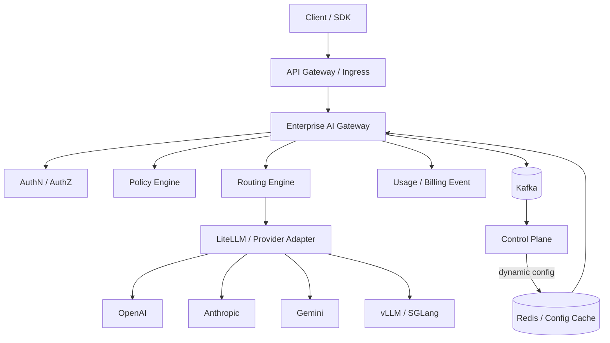

# Enterprise AI Platform Architecture Guide（企业 AI 平台架构指南）

**Version:** 1.0  
**Date:** 2026-08-07  
**Source baseline:** `AI-Gateway.md`（2930 行讨论稿）  
**Status:** Architecture & Implementation Baseline / 可作为研发设计说明书、评审基线与实施蓝图

## 1. 文档定位

本指南把源讨论稿提出的 AI Gateway 方案正式化为 **Enterprise AI Platform**：Control Plane 负责 IAM、Tenant、Provider、Model、Policy、Routing Config、Billing、Audit 和配置治理；Data Plane 负责统一 API、鉴权、限流、策略执行、缓存、路由、重试/回退和可观测性；AI Runtime 负责 LiteLLM 与外部/自托管模型运行时；Infrastructure 提供 Kubernetes、Redis、PostgreSQL、Kafka、对象存储和监控基础。

**最关键边界：LiteLLM 不是最终产品，也不直接面向用户；它只是 Runtime/Provider Adapter。**

## 2. 阅读顺序

- 架构负责人：Volume 1 -> Volume 2 -> Volume 3 -> Volume 6 -> Volume 7。
- 后端研发：Volume 2 -> Volume 3 -> Volume 8。
- 推理平台：Volume 4 -> Volume 5 -> Volume 7。
- SRE/平台工程：Volume 5 -> Volume 7 -> Volume 8 -> Appendix B。
- 安全/合规：Volume 6 -> Volume 2 Audit -> Appendix B。

## 3. 总体架构

## 4. 五项架构原则

| 原则 | 说明 |
| --- | --- |
| Everything is API | 所有可被平台外部或跨域调用的能力都必须定义稳定、版本化、可审计的 API 合同。 |
| Everything is Event | 调用、计费、审计、健康、配置发布等跨域副作用优先通过事件总线解耦。 |
| Everything is Stateless | Gateway、Router、LiteLLM 等数据平面实例不保存业务状态，可水平扩容并可随时替换。 |
| Everything is Configurable | Provider、模型映射、路由、预算、租户权限和安全策略由控制平面动态下发。 |
| Everything is Observable | 每个请求从入口到 Provider 都有 request_id/trace_id，并可关联延迟、Token、成本、缓存、重试和审计。 |

## 5. 全章节目录

| 章节 | 卷 | 标题 | 覆盖重点 |
| --- | --- | --- | --- |
| Chapter 1 | Volume 1 | 项目背景、目标与平台定位 | 为什么企业需要 AI Gateway、为什么不能把 LiteLLM 直接当最终产品、Enterprise AI Platform 定位、目标用户与典型场景、范围与非目标、成功标准与关键术语 |
| Chapter 2 | Volume 1 | 架构原则与非功能需求 | 五项核心原则、高可用与无状态、性能与延迟预算、一致性与配置传播、可扩展性与插件化、可观测性与审计、成本与合规约束 |
| Chapter 3 | Volume 1 | C4 Context：系统上下文 | 人员与外部系统、SDK/Client 接入、企业身份源、外部模型 Provider、自托管推理集群、监控与安全系统、上下文级信任边界 |
| Chapter 4 | Volume 1 | Container / Component 架构 | Web Console、Control Plane 服务群、Data Plane 服务群、AI Runtime、基础设施、同步调用与异步事件边界、组件依赖规则 |
| Chapter 5 | Volume 1 | Deployment：Kubernetes 与多 Region | Namespace 与工作负载、Ingress/Gateway、多副本与 HPA、Region/Zone 拓扑、跨 Region 配置同步、故障切换、数据驻留与延迟 |
| Chapter 6 | Volume 1 | DDD 与 Bounded Context | IAM、Tenant、Provider、Model、Policy、Routing、Billing、Audit、Gateway、上下文映射与领域事件 |
| Chapter 7 | Volume 1 | 架构治理与 ADR | 架构决策记录、技术债治理、兼容性规则、能力成熟度、变更评审、例外管理、平台演进原则 |
| Chapter 8 | Volume 2 | IAM Service | 用户、组织、部门、角色、OIDC/JWT 会话、服务身份、用户生命周期、权限声明、管理 API、缓存与撤销 |
| Chapter 9 | Volume 2 | Tenant、组织层级与授权模型 | Tenant/Department/User 层级、逻辑隔离、RBAC、ABAC、模型权限、Provider 白名单、地域与环境约束 |
| Chapter 10 | Volume 2 | API Key 与凭据生命周期 | 企业 API Key 格式、生成与哈希存储、轮换、过期与撤销、RPM/TPM/Quota 绑定、泄漏处置、Provider Key 隔离 |
| Chapter 11 | Volume 2 | Provider Registry 与 Provider Capability Registry | Provider/Region/Endpoint、Credential 引用、Priority/Weight、Health/Latency/Cost、Vision/Tool/Reasoning/Embedding/Audio/Rerank、能力版本、Provider 生命周期 |
| Chapter 12 | Volume 2 | Model Registry 与模型别名 | client_model/model_alias、provider_model、smart-chat 映射、版本与弃用、能力要求、上下文长度、模型市场与租户可见性 |
| Chapter 13 | Volume 2 | Policy Engine | Quota、Budget、RateLimit、Whitelist/Blacklist、Region、Model Permission、Sensitive Prompt、OPA/CEL/DSL、Policy as Code |
| Chapter 14 | Volume 2 | Routing Config Service | 策略配置模型、Weight/Latency/Cost/Geo/Sticky、AB Test、Fallback 链、热更新、发布与回滚、配置版本 |
| Chapter 15 | Volume 2 | Billing、Usage、Quota 与 Budget | Token 与成本、RPM/TPM、Daily/Weekly/Monthly/Lifetime Budget、Tenant/Department/User 分摊、价格版本、异步聚合、超预算行为 |
| Chapter 16 | Volume 2 | Audit Service | 登录与身份事件、配置变更、Provider/模型变更、API Key 操作、调用审计、SOX/ISO27001 证据、不可抵赖与保留策略 |
| Chapter 17 | Volume 3 | 数据平面总览与请求生命周期 | OpenAI Compatible API、请求上下文、AuthN/AuthZ、RateLimit、Policy、Cache、Router、LiteLLM、Provider |
| Chapter 18 | Volume 3 | 统一 API 与协议兼容层 | Chat Completions、Responses 风格扩展、Embedding、Image、Audio、Tool Calling、错误模型、幂等与版本化 |
| Chapter 19 | Volume 3 | 请求上下文、鉴权、限流与策略执行 | JWT/API Key 解析、tenant/user/request_id、RPM/TPM、配额预检、策略判定、敏感参数过滤、决策缓存 |
| Chapter 20 | Volume 3 | Router Engine：插件化路由管线 | CapabilityFilter、TenantFilter、BudgetFilter、GeoFilter、HealthFilter、LatencyRouter、CostRouter、WeightRouter、Sticky/Session Affinity、AB Test |
| Chapter 21 | Volume 3 | 可靠性：Timeout、Retry、Circuit Breaker、Fallback | 分层超时、可重试错误、指数退避与抖动、熔断状态机、Fallback DAG、请求预算、防重放 |
| Chapter 22 | Volume 3 | 缓存：Memory、Redis、Semantic Cache | L1/L2/L3、cache key、tenant/model/temperature/prompt_hash、TTL、负缓存、流式缓存、语义缓存风险、失效 |
| Chapter 23 | Volume 3 | Streaming、SSE、WebSocket 与 Realtime | SSE 代理、背压、客户端断连、WebSocket 会话、Realtime API、流式计费、中途失败、超时与心跳 |
| Chapter 24 | Volume 3 | 事件、Usage、Billing 与 Telemetry 发射 | 调用完成事件、Token/Cost 事件、Audit 事件、Kafka topic、幂等键、At-least-once、DLQ、聚合 |
| Chapter 25 | Volume 3 | 配置一致性与无状态性能模型 | Redis/Memory Cache、版本戳、Pub/Sub/Watch、冷启动、数据库隔离、配置回滚、数据平面不查主库原则 |
| Chapter 26 | Volume 4 | LiteLLM 作为 Router/Provider Adapter | 职责边界、Provider 适配、模型参数规范化、错误归一化、重试边界、凭据注入、不可直接暴露原则 |
| Chapter 27 | Volume 4 | vLLM 生产部署 | 模型服务拓扑、GPU/显存、Tensor Parallel、KV Cache、并发控制、OpenAI Compatible Server、滚动升级、监控 |
| Chapter 28 | Volume 4 | SGLang 推理运行时 | 适用场景、调度与并发、结构化输出、部署模式、与 vLLM 的选择边界、容量与压测 |
| Chapter 29 | Volume 4 | Ollama 与开发环境 | 开发者本地体验、模型拉取、非生产边界、与统一 API 集成、资源限制、测试数据 |
| Chapter 30 | Volume 4 | Embedding Runtime | 模型注册、维度与距离度量、批处理、吞吐优化、版本兼容、缓存、成本 |
| Chapter 31 | Volume 4 | Reranker Runtime | Cross-Encoder、TopK、超时预算、批量重排、模型路由、降级、指标 |
| Chapter 32 | Volume 4 | Vision、Audio、Image 多模态统一接入 | 输入规范化、对象存储、MIME/大小限制、异步任务、安全扫描、成本核算、能力匹配 |
| Chapter 33 | Volume 4 | Prompt Registry、Version 与 Template | Prompt ID、版本、模板变量、发布环境、审批、回滚、Trace 关联、评测 |
| Chapter 34 | Volume 4 | Agent、MCP、RAG、Workflow 扩展边界 | Gateway 与 Agent Gateway 边界、MCP Server 注册、RAG 服务接口、工具权限、工作流编排、安全上下文传递、未来演进 |
| Chapter 35 | Volume 5 | Kubernetes 生产架构 | Deployment、Service、Ingress、ConfigMap、Secret、PVC、StorageClass、NodeAffinity、HPA/PDB、Namespace |
| Chapter 36 | Volume 5 | Helm Chart 设计 | Chart 拆分、values 分层、Secrets 引用、模板函数、探针、资源配额、升级与回滚、Chart 测试 |
| Chapter 37 | Volume 5 | Terraform 与多云基础设施 | AWS、Azure、GCP、网络、Kubernetes、数据库、缓存、对象存储、KMS、模块与 state |
| Chapter 38 | Volume 5 | Redis：配置、限流与缓存基础 | Cluster、Sentinel、Key 设计、TTL 30/60/300、一致性、热点 Key、内存策略、灾备 |
| Chapter 39 | Volume 5 | PostgreSQL：系统事实源 | Patroni、Read Replica、Schema、索引、分区、连接池、备份、PITR、迁移 |
| Chapter 40 | Volume 5 | Kafka：Async Event Bus | Topic 规划、Partition Key、Consumer Group、Schema、幂等、重试、DLQ、保留策略、容量 |
| Chapter 41 | Volume 5 | MinIO / S3 对象存储 | 多模态对象、审计归档、生命周期、加密、预签名 URL、病毒扫描、跨 Region 复制 |
| Chapter 42 | Volume 5 | 网络、Ingress、服务发现与 mTLS | NGINX/Envoy/Kong、Kubernetes Service、DNS、NetworkPolicy、mTLS、egress 控制、Private Endpoint、超时 |
| Chapter 43 | Volume 5 | GPU Node 与自托管推理基础设施 | GPU Pool、NodeAffinity/Taint、驱动与 Runtime、MIG、容量隔离、监控、成本、故障处理 |
| Chapter 44 | Volume 6 | Authentication：OIDC、OAuth2、JWT | Azure AD/Keycloak/Auth0、Authorization Code/Client Credentials、JWT 校验、JWKS 缓存、会话与服务身份、撤销 |
| Chapter 45 | Volume 6 | Authorization：RBAC、ABAC 与策略授权 | 角色、资源、动作、租户边界、属性、最小权限、策略冲突、权限审计 |
| Chapter 46 | Volume 6 | Secrets：Vault、KMS 与 Provider Key | 密钥不落库明文、动态凭据、KMS Envelope Encryption、轮换、租户密钥、审计、Break-glass |
| Chapter 47 | Volume 6 | Encryption：TLS、mTLS 与静态加密 | TLS1.2+、证书轮换、内部 mTLS、Postgres/Redis/Kafka 加密、对象存储 SSE、字段级加密 |
| Chapter 48 | Volume 6 | Compliance：GDPR、SOC2、ISO27001、SOX | 数据分类、数据驻留、保留与删除、访问审计、变更控制、供应商风险、证据留存、责任矩阵 |
| Chapter 49 | Volume 6 | AI Safety：Prompt Injection、Guardrail、PII、Moderation | 输入检测、输出检测、PII 识别/脱敏、工具调用约束、Prompt Injection、模型安全策略、人工升级 |
| Chapter 50 | Volume 6 | API Security 与 OWASP | 认证绕过、注入、SSRF、越权、DoS、请求大小、速率限制、CORS、错误信息最小化 |
| Chapter 51 | Volume 6 | 供应链、容器与运行时安全 | SBOM、镜像签名、依赖扫描、Admission Policy、只读文件系统、Seccomp、NetworkPolicy、漏洞响应 |
| Chapter 52 | Volume 7 | 可观测性架构：OTEL、Prometheus、Grafana、Tempo、Langfuse | Metrics/Logs/Traces、Trace Context、OTEL Collector、Prometheus、Tempo/Jaeger、Langfuse、采样、数据保留 |
| Chapter 53 | Volume 7 | Dashboard 与核心指标 | Gateway QPS/RPM、Latency P50/P95/P99、Token、Provider、Tenant、Cache、Retry/Fallback、Budget/Cost、GPU |
| Chapter 54 | Volume 7 | SLI、SLO 与 Error Budget | 可用性、成功率、延迟、流式首 Token、配置传播、Provider 可用性、错误预算政策 |
| Chapter 55 | Volume 7 | Alerting 与 On-call | 多窗口告警、Provider 5xx/429、延迟、预算异常、Kafka Lag、Redis/Postgres、PagerDuty、降噪 |
| Chapter 56 | Volume 7 | Runbook：故障处置手册 | OpenAI 429、Provider 5xx、Redis 故障、Postgres 故障、Kafka Lag、配置错误、密钥泄漏、GPU OOM |
| Chapter 57 | Volume 7 | Chaos Engineering | Provider 注入失败、网络延迟、Pod Kill、Redis 故障、Kafka 分区、Region 故障、恢复目标 |
| Chapter 58 | Volume 7 | 容量规划、压测与性能工程 | QPS/TPS、并发、Token Throughput、Little 定律、连接池、缓存命中率、GPU 容量、压测场景 |
| Chapter 59 | Volume 7 | FinOps 与自动成本优化 | Provider 单价、模型分层、Budget、缓存节省、路由成本、闲置 GPU、Showback/Chargeback、Cost Optimizer |
| Chapter 60 | Volume 7 | 备份、灾难恢复与多 Region Failover | RPO/RTO、Postgres PITR、Redis 恢复、Kafka 复制、对象存储复制、DNS/GSLB、演练 |
| Chapter 61 | Volume 8 | Monorepo 与 Repository 结构 | apps/、packages/、deploy/、ops/、docs/、scripts/、共享库边界、版本策略 |
| Chapter 62 | Volume 8 | 代码规范、DDD 分层与插件接口 | Domain/Application/Infrastructure、依赖方向、Router Plugin、Policy Plugin、Provider Adapter、Guardrail、Cache、测试约束 |
| Chapter 63 | Volume 8 | 数据库 DDL 与 Migration | tenant、user、api_key、provider、provider_capability、model、route_policy、usage、audit、迁移流程 |
| Chapter 64 | Volume 8 | OpenAPI、错误码、API 版本与 SDK | OpenAI Compatible Surface、/v1、管理 API、错误模型、分页、幂等、SDK 生成、兼容性测试 |
| Chapter 65 | Volume 8 | Dockerfile 与构建标准 | 多阶段构建、最小基础镜像、非 root、依赖锁定、健康检查、SBOM、缓存、镜像标签 |
| Chapter 66 | Volume 8 | 完整 Helm 部署模型 | gateway、control-plane、runtime、observability、依赖 Chart、values 示例、生产覆盖、升级策略 |
| Chapter 67 | Volume 8 | Terraform 模块与环境拓扑 | network、kubernetes、postgres、redis、kafka、object-storage、kms、dns、dev/stage/prod |
| Chapter 68 | Volume 8 | GitHub Actions、Harbor、ArgoCD 与 GitOps | PR 检查、测试、镜像构建、扫描、推送 Harbor、环境晋级、ArgoCD Sync、回滚 |
| Chapter 69 | Volume 8 | 测试策略：Unit、Contract、E2E、Load、Security | 单元测试、契约测试、Provider Mock、E2E、故障注入、性能回归、安全扫描、发布门禁 |
| Chapter 70 | Volume 8 | Roadmap 与团队拓扑 | Phase1 MVP、Phase2 企业可用、Phase3 平台化、Phase4 云原生、Phase5 AI 平台、团队角色、里程碑与 Exit Criteria |
| Chapter 71 | Volume 8 | 发布、兼容、弃用与变更管理 | SemVer、API Compatibility、Model Alias 切换、Provider 灰度、数据库迁移、配置回滚、弃用窗口 |
| Chapter 72 | Volume 8 | 生产上线与运营移交 | 上线 Gate、容量与演练、安全审批、SLO、Runbook、值班、证据包、Day-2 Operations |

## 6. 源文件需求覆盖矩阵

| 源文件明确要求 | 本指南落点 |
| --- | --- |
| LiteLLM 只承担 Provider 调度，不直接暴露给用户 | Ch1, Ch17, Ch26 |
| Enterprise Gateway 前置 AuthN/AuthZ、Policy、Routing、Billing | Ch4, Ch17-Ch20, Ch24 |
| 多租户 Tenant/User/API Key | Ch8-Ch10, Ch63 |
| Provider / Model Mapping / Capability Registry | Ch11-Ch12, Ch20, Ch63 |
| Router Pipeline：Capability/Tenant/Budget/Geo/Health/Latency/Cost/Weight | Ch14, Ch20 |
| Latency/Cost/Region/Sticky/Weighted/Health/Capability 路由 | Ch14, Ch20 |
| Budget：Daily/Weekly/Monthly/Lifetime | Ch13, Ch15 |
| 灰度发布、UserID Hash、A/B Test | Ch14, Ch20, Ch71 |
| Provider Health：P95/P99/Availability/ErrorRate，后台探测 | Ch11, Ch20, Ch53-Ch56 |
| 三级缓存：Memory/Redis/Vector(Semantic) | Ch22, Ch38 |
| Data Plane 无状态，配置来自 Redis/Memory，不直接查询数据库 | Ch2, Ch17, Ch25 |
| Control Plane：IAM/Provider/Model/Policy/Routing/Billing/Audit | Ch8-Ch16 |
| Kafka 异步日志、计费、审计 | Ch15-Ch16, Ch24, Ch40 |
| Kubernetes + Helm + HPA；Redis Cluster；Postgres Patroni | Ch35-Ch39, Ch66 |
| CI/CD：GitHub Actions + Harbor + ArgoCD | Ch68 |
| Observability：Prometheus/Grafana/OTEL/Tempo/Langfuse | Ch52-Ch56 |
| AI Runtime：LiteLLM/vLLM/SGLang/Ollama | Ch26-Ch29 |
| Embedding/Reranker/Vision/Audio/Image | Ch30-Ch32 |
| Prompt Registry/Version/Template | Ch33 |
| MCP/Agent/RAG/Workflow/Evaluation/Safety/Marketplace | Ch34, Ch49, Ch70 |
| Security：OIDC/OAuth2/JWT、RBAC/ABAC、Vault/KMS、TLS/mTLS、GDPR/SOC2/ISO27001 | Ch44-Ch51 |
| Operations：Alert/Runbook/Chaos/Capacity Planning | Ch55-Ch60 |
| Implementation：Repository/DDL/OpenAPI/Helm/Terraform/Dockerfile/GitOps/Code Convention | Ch61-Ch72 |

## 7. 交付物清单

- `Volume-01...md` 至 `Volume-08...md`：8 卷正文，共 72 章。
- `Appendix-A-Sequence-Diagrams.md`：20 个核心时序图模板。
- `Appendix-B-Production-Checklist.md`：生产上线基线检查清单。
- `Appendix-C-Best-Practices.md`：最佳实践、反模式与技术栈基线。
- `Enterprise-AI-Platform-Architecture-Guide-Full.md`：合并版全文。
- `SOURCE-COVERAGE.md`：源讨论稿逐能力映射表。

## 8. 使用约束

本文是架构与工程实施基线，不替代具体企业的法务、合规、安全审批和容量实测。涉及 GDPR/SOC2/ISO27001/SOX 的章节给出平台应具备的工程控制面，不声称仅凭本指南即可获得任何认证。
